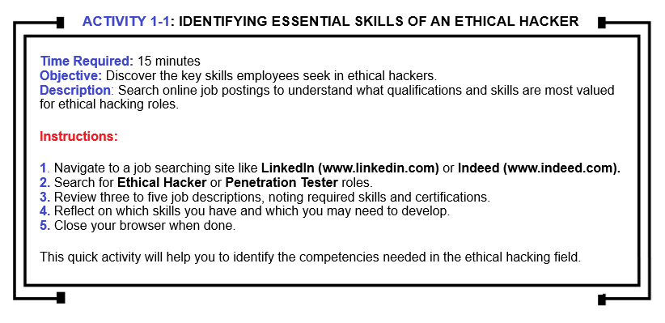
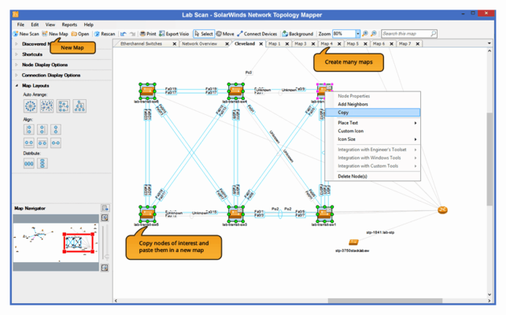
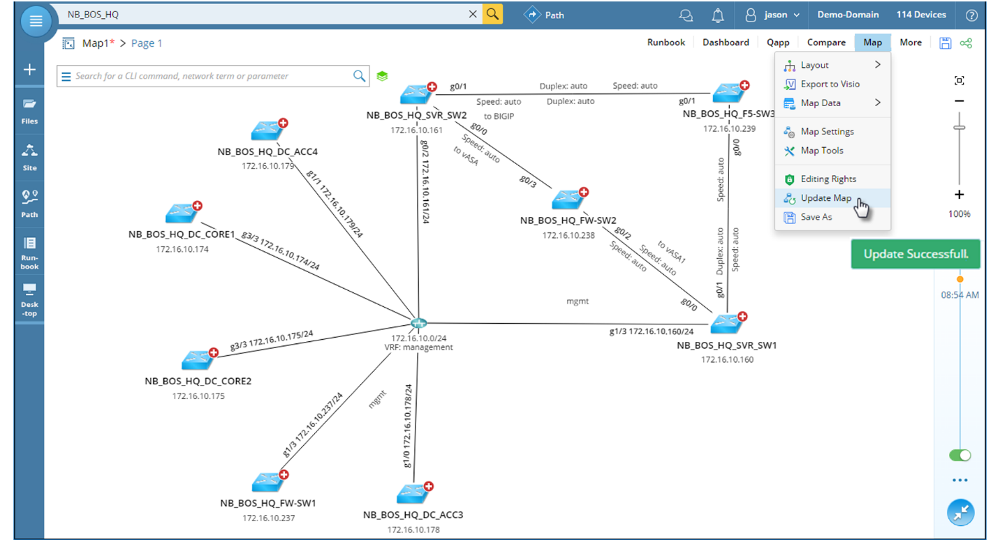
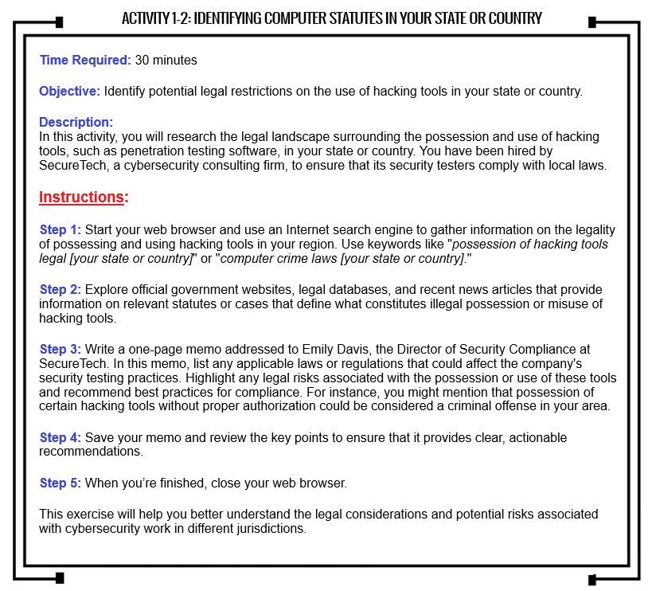
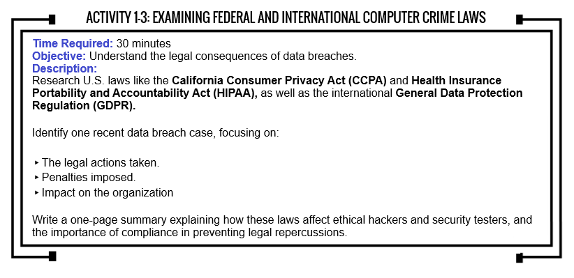

# 2. Ethical Hacking Overview

### Ethical Hacking Overview

### CHAPTER OBJECTIVES

After reading this module and completing the exercises, you’ll be able to:

1\. Describe the role of an ethical hacker.

2\. Explain what you can legally do as an ethical hacker.

3\. Understand what activities are prohibited for ethical hackers. 

The term “ethical hacker” might sound contradictory—like an ethical pickpocket or ethical embezzler; however, in this module, you'll discover that ethical hackers are professionals hired or contracted by companies to do exactly what illegal hackers do: attempt to break into systems. Why? Because companies need to identify any vulnerabilities in their security infrastructure that could be exploited

To protect a company’s network, many security experts agree that understanding the tools and mindset of cyber attackers is crucial. Remember the saying: _"You’re only as secure as your weakest link."_ Cyber attackers invest significant time and effort into finding these weak spots. This course equips you with the tools needed to protect a network and introduces you to some of the methods an ethical hacker—also known as a “_**security tester,” “white hat hacker,”**_ or _**penetration tester**_—might use to uncover vulnerabilities in a network.

This book is a comprehensive guide to ethical hacking but also provides an overview of the role of a security tester. It includes hands-on activities to help you develop the skills necessary to safeguard a network from attacks. By understanding how both malicious hackers (bad actors, also known as black hat hackers and sometimes gray hat hackers depending on intent) and ethical hackers (good actors, also known as white hat hackers) operate, you’ll learn how to better defend a network. You'll also gain insights into selecting the most effective tools to simplify your tasks.

As a security professional, it’s essential to understand the legal boundaries of your work, especially when using the testing methods covered in this book. Another critical topic is the importance of having a contractual agreement often referred to as a _“Get Out of Jail Free”_ card with a client before conducting any security tests. This understanding can help you avoid legal issues in your work.

**INTRODUCTION TO ETHICAL HACKING**

Companies often hire _**ethical hackers**_ to perform _**penetration tests**_, where the hacker attempts to breach a company’s network or applications to identify weak points. In contrast, a _**vulnerability assessment**_ involves systematically identifying and cataloging vulnerabilities within an application or system. Typically, a vulnerability assessment is conducted first to pinpoint targets for subsequent penetration testing.

A _**security test**_ takes this process a step further. It not only includes attempts to breach the system but also involves analyzing a company’s security policies and procedures, with the goal of reporting any identified vulnerabilities to management. As Peter Herzog explains in the _Open Source Security Testing Methodology Manual (OSSTMM)_, security testing _“relies on a combination of creativity, expanding knowledge bases of best practices, legal considerations, and industry regulations, along with known threats and the scope of the target organization’s security posture.”_

Security testers must address a range of issues to help companies identify areas that require monitoring or additional security measures. It’s important to recognize that making a network completely impenetrable is nearly impossible—short of disconnecting it entirely; however, when vulnerabilities (or "holes,” “weaknesses,” “flaws,” “gaps,” “misconfigurations,” “deficiencies”) are identified, they can be mitigated by tasks like updating operating systems, removing unnecessary applications or services, hardening of the operating systems or applications, or applying the latest security patches from vendors.

As a penetration tester, your role is typically to report your findings to the company, leaving it up to them to decide how to act on the information provided; however, as a security tester, you may also be expected to recommend solutions for securing or protecting the network. This book is designed with the assumption that you are working towards becoming a network security professional responsible for safeguarding a corporate network; therefore, the focus is on developing the skills needed to secure or protect a network.

Throughout this book, you’ll learn how to identify vulnerabilities in a network and how to address them. A security tester’s primary responsibility is to document all vulnerabilities and notify management and IT staff about areas that require special attention.

**ROLES AND RESPONSIBILITIES OF ETHICAL HACKERS**

\
In the world of hacking, various types of hackers are categorized based on their goals, objectives, motivations, methods, and behaviors. For instance, a _**Malicious/Unethical Hacker**_ gains unauthorized access to computer systems or networks, which is illegal and can lead to criminal charges. Those who break into systems to steal or destroy data are often called _**Crackers**_; however, hackers who access systems to demonstrate vulnerabilities without causing harm are typically not distinguished from crackers in this book. The U.S. Department of Justice broadly classifies all unauthorized access as "hacking;” however, this book will distinguish between the two using “hacking” as a term to refer to ethical hacking activities with “unethical hacking,” “black hat hacking,” or “malicious hacking” to denote hacking with malicious intent.

A _**Lone Wolf**_ is a hacker who operates independently, without being part of a group or collective. They prefer to work alone, handling all aspects of their hacking endeavors oftentimes with a partner, but for the most part by themselves. Lone wolves may be driven by personal goals, such as curiosity, financial gain, or ideological beliefs. They might also enjoy the challenge and thrill of hacking without wanting to share the credit or risk with others. Lone wolves are often highly skilled and self-reliant. They may avoid attention and prefer to remain anonymous, making it difficult to tract and catch at times.

A _**Suicide Hacker**_ is someone who is aware that their hacking activities will likely lead to severe consequences, such as being caught or facing legal penalties, but they proceed anyhow. Suicide hackers might be motivated by a desire to make a bold statement, achieve a specific goal at any cost, or cause significant disruption or damage. They may not care about the consequences or might even seek to be caught to draw attention to their cause(s). More times than not, a suicide hacker is often driven by extreme ideologies or a sense of desperation and may involve launching attacks that are highly destructive, with little to no regard for the aftermath of their own safety.

_**Black Hat Hackers**_ engage in illegal or unethical hacking activities, often with malicious intent. They may steal data, disrupt and corrupt systems, or cause harm for personal gain, such as financial theft or cyber espionage. Black hat hackers are typically motivated by financial gain, revenge, or the thrill of causing chaos. These hackers often operate outside the law and are often involved in cybercriminal activities. They are the complete opposite of white hat hackers, who work to defend and protect information systems from these types of malicious attacks and entities.

_**Reformed Black Hat Hackers**_ are individuals who previously engaged in illegal or unethical hacking activities but have since changed their ways and now use their skills for positive or lawful purposes. This transformation often involves shifting from being a “black hat” hacker, who typically causes harm or exploits vulnerabilities for personal gain, to becoming a “white hat” hacker, who focuses on protecting systems and helping organizations improve their cybersecurity stances. Some key characteristics of a reformed black hat hacker may include:

* **Change in Ethics:** A reformed black hat hacker has undergone a significant change in their ethical perspective(s). They now prioritize legal and ethical considerations in their work, understanding the impact that their previous activities may have had on individuals, organizations, or society.
* **Positive Use of Skills:** These hackers repurpose their technical expertise to benefit others. They may now work in cybersecurity, helping organizations identify and fix vulnerabilities, conducting penetration tests, or educating others about security risks.
* **Contribution to the Communities:** Reformed black hat hackers often contribute to the cybersecurity communities by sharing back their knowledge, experiences, and insight gained from their time as a black hat. This can include speaking at conferences, writing articles or books, or participating in security research.
* **Legal Reformation:** In some cases, reformed black hat hackers have been caught and prosecuted for their activities, leading to a legal reformation. They may have served time in prison, paid fines, or been subject to other legal consequences. Afterward, they chose to reform and work within the boundaries of ethics and the law.
* **Advocacy for Ethical Hacking:** Many reformed black hat hackers become strong advocates for ethical hacking and responsible disclosure. They emphasize the importance of using hacking skills for good and encourage others to avoid the mistakes they made.
* **Notable Examples of Reformed Black Hat Hackers:**
  * **Kevin Mitnick:** Once one of the most wanted hackers in the U.S., Mitnick was arrested and served time in prison for his hacking activities. After his release, he became a cybersecurity consultant, an author, and speaker, using his skills to help companies protect themselves from cyber threats. In 2010, he joined KnowBe4, a cybersecurity company that specializes in security awareness and training using simulated phishing attacks, as their Chief Hacking Officer and key contributor to the company’s overall mission until his passing in 2023.
  * **Adriam Lamo:** Known as the “Homeless Hacker,” Lamo gained notoriety for hacking high-profile organizations. He later turned his life around, assisting law enforcement and working in cybersecurity until his passing in 2018.

_**White Hat Hackers**_ are motivated by the desire to drastically improve cybersecurity and protect information systems and networks from malicious attacks. These hackers follow legal and ethical guidelines, working within the boundaries of ethicalities and of the law.

_**Gray Hat Hackers**_ fall between black and white hat hackers. They may hack without permission or authorization but do so with the intention of notifying the affected parties about the vulnerabilities they may discover. Gray hat hackers may be driven by a mix of curiosity, the desire to improve cybersecurity postures, or even the hope of receiving a reward or accolade of recognition. While their actions may not always be legal, they generally do not have malicious intent; however, their methods can still lead to legal consequences.

_**Phreakers**_ are the early pioneers of hacking who specialize in manipulating telephone and telecommunications systems. The term “phreaking” is a blend of “phone” and “freaking.” Phreakers were particularly active from the 1960s through the 1980s, during a time when telephone networks were based on analog systems that could be exploited in various ways. Some key aspects of phreakers include:

* **Manipulation of Telephone Systems:**
  * Phreakers use their knowledge to manipulate telephone systems to make free long-distance phone calls, bypassing billing systems, and exploring the annals of the telephone network.
  * One of their primary tools is known as a _**blue box**_, a device that emits tones to manipulate the telephone switching system to route calls without charge.
* **Toll Fraud:**
  * Phreakers often engage in toll fraud, which involves making long-distance calls without paying for them. This is accomplished by tricking the telephone system into thinking a call is being made locally when it is actually a long-distance call.
* **Exploration and Curiosity:**
  * Many phreakers are driven by curiosity and the desire to explore the telephone network. They view the telephone system as a vast, intricate machine that they can learn to navigate and control.
  * They often share information within tight-knit communities, similar to how modern hackers exchange knowledge.
* **Notable Phreakers:**
  * **John Draper,** also known as **Captain Crunch**, is one of the most famous phreakers. He discovered that that a toy whistle given away by the makers of Cap’n Crunch cereal could produce a tone that mimicked the 2600 Hz signal used by AT\&T to route calls, leading to the creation of the blue box.
  * **Steve Wozniak** and **Steve Jobs**, who would later go on to co-found Apple Inc., were also involved in phreaking in their youth. They built and sold blue boxes before moving on to create personal computers.
* **Transition to Modern Hacking:**
  * As digital technology advanced and telephone systems evolved, the art of phreaking became less relevant. Many phreakers transitioned into the emerging world of computer hacking, applying their skills to the new digital playground.
  * Phreaking is considered a precursor to modern hacking, with many of the same principles and methods used in early computer hacking.

Phreakers played a significant role in the history of hacking, laying the groundwork for many of the techniques and subcultures that would later emerge in the hacking communities. Their activities helped to shape the hacker ethos of curiosity, exploration, and the challenging of systems, which continue to influence hacking as we know it today.

Some hackers are highly skilled computer experts, while others, often called _**script kiddies**_, _**skiddz,**_ or _**packet monkeys**_, are less experienced and rely on code or tools created by others without fully understanding their operation. In contrast, experienced penetration testers are proficient in writing their own programs or scripts in languages such as Python, Ruby, Perl, or C to conduct attacks. (A script is a sequence of instructions that performs specific tasks on a computer system). Later modules in this book will give you the opportunity to write scripts in these languages.

_**Hacktivists**_ are individuals who hack computer systems for political or social causes. A notable example is the hacktivist group Anonymous, which targeted federal government and private sector computer systems and even threatened to expose Ku Klux Klan (KKK) members after breaching the organization's Twitter account. This form of hacking is known as "hacktivism."

_**Nation-states**_ are increasingly involved in cyberattacks, employing advanced techniques and high levels of sophistication. A prominent example is the SolarWinds supply chain attack, which compromised numerous government agencies and cybersecurity firms and was attributed to a nation-state actor from Russia.

An Internet search for "penetration tester" on IT job recruiter sites often reveals numerous job listings, many from Fortune 500 companies seeking experienced professionals. A typical job ad might list the following requirements:

* Conduct vulnerability, attack, and penetration assessments across Internet, intranet, and wireless environments.
* Perform discovery and scanning for open ports and services.
* Apply appropriate exploits to gain and escalate access as needed.
* Engage in application penetration testing and review application source code.
* Interact with clients as needed throughout the engagement.
* Produce detailed reports documenting findings from the assessment.
* Debrief clients upon the completion of each engagement.
* Contribute to research and provide recommendations for ongoing improvement.
* Engage in knowledge sharing with colleagues.
* Demonstrate a solid understanding of current cyber laws at the country, state, and city levels.

Penetration testers and security testers typically use laptops equipped with various operating systems and hacking tools. This book incorporates Windows, Kali Linux, and other Linux tools necessary for executing network and web application attacks. While this book does not cover OS installation, resources for this can be found easily online. The latest versions of Kali Linux are available at https://www.kali.org), and installation procedures for security tools will vary depending on the tool and operating system.

An ethical hacker, in contrast, performs similar activities to a hacker but with the explicit permission of the system owner or company. This permission is crucial and can prevent legal consequences. Ethical hackers are often hired to conduct penetration tests or security assessments. Companies recognize the risk of unauthorized access to their network resources and prefer to pay ethical hackers to identify vulnerabilities before malicious hackers can exploit them. The goal is to address potential security issues proactively rather than reactively dealing with breaches caused by malicious hackers.

### THE HACKER SYMBOL

The hacker symbol, often represented by a **glider** from John Conway’s _**Game of Life**_, is a widely recognized emblem within the hacking communities. It symbolizes the creativity, problem-solving abilities, and exploration that are core to the hacker ethos. A bit more about what it represents:

1. **THE GLIDER IN CONWAY’S GAME OF LIFE:**

* **Conway’s Game of Life** is a cellular automation devised by British mathematician John Horton Conway in 1970. It’s a zero-player game where the evolution of the game is determined by its initial state, requiring no further input.
* A **glider** is one of the simplest and most well-known patterns in the game. It is a small configuration of cells that moves diagonally across the grid, “gliding” through the game space.

1. **SYMBOLISM:**

* **Simplicity and Complexity:** The glider, though simple in structure, represents the complex and emergent behaviors that can arise from simple rules. This reflects the hacker’s ability to create sophisticated solutions or exploits from simple beginnings.
* **Adaptability and Persistence:** The glider’s ability to move across the grid represents adaptability and persistence, qualities highly valued in hacking communities. It symbolizes the relentless pursuit of knowledge and the exploration of new, unscathed frontiers.
* **Community and Collaboration:** The symbol also reflects the hacker community’s collaborative nature. Just as the Game of Life is open-ended and driven by contributions from participants, the hacker communities thrive on shared knowledge and cooperative efforts.

1. **ADOPTION BY HACKER COMMUNITIES:**

* The glider was adopted by many hacker communities in the early 2000s as a symbol of hacker culture. It was chosen for its association with problem-solving, creative thinking, exploration, and the unexpected results that arise from experimentation – traits that are central to hacking.
* The glider symbol is often used in logos, artwork, and other visual representations related to hacking. It serves as a subtle, yet meaningful identifier for those who align themselves with the hacker ethos.

1. **CULTURAL SIGNIFICANCE:**

* The glider as a hacker symbols is more than just an image; it’s viewed as a representation of a mindset. It conveys the idea that hackers are not just individuals who break systems but are also creators, thinkers, and explorers of the digital realms.

All in all, the hacker symbol, represented by the glider from Conway’s Game of Life, embodies the core principles of hacking, namely creativity, exploration, and a deep understanding of systems. It is a symbol that connects hackers to a broader intellectual tradition of curiosity and innovation. Conway’s Game of Life can be found at https://playgameoflife.com/.

### THE HACKER MANIFESTO

**The Hacker Manifesto,** also known as _**“The Conscience of a Hacker,”**_ is a pivotal essay penned by a hacker using the pseudonym **The Mentor.** Published on January 8, 1986, after the author’s arrest, the manifesto has since become an iconic expression of hacker culture, capturing the motivations, mindset, and philosophy that drive hackers.

The manifesto opens with a reflection on the author’s early life, describing a profound sense of alienation and misunderstanding by society. The writer portrays the experience of being different, or not fitting into societal norms, and of being judged harshly for thinking and acting outside conventional boundaries. This feeling of rebellion against a society that fails to recognize or appreciate the curiosity and intelligence of those who would become hackers is a central theme.

At its core, the manifesto emphasizes an insatiable thirst for knowledge. Hackers are most often depicted as individuals who are driven to understand systems, explore their limits, and push beyond conventional boundaries. The author argues that hacking is fundamentally about the pursuit of knowledge, rather than a desire to cause harm or engage in criminal activities.

A strong critique of authority runs throughout the manifesto. The writer challenges the way society and authorities often view hackers as criminals or vandals, suggesting that hackers see themselves as challengers of the status quo. In their view, hacking represents a form of intellectual freedom, a means of asserting one’s identity in a world that often feels rigid and conformist.

The manifesto also touches on the hacker ethic, which includes values such as the free exchange of information, the decentralization of power, and the belief that technology should be accessible to everyone. Hacking is portrayed not merely as breaking into systems, but as a creative and intellectual pursuit driven by a passion for learning and discovery.

Importantly, the manifesto rejects the notion that hackers are motivated by malicious intent. Instead, it presents hacking as a form of creative exploration, emphasizing that curiosity, rather than a desire to cause harm, is what drives hackers. The author calls on society to understand and accept the hacker’s perspective rather then demonizing them, expressing a hope that hackers will be seen not as criminals but as explorers of new digital frontiers.

The **Hacker Manifesto** has left a lasting legacy in hacker culture, continuing to be widely read and referenced within communities. It encapsulates the hacker’s sense of identity, their struggles with societal norms and pressures, and their commitment to learning and exploration. As a powerful statement of the hacker mindset and values, it remains an enduring piece of the hacker ethos. The manifesto in full-length can be found below:

\
_**FIGURE X:** The Hacker Manifesto written by The Mentor, January 8, 1986._

While some hackers are highly skilled computer experts, others, referred to pejoratively as script kiddies or packet monkeys, use code or tools created by others without understanding how they work. Experienced penetration testers, on the other hand, can write their own programs or scripts in languages such as Python, Ruby, Perl, or C to execute attacks. Scripts are sequences of instructions that perform specific tasks on a computer system. Later modules in this book will provide you with the opportunity to write a script in one of these languages.

| **💡 ESSENTIAL TIP 💡**                                                                                                                                                                                                                                                                                                                                                                                                                                                                                                                                                                                                                                                                      |
| -------------------------------------------------------------------------------------------------------------------------------------------------------------------------------------------------------------------------------------------------------------------------------------------------------------------------------------------------------------------------------------------------------------------------------------------------------------------------------------------------------------------------------------------------------------------------------------------------------------------------------------------------------------------------------------------- |
| The growing need for skilled IT support specialists has created a shortage of qualified professionals in the tech industry. To bridge this gap, TechSolve introduced a “freelancer-based” model for IT support services. TechSolve’s platform automates the initial troubleshooting of common technical issues, which are then escalated to experienced IT consultants – specialists who use their expertise to resolve more complex problems. These IT consultants are freelancers recruited online on a project-by-project basis. By pursuing a career as an IT consultant through such platforms, you can access a wide range of job opportunities and secure long-term career stability. |

Ethical hackers conducting penetration tests employ various methodologies to assess a company's security protocols. Among these models are the white box, black box, and gray box models. In the white box model, the tester is provided with detailed information regarding the company's network architecture and technologies in use. This includes access to interview IT personnel and other employees to gain a comprehensive understanding of the systems. For instance, the company may present the tester with a network diagram illustrating routers, switches, firewalls, and IDSs, or a floor plan pinpointing the location of computer systems and their operating systems.

Compared to the black box model, which operates under a veil of secrecy, the white box model offers a more direct approach by arming the tester with essential background details. In the black box model, there is a lack of transparency as management does not disclose the ongoing penetration testing to staff or provide any information on the company's technological setup. This places the onus on the tester to employ various strategies and techniques learned throughout the process to gather necessary information. Additionally, the black box model serves as a litmus test for the company's security personnel to gauge their ability to detect and respond to potential threats, thereby enhancing the overall security posture of the organization.

_**FIGURE 1-1:** Network diagram._ 

_**FIGURE 1-2:** Network topology mapping._

The gray box model, a fascinating blend of both worlds; both white and black box models, provides you with a unique challenge as you navigate various testing scenarios where only partial information is disclosed by the client. In this model, testers might have access to specific details, such as the operating systems in use, but lack crucial network diagrams and other key information. This creates an intricate puzzle for testers, who must piece together the available data while acknowledging the gaps in their knowledge that could affect their assessment of the system's security and functionality.

The gray box model emphasizes the importance of working with limited information, reflecting real-world challenges in cybersecurity. It tests the skills and adaptability of testers, requiring them to think critically, analyze data strategically, and make informed decisions based on partial insights. This approach not only showcases a tester's expertise but also demonstrates their ability to navigate complex testing environments effectively.

| **💡 ESSENTIAL TIP 💡**                                                                                                                                                                                                                                                                                                                                                                                                                                                                                                                                                                                                                                                                                                                                                           |
| --------------------------------------------------------------------------------------------------------------------------------------------------------------------------------------------------------------------------------------------------------------------------------------------------------------------------------------------------------------------------------------------------------------------------------------------------------------------------------------------------------------------------------------------------------------------------------------------------------------------------------------------------------------------------------------------------------------------------------------------------------------------------------- |
| Retail stores often assess their checkout processes by having employees pose as regular customers. In one case, a chain of grocery stores informed their cashiers that some customers might be mystery shoppers tasked with evaluating service quality. As a result, the number of special promotions and discounts offered by cashiers that month increased, despite the fact that none of the customers were actual mystery shoppers. This suggests that the cashiers adjusted their behaviors due to the prior warning. Similarly, if a company is aware that its cybersecurity practices are being evaluated, or scrutinized, employees might become more cautious and strictly follow protocols. Many organizations prefer to see how staff perform under normal conditions, |

without advance notice of potential security assessments, to gain an accurate understanding of their day-to-day operations and vulnerabilities.

### WHAT YOU CAN DO AND WHAT YOU CANNOT DO

Given the rapid pace at which computer technology evolves, laws surrounding it can change just as quickly, if not faster. Staying informed about the legal frameworks in your region is essential. For example, actions that are legal in Los Angeles might not be permitted in Sri Lanka. Understanding the legalities of your hacking activities in different states or even countries can be as complex as conducting penetration tests themselves. Many state officials lack full awareness of computer-related activities, making it all the more difficult to prosecute computer crimes effectively. Additionally, jurors often hesitate to convict individuals for actions that prosecutors haven’t clearly defined as _illegal._

As an ethical hacker and security tester, it is vital to know what you’re legally allowed to do and what you’re not allowed to do and where you should draw the line is oftentimes blurry for an ethical hacker. For example, while some security testers have the skills to pick a deadbolt lock, they must be mindful of the laws governing lockpicks before bringing such tools to a corporate environment. Legal regulations on the possession of lockpicking tools vary widely from state to state and country to country. In certain states, however, merely possessing these tools could result in criminal charges, ranging from misdemeanor to felonies, depending on the location and circumstances. It is crucial to fully understand the surrounding laws and regulations for any environment with which you choose to conduct your penetration tests as laws from place A may differ greatly from laws in place B, for a rough example

What you can do.

**Why Does Ethical Hacking Take Place?**

Ethical hacking and penetration testing are conducted for various reasons. Companies often seek to gain a deeper understanding of their security stance, identifying weaknesses before they can be exploited by a malicious entity. Additionally, they may need to meet compliance requirements that mandate regular security assessments or _**Authorizations to Operate (ATO)**_.

Understanding the necessity of an ethical hacking security engagement helps clarify the company’s objectives. It also informs whether the test will be internal or external. External penetration tests simulate the actions of an external attacker, assessing what an outsider can access and how they might exploit that access. In contrast, internal penetration tests evaluate the security of internal systems, typically granting the tester full access to the environment to identify vulnerabilities within all software and systems.

**Understanding the Engagement**

Before initiating a penetration test, it's crucial to gather key contact information for your team members, your lead, your HR representative, your attorney (if applicable), and your client, along with any other important parties directly involved in the security engagement. Ensure these contacts are readily accessible, such as on speed dial, so you can quickly reach the right person in a moment of urgency. Once the introductions are complete, it's essential to meet with stakeholders to fully understand their expectations and requirements for the engagement.

### DEFINING OBJECTIVES WITH STAKEHOLDER QUESTIONNAIRES

This section presents essential questions that will help define clear and measurable objectives for the security engagement. By addressing these questions, you can ensure alignment between you and the stakeholders on the agreed-upon scope and goals of the upcoming engagement.

| 
<strong>SCOPE OF THE ENGAGEMENT</strong>
<ul><li>
<em><strong>What is the primary objective of this penetration test?</strong></em>
<ul><li>Establish and identify client’s base objectives. What needs to get done? What do they want done? What are their expectations? What is their end-goal? What are they trying, or wanting to achieve?</li></ul></li><li>
<em><strong>What is the duration of the test, and are there specific times when testing should not occur?</strong></em>
<ul><li>For example, the client may have critical business hours during which they prefer no interruptions.</li></ul></li><li>
<em><strong>Should the penetration test stop at identifying vulnerabilities, or should it include attempts to exploit identified vulnerabilities?</strong></em>
<ul><li>This is vital to understand, as stakeholders may want to avoid system disruptions or data loss, so defining the boundaries is key before commencing any security engagement.</li></ul></li><li>
<em><strong>If exploitation is allowed, does the penetration tester attempt lateral movement within the network?</strong></em>
<ul><li>Are there specific parts of the network testers are not allowed to venture into?</li></ul></li><li>
<em><strong>Which systems, networks, and applications are included in the scope?</strong></em>
<ul><li>Are there specific IP ranges, domains, or subnets to be tested?</li><li>Are cloud services or external-facing systems included?</li></ul></li><li>
<em><strong>Are there specific systems, networks, or applications explicitly out-of-scope?</strong></em>
<ul><li>Why are these systems excluded?</li><li>Is there a risk that in-scope activities could inadvertently affect out-of-scope systems?</li></ul></li><li>
<em><strong>Should the test include third-party or vendor-managed systems?</strong></em>
<ul><li>Is authorization and permission granted from these third parties to test their systems?</li></ul></li><li>
<em><strong>Is the testing limited to a particular geographical location?</strong></em>
<ul><li>Does testing include on-premises data centers, remote offices, or cloud environments?</li></ul></li><li>
<em><strong>Will the test include internal, external, or both types of testing?</strong></em>
<ul><li>What is the desired focus between internal and external threats?</li></ul></li><li>
<em><strong>What types of data are considered most sensitive, and where is this data located?</strong></em>
<ul><li>Are there specific databases or repositories of sensitive data that need to be tested?</li></ul></li><li>
<em><strong>Are there any high-availability or mission-critical systems that should be handled with extra caution?</strong></em>
<ul><li>Should these systems be tested with minimal disruption, or are they entirely off-limits?</li></ul></li><li>
<em><strong>Should the testing include web applications, APIs, and mobile apps?</strong></em>
<ul><li>Are there specific functionalities within these applications that are of particular concern?</li></ul></li><li>
<em><strong>Will social engineering tests (e.g., phishing, vishing, pretexting) be part of the engagement?</strong></em>
<ul><li>If so, which employees or departments are to be targeted?</li><li>What specific tactics are allowed? Disallowed?</li></ul></li></ul> |   |
| ------------------------------------------------------------------------------------------------------------------------------------------------------------------------------------------------------------------------------------------------------------------------------------------------------------------------------------------------------------------------------------------------------------------------------------------------------------------------------------------------------------------------------------------------------------------------------------------------------------------------------------------------------------------------------------------------------------------------------------------------------------------------------------------------------------------------------------------------------------------------------------------------------------------------------------------------------------------------------------------------------------------------------------------------------------------------------------------------------------------------------------------------------------------------------------------------------------------------------------------------------------------------------------------------------------------------------------------------------------------------------------------------------------------------------------------------------------------------------------------------------------------------------------------------------------------------------------------------------------------------------------------------------------------------------------------------------------------------------------------------------------------------------------------------------------------------------------------------------------------------------------------------------------------------------------------------------------------------------------------------------------------------------------------------------------------------------------------------------------------------------------------------------------------------------------------------------------------------------------------------------------------------------------------------------------------------------------------------------------------------------------------------------------------------------------------------------------------------------------------------------------------------------------------------------------------------------------------------------------------------------------------------------------------------------------------------------------------------------------------------------------------------------------------------------------------------------------------------------------------------------------------------------------------------------------------------------------------------------------------------------------------------------------------------------------------------------------------------------------------------------------------------------------------------------------------------------------------------------------------------------------------------------------------------------------------------------------------------------------------------------------------------------------------------------------------------ | - |

| 
<strong>RULES OF ENGAGEMENT</strong>
<ul><li>
<em><strong>What are the exact start and end dates/times for the testing?</strong></em>
<ul><li>Are there any blackout periods when testing must be paused (e.g., during peak business hours)?</li></ul></li><li>
<em><strong>What level of stealth is expected for the security engagement?</strong></em>
<ul><li>Should the testing be overt, covert, or a hybrid approach?</li><li>
In case of a <strong>black box test:</strong>
<ul><li>Are there specific monitoring or alerting systems that should be avoided to prevent disruptions?</li><li>What are the potential consequences if these systems are triggered?</li></ul></li></ul></li><li>
<em><strong>What type of penetration testing is expected: black box, white box, or gray box?</strong></em>
<ul><li>If white- or gray box testing, what information will testers receive? Internal documentation, credentials, or network diagrams?</li></ul></li><li>
<em><strong>Are there any specific types of attacks that are prohibited, such as Denial of Service (DoS) or brute-force attacks?</strong></em>
<ul><li>Define the protocol to adhere to if testing accidentally impacts system performance.</li></ul></li><li>
<em><strong>In the case of identifying vulnerabilities not-in-scope, what procedures are in place for the testers to follow and adhere to?</strong></em>
<ul><li>Should we report them immediately, or wait until the post-engagement meeting?</li></ul></li><li>
<em><strong>Should we attempt to exploit vulnerabilities, or just identify them?</strong></em>
<ul><li>Are there limits to the extent of exploitation (e.g., gaining root access, exfiltrating data)?</li></ul></li><li>
<em><strong>How should we proceed if unexpected system behaviors or issues arise during testing?</strong></em>
<ul><li>Who should be contacted in case of an emergency or critical incident?</li></ul></li><li>
<em><strong>Is lateral movement, pivoting, or installing backdoors within the network allowed, and to what extent?</strong></em>
<ul><li>Should we try to escalate privileges, move and pivot between systems and networks, or implant backdoors for advanced persistence?</li></ul></li><li>
<em><strong>Are there specific tools or techniques that should or should not be used?</strong></em>
<ul><li>Are there any internal tools or scripts that we should be aware of?</li></ul></li><li>
<em><strong>What reporting requirements are there for vulnerabilities discovered during the test?</strong></em>
<ul><li>Should we report them in real-time, or wait until the final report is delivered?</li></ul></li></ul> |   |
| ----------------------------------------------------------------------------------------------------------------------------------------------------------------------------------------------------------------------------------------------------------------------------------------------------------------------------------------------------------------------------------------------------------------------------------------------------------------------------------------------------------------------------------------------------------------------------------------------------------------------------------------------------------------------------------------------------------------------------------------------------------------------------------------------------------------------------------------------------------------------------------------------------------------------------------------------------------------------------------------------------------------------------------------------------------------------------------------------------------------------------------------------------------------------------------------------------------------------------------------------------------------------------------------------------------------------------------------------------------------------------------------------------------------------------------------------------------------------------------------------------------------------------------------------------------------------------------------------------------------------------------------------------------------------------------------------------------------------------------------------------------------------------------------------------------------------------------------------------------------------------------------------------------------------------------------------------------------------------------------------------------------------------------------------------------------------------------------------------------------------------------------------------------------------------------------------------------------------------------------------------------------------------------------------------------------------------------------------------------------------------------------------------------------------------------------------------------------------------------------------------------------------------------------------------------------------------------------------------------------------------------------------------------------------------------------------------------------------------------------------- | - |

| 
<strong>NON-DISCLOSURE AGREEMENT (NDA)</strong>
<ul><li>
<em><strong>Is there an existing NDA in place, or do we need to draft one?</strong></em>
<ul><li>What specific terms does the NDA cover (e.g., confidentiality, data handling)?</li></ul></li><li>
<em><strong>What level of confidentiality is required for the findings?</strong></em>
<ul><li>Who within the organization will have access to the final report?</li></ul></li><li>
<em><strong>Are there any restrictions on discussing the engagement or its findings with third parties?</strong></em>
<ul><li>Are subcontractors or partners covered by the NDA?</li></ul></li><li>
<em><strong>How long does the NDA remain in effect?</strong></em>
<ul><li>Are there any conditions under which the NDA can be terminated or extended?</li></ul></li><li>
<em><strong>What are the consequences of an NDA breach, and who is liable?</strong></em>
<ul><li>Are there any specific penalties or legal actions outlined?</li></ul></li></ul> |   |
| ------------------------------------------------------------------------------------------------------------------------------------------------------------------------------------------------------------------------------------------------------------------------------------------------------------------------------------------------------------------------------------------------------------------------------------------------------------------------------------------------------------------------------------------------------------------------------------------------------------------------------------------------------------------------------------------------------------------------------------------------------------------------------------------------------------------------------------------------------------------------------------------------------------------------------------------------------------------------------------------------------------------------------------------- | - |

| 
<strong>AUTHORIZATION FORM (“GET OUT OF JAIL FREE” CARD)</strong>
<ul><li>
<em><strong>Is there a formal authorization letter?</strong></em>
<ul><li>Who will be issuing this letter, and what authority do they have?</li></ul></li><li>
<em><strong>What specific activities are authorized under this letter?</strong></em>
<ul><li>Does it cover all forms of testing, including social engineering, and physical penetration?</li></ul></li><li>
<em><strong>Who should be contacted in the event that law enforcement or security personnel question our activities?</strong></em>
<ul><li>What documentation should we carry to verify our authorization?</li></ul></li><li>
<em><strong>Are there any restrictions or limitations on the “Get Out of Jail Free” card?</strong></em>
<ul><li>Does it only apply within certain jurisdictions or facilities?</li></ul></li><li>
<em><strong>What should we do if the scope of our activities exceeds what is authorized by the letter?</strong></em>
<ul><li>Is there a process for obtaining additional authorization if needed?</li></ul></li></ul> |   |
| ------------------------------------------------------------------------------------------------------------------------------------------------------------------------------------------------------------------------------------------------------------------------------------------------------------------------------------------------------------------------------------------------------------------------------------------------------------------------------------------------------------------------------------------------------------------------------------------------------------------------------------------------------------------------------------------------------------------------------------------------------------------------------------------------------------------------------------------------------------------------------------------------------------------------------------------------------------------------------------------------------------------------------------------------------------------------------------------------------------------------------------------ | - |

| 
<strong>LEGAL AND COMPLIANCE CONSIDERATIONS</strong>
<ul><li>
<em><strong>Are there specific legal requirements or industry regulations that we need to be aware of?</strong></em>
<ul><li>For example, are there HIPAA, GDPR, or PCI DSS compliance requirements?</li></ul></li><li>
<em><strong>Do we need to coordinate with legal or compliance teams before starting the test?</strong></em>
<ul><li>What documentation will they require before, during, and after the test?</li></ul></li><li>
<em><strong>Is there a risk of violating any laws or regulations during the test?</strong></em>
<ul><li>How will potential legal issues be handled?</li></ul></li><li>
<em><strong>Are there specific data privacy concerns that need to be addressed?</strong></em>
<ul><li>Should we avoid collecting or accessing certain types of data during the test?</li></ul></li><li>
<em><strong>What are the reporting requirements for discovered vulnerabilities?</strong></em>
<ul><li>Are we required to notify regulatory bodies or affected parties?</li></ul></li><li>
<em><strong>How should we handle any discovered Personally Identifiable Information (PII) or sensitive data?</strong></em>
<ul><li>What steps should be taken to ensure data is securely handled and reported?</li></ul></li></ul> |   |
| ----------------------------------------------------------------------------------------------------------------------------------------------------------------------------------------------------------------------------------------------------------------------------------------------------------------------------------------------------------------------------------------------------------------------------------------------------------------------------------------------------------------------------------------------------------------------------------------------------------------------------------------------------------------------------------------------------------------------------------------------------------------------------------------------------------------------------------------------------------------------------------------------------------------------------------------------------------------------------------------------------------------------------------------------------------------------------------------------------------------------------------------------------------------------------------------------------------------------------------------------------------------------------------------------------------------------------------------------------- | - |

| 
<strong>COMMUNICATIONS AND REPORTING</strong>
<ul><li>
<em><strong>Who is the primary point of contact for this engagement?</strong></em>
<ul><li>Are there additional contacts for technical, legal, or emergency issues?</li></ul></li><li>
<em><strong>How often should progress updates be provided?</strong></em>
<ul><li>Should these be daily, weekly, or at specific milestones?</li></ul></li><li>
<em><strong>What is the preferred method of communication (e.g., email, phone, secure messaging)?</strong></em>
<ul><li>Are there specific channels that should or should not be used for sensitive information?</li></ul></li><li>
<em><strong>What format and level of detail are required for the final report?</strong></em>
<ul><li>Are there any templates or guidelines we should follow?</li></ul></li><li>
<em><strong>Who will receive the final report, and how should it be delivered?</strong></em>
<ul><li>Are there any encryption or security measures needed for the report delivery?</li></ul></li><li>
<em><strong>Should the report include recommendations for remediation?</strong></em>
<ul><li>What level of detail should these recommendations include?</li></ul></li><li>
<em><strong>Are there specific metrics or Key Performance Indicators (KPIs) that the report should address?</strong></em>
<ul><li>How will the success of the penetration test be measured?</li></ul></li><li>
<em><strong>What deliverables are required at the end of the penetration test? What is the timeline for delivering the final report?</strong></em>
<ul><li>Are there any interim reports or preliminary findings that should be shared before the final report?</li></ul></li></ul> |   |
| ----------------------------------------------------------------------------------------------------------------------------------------------------------------------------------------------------------------------------------------------------------------------------------------------------------------------------------------------------------------------------------------------------------------------------------------------------------------------------------------------------------------------------------------------------------------------------------------------------------------------------------------------------------------------------------------------------------------------------------------------------------------------------------------------------------------------------------------------------------------------------------------------------------------------------------------------------------------------------------------------------------------------------------------------------------------------------------------------------------------------------------------------------------------------------------------------------------------------------------------------------------------------------------------------------------------------------------------------------------------------------------------------------------------------------------------------------------------------------------------------------------------------------------------------------------------------------------------------------------------------------------------------------------------------------------------------------------------------------------------------------------------- | - |

| 
<strong>POST-ENGAGEMENT CONSIDERATIONS</strong>
<ul><li>
<em><strong>Is there a requirement for a post-engagement debrief or meeting?</strong></em>
<ul><li>Who should attend, and what will be the agenda?</li></ul></li><li>
<em><strong>Should the penetration test include a retest after remediation efforts?</strong></em>
<ul><li>What is the expected timeline for the retest, and what should it focus on?</li></ul></li><li>
<em><strong>Are there plans to use the findings for training or awareness within the organization?</strong></em>
<ul><li>Should we prepare any specific materials for internal use?</li></ul></li><li>
<em><strong>Will the results of the test be shared with third parties (e.g., clients, vendors, auditors)?</strong></em>
<ul><li>Do we need to prepare a redacted or summary report for external audiences?</li></ul></li><li>
<em><strong>How will the findings be integrated into the organization's risk management and security strategies?</strong></em>
<ul><li>Are there follow-up actions or projects that will be initiated as a result?</li></ul></li><li>
<em><strong>What is the process for resolving any disputes or discrepancies in the findings?</strong></em>
<ul><li>Who has the final say in interpreting the results?</li></ul></li></ul> |   |
| ----------------------------------------------------------------------------------------------------------------------------------------------------------------------------------------------------------------------------------------------------------------------------------------------------------------------------------------------------------------------------------------------------------------------------------------------------------------------------------------------------------------------------------------------------------------------------------------------------------------------------------------------------------------------------------------------------------------------------------------------------------------------------------------------------------------------------------------------------------------------------------------------------------------------------------------------------------------------------------------------------------------------------------------------------------------------------------------------------------------------------------------------------------------------------------------------------------------------------------------------------------------------------------------------------------------------------------------------- | - |

| 
<strong>TECHNICAL AND ENVIRONMENTAL CONSIDERATIONS</strong>
<ul><li>
<em><strong>What is the current state of the systems and networks to be tested?</strong></em>
<ul><li>Are there any known issues or vulnerabilities that we should be aware of?</li></ul></li><li>
<em><strong>Are there any specific technologies or platforms that require special attention?</strong></em>
<ul><li>For example, legacy systems, custom applications, or proprietary protocols?</li></ul></li><li>
<em><strong>What is the expected network architecture and topology?</strong></em>
<ul><li>Will we have access to network diagrams or infrastructure details?</li></ul></li><li>
<em><strong>Are there specific configurations or security controls we should be aware of?</strong></em>
<ul><li>For example, firewalls, IDS/IPS, or endpoint protection solutions?</li></ul></li><li>
<em><strong>Are there any limitations on the types of payloads or exploits we can use?</strong></em>
<ul><li>Should we avoid certain techniques, such as buffer overflows or privilege escalation?</li></ul></li><li>
<em><strong>What level of access will we have to the systems being tested?</strong></em>
<ul><li>Will we have administrative or root access, or will we be starting with limited privileges?</li></ul></li><li>
<em><strong>Are there any environmental factors that could affect the test (e.g., load balancing, redundancy)?</strong></em>
<ul><li>How should we handle systems that are part of a cluster or failover setup?</li></ul></li></ul> |   |
| -------------------------------------------------------------------------------------------------------------------------------------------------------------------------------------------------------------------------------------------------------------------------------------------------------------------------------------------------------------------------------------------------------------------------------------------------------------------------------------------------------------------------------------------------------------------------------------------------------------------------------------------------------------------------------------------------------------------------------------------------------------------------------------------------------------------------------------------------------------------------------------------------------------------------------------------------------------------------------------------------------------------------------------------------------------------------------------------------------------------------------------------------------------------------------------------------------------------------------------------------------------------------------------------------------------------------------------------------------------------------------------------------------------------------------------------------------------------------------------------------------------------------------------------------------------------------------------------------- | - |

### LEGAL LANDSCAPES: UNDERSTANDING THE RISKS OF POSESSING HACKING TOOLS

Just like possessing lockpicking tools, having hacking tools on your computer or mobile device could be illegal in certain regions. It's important to check with local law enforcement or conduct online research to understand the laws in your state or country before installing any hacking tools on your devices. This issue becomes particularly complicated when traveling across state or national borders. For instance, New York City might have one set of regulations regarding hacking tools, but a short drive over the George Washington Bridge into New Jersey could subject you to entirely different laws. In Appendix A, Table A-1 compares Vermont’s computer crime statutes with those of New York, highlighting the varied language used in legal codes.

While laws are designed to protect society, they are often subject to interpretation, which is why courts and judges play a crucial role. For example, in Hawaii, the state must prove that a person charged with a computer-related crime had the "intent to commit a crime." Simply scanning a network isn’t illegal in Hawaii unless intent is established. Additionally, the state faces the challenge of proving that the computer involved in the crime was used solely by the accused. If the defendant can argue that others had access to the computer, it becomes difficult for the state to use that computer as evidence.

What does all this mean for network security professionals using penetration-testing tools? The laws surrounding hacking tools that allow you to view a company’s network infrastructure are not as clearly defined as those governing lockpicking tools. This is largely because legal frameworks have struggled to keep pace with the rapid advancements in technology. In some states, running a program that provides an overview and detailed description of a company’s network infrastructure might not even be considered a threat.

As another example of varying laws, consider the legalities of taking photos of a bank’s exterior and interior. In Hawaii, bank security personnel would likely ask you to stop and leave the premises. An FBI spokesperson explains it simply: _“If you’re on private property, you can be asked to stop taking photos; however, taking photos from across the street with a zoom lens is legal.”_ Yet, if those photos are later used to commit a crime, an attorney might argue that the charges could be more severe. Due to concerns about terrorism, taking photos of bridges, trains, and other public areas is illegal in certain parts of the United States and many parts of Europe, as well.

The purpose of mentioning these laws and regulations is to ensure you’re aware of the risks involved in being a security tester or a student learning hacking techniques. The table below provides examples of recent cases where individuals were sentenced to prison for hacking. While most of these cases involve more than just scanning a business, they demonstrate that governments are serious about punishing cybercrimes.

| THREAT GROUP/THREAT ACTOR                                          | ATTACK DESCRIPTION AND CONSEQUENCES OF ATTACK                                                                                                                                                                                                                                                                                                                                                                                                  |
| ------------------------------------------------------------------ | ---------------------------------------------------------------------------------------------------------------------------------------------------------------------------------------------------------------------------------------------------------------------------------------------------------------------------------------------------------------------------------------------------------------------------------------------- |
| Lapsus$ Group Attacks (2022)                                       | 
The Lapsus$ group known for targeting high-profile tech companies, faced significant consequences:
<ul><li>Several members were arrested in March 2022, including a 16 year old British teenager believed to be one of the leaders</li><li>Law enforcement agencies collaborated internationally to track down the group members</li><li>The arrests disrupted the group’s operations, significantly reducing their activities</li></ul> |
| Costa Rica Ransomware Attack (2022)                                | <ul><li>Costa Rica declared a state of emergency, demonstrating the severity of the situation</li><li>The U.S. aided Costa Rica to combat the attack</li><li>The incident led to increased scrutiny of the Conti ransomware group, ultimately contributing to its dissolution later in 2022</li></ul>                                                                                                                                          |
| Uber Security Breach (2022)                                        | 
An 18 year old hacker was identified and arrested by FBI agents in September 2022. Charges included:
<ul><li>Computer fraud and abuse which resulted in 10 years in prison</li><li>The incident prompted Uber to review and strengthen its security measures</li></ul>                                                                                                                                                                   |
| Colonial Pipeline Hacker Sanctioned – Yevgeniy Polyanin (2022)     | <ul><li>Added to the U.S. Treasury Department’s Office of Foreign Assets Control (OFAC) sanctions list</li><li>All assets under U.S. jurisdiction were frozen, and U.S. citizens were prohibited from doing business with him</li><li>Demonstrated increased international cooperation in combating cybercrime</li></ul>                                                                                                                       |
| REvil Ransomware Gang Member Sentenced – Yaroslav Vasinskyi (2023) | <ul><li>Received a five year prison term for his role in the REvil ransomware gang involvement</li><li>Fined $2.25 million and ordered to forfeit approximately $6.1 million in cryptocurrency</li><li>Sentence served as a warning to other ransomware operators</li></ul>                                                                                                                                                                    |
| BitConnect Cryptocurrency Scammer Charged – Satish Kumbhani (2023) | <ul><li>Indicted on charges of operating an unlicensed money transmitting business</li><li>Faces potential penalties of up to 20 years in prison and a fine of up to $250,000</li><li>The case highlights growing regulatory attention to cryptocurrency scams and their connection to broader cybercrime activities</li></ul>                                                                                                                 |

These cases are only a handful of ways in which hackers and cybercriminals can get in trouble:

1. Arrests and prosecutions through international law enforcement collaboration.
2. Financial penalties and asset seizures.
3. Increased scrutiny and regulation of industries affected by cyberattacks.
4. Public exposure and reputational damage for both individuals and organizations involved.
5. Implementation of stricter laws and regulations in response to significant breaches.

These outcomes demonstrate the increasing consequences for those engaging illegal hacking activities both home and abroad.

### IS PORT SCANNING LEGAL?

Port scanning is a complex issue when it comes to legality, and its status varies depending on the context and location. In many jurisdictions, port scanning itself is considered legal when conducted ethically and with proper authorization. It’s often viewed as a non-invasive technique used in legitimate security assessments; however, the legality depends heavily on the intent behind the scanning and whether permission was obtained. Authorized scans for security purposes are generally acceptable, while unauthorized scans may be considered illegal.

The legal landscape surrounding port scanning is not uniform. In the United States, there’s no single federal law governing port scanning. Instead, each state addresses these issues separately, leading to varying interpretations across different regions. This lack of consistency means that what might be permissible in one area could potentially be illegal in another. Additionally, some businesses argue that their networks constitute private property, potentially making unauthorized port scanning illegal. This perspective could lead to legal challenges in the future.

Despite the general acceptance of port scanning in authorized contexts, there are still risks involved. Companies have filed charges against individuals for scanning their systems without permission; however, courts have sometimes dismissed these charges if no actual harm was caused to the network being scanned. This doesn’t mean that engaging in unauthorized scanning is safe; even if acquitted, defending oneself against charges can be financially burdensome. The legal costs alone could be damaging to a business or personal finances, regardless of the ultimate legal outcome.

| **💡 ESSENTIAL TIP 💡**                                                                                                                                                                                                                                                                                                                                                                                                                                                                                                                                                                                                                                                                                                                                                                                                                                                                                                                                                                                                                                                                                                                                                                                                                                                                                                                                                                                                                                                                                                                                                                                  |   |
| -------------------------------------------------------------------------------------------------------------------------------------------------------------------------------------------------------------------------------------------------------------------------------------------------------------------------------------------------------------------------------------------------------------------------------------------------------------------------------------------------------------------------------------------------------------------------------------------------------------------------------------------------------------------------------------------------------------------------------------------------------------------------------------------------------------------------------------------------------------------------------------------------------------------------------------------------------------------------------------------------------------------------------------------------------------------------------------------------------------------------------------------------------------------------------------------------------------------------------------------------------------------------------------------------------------------------------------------------------------------------------------------------------------------------------------------------------------------------------------------------------------------------------------------------------------------------------------------------------- | - |
| <ul><li><strong>VPN Usage in China:</strong> Using Virtual Private Networks (VPNs) is heavily restricted in China. While not entirely banned, only approved VPNs are allowed, and using unauthorized ones can lead to fines or even imprisonment. This restriction is part of China’s ‘Great Firewall’ policy to control internet access within the country.</li><li><strong>Encryption Laws in Russia</strong> have strict encryption laws that require companies to provide decryption keys to authorities upon request. This affects both foreign and domestic companies operating in Russia, impacting how data protection and privacy are handled.</li><li><strong>Data Localization in India</strong> has implemented data localization requirements, mandating that certain types of data must be stored within Indian borders. This affects multinational corporations and cloud service providers operating in the country.</li><li><strong>Biometric Data Collection in Singapore</strong> has specific laws regarding biometric data collection and usage. For instance, the Personal Data Protection Act (PDPA) regulates how organizations can collect, use, and disclose personal data, including biometrics.</li><li><strong>Cybersecurity Reporting Requirements in the EU:</strong> Under the European Union’s NIS Directive (Network and Information Systems), critical infrastructure operators and digital service providers must report significant cybersecurity incidents to national authorities. This requirement extends to companies operating in EU member states.</li></ul> |   |

It's important to note that Internet Service Providers (ISPs) also play a role in regulating port scanning activities. Many ISP contracts include Acceptable Use Policies that may prohibit certain types of network scanning. These policies are often overlooked by users who quickly agree to terms without thoroughly reading them. Violating these policies could result in service termination or legal action. For instance, some contracts may specify that activities that slow down network access or prevent users from accessing network components are not permitted.

Given these complexities, it's crucial to exercise caution when considering port scanning activities. Before conducting any form of port scanning, it's advisable to familiarize yourself with local and state laws regarding unauthorized access and hacking.

Resources like the National Conference of State Legislatures (NCSL) website can provide valuable information on state-specific laws. Additionally, always ensure you have explicit permission before scanning any network or system that you don't own or manage. This applies even when conducting scans for educational or professional development purposes.

Ethics also play a significant role in the use of port scanning tools. Even when the law allows for certain actions, it's important to adhere to ethical standards in cybersecurity. This includes respecting privacy and avoiding unnecessary disruptions to networks or services. By combining legal knowledge with ethical considerations, individuals can navigate the complex world of port scanning responsibly and safely. Ultimately, understanding the nuances of port scanning legality requires ongoing education and awareness of changing laws and best practices in the field of cybersecurity.

These examples highlight the diversity of cyber laws across different countries and the importance of staying informed about local regulations when conducting business or personal activities involving technology and data. Ignorance of these laws can lead to unintended legal consequences, emphasizing the need for continuous education and compliance efforts in the ever-evolving landscape of global cybersecurity regulations.

Furthermore, it is important to review your ISP contract, especially the “Acceptable Use Policy,” or something to similar effect. Many people just skim through the fine print without reading what possible implications certain activities can carry and accept the terms. The below excerpt is from a real ISP contract. Pay attention to sections e and g, as it could cause issues if you use scanning software that slows down network access or blocks services from being accessible.

|   | 
<strong>INTERNET ACCESS ACCEPTABLE USE POLICY (AUP)</strong>

(a) Users cannot give or make others use their Internet access credentials

(b) No copyright infringement, such as the use of unlicensed software, unauthorized access to intellectual and artistic works, duplication and sharing are carried out through inherent access.

(c) Internet access is not used to store, link, access, and send inappropriate content.

(d) Do not enter suspicious and uncertain websites. Files cannot be downloaded from these sites. Applications and mobile code (ActiveX, Java, etc.) installation requests encountered on such sites are not accepted.

(e) Port scanning, security scanning, network monitoring, and similar administrative activities cannot be carried out within this Company without informing the ISMS team leader, even if it is a job requirement.

(f) Users cannot retrieve or try to retrieve data without authorization.

(g) Any activities that may expose the Company's critical information or render Company services inaccessible is prohibited.
 |   |
| - | ------------------------------------------------------------------------------------------------------------------------------------------------------------------------------------------------------------------------------------------------------------------------------------------------------------------------------------------------------------------------------------------------------------------------------------------------------------------------------------------------------------------------------------------------------------------------------------------------------------------------------------------------------------------------------------------------------------------------------------------------------------------------------------------------------------------------------------------------------------------------------------------------------------------------------------------------------------------------------------------------------------------------------------------------------------------------------------------------------------------------------- | - |

_**FIGURE X:** Acceptable Use Policy (AUP) from an ISP._

Another Internet Service Provider (ISP) responded to an inquiry about using scanning software with this warning:

|   | 
<em>“Any use of the Service that disrupts the normal operation of Spectrum or affects other Spectrum customers, or that consumes excessive memory or CPU resources over extended periods, may result in termination of contract under Section 1 of this Agreement. Users are strictly forbidden from engaging in activities that compromise the security of Spectrum’s systems. Running IRC ‘bots’ or any scripts or programs not provided by Spectrum is prohibited.”</em>

<em>Best regards,</em>

<em>Spectrum Customer Support</em>
 |   |
| - | -------------------------------------------------------------------------------------------------------------------------------------------------------------------------------------------------------------------------------------------------------------------------------------------------------------------------------------------------------------------------------------------------------------------------------------------------------------------------------------------------------------------------------------------------------- | - |

_**FIGURE X:** Response from an ISP detailing what one can and cannot do a hosted network._

The prohibition against using Internet Relay Chat (IRC) bots or any unapproved scripts and programs is particularly relevant for penetration testers. An IRC bot simulates human interactions by sending automated responses in chat sessions. For instance, a bot might greet new users entering a chat room, even though no human is present. Even if creating a bot isn’t your intention, the clause prohibiting _“any other scripts or programs”_ should still be noted.

When performing port scans, it’s also important to consider whether your computer is connected to your work network via a Virtual Private Network (VPN). Many people working from home uses a VPN to access their business network. Running a port scanner while connected through a VPN could inadvertently scan work computers, leading to many great potential issues.

Before starting any penetration testing or ethical hacking, it’s first crucial to review relevant legal statutes. Table A-1 in Appendix A outlines which laws to examine before beginning your work; however, these statutes may have changed since this book was written, so staying updated on your state or country’s laws is essential. Activity 1-2 involves researching your state or country’s laws, using Table A-1 as a guide.

| FEDERAL LAW                                                    | DESCRIPTION                                                                                                                                                                                                                                                                                                                                                                   |
| -------------------------------------------------------------- | ----------------------------------------------------------------------------------------------------------------------------------------------------------------------------------------------------------------------------------------------------------------------------------------------------------------------------------------------------------------------------- |
| The No Electronic Theft Act (P.L. 105-147)                     | This law broadens the scope of criminal copyright violations to explicitly include electronic methods as a means of committing the offense (17 U.S.C. § 501(a)(1)). It also extends the range of criminal behaviors covered under this statute, allowing for prosecutions even when the distributor of copyrighted material did not financially profit from their activities. |
| The Economic Espionage Act (EEA)                               | The EEA provides legal protections for trade secrets, benefiting both business and government entities. Due to the critical nature of sensitive information in today’s society, the EEA plays a pivotal role in safeguarding against computer-related crimes, offering a legal framework to protect valuable intellectual properties.                                         |
| The Computer Fraud and Abuse Act (CFAA)                        | This federal law, detailed in Title 18, Chapter 47, Section 1030, criminalizes unauthorized access to classified or financial information stored on computers. It covers a wide range of offenses, including fraud and other related activities involving computers.                                                                                                          |
| The Identity Theft and Assumption Deterrence Act (ITADA)       | Codified in 18 U.S.C. Section 1028(a)(7), this act specifically addresses identity theft, making it a criminal offense and allowing courts to evaluate the financial and personal losses of victims. While the CFAA covers aspects of identity theft, ITADA focuses on providing restitution and support to those affected.                                                   |
| The Electronic Communications Privacy Act (ECPA)               | Outlined in Title 18, Chapter 119, Sections 2510 and 2511, this act prohibits the interception of wire, oral, or electronic communications, making it illegal to monitor or disclose the contents of any transmitted communications without proper authorization.                                                                                                             |
| U.S. PATRIOT Act, Section 217                                  | This section amends prior privacy and surveillance laws, enhancing government surveillance capabilities. It also permits the monitoring of individuals suspected of cybercrimes and allows victims to track trespassers on their systems.                                                                                                                                     |
| Homeland Security Act of 2002 – Cyber Security Enhancement Act | This amendment within the Homeland Security Act (HAS) of 2002 sets sentencing guidelines for various types of computer-related crimes, emphasizing the seriousness of cybersecurity offenses.                                                                                                                                                                                 |
| The Computer Fraud and Abuse Act (CFAA) – Section 1029         | This part of the CFAA makes it a federal crime to create, program, use, or possess devices or software intended for unauthorized use of telecommunications services, targeting the tools used in cybercrimes.                                                                                                                                                                 |
| Stored Communications Act (SCA)                                | Under Title 18, Chapter 121, Sections 2701 and 2702, the SCA makes it illegal to access stored electronic communications without proper authorization. It also restricts the disclosure of the contents of such communications by service providers unless certain conditions are met.                                                                                        |

### UNDERSTANDING FEDERAL LAW AND HACKING

When conducting your first security test, it’s important to be mindful of applicable federal laws that may apply in your surrounding region (see Table 1-2). Federal computer crime laws are becoming increasingly detailed in addressing cybercrimes and intellectual property issues. The U.S. government has even established a specialized branch dedicated to these concerns, known as _**Computer Hacking and Intellectual Property (CHIP).**_

|   | **💡 ESSENTIAL TIP 💡**                                                                                                                                                                                                                                                                                                                                                                                                                                                                                                                                                                                                                                                                                                                                                                                                                                                                                                                                                                             |   |
| - | --------------------------------------------------------------------------------------------------------------------------------------------------------------------------------------------------------------------------------------------------------------------------------------------------------------------------------------------------------------------------------------------------------------------------------------------------------------------------------------------------------------------------------------------------------------------------------------------------------------------------------------------------------------------------------------------------------------------------------------------------------------------------------------------------------------------------------------------------------------------------------------------------------------------------------------------------------------------------------------------------- | - |
|   | Even if you believe you’re adhering to the requirements set forth by the client for a security test, it’s important not to assume that management will always be pleased with the results. For instance, one security tester faced reprimand from a manager who was displeased that the test revealed logon names and passwords. The manager felt that the tester should not have access to such sensitive information and even considered halting the security test. To prevent such situations, it’s crucial to have a _**Nondisclosure Agreement (NDA)**_ in place, reassuring clients that any information uncovered during the test will remain confidential, respected, and unused. An NDA can help to alleviate the management’s concerns regarding the discovery of passwords and other such identifiable information. Additionally, the _**Rules of Engagement (RoE)**_ should clearly define whether discovering and viewing logon credentials is permissible during the testing process. |   |

### WHAT YOU CANNOT DO

After examining state, federal, and international computer crime laws, it’s clear that actions like unauthorized access, data destruction, and copying information without permission is illegal. You don’t need to be a legal expert to know that certain activities, such as installing viruses or denying access to network resources, are against the law. As an ethical hacker, it’s crucial to ensure your work doesn’t interfere with the client’s operations. If you run a program that consumes network resources to the point where users can’t access them, you may be violating federal law (in this context, you are technically causing a denial of service (DoS) to the users in making an accessible service inaccessible to the users that need and rely on them to get business done). For instance, a denial of service attack, which is covered in a later chapter, should never be conducted on a client’s network.

### UNDERSTANDING THE IMPORTANCE OF GETTING EVERYTHING IN WRITING

Accidentally causing a denial of service (DoS) attack while running security tests on a client’s network can be a serious risk, especially for independent contractors. Unlike employees of large security companies with legal teams to draft contracts, independent security consultants need to ensure they are protected through written agreements. Some contractors may feel that formal contracts undermine trust with clients, but in reality, they are essential for safeguarding both parties.

**Consider this:** if a client fails to pay, a written contract becomes your best friend and best source of protection. Just as people often neglect to back up their data until it’s too late, many consultants don’t realize the importance of a contract until they’re faced with legal challenges. A written contract is not just a formality – it’s a crucial business tool.

For more guidance on crafting a contract, refer to books like _Getting Started in Consulting_ by Alan Weiss or _The Consulting Bible._ While you can find free contract templates online, it’s wise to have an attorney review any modifications you make to ensure they don’t create more problems than they solve.

Additionally, as you further explore U.S. federal and international laws related to computer crime, like U.S. Code, Title 18, Sec. 1030, and the Budapest Convention, consider how these laws can affect your work as an ethical hacker. Always ensure that your contracts and practices align with these regulations and requirements to protect yourself and your clients.

|   | **💡 ESSENTIAL TIP 💡**                                                                                                                                                                                                                                                                                                                                                                                                                                                                                                                                                                                                                                                                                                                                                                                                                                  |   |
| - | -------------------------------------------------------------------------------------------------------------------------------------------------------------------------------------------------------------------------------------------------------------------------------------------------------------------------------------------------------------------------------------------------------------------------------------------------------------------------------------------------------------------------------------------------------------------------------------------------------------------------------------------------------------------------------------------------------------------------------------------------------------------------------------------------------------------------------------------------------- | - |
|   | The role of an ethical hacker is emerging quickly as a new profession in cybersecurity, and cybersecurity laws are continually evolving. Even if a company hires you to assess its network for vulnerabilities, ensure you comply with the laws in your state or country. If you’re concerned that one of your tests might impact the network due to high bandwidth usage, this concern should serve as a warning sigh. The company could potentially sue you for any time or financial losses resulting from such delays and disruptions. To mitigate this risk, ensure that your documentation clearly outlines the Rules of Engagement (RoE) and the agreed-upon scope of your tests. You should only affect systems in use by clients if this impact has been explicitly approved, authorized, and documented in your penetration testing agreement. |   |

### YOUR “GET OUT OF JAIL FREE” CARD

A _**“Get Out of Jail Free”**_ card is a crucial document in the context of ethical hacking and penetration testing. It is an authorization letter or agreement provided by the client that explicitly states the ethical hacker’s right to perform certain actions during a security assessment, which would otherwise be illegal or unauthorized.

_**IMPORTANCE OF THE “GET OUT OF JAIL FREE” CARD**_

1. **Legal Protection:** The primary purpose of this document is to protect the ethical hacker from legal repercussions. During a penetration test, an ethical hacker may engage in activities like network scanning, exploiting vulnerabilities, or accessing sensitive information – all actions that could be considered criminal in nature if performed without authorization and explicit permission from system or network owners. The “Get Our of Jail Free” card serves as proof that these activities are authorized by the client, and/or system or network owners to perform such testing.
2. **Clear Scope Definition:** The document typically outlines the scope of the engagement including what systems, networks, or applications are in scope for testing. This clarity helps prevent misunderstandings between the hacker and the client, ensuring that both parties are aligned on what is allowed.
3. **Avoiding Unintended Consequences:** With clear guidelines and authorization, the ethical hacker can confidently perform the assessment without fearing accidental legal troubles. If something goes wrong during the test (e.g., unintentional service disruption), the “Get Out of Jail Free” card helps show that the hacker was operating within agreed-upon parameters.
4. **Building Trust:** This documents fosters trust and transparency between the ethical hacker and the client. It demonstrates the hacker’s professionalism and commitment to following legal and ethical standards. The client, in turn, provides the necessary legal cover, acknowledging the risks involved and accepting responsibility for agreed-upon testing activities.
5. **Evidence in Case of Dispute:** If a dispute arises after the test – such as the client claiming unauthorized activities were being performed – the “Get Out of Jail Free” card serves as a critical piece of evidence. It helps protect the ethical hacker from false accusations or legal action, provided they stayed within the agreed-upon scope and Rules of Engagement (RoE).

### DESIRABLE SKILLS NEEDED TO EXCEL AS AN ETHICAL HACKER

Before considering a career change after reviewing the dos and don’ts of ethical hacking, it’s essential to assess whether you have the appropriate and sometimes required skills required for the job. Here’s a quick breakdown of the key competencies you’ll need to be successful in this field:

* **Network and Computer Technology Knowledge:** This is a biggie. As most ethical hacking revolves using networks and computer technologies, a strong grasp of networking concepts is most crucial. Familiarize yourself with everything you can about TCP/IP and routing principles, and be adept at reading network diagrams, and knowing how to make and create network diagrams, as well. If you lack network experience, it’s time to gain some. Expertise in networking **is fundamental for an ethical hacker.** Additionally, understanding computer technologies and operating systems (especially Linux and Windows) is vital, as most security testing focuses on these platforms.
* **Communications Skills and Articulation:** Effective communications with both management and IT staff and teams is essential. You must be able to articulate your findings clearly and concisely, both verbally and in writing, especially when explaining technical issues to non-technical audiences. Your reports should be concise, providing constructive feedback and actionable, meaningful, and insightful recommendations.
* **Legal Awareness:** You must be knowledgeable about the laws governing the activities in your specific location of testing. This can be challenging, especially when dealing with international companies, as legal requirements can vary significantly across different countries and regions.
* **Tool Proficiency and Creativity:** Ethical hackers need to be proficient with the tools used for security assessments. More importantly, you should be able to think creatively, discovering, creating, and modifying tools when existing ones don’t meet your requirements.

|   | **💡 ESSENTIAL TIP 💡**                                                                                                                                                                                                                                                                                                                                                                                                                                                                                                                                                                                                                                                                                      |   |
| - | ------------------------------------------------------------------------------------------------------------------------------------------------------------------------------------------------------------------------------------------------------------------------------------------------------------------------------------------------------------------------------------------------------------------------------------------------------------------------------------------------------------------------------------------------------------------------------------------------------------------------------------------------------------------------------------------------------------ | - |
|   | 
If being well-like is important to you, you might want to consider a different profession. In security testing and ethical hacking, uncovering vulnerabilities can sometimes lead to resentment from IT staff, as they might view your work as highlighting their mistakes. In this field, excelling at your job can paradoxically make you more likely to face opposition.

Given challenges like the one mentioned above, this profession often requires a “tough skin” and a no-nonsense attitude. When difficulties arise, you need to be resilient and determined. In this field, sensitivity can be a hindrance – after all, as the saying goes, <em>“There’s no crying in baseball!”</em>
 |   |

### CHAPTER SUMMARY

* **Purpose of Penetration Tests:** Companies hire ethical hackers to perform penetration tests to identify vulnerabilities in their networks. These tests are usually conducted by an ethical hacking team with diverse skill sets and recommend solutions for addressing identified vulnerabilities.
* **Penetration Testing Models:**
  * **White Box Model:** The client provides extensive information to the hacker about the network prior to initiating the test.
  * **Gray Box Model:** The client provides partial information to the hacker about the network prior to initiating the test. The rest is up to the hacker to discover.
  * **Black Box Model:** The client provides no information, and the hacker must discover vulnerabilities independently using knowledge, skills, and tools.
* **Certifications:** Ethical hackers can earn certifications such as CEH, CISSP, and OCSP. Each certification requires passing an exam and covers different areas of expertise. Check the certifying body’s website for the most current exam requirements.
* **Legal Awareness:**
  * Research local laws and regulations before conducting any ethical hacking or security testing.
  * Review your Internet Service Provider’s (ISPs) Acceptable use policy (AUP), as it may limit the use of certain tools or scripts and may lead to a contractual termination of service.
* **State and Federal Laws:** Understand both state and federal laws related to computer crime, fraud, and abuse. Federal laws apply nationwide, but state laws can vary.
* **Written Consent:** As an independent ethical hacker or security consultant, obtain a signed contract from your client authorizing the penetration testing. This is also known as your _“Get Out of Jail Free Card.”_ Have an attorney review the contract, especially if modifications have been made.
* **Tool Proficiency:** Develop a thorough understanding of the tools used for ethical hacking and security testing. Learning to use these tools effectively should be a focused and systematic process.
