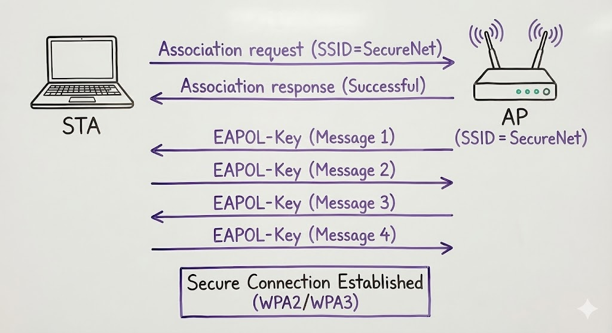

# 5.1 IEEE 802.11 in Action

The IEEE 802.11 Media Access Code (MAC) protocol supplies the functionality in WLANs that is required to provide reliable delivery of user data over the potentially noisy, unreliable wireless media. The IEEE 802.11 MAC protocol implements a frame exchange protocol in which the STA receiving a frame either returns an ACK to the frame's source that the frame was received correctly, or notifies the source of an error.

The frame exchange protocol is then executed by each STA in the WLAN; every STA receives, decides, and responds to information in the MAC header for every frame that it receives, with the exception of certain broadcast, unicast, and beacon frames.

Figure 5.1 depicts a typical two-frame flow for IEEE 802.11 WLAN communication that illustrates an Association Request and Response. First, the STA sends an Association Request frame to the AP, which is a request to connect to the WLAN. The AP with the matching SSID then responds to the STA with either success or failure. If the response indicates success, the result is an Association (not yet an RSNA) between the AP and STA. Association is a record-keeping procedure that allows the DS to keep track of STA location, so that frames from the DS are forwarded to the correct STAs.

<figure><figcaption></figcaption></figure>

**Figure 5-1. Typical Two-Frame IEEE 802.11 Communication**
