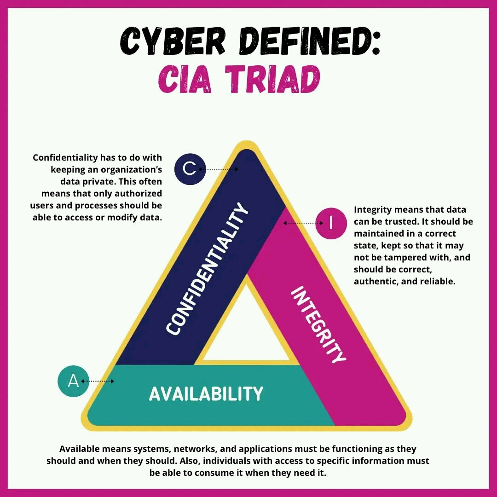

# Hackers

In this book, you will explore the various technologies and methodologies essential for becoming an efficient ethical hacker. You will gain an understanding of what it means to be an ethical hacker and the technical and ethical responsibilities that come with this role.

As you develop your skills as an ethical hacker, you'll see that companies and enterprise environments have had to swiftly and effectively address the daily threats and vulnerabilities they encounter. These organizations have adopted a multi-layered approach that combines technological, administrative, and physical measures to prevent major problems.

Technologies such as Virtual Private Networks (VPNs), cryptographic protocols, Intrusion Detection Systems (IDSs), Intrusion Prevention Systems (IPSs), Access Control Lists (ACLs), biometrics, smart cards, and other devices have all enhanced security. Additionally, administrative countermeasures, including policies, procedures, and operating protocols, have been strengthened and implemented over the past decade. Physical measures, like cable locks, device locks, and alarm systems, also play a crucial role in security.

Your new role as an ethical hacker will involve dealing with all these aspects and more, ensuring a comprehensive approach to cybersecurity.

As an ethical hacker, you must not only understand the environment you will be working in, but also how to identify and address weaknesses and vulnerabilities as needed. Before diving into these tasks, this chapter discusses the history of hacking and what it means to be an ethical hacker. We will also explore the process of penetration testing and the importance of legally binding contracts and the contractual obligations you may be required to adhere to.

### HACKING: A SHORT HISTORY

The term "hacker" is one of the most misunderstood and overused terms in the security industry today. The mere mention of the word often conjures up negative connotations, evoking fear or dismissal. It has almost become the technological equivalent of a boogeyman. But what is a hacker, and where do ethical hackers fit in? To answer this question, let's explore the history and origin of hacking, along with some notable events.

#### _ORIGINS OF HACKING_

The earliest hackers were a group of technologically like-minded programmers and "computer geeks" who were passionate and curious about new technologies. They were the equivalent of modern-day individuals who not only seek the latest technology, like smartphones or iPhones, but also want to uncover all the intricate details of what these devices can do, including hidden features often referred to as "easter eggs." Since those early days, hacking has evolved dramatically: individuals have become more advanced and innovative, with access to newer and more powerful tools.

Hackers and enthusiasts have always worked with the best technology available at the time. In the 1970s, they focused on the mainframes present on college campuses and in corporate environments. By the 1980s, the personal computer (PC) became the newest technological frontier, leading hackers to shift their activities to this new environment. During this decade, hackers began engaging in more mischievous and later malicious activities. Their attacks became more widespread as more people gained access to PCs.

In the 1990s, the public gained access to the Internet, and systems became interconnected. As a result, hackers' curiosity and mischief could easily spread beyond a small collection of systems to reach a global audience. From 2000 onwards, the advent of smartphones, tablets, Bluetooth, and other technologies expanded the range of devices and systems hackers targeted. As technologies evolved, so did hacking techniques and attacks.

When the Internet became widely available, hackers were quick to follow. The emergence of the first generation of web browsers in the early to mid-1990s saw a rise in attacks, including website defacements and other forms of online mischief. Initially, these cyber intrusions were often humorous or interesting pranks; however, more aggressive and harmful attacks soon began to surface, such as the hacking of movies and government websites. Until the early 2000s, website defacements were so common that many incidents went unreported.

#### _CURRENT DEVELOPMENTS_

In the early 2000s, the nature of cyberattacks evolved, becoming more advanced and malicious. The first few years of the new millennium saw an increase in the aggressiveness of attacks, many of which were criminally motivated. Some notable forms of these malicious activities include:

* Denial of Service (DoS) attacks
* Manipulation of stock prices
* Identity theft
* Vandalism
* Credit card and identity theft
* Piracy
* Theft of service

Several factors have contributed to the rise in hacking and cybercrime. One key factor is the sheer volume of information being transmitted and the increasing dependency on the Internet and digital devices. Over the past decade, the number of financial transactions has surged, creating lucrative targets for cybercriminals. Additionally, the openness of modern devices such as the Internet of Things (IoT), smartphones, and technologies like Bluetooth has made hacking and information theft more accessible. The proliferation of Internet-connected devices—including tablets, baby monitors, smart refrigerators, and other gadgets—has further expanded the attack surface for cybercriminals.

The growing number of these devices has drawn the attention of cybercriminals, who are enticed by the opportunity to steal unprecedented amounts of money, data, and other resources. As computer crime laws began to be enacted, the appeal of bragging rights for hacking a website diminished. Consequently, prank activities slowed down, while real criminal activities increased. With the rise of online e-commerce, cyber skills started being sold to the highest bidder, leading to the formation of cybercrime rings, organized cybercrime, and the use of the Internet as an attack vector by nations with hostile intentions.

**\*\*Note:\*\* It is important to remember that many modern attacks are driven by both criminal intent and pranks. Regardless of the attack's motivation, the outcome is often similar: system owners lose access to their assets, and legal boundaries are breached.**

#### _HACKING: FUN OR CRIMINAL ACTIVITY?_

Hacking is by no means a new phenomenon; it has existed in one form or another since the 1960s. It is only in recent decades that hacking has been widely viewed as a crime and a situation that needs to be addressed. Here are some of the most famous hacks over time:

* 1988: Cornell University student Robert T. Morris, Jr. created what is considered the first Internet worm. According to Morris, his worm was designed to count the number of systems connected to the Internet. Due to a design flaw, the worm replicated quickly and indiscriminately, causing widespread slowdowns across the globe. Morris was eventually convicted under the 1986 Computer Fraud and Abuse Act and sentenced to community service.
* 1999: David L. Smith created the Melissa virus, which was designed to email itself to entries in a user’s address book and later delete files on the infected system.
* 2001: Jan de Wit authored the Anna Kournikova virus, which was designed to read the entries of a user’s Outlook address book and email itself to each.
* 2004: Adam Botbyl, along with two friends, conspired to steal credit card information from the Lowe’s hardware chain.
* 2005: Cameron LaCroix hacked into the phone directory of celebrity Paris Hilton and participated in an attack against the site LexisNexis, an online public record aggregator, ultimately exposing thousands of personal records.
* 2011: The hacking group LulzSec performed several high-profile attacks against targets such as Sony, CNN, and Fox.com. The group still appears to be active occasionally despite their claims of retiring.
* 2012 to Present: The hacking group Anonymous has attacked multiple targets, including local government networks, news agencies, and others. The group remains active today.

The high-profile hacking incidents discussed above are just a fraction of the total number of cybercrimes. For every story that reaches the public eye, countless others go unreported. Even among those that do make headlines, only a small percentage of the individuals responsible are caught, and an even smaller number face prosecution. Today, hacking is unequivocally classified as a crime under various laws and regulations, regardless of whether it stems from curiosity or malice. As technology continues to advance, the frequency, volume, and severity of cyberattacks are expected to increase correspondingly.

Here are some common examples of cybercrime:

* Theft of Access: Stealing or exploiting usernames, passwords, or system vulnerabilities to gain unauthorized access. Even merely possessing stolen credentials, without using them, can be considered a crime in some jurisdictions. Sharing credentials with others can also be illegal in certain states.
* Network Intrusions: Unauthorized access to systems or networks, sometimes through simple methods like logging into a guest account, constitutes digital trespassing and is a cybercrime.
* Social Engineering: Exploiting human vulnerabilities to gain access to systems or information. This can be simple, like tricking someone into revealing information, or complex, requiring careful manipulation of verbal and non-verbal cues.
* Illegal Material Distribution: The sharing or posting of illegal content, such as pornography or other illicit materials, has become more problematic with the rise of social media and online platforms.
* Fraud: Deceptive practices to obtain information, access, or financial gain. This includes phishing and other forms of trickery aimed at financial or personal benefit.
* Software Piracy: The unauthorized possession, duplication, or distribution of software, or the removal of copyright protections. This issue has grown with the proliferation of file-sharing services and open directories.
* Dumpster Diving: Retrieving discarded or unsecured information from trash or other waste containers. This method often involves piecing together sensitive data from discarded materials.
* Malicious Code: Creating or deploying viruses, worms, spyware, adware, rootkits, and other types of malware designed to disrupt, damage, or access systems without authorization.
* Unauthorized Destruction or Alteration of Information: Tampering with, destroying, or modifying information without permission.
* Embezzlement: The theft or misdirection of funds by someone in a position of trust, facilitated by digital tools and methods.
* Data Diddling: Unauthorized alteration of data to obscure activities or manipulate information.
* Denial-of-Service (DoS) and Distributed Denial-of-Service (DDoS) Attacks: Overloading a system’s resources to prevent legitimate users from accessing services or information.

The Evolution and Growth of Hacking

As you will explore in this book, the tactics and strategies of hacking have continually evolved and advanced over time. Attackers have consistently sought to enhance their methods, incorporating new types of malware such as worms, spam, spyware, adware, and rootkits. Initially, hacking focused on minor disruptions and annoyances, but in recent years, attackers have escalated their efforts, exploiting our increasingly interconnected lifestyles to cause significant disruptions.

Hackers have also discovered lucrative opportunities in their activities. For instance, some have redirected web browsers to specific pages to generate revenue through advertising. Spammers, on the other hand, send out massive quantities of promotional emails at minimal cost, requiring only a small number of responses to achieve substantial profits.

The field of cybersecurity, whether you're entering it as a security administrator or network engineer, is characterized by rapid and constant change. It is a dynamic battleground where attackers and defenders engage in a perpetual struggle for dominance. Just as attackers continuously adapt and refine their tactics, you as an ethical hacker must also stay agile and innovative. Your ability to think creatively and anticipate potential threats will be crucial in developing effective countermeasures before they can be used against you.

**\*\*Note:\*\* When you encounter new technology or situations, always consider unconventional uses and potential vulnerabilities. For instance, think about how devices like tablets or smartphones might be exploited in ways beyond their intended purpose. Stay alert for weaknesses that could be leveraged. Train yourself to think creatively and anticipate how someone might misuse technology or find ways to bypass security measures. As an ethical hacker, you'll need to apply this mindset constructively and ethically.**

Today, security managers face increased challenges due to the emergence of group-based attacks, which complicate defensive measures and planning. Unlike the early days when attacks were typically carried out by individuals, modern attackers often operate in groups, such as Anonymous and LulzSec. This collective or hive-like approach has proven highly effective, allowing attackers to deploy multiple methods rapidly and achieve significant results. These groups benefit from their size, diversity, and complementary skill sets, often coupled with structured leadership. Moreover, some of these groups have links to criminal or terrorist organizations, further escalating the threat landscape.

In this book, you will explore the methods and tools used on the front lines to carry out increasingly sophisticated and damaging attacks. You'll gain insight into the evolution of these attacks, the role of technology, and how the legal landscape is adapting to address these challenges.

Additionally, you'll learn about adopting the motivations and mindset of attackers. One of the key challenges for ethical hackers is to understand and empathize with their adversaries. By grasping the motivations behind attacks, you can often gain valuable insights into why a particular attack was or might be launched against a target. Remember, an attacker typically needs three things to execute a crime:

* Means: The knowledge, skills, and abilities (KSAs) required to carry out their objectives.
* Motive: The reason or incentive driving their actions.
* Opportunity: The openings or vulnerabilities that allow them to exploit the threat.

Understanding these elements will help you anticipate and defend against potential attacks more effectively.

### WHAT IS AN ETHICAL HACKER?

As you dive further into this book and explore the various tools and techniques it presents, you’ll be learning about hacking from both ethical and unethical perspectives; however, to truly understand your role, it’s essential to clarify what it means to be an ethical hacker.

Ethical hackers are professionals employed either through contracts or direct employment to evaluate and enhance the security posture of organizations. They utilize the same skills and techniques as malicious hackers, but with explicit permission from system or network owners. The key difference is that ethical hackers are authorized to test and probe systems to identify vulnerabilities and weaknesses.

Ethical hackers adhere to strict guidelines and confidentiality agreements. They do not disclose any discovered weaknesses to anyone other than the system or network owner. Their work is governed by contracts that outline the scope of their activities, including what is off-limits and what is expected. Some organizations even maintain dedicated teams of ethical hackers to continuously assess and fortify their security.

In essence, ethical hackers play a crucial role in proactively defending against cyber threats by identifying and addressing vulnerabilities before malicious actors can exploit them.

| **Types of Hackers**                                                                                                                                                                                                                                                                                                                                                                                                                                                                                                                                                                                                                                                                                                                                                                                                                                                                                                                                                                                                                                                                                                                                                                                                                                                                                                                                                                                                                                                                                                                                                                                                       |
| -------------------------------------------------------------------------------------------------------------------------------------------------------------------------------------------------------------------------------------------------------------------------------------------------------------------------------------------------------------------------------------------------------------------------------------------------------------------------------------------------------------------------------------------------------------------------------------------------------------------------------------------------------------------------------------------------------------------------------------------------------------------------------------------------------------------------------------------------------------------------------------------------------------------------------------------------------------------------------------------------------------------------------------------------------------------------------------------------------------------------------------------------------------------------------------------------------------------------------------------------------------------------------------------------------------------------------------------------------------------------------------------------------------------------------------------------------------------------------------------------------------------------------------------------------------------------------------------------------------------------- |
| 
Categories of Hackers

1. Script Kiddies: These individuals have minimal training and rely on pre-written scripts or tools to perform attacks. They often lack a deep understanding of the techniques or tools they use, and their actions are typically more about experimentation or showing off rather than achieving specific goals.

2. White Hat Hackers: Also known as ethical hackers or penetration testers, these professionals use their skills to help organizations strengthen their security. They emulate the techniques of malicious hackers but operate with permission and adhere to a code of ethics, ensuring their actions are legal and intended to improve security.

3. Gray Hat Hackers: These hackers operate in a morally ambiguous space, often engaging in activities that straddle the line between ethical and unethical. They might identify vulnerabilities without authorization but report them to the organization or publicize them in a way that aims to prompt action. Although their intentions might be to improve security, their methods can be questionable, and they may not always be fully trusted.

4. Black Hat Hackers: This category includes individuals who engage in malicious activities with the intent to exploit vulnerabilities for personal gain or to cause harm. They are often unconcerned with legality or getting caught, and their actions can involve theft, sabotage, or other forms of cybercrime.

This categorization helps in understanding the different motivations and approaches within the hacking community.
 |

Understanding and adhering to permission and confidentiality is crucial for an ethical hacker.

One of the most important principles you must grasp and uphold is the necessity of obtaining explicit permission. As an ethical hacker, you should never target or test a system or network without proper authorization. Engaging in unauthorized activities is illegal and can have severe consequences for both your career and personal freedom.

Before initiating any testing, ensure you have a signed agreement or contract from the system or network owner that grants you explicit authorization. This contract should clearly outline the scope of your work and specify what you are permitted to assess. Any changes to the testing scope must be documented in an updated contract to avoid potential legal issues.

It’s also essential to include provisions in the contract that address confidentiality and privacy. During testing, you may come across sensitive or confidential information. The contract should specify how this information will be handled, including who you are allowed to share your findings with. Typically, clients will want you to report your findings exclusively to them.

According to the International Council of Electronic Commerce Consultants (EC-Council), as a Certified Ethical Hacker (CEH), you are required to maintain the confidentiality of any sensitive information acquired during your work. This includes not collecting, distributing, or sharing personal information—such as names, email addresses, social security numbers, or other identifiers—without explicit consent from your client.

Failure to adhere to these ethical standards can lead to a loss of client trust and potential legal repercussions. Always ensure that your actions are compliant with legal requirements and contractual agreements.

\*\*Note:\*\* Contracts are a critical aspect of ethical hacking, and getting them right is essential to avoid legal problems. The legal language and preparation involved can be complex and intimidating. It’s highly recommended to consult with a lawyer who specializes in this field to ensure that your contractual obligations are properly understood and executed. This professional guidance will help you navigate the intricacies of contracts and safeguard against potential legal issues.

Your legally binding agreement is crucial for several reasons, serving as a vital _“get out of jail free”_ card. A contract not only ensures that you have explicit permission from the system or network owner to perform probing or testing but also acts as proof of that authorization. Without such documentation, you lack concrete evidence of consent, which can lead to significant legal complications.

|  | FYI: FOR YOUR INFORMATION                                                                                                                                                                                                                                                                                                                                                                                                                                         |
| ------------------------------------------------------------------------------------------------- | ----------------------------------------------------------------------------------------------------------------------------------------------------------------------------------------------------------------------------------------------------------------------------------------------------------------------------------------------------------------------------------------------------------------------------------------------------------------- |
|                                                                                                   | Upon obtaining the requisite permissions and agreements, you are cleared to initiate penetration testing, commonly referred to as pentesting. This systematic examination aims to expose, take advantage of, and document the protective measures and weaknesses inherent in a target system. When executed appropriately, pentesting provides critical intelligence that enables system or network proprietors to bolster their security mechanisms effectively. |

| BAD GUYS AND GOOD GUYS? OR ETHICAL HACKERS AND UNETHICAL HACKERS?                                                                                                                                                                                                                                                                                                                                                                                                                                                                                                                                                                                                                                                                                                                                                                                                                                                                                                                                                                                                                                                                                                                                                                                                                                                                                                                                                                                                                                                                                       |
| ------------------------------------------------------------------------------------------------------------------------------------------------------------------------------------------------------------------------------------------------------------------------------------------------------------------------------------------------------------------------------------------------------------------------------------------------------------------------------------------------------------------------------------------------------------------------------------------------------------------------------------------------------------------------------------------------------------------------------------------------------------------------------------------------------------------------------------------------------------------------------------------------------------------------------------------------------------------------------------------------------------------------------------------------------------------------------------------------------------------------------------------------------------------------------------------------------------------------------------------------------------------------------------------------------------------------------------------------------------------------------------------------------------------------------------------------------------------------------------------------------------------------------------------------------- |
| 
The distinction between ethical and unethical hackers often sparks debate. The term "hacker" can evoke a range of opinions, from those who view hackers as noble explorers of technology to those who see them as malicious actors. Some even argue that the term originated with model-train enthusiasts who took an interest in computers.

For our purposes, hackers are categorized based on their intentions and the legality of their actions:
<ul><li><em>Black Hats</em>: These hackers act without permission and often engage in illegal activities with the intent to cause harm. Their actions typically fall outside the law.</li><li><em>White Hats:</em> These hackers operate with explicit authorization and focus on improving security. They do not share information about their clients with anyone other than the client itself.</li><li><em>Gray Hats:</em> These hackers operate in a gray area, switching between offensive and defensive actions as needed. They may not always have explicit permission, but their intentions are not always malicious.</li><li><em>Suicide Hackers:</em> A newer category, these hackers pursue their goals with little regard for stealth or consequences. Their primary focus is on successfully executing their attack, even if it leads to legal repercussions.</li><li><em>Hacktivists:</em> Hacktivists use hacking to promote political or social agendas. They target organizations such as government agencies or large corporations to advance their causes.</li></ul> |

#### _ETHICAL HACKING AND PENETRATION TESTING_

Ethical hackers perform sanctioned hacking, meaning they have permission from the system or network owner to conduct their activities. Often referred to as _pentesters_ or _penetration testers_, they simulate malicious attacks to identify and address vulnerabilities in a system. Their aim is to improve security, not to cause harm.

#### _KEY TERMS IN PENETRATION TESTING_

* Hack Value: The appeal or significance of a target, which may make it attractive to attackers due to its potential contents or importance.
* Target of Evaluation (TOE): A system or resource being assessed for vulnerabilities, as specified in the contract with the client.
* Attack: The act of actively engaging and targeting a TOE.
* Exploit: A defined method used to breach a system's security.
* Zero Day: A threat or vulnerability unknown to developers and unpatched, posing a serious risk.
* Security: A state of well-being where only authorized actions is permitted.
* Threat: A potential risk to security.
* Vulnerability: A weakness in a system that can be exploited to gain unauthorized access.
* Daisy Chaining: The sequence of multiple hacking attacks, each building upon the results of the previous one.

#### _RESPONSIBILITIES AND ETHICS OF AN ETHICAL HACKER_

As an ethical hacker, you must adhere to the following guidelines:

* Obtain Written Permission: Ensure you have explicit authorization from the system owner before conducting any tests. Update contracts if the scope changes.
* Use Malicious Techniques Legally: Employ the same methods as attackers but within the bounds of the law and with permission.
* Consider Potential Harm: Be mindful of the possible impacts of your actions, as they can be as disruptive as malicious attacks.
* Understand the Target: Gain knowledge of the target system and its vulnerabilities.
* Define Rules of Engagement (ROE): Establish clear ROE before beginning any testing.
* Maintain Confidentiality: Do not disclose client information to anyone other than the client.
* Respect Client Requests: If asked to stop a test, comply immediately.
* Provide Reports: Deliver detailed reports on your findings and assist with addressing any identified issues if requested.

#### _CODE OF ETHICS_

As an ethical hacker, you agree to:

* Protect Confidential Information: Keep client information private and do not transfer it without consent.
* Respect Intellectual Property: Use your own innovation and avoid illegal or unethical software.
* Disclose Potential Dangers: Inform relevant parties about risks associated with electronic transactions or related technology.
* Work Within Competence: Be honest about your skills and qualifications. Ensure you are appropriately qualified for any project.
* Avoid Deceptive Practices: Refrain from bribery, double billing, or other unethical financial practices.
* Use Client Property Appropriately: Only use client resources in authorized ways with their consent.
* Disclose Conflicts of Interest: Reveal any unavoidable conflicts of interest.
* Manage Projects Effectively: Ensure quality management and full disclosure of risks in projects you lead.
* Contribute to the Profession: Enhance your knowledge, share experiences with peers, and promote e-commerce benefits.
* Maintain Ethical Conduct: Act with integrity in all professional assignments and avoid any association with malicious hackers or activities.
* Adhere to Legal and Ethical Standards: Ensure all activities are authorized, avoid black hat activities, and do not participate in underground hacking communities. Do not misuse certifications or violate laws.

Under the right circumstances and with careful planning, ethical hacking can provide valuable insights to the target organization. Collaborate with your client to thoroughly analyze your findings and prioritize areas needing attention. It is crucial to balance security and convenience, as increased security often leads to reduced convenience. Your client will need to determine the optimal trade-off between these factors. When addressing identified issues, ensure that any changes to security controls do not negatively impact usability. The challenge lies in enhancing security without compromising the system's functionality and user experience. Figure 1.1 illustrates this delicate balance between security and convenience

..png>)\
_**FIGURE 1:** Security versus convenience analysis._

### PENETRATION TESTING AND RULES OF ENGAGEMENT (ROE)

Penetration testing, also known as _pentesting,_ is a specialized form of ethical hacking that involves simulating cyberattacks against a computer system, network, or web application to identify vulnerabilities that could be exploited by malicious actors. Unlike traditional hacking, which is illegal, penetration testing is conducted with explicit authorization from the owner of the system being tested. This distinction is crucial because it separates legitimate security assessment activities from criminal acts.

#### _IMPORTANCE OF CLEAR RULES OF ENGAGEMENT_

The essence of penetration testing lies in its structured and formalized approach, which contrasts sharply with the ad hoc and unpredictable nature of unauthorized hacking. To ensure that penetration tests remain within the bounds of legality and ethics, clear _**Rules of Engagement (RoE)**_ must be established before the test begins. RoE defines the scope, objectives, and boundaries of the penetration test, specifying what is permissible and what is not during the testing process.

#### _RISKS WITHOUT ESTABLISHED RULES OF ENGAGEMENT_

Without clearly defined RoE, the risk of unintended consequences increases significantly. These consequences can range from minor inconveniences, such as temporarily disrupting services, to more severe outcomes, including financial losses, reputational damage, and legal liabilities. In extreme cases, actions taken during a penetration test could lead to criminal or civil charges against you or the organization conducting the test. This shows the importance of establishing RoE to protect all parties involved.

#### _LEGAL AND OPERATIONAL CONDITIONS_

From a legal standpoint and perspective, establishing RoE helps ensure that you operate within the confines of the law. By obtaining proper authorization and adhering to predefined guidelines, you can conduct thorough assessments without risking legal repercussions. Operationally, RoE serve as a blueprint for the testing process, guiding you on what systems to target, what types of attacks to simulate, and how to report findings. This structured approach facilitates effective communications between you and stakeholders, ensuring that everyone understands the goals, methods, and implications of the penetration test.

Remember that penetration testing is a vital component of any cybersecurity strategy, providing you and organizations with insights into potential vulnerabilities that could be exploited by attackers; however, the effectiveness and safety of penetration testing depends heavily on the establishment of clear Rules of Engagement (RoE). These rules delineate the boundaries of the test, safeguarding both you and the organization from legal and operational pitfalls, and ensuring that your testing process contributes positively to the overall security posture of your client organization.

### TYPES OF PENETRATION TESTS

Understanding and conducting black, white, and gray box penetration tests effectively plays a huge role as part of your pentesting endeavors. These are literally the pentests that you will be hired or assigned to complete, and each is crucial for assessing the security postures of the systems for which you are tasked to probe, penetrate, assess, and remediate. Each method provides a unique perspective on potential vulnerabilities, allowing you to tailor your testing strategies to you and your client organization’s specific needs. Pentests generally fall into one of three categories:

#### _1. BLACK BOX TESTING_

In a black box test, you’re essentially mimicking an external attacker who has no prior knowledge of the systems, applications, or network. This means you will not receive any pre-testing information about the target systems, its architecture, configurations, existing vulnerabilities and risks present in the infrastructure, and applications, or networks for which you will be assessing. To conduct a successful black box test, it would be beneficial for you to follow these steps:

1. _**Focus on User Perspective:**_ Since black box testing doesn’t require knowledge of internal workings of the system, concentrate also on simulating real user interactions and scenarios. This approach helps identifying issues from the user’s perspective, ensuring the system behaves as expected.
2. _**Utilize Decision Table Testing:**_ This technique involves creating tables that represent all combinations of inputs and expected outputs. It’s particularly useful in black box testing for covering a wide range of scenarios without needing to know the internal logic.
3. _**Gather Public Information:**_ Start by collecting as much publicly available information about the target(s) as possible. This includes domain registration details, DNS records, and any content that might reveal the technology stack being used.
4. _**Perform Reconnaissance:**_ Use tools like Nmap for scanning IP ranges, Shodan for discovering directly Internet-connected devices, and Google hacking or Google dorks for searching through websites.
5. _**Exploit Findings:**_ Based on your reconnaissance, information gathering, or footprinting efforts, attempt to exploit identified vulnerabilities. Focus on exploiting known vulnerabilities that match the information gathered.

#### _2. GRAY BOX TESTING_

Here, the tester is given partial information about the target, such as IP addresses, operating systems, and network environment details. Gray box testing strikes a balance between black and white box testing by providing you with limited information about your target entities. Typically, you are given only some of the organization’s _“lay of the land,”_ while the other parts you’re expected to find out on your own with no leads. This approach mirrors the situation of an insider or someone with limited knowledge of the system, providing a balance between the external and internal perspectives. To conduct a gray box test effectively, it would be beneficial for you to follow these steps:

1. _**Combine Strengths of Both Approaches:**_ Gray box testing leverages the strengths of both black and white box testing. Use your knowledge of the system’s architecture to create more targeted test cases that cover critical functionalities and potential vulnerabilities.
2. _**Leverage Matrix Testing:**_ This technique involves systematically testing combinations of inputs and outputs, considering the internal workings of the system. It’s particularly effective in gray box testing for uncovering subtle bugs and security issues.
3. _**Receive Limited Information:**_ Agree on the scope of information you will be provided with. This could include specific credentials or access to certain systems you are assigned or hired to penetrate and assess.
4. _**Analyze Provided Data:**_ Use the provided information to plan your test effectively, focusing on areas that are likely to be vulnerable based on the partial visibility you have.
5. _**Simulate Insider Threats:**_ Since you have some level of access, try to simulate an insider threat scenario, focusing on how an employee with limited knowledge of the system might go about exploiting vulnerabilities.

#### _3. WHITE BOX TESTING_

Conducting a white box test gives you full visibility into the target system, including its architecture, configurations, and known vulnerabilities. This method is akin to having insider access. To succeed in a white box test, you should:

1. _**Deep Dive into Code:**_ With white box testing, you have access to the internal code and architecture. Take advantage of this by looking for common coding mistakes, inefficient algorithms, syntax errors, and security vulnerabilities that might not be evident from the user interface alone.
2. _**Implement Control Flow Testing:**_ This involves tracing the execution path of the code to ensure every line is executed under different conditions. It’s a powerful way to verify that the code logic is correctly implemented and covers all intended paths.
3. _**Review Documentation:**_ Obtain and study all available documentation, including network diagrams, blueprints, schematics of network topology and layout, list of assets, software versions, and locations of devices to be tested.
4. _**Identify Potential Vulnerabilities:**_ Use this extensive knowledge to identify potential vulnerabilities, focusing on areas that are commonly exploited or misconfigured.
5. _**Test Hypotheses:**_ Validate your hypotheses by attempting to exploit the identified vulnerabilities. Given comprehensive knowledge, this step might involve custom exploits tailored to the specific configurations and versions of your target system(s).

Each type of testing provides different insights and has its use cases, so it’s important to understand and implement the appropriate one based on the client's needs and the scope of the engagement.

|  | FYI: FOR YOUR INFORMATION                                                                                                                                                                                                                                     |
| ------------------------------------------------------------------------------------------------- | ------------------------------------------------------------------------------------------------------------------------------------------------------------------------------------------------------------------------------------------------------------- |
|                                                                                                   | Remember to keep the terms black box, white box, and gray box in mind, as you'll encounter them both in this book and in real-world scenarios. While the concepts are straightforward, it's important to memorize these terms to ensure you're well-prepared. |

In many cases, you'll be conducting what’s known as an IT audit. This process evaluates and confirms whether the controls designed to protect an organization are functioning as intended. Typically, an IT audit is conducted using a standard or checklist that includes security protocols, software development practices, administrative policies, and IT governance; however, it's important to note that passing an IT audit does not guarantee complete security, as audit criteria may become outdated.

### THE CIA TRIAD

As an ethical hacker, you'll aim to uphold the _**CIA triad:**_ _**Confidentiality**_, _**Integrity**_, and _**Availability**_. Understanding the CIA triad is fundamental to grasping the core principles of information security. This model serves as a guiding framework for developing and implementing security policies within an organization. Let’s break down each component to ensure you have a solid grasp of what makes up the CIA triad.

#### _CONFIDENTIALITY_

Confidentiality is about ensuring that data is accessible only to those authorized to have access. It’s the concept of keeping information secret and limiting access to it. In practice, this means implementing strong authentication and authorization mechanisms to control who can view or interact with certain data. Think of it as setting up a lock on your data cabinet – only the right keys (credentials) can unlock it.

#### _INTEGRITY_

Integrity ensures that data remains consistent, accurate, and unchanged during processing. It’s about maintaining the trustworthiness of the data and preventing unauthorized modifications. This involves using checksums, hashes, and digital signatures to verify the authenticity and consistency of data. Imagine your data as a recipe for baking cookies. Integrity ensures that every ingredient is exactly as it should be, and nothing extra or missing, to ensure the final product turns out as expected.

#### _AVAILABILITY_

Availability is about ensuring that data is accessible when needed by authorized users. It addresses the aspect of reliability and uptime, ensuring that systems and data are operational and accessible. This involves designing systems to withstand failures and ensuring that backups and recovery plans are in place. Think of it as making sure your favorite restaurant is open when you want to eat there – your food (data) is ready and waiting for you to grab it.

The CIA triad isn’t just about adding layers of security; it’s about creating a comprehensive security strategy that covers all your bases. When implemented correctly, the CIA triad can help you to create secure environments where data is protected, trusted, and accessible when needed. It’s a proactive approach you can take to security and provides you with steppingstones to implement appropriate safeguards to prevent breaches and ensure that data remains safe, untampered, and usable.

#### _BENEFITS OF THE CIA TRIAD_

Implementing the CIA triad offers several benefits, including enhanced data security and privacy, compliance with regulatory requirements, proactive risk prevention, and comprehensiveness in addressing security concerns. It’s not just about stopping attackers; it’s about ensuring that your data is secure, accurate, and accessible, which is crucial for the smooth operation of any organization.

In sum, the CIA triad is a cornerstone of information security, providing you a structured approach to ensuring that data is kept confidential, its integrity is maintained, and its availability is guaranteed. By understanding and applying the principles of the CIA triad, you can significantly enhance the security posture of any organization.

\
_**FIGURE X:** Illustration depicting the C.I.A. triad._

The CIA triad is one of the most critical sets of goals to maintain when assessing and planning security for a system. Attackers will often aim to compromise these goals—confidentiality, integrity, and availability—when targeting a system. As an ethical hacker, your role is to identify, evaluate, and address any vulnerabilities or weaknesses related to these principles to prevent malicious actors from causing harm.

The Anti-CIA Triad

Understanding the concepts of _**disclosure, alteration,**_ and _**destruction**_ is crucial for anyone involved in cybersecurity, whether you’re an ethical hacker, a security professional, or just someone interested in learning about the fundamentals of information and cyber security. These concepts form the basis of the inverse of the _**CIA (Confidentiality, Integrity, Availability) triad,**_ often referred to as the _**DAD (Disclosure, Alteration, Destruction) triad**_ or as the _**Anti-CIA triad.**_ Let’s break each of these terms down to ensure you have a solid grasp on them in conjunction with the CIA triad.

While the CIA triad focuses on preserving the security of information and resources, the anti-CIA triad highlights how these principles can be violated:

#### _DISCLOSURE_

Disclosure occurs when unauthorized parties gain access to information that they shouldn’t have access to. This can happen due to various reasons, such as weak security measures, human error, or sophisticated attacks. For instance, it someone manages to steal confidential medical records and publishes them online, causing embarrassment or financial loss to the affected individuals, this would be considered a case of disclosure. It’s a violation of confidentiality, one of the pillars of the CIA triad. In addition, disclosure using the examples above could also be considered a form of _**doxing**_ which is a term that has become increasingly prevalent in our digital age.

#### _DOXING_

At its core, doxing involves the act of publicly disclosing personally identifiable information about an individual or organization without their consent, typically through the internet. This practice can have serious implications and consequences for privacy and security, as it exposes individuals to potential harm, including stalking, harassment, and identity theft. The term “doxing” originates from the phrase “dropping dox” which refers to the act of releasing documents containing personal information. Historically, doxing has been used in various contexts, ranging from exposing the identities of hackers to embarrassing or punishing individuals with opposing viewpoints. It’s a form of _**cyberbullying**_ that leverages sensitive information, statements, or records for harassment, exposure, financial harm, or other exploitative purposes.

Doxing can be carried out through several methods, including:

*
  *
    * _**Aggregating Public Information:**_ Collecting personal information from public databases and social media platforms.
    * _**Hacking:**_ Gaining unauthorized access to personal information stored in digital systems.
    * _**Social Engineering:**_ Manipulating individuals into revealing personal information.

The motivations behind doxing vary widely. Some perpetrators aim to reveal harmful behavior and hold offenders accountable, while others seek to embarrass, scare, threaten, or punish someone. It’s also commonly used for _**cyberstalking**_ which can instill fear for the victim’s safety. Despite its negative connotations, some argue that doxing can be justified in cases where it serves to expose harmful behaviors, as long as the act aligns with public interests.

Platforms like Facebook and others are actively working to prevent users from being doxed or otherwise targeted for harassment; however, the ease with which information can be shared and accessed online makes doxing a challenging problem to tackle. Individuals and organizations are advised to take proactive measures to protect their personal information and to report incidents of doxing to the relevant authorities.

Although doxing is not part of the DAD, or Anti-CIA triad, it remains a serious issue that highlights the importance of privacy and security in our digital age. It underscores the need for responsible behaviors online and the importance of implementing safeguards to protect personal information.

#### _ALTERATION_

Alteration happens when data is intentionally or unintentionally modified or changed. This can lead to incorrect information being presented or decisions being made based on inaccurate data. An example of alteration could be someone tampering with patient medical records to suggest a different diagnosis or treatment plan, which could lead to incorrect treatment and potentially endanger lives. Alteration undermines the integrity component of the CIA triad, which emphasizes maintaining the accuracy and consistency of data.

#### _DISRUPTION (ALSO KNOWN AS LOSS)_

Destruction refers to the act of completely deleting or rendering data, systems, or applications inaccessible. A cyberattack related to large disruption of these automated services is known as a _**Denial of Service (DoS) attack.**_ Disruptions can be a result of a deliberate attack aiming to wipe out critical systems or data, or it could occur due to natural disasters, such as floods, earthquakes, or fires, or hardware failures. For example, if a cybercriminal gains access to a company’s database and deletes all customer records, this would constitute destruction. It’s the antithesis of availability, which ensures that data and resources are accessible when needed.

### BALANCING SECURITY MEASURES

It’s important to note that achieving perfect, or _**absolute security**_ is nearly impossible. Striving for absolute secrecy can make accessing information unnecessarily difficult, while overly permissive access controls can leave valuable data exposed. Finding the right balance between keeping things secret, safe, and easily accessible is key to effective security. This involves implementing resilient security measures, regularly updating and patching systems and software, educating users about security best practices, and continuously monitoring and assessing security posture.

Understanding disclosure, alteration, and destruction helps you appreciate the multifaceted challenges faced by security professionals in cybersecurity. By recognizing these threats and taking proactive steps to mitigate them, you can play a crucial role in protecting valuable information and systems from unauthorized access, modifications, or destruction.

Furthermore, understanding the anti-CIA triad helps you view security from the aggressor’s perspective, emphasizing how attackers aim to undermine these core principles. Additionally, an ethical hacker's primary responsibility is to uphold the CIA triad—confidentiality, integrity, and availability—ensuring that these principles are maintained at all times. They must address threats in alignment with the organization's goals, legal requirements, and other needs. For instance, if an investment firm or defense contractor experienced a disclosure incident due to a malicious attack, the consequences could be devastating. Such a breach could lead to significant financial loss, damage to reputation, and potential legal repercussions, highlighting the critical importance of preserving the CIA triad in every security assessment and action.

In this book, you will frequently come across legal issues related to ethical hacking and penetration testing. It is crucial for you to understand which laws apply to your activities and consult with a lawyer to ensure compliance. Always be aware of the legal boundaries in your work and seek legal advice if you find yourself in a situation where the law might be unclear or potentially problematic.

#### _HACKING METHODOLOGIES_

A hacking methodology is a structured approach used by attackers to compromise a target, such as a computer network. While there is no universal step-by-step process followed by all hackers, certain general phases are commonly employed. Unlike ethical hackers, who adhere to a code of ethics and follow legal guidelines, malicious hackers operate without such constraints.

The typical steps in a hacking process, as illustrated in Figure 2, generally include:

1. _**Reconnaissance**_

Gathering information about the target to identify potential vulnerabilities. This can involve passive methods, such as searching publicly available information, or active methods, like scanning the network.

1. _**Scanning**_

Using tools to probe the target for open ports, services, and vulnerabilities. This step helps attackers understand the target's configuration and find weaknesses to exploit.

1. _**Gaining Access**_

Exploiting identified vulnerabilities to gain unauthorized access to the target system. This can involve using various attack techniques such as phishing, exploiting software flaws, or brute-forcing passwords.

1. _**Maintaining Access**_

Establishing a foothold within the target system to ensure continued access. This may involve installing backdoors or creating new user accounts to retain control.

1. _**Cleanup and Exit Strategy**_

Erasing evidence of the attack to avoid detection. This can include clearing logs, deleting files, or modifying timestamps.

1. _**Escalating Privileges**_

Gaining higher levels of access within the target system, such as administrative rights, to enhance control and further exploit the system.

1. _**Exfiltrating Data**_

Extracting valuable information from the target, which could include sensitive data, intellectual property, or personal information.

1. _**Reporting**_

For ethical hackers, this involves documenting findings and providing recommendations to the client to improve security. For malicious hackers, this step is typically not performed unless it involves communicating demands or threats.

Understanding these steps helps ethical hackers anticipate potential attack vectors and strengthen defenses accordingly..png>)\
_**FIGURE 2:** The hacking lifecycle._

### HACKING PHASES

_**1. Footprinting**_

Footprinting involves gathering information about a target using primarily passive methods to minimize detection. Techniques include:

* _**WHOIS Queries**_
  * Identifying domain registration details.
* _**Google Searches**_
  * Finding information about the target from publicly available sources.
* _**Job Board Searches**_
  * Discovering details from job postings that may reveal network configurations or technologies in use.
* _**Discussion Groups**_
  * Analyzing forums or social media for useful information.

This phase aims to collect as much background information as possible without directly interacting with the target system.

_**2. Scanning**_

In the scanning phase, you use the information obtained from footprinting to conduct more targeted investigations. Techniques include:

* _**Ping Sweeps**_
  * Determining which hosts are active on the network.
* _**Port Scans**_
  * Identifying open ports and services on the target system.
* _**Observations of Facilities**_
  * Inspecting physical locations if applicable.

Tools like **Nmap** are commonly used to perform these tasks, helping you refine your approach based on the data collected.

_**3. Enumeration**_

Enumeration involves extracting detailed information from the scanned data to understand the target better. This is akin to exploring a hallway and checking which doors are unlocked. This phase focuses on:

* _**Usernames and Groups**_
  * Identifying users and their roles.
* _**Applications and Services**_
  * Gathering information about software and service configurations.
* _**Banner Information**_
  * Retrieving service banners for version details and vulnerabilities.
* _**Auditing Information**_
  * Discovering audit logs and other useful system data.

_**4. System Hacking**_

With detailed knowledge from enumeration, you can plan and execute attacks. This phase might involve:

* _**Account Attacks**_
  * Exploiting user accounts found during enumeration.
* _**Service Exploits**_
  * Crafting attacks based on service information or vulnerabilities identified from banners.

_**5. Privilege Escalation**_

If the initial system hacking phase is successful, you aim to gain higher-level access. Techniques include:

* _**Privilege Escalation**_
  * Moving from a low-level account (e.g., guest) to a higher privilege level (e.g., administrator or root).
* _**Exploit Vulnerabilities**_
  * Leveraging flaws to escalate access permissions.

_**6. Cleanup and Exit Strategy**_

In this phase, you attempt to erase evidence of your presence to avoid detection. Actions may include:

* _**Purging Log Files**_
  * Deleting or modifying logs that record your activities.
* _**Destroying Evidence**_
  * Removing other indicators of compromise to make detection more difficult.

_**7. Planting Back Doors**_

To maintain future access, you may install backdoors such as:

* _**Special Accounts**_
  * Creating hidden user accounts with elevated privileges.
* _**Trojan Horses**_
  * Installing malicious software that allows remote access.

Understanding these phases helps ethical hackers anticipate potential attack methods and enhance defensive measures accordingly.

Both ethical hackers and malicious hackers typically follow a similar process, though their motivations and constraints differ significantly.

#### _MALICIOUS HACKERS:_

* _**Flexibility**_
  * They set their own rules and employ the hacking process based on personal objectives or immediate goals. Their approach is often driven by personal gain, curiosity, or malicious intent, without formal constraints or oversight.

#### _ETHICAL HACKERS:_

* _**Structured Approach**_
  * They adhere to a structured process similar to that of malicious hackers, but with key differences:
    * _**Permission**_
      * Ethical hackers must obtain explicit authorization from the target organization before starting any phase of their assessment.
    * _**Reporting**_
      * They generate detailed reports documenting their findings at each phase of the process. These reports are essential for informing the client about vulnerabilities and recommendations for improvement.
    * _**Documentation**_
      * Ethical hackers maintain meticulous records throughout the process to ensure comprehensive and accurate reporting.

Ethical hackers follow the same general steps as malicious hackers but operate within a framework of accountability and professionalism, including legal agreements and reporting obligations.

When preparing to conduct a penetration test, it's crucial to engage with your client to understand their needs and establish clear parameters. Ask the following questions along with any others you might feel are relevant. During this phase, your goal is to clearly determine why a pentest, and its associated tasks are necessary Some questions to guide you could include:

_**1.**_ _**Purpose and Scope:**_

* Why did the client request a penetration test?
* What is the function or mission of the organization being tested?
* What data and services will be included in the test?

_**2.**_ _**Rules and Constraints:**_

* What are the constraints or rules of engagement for the test?
* What actions are allowed during the test?
* Will the test be performed as a black box, gray box, or white box?
* What conditions will determine the success of the test?

_**3.**_ _**Data and Privacy:**_

* Who is the data owner?
* Will insiders be notified of the test?

_**4. Expectations and Reporting:**_

* What results are expected at the conclusion of the test?
* What will be done with the results when presented?

_**5**_. _**Resources and Budget:**_

* What is the budget for the test?
* What are the expected costs?
* What resources will be made available for the test?

_**6**_. _**Testing Types:**_

* _**Insider Attack**_
  * Intended to mimic actions by internal employees or parties with authorized access.
* _**Outsider Attack**_
  * Simulates actions and attacks by an external party.
* _**Stolen Equipment Attack**_
  * Involves stealing a piece of equipment to access or extract information.
* _**Social Engineering Attack**_
  * Targets users to exploit human trust and gather needed information.

Vulnerability Research and Tools

The process of vulnerability research and utilizing tools during a pentest is a multifaceted endeavor that begins with planning and ends with analyzing the outcome. At the outset, the at this point in the pentest, you should have enough information gathered to understand the network’s functioning and potential weaknesses. This foundational step sets the stage for the subsequent phases of the pentest in which you are performing.

Following the scanning phase, the next step involves gaining access to the target application. This is achieved by locating vulnerabilities using pentesting strategies such as Cross-Site Scripting (XSS) and SQL Injection 9SQLi). The ability to maintain access post-exploitation is then assessed, checking if a cybercriminal could sustain a persistent presence through an exploited vulnerability or gain a deeper foothold into the network fabric.

The final phase of the process is analysis, where the outcome of your pentest is evaluated. You will have to create and prepare a detailed report, outlining the exploited vulnerabilities, the sensitive data accessed, and the response time of the system of when you initially penetrated it. This report will include all the meticulous notes you have been taking throughout your entire pentesting process from beginning to finish. This comprehensive analysis ensures that your pentest not only identifies the vulnerabilities you uncovered within scope but also assesses the effectiveness of the target system’s defenses against potential attacks.

Throughout this process, you will be using the vulnerability assessment tools in your toolkit employed to facilitate the identification and exploitation of your identified vulnerabilities. Your tools should range from vulnerability scanners that identify known vulnerable applications and misconfigurations on the systems to be tested, to network sniffers that monitor data in network traffic, and password crackers that attempt to recovery passwords stored or transmitted in a scrambled form. Each tool you have plays a unique role in the pentest, contributing to a holistic view of the target system’s security posture.

The process of vulnerability research and tool utilization in penetration testing is a systematic approach that combines strategic planning, rigorous scanning, targeted exploitation, and thorough analysis. By leveraging a suite of specialized tools, you can find yourself uncovering and exploiting vulnerabilities, offering valuable insights into the security of a system and informing necessary remediation efforts.

**Identifying Vulnerabilities**

The process of identifying vulnerabilities within systems, software, and environments is a critical aspect of maintaining security and resilience. This task requires a nuanced understanding of potential security flaws, from the development phase through deployment, and the implementation of effective strategies to mitigate these risks. Your goal is to enhance the security posture of applications, safeguarding data and services against unauthorized access or compromise.

Understanding the specifics of vulnerabilities is your first step toward securing the applications you penetrated against them. It involves adopting secure coding practices, implementing comprehensive testing and monitoring strategies, regularly updating and patching software components to address known vulnerabilities, and you continuously reviewing and enhancing security configurations. If you adopt a proactive and informed approach to application security, you can contribute greatly to your client organization to significantly reducing their risk associated with the vulnerabilities you uncover.

One of your key strategies for identifying application security issues is by integrating security into _**Continuous Integration/Continuous Development (CI/CD)**_ pipelines. This involves incorporating tools for automatic scanning of vulnerabilities in code, dependencies, and configurations within the CI/CD process. _**Static Application Security Testing (SAST)**_ is used for deep code analysis, while _**Dynamic Application Security Testing (DAST)**_ is applied for live application testing, including authenticated scans to cover parts of the application post-authentication.

Comprehensive application testing is another essential practice you will need to master. By combining _**Software Composition Analysis (SCA)**_ and _**Interactive Application Security Testing (IAST)**_ allows for the identification of vulnerabilities in both open-source libraries and custom code in real-time during the pentesting phases. These tools offer you valuable insights into outdated libraries, known vulnerabilities, and how data flows through the application.

Another aspect of vulnerability analysis is for you to perform _**threat modeling**_ and the and adopt and advocate to enforce the _**Principle of Least Privilege (PoLP)**_ to better understand potential security threats and design application architecture accordingly. This ensures minimal permissions for operation, helping to prioritize security efforts and minimize the impact of potential compromises.

Automating security maintenance and conducting regular penetration testing require steps to you uncovering vulnerabilities that your automated tools might miss, providing a as your goal and aim is to turn out the most comprehensive security assessment you are capable of. Automated secret detection prevents data breaches from accidentally committed sensitive information, and regular updates and patches to keep dependencies secure.

The process in which you need to identify vulnerabilities and addressing application vulnerabilities is essential for you to maintain a secure and resilient digital environment for your client and their stakeholders. By implementing these strategies and best practices, you can significantly contribute to the enhancement of your client’s application security posture, ensuring ongoing vigilance and adaptability to emerging threats.

**Classifying Vulnerabilities**

When you embark on a penetration test, one of the crucial steps is classifying vulnerabilities. This process involves you having to evaluate and sorting the vulnerabilities you’ve identified into categories based on their potential impact and how easily they can be exploited. Your understanding of the classification processes helps you to prioritize which vulnerabilities your client needs to address first, ensuring that the most critical issues are tacked immediately and efficiently.

Some approaches you can implement to aid you in this process may include but are not limited to:

1. _**Understand the Basics**_

First, familiarize yourself with the types of vulnerabilities you might encounter. Common categories include:

* _**High Severity**_
  * These vulnerabilities pose a significant risk to the system or application. They will allow malicious actors to gain full control or access to sensitive data without authorization.
* _**Medium Severity**_
  * While not as critical as high-severity vulnerabilities, these still require attention. They might allow limited access or data leakage.
* _**Low Severity**_
  * These vulnerabilities are generally considered minor and might not directly impact the system’s functionality or security; however, they could potentially be part of a larger attack vector.

1. _**Assessment Criteria**_

To classify vulnerabilities accurately, consider the following criteria:

* _**Impact**_
  * Evaluate the potential damage or loss that could potentially occur if the vulnerability is exploited. Consider factors like data loss, system downtime, or unauthorized access.
* _**Exploitability**_
  * Determine how easily the vulnerability can be exploited. Factors here include the complexity of the exploit, availability of tools, and the skill level required.
* _**Remediation Effort**_
  * Estimate the effort required to fix the vulnerability. This includes the cost, time, and resources needed.

1. _**Practical Steps**_

* _**Initial Scanning**_
  * Start with a broad scan to identify potential vulnerabilities. Use automated tools to get a comprehensive list of vulnerabilities.
* _**Detailed Analysis**_
  * For each identified vulnerability, conduct a detailed analysis. This might involve manual testing or using specialized tools to understand the vulnerability fully and thoroughly.
* _**Classification**_
  * Based on your analysis, classify each vulnerability. Use the criteria mentioned earlier to guide your decision-making.
* _**Prioritization**_
  * With your vulnerabilities classified, prioritize them based on their severities and the potential impact or likelihood on the system(s). Address high-severity vulnerabilities first, however.
* _**Documentation**_
  * Document, document, document! Document each vulnerability, including its classification, details of the analysis, and provide recommended mitigation steps. This documentation serves as a reference point for future audits and helps track your client’s progress in remediating their vulnerabilities.
* _**Follow-Up**_
  * Regularly revisit your classification and prioritization as new information comes to light or as the system evolves. This ensures that your classification remains relevant and accurate as your client navigates remedial processes.

If you follow these guidelines, you’ll be able to classify vulnerabilities effectively, ensuring that your penetration testing efforts are focused, meaningful, and impactful. Remember, the goal is not just to identify vulnerabilities but to also understand their significance and prioritize them for remediation, ultimately strengthening your client’s systems’ security posture.

Defense Positioning in Penetration Testing

As you journey further into the world of penetration testing, understanding defense positioning becomes a crucial factor. This concept revolves around using the insights gained from your penetration tests to strategically deploy and adjust security measures per client scope and expectations. Think of it as setting up a fortress; the information you gather from your tests acts like a map, showing your client where the walls are weak, where the gates are vulnerable, and where reinforcements are needed. First, we’ll discuss the concept of defense positioning in penetration testing and then we will break down how you can apply this concept effectively.

Defense positioning in the context of penetration testing refers to the strategic placement and enhancement of security measures based on the insights gained from your penetration testing efforts. It’s about using the information you uncovered during your tests to make informed decisions about where to strengthen your client’s defenses. This process is important for optimizing your client’s security posture, ensuring that your defenses are aligned with the vulnerabilities and threats your client is most at risk of facing.

Understanding the Concept of Defense Positioning in Penetration Testing

Imagine you’re preparing a castle for an oncoming siege. Before the enemy arrives, you send scouts to assess the landscape, identify weak points in the walls, and observe the enemy’s tactics. This is similar to what you do during a penetration test. You’re essentially assessing your client’s system’s defenses, identifying vulnerabilities, and understanding the _**Tactics, Techniques, and Procedures (TTPs)**_ that attackers may employ.

After conducting your penetration test, you will have a wealth of information about the assessed systems’ vulnerabilities and the potential impacts of these weaknesses. This information serves as a valuable tool for defense positioning as it tells you exactly where your defenses need to be strengthened and how to do so effectively.

Strategic Placement of Defenses

Based on the insights from your penetration testing efforts, you can strategically place your defenses. For example, if you discover that a system is particularly vulnerable to SQL injection (SQLi) attacks, you might decide to implement stricter input validation rules or use parameterized queries to prevent such attacks. Similarly, if you find that certain areas of the network you are assessing are poorly configured, leading to easy access for malicious actors, you might want to tighten up network configurations or implement additional monitoring to detect unusual activities.

Defense positioning is not a one-time activity. As systems evolve and new threats emerge, you need to continually reassess your defenses. Regular penetration testing is key to staying ahead of potential attackers. By regularly testing your defenses and adapting your security measures based on your latest findings, you ensure that the systems you test remain resilient against evolving threats.

Keep in mind that defense positioning is about more than just patching identified vulnerabilities. It’s about you making strategic decisions about where to strengthen your defenses based on your deep understanding of your system’s vulnerabilities and the tactics of potential attackers. By applying the insights from your penetration tests, you can optimize security postures, making it harder for attackers to succeed and ensuring the safety of your system.

Gathering Intelligence

First off, you’re going to gather a ton of information. This isn’t just about finding vulnerabilities; it’s about fully understanding the entire landscape of the systems you are assessing security status. You’ll be looking at everything from network configurations to application settings and even the habits of the users interacting with the system. This step is akin to scouting out the terrain before deciding where to build your fortress.

Once you’ve gathered enough information, it’s time for you to analyze it. Look closely at the vulnerabilities you’ve discovered – how serious are they? How easy are they to exploit? What kind of access do they give an attacker? This analysis will tell you where your defenses are weakest and where you need to strengthen them.

With your analysis complete, you can start strategizing. Maybe you decide to reinforce certain areas because they’re particularly vulnerable. Or perhaps you decide to change your approach entirely, moving away from a perimeter-based defense to a more internal focus, given the nature of the vulnerabilities you’ve discovered. This is where your role as a strategist really shines – you’re not just fixing the problems; you’re creating a comprehensive defense plan.

At this time, you put your plan into action. This might mean installing new firewalls, adjusting configurations, or even retraining staff on safe practices. Every change you make is based on the insights you gained from your penetration test, making your defense positioning more informed and effective.

Finally, remember that defense positioning isn’t just a one-time event. Just like a fortress needs constant maintenance and occasional renovations, your security measures need to also evolve over time with dynamic changes of threat and attack TTPs. Keep running penetration tests, stay abreast of new threats and vulnerabilities, and be ready to adjust your defenses as needed. This ongoing process ensures that your fortress remains strong against whatever challenge may come its way.

In essence, defense positioning is about using the information you gathered from penetration testing assessments to make smart, strategic decisions about how to best secure the assessed systems. It’s about turning your insights from your tests into actionable steps that ultimately strengthen your defenses, making your systems more resilient against potential attacks. So, as you embark on your penetration testing journey, remember to always keep an eye on the bigger picture – and how your actions today can shape the security landscape of tomorrow.

Resource Allocation in Penetration Testing

Resource allocation is a critical aspect that determines how effectively you can guide your client to better protect their systems. It’s about making smart choices and decisions on where to invest your security resources and how to distribute them across your client’s network and applications. Let’s dive into why this matters and how you can master it.

Understanding Resource Allocation

Think of your client’s IT infrastructure as a city. Just like a city needs roads, parks, schools, and hospitals to function smoothly, your client’s IT infrastructure requires various resources to operate securely. These resources include hardware, software, personnel, and budget. Effective resource allocation means ensuring these resources are distributed wisely to maximize security.

The first step in resource allocation is identifying where your vulnerabilities lie. Through penetration testing, you uncover these weaknesses, whether they’re in your web applications, databases, or network infrastructure. Once you know where the vulnerabilities are, you can start allocating resources to address them.

Deciding Between Prevention and Response

Next, you need to decide how to allocate your resources. Do you invest more in preventive measures, like intrusion detection systems and firewalls, or in response capabilities, like incident response plans and forensic analysis tools? Both are important, but the right balance depends on your organization’s risk profile and the nature of the vulnerabilities you’ve identified.

Monitoring is also a key part of resource allocation. By deciding where to place sensors and what metrics to track, you can ensure that you’re keeping a close eye on the areas of your client’s systems that are most vulnerable. This proactive approach can help you to catch potential threats early and respond quickly.

Personnel Allocation

Personnel is often the most valuable resource in an organization. By assigning skilled security analysts to monitor critical systems and train others on security-minded best practices, you can enhance security postures significantly. Consider the roles of red team members, who simulate attacks, and blue team members, who defend the system in your resource allocation strategy.

Budgeting for Security

Lastly, don’t forget about the budget. Security doesn’t happen for free. Speak with your lead about allocating funds for purchasing security tools and investing in training and certification. A well-planned budget ensures that you have the financial means and resources to support your security-driven initiatives.

Effective resource allocation is about making strategic decisions based on the insights from your penetration tests. It's about knowing where to invest your resources to get the biggest bang for your buck. Whether it's upgrading firewall software, deploying advanced analytics for threat detection, or training your team on the latest security practices, every dollar spent should move you closer to a more secure system.

Mastering resource allocation in penetration testing is about understanding your vulnerabilities, deciding where to invest your resources, and planning how to monitor and respond to threats. By doing so, you can ensure that your security investments are directed where they're needed most, making your client’s systems stronger and more resilient against potential attacks.

Embarking on a journey of penetration testing, understanding and executing vulnerability research effectively is paramount. This process, particularly when approached passively, is about identifying and understanding vulnerabilities without directly interacting with the target system. Let's dive into how you can master this technique.

Passive Vulnerability Research

At the heart of passive vulnerability research lies the art of observation. Imagine you're watching a chess game from afar, trying to predict the opponent's moves based on their past actions and the current setup. Similarly, in passive vulnerability research, you're observing the target system, network, or application without sending any signals or probes that could alert the system to your presence. This approach relies heavily on gathering information that's already publicly available or can be observed indirectly.

Techniques for Passive Vulnerability Research

1. _**Internet Footprinting:**_ Start by exploring the internet for any publicly available information about the target. This includes domain registration details, DNS records, and any content that might reveal the technology stack being used. Tools like WHOIS lookup and DNS enumeration tools can be very helpful here.
2. _**Open-Source Intelligence (OSINT):**_ Utilize OSINT tools and techniques to gether information from publicly accessible sources. This could include social media profiles, news articles, and forums where discussions about the target might have occurred. The goal is to piece together as much information as possible about the target’s operations, infrastructure, and potential vulnerabilities.
3. _**Network Traffic Analysis:**_ Monitor network traffic to the target system. Even though you’re not sending any packets yourself, observing the traffic can reveal a lot about the target’s security posture. Look for anomalies, such as unexpected connections, unusual data transfer volumes, or unencrypted communications, which could indicate vulnerabilities.
4. _**Configuration Reviews:**_ Sometimes, simply reviewing the configurations of publicly accessible elements can reveal insecure settings. For example, checking the configuration of web servers or mail servers might show that default credentials haven’t been changed (and yes, you will see cases as such), or that unnecessary services are enabled.

Why Passive Matters

Passive vulnerability research is crucial because it allows you to gather information without risking detection. It’s a stealthy approach that can uncover vulnerabilities that might not be apparent through more intrusive methods. Additionally, it aligns with the principle of “least privilege,” avoiding actions that could escalate your visibility or risk detection.

After gathering information passively, your next steps involve analyzing the collected data to identify potential vulnerabilities. This might involve correlating information from different sources, researching known vulnerabilities that match the observed behaviors, and prioritizing findings based on their potential impact and exploitability.

Remember, the goal of passive vulnerability research is not just to find vulnerabilities but to understand the broader security context of the target. This understanding forms the foundation for more targeted and effective penetration testing efforts.

Mastering passive vulnerability research is about becoming a silent observer, piecing together clues from publicly available information to uncover potential security weaknesses. By doing so, you lay the groundwork for a successful penetration testing engagement, ensuring that your efforts are informed, targeted, and impactful.

Ethics and the Law

Being aware of legal considerations is crucial for you as an ethical hacker, especially in the field of penetration testing, requires you to have a deep understanding of legal considerations to navigate the complexities of cybersecurity law and ethics. Let’s break down these concepts to ensure you’re equipped to handle them effectively.

Ignorance of the law is never an excuse, and this holds true in the realm of cybersecurity. As an ethical hacker, you must be fully aware of the legal frameworks governing your activities. This includes understanding the laws in your own country, as well as those in any other jurisdictions you may be operating in. Failing to comply with these laws can lead to severe consequences, including legal action and criminal charges. It’s crucial to stay informed about changes in legislation and how they might affect your work.

Jurisdictional Issues in Ethical Hacking

Cybercrimes often transcend national borders, making them subject to the laws of multiple jurisdictions. This complexity can complicate investigations and prosecutions, as different countries may have varying definitions of offenses and penalties. As an ethical hacker, you must be prepared to tread these waters carefully. Understanding the legal systems of the countries involved, including common law, military law, and civil law, is essential. This knowledge will help you to anticipate potential legal pitfalls and ensure that your activities remain within the bounds of ethicality and legality.

Trust and Legal Implications: Upholding Integrity

Your clients place a great deal of trust in you to conduct penetration tests ethically and responsibly. Breaching this trust can have far-reaching consequences, including legal repercussions. It’s imperative to adhere strictly to the agreed-upon scope and rules of engagement for each penetration test you conduct or take part of. Understanding the legal risks associated with overstepping these boundaries is crucial for protecting your professional integrity and the interests of your clients.

Several landmark laws and regulations have shaped the legal landscape of cybersecurity. Familiarizing yourself with these laws, such as the U.S. Code of Fair Information Practices, the U.S. Privacy Act, and the U.S. Computer Fraud and Abuse Act, among others, is essential. These laws govern various aspects of data privacy, computer fraud, and electronic communications, providing a framework for your ethical hacking activities. Being aware of legal considerations is not just about avoiding legal trouble; it’s about upholding the higher standards of professionalism and integrity in the field of ethical hacking. By understanding the legal frameworks, navigating jurisdictional issues, seeking legal counsel, and adhering to the terms of your engagement’s contracts, you can ensure that your work contributes positively to cybersecurity while minimizing legal risks.

Key Laws and Regulations

Key laws and regulations and the significance and impact of these pivotal pieces of legislation on the landscape of cybersecurity and data privacy is crucial. Your full understanding of varying legislations can lead you to staying out of legal trouble. Let’s take a look at some of these legislations that might impact your ethical hacking efforts.

* _**1973: U.S. Code of Fair Information Practices**_

This foundational document established principles for the collection, maintenance, and dissemination of personal information by data systems. It set the stage for subsequent laws by emphasizing the importance of individual rights regarding their personal data, including accuracy, completeness, relevance, and timeliness. It also highlighted the necessity for safeguards to prevent unauthorized access to personal information.

* _**1974: U.S. Privacy Act**_

The Privacy Act was enacted to regulate the collection, maintenance, use, and dissemination of _**Personally Identifiable Information (PII)**_ held by federal agencies. It protects individuals’ privacy rights by requiring agencies to inform citizens whose PII is being collected and how it will be used. This act has been instrumental in shaping data privacy laws globally, influencing policies that protect personal information and data in the hands of government entities.

* _**1984: U.S. Medical Computer Crime Act**_

The U.S. Medical Computer Crime Act was a pioneering piece of legislation that specifically targeted the protection of medical data stored in computer systems. Prior to this act, there were few legal protections for the confidentiality, integrity, and availability of medical information. This act made it a federal offense to knowingly access or alter medical data without authorization, marking a significant step forward in safeguarding patient privacy and the integrity of medical records, or _**Personal Health Information (PHI).**_ It underscored the importance of securing healthcare information and set precedents for future laws focusing on data protection.

* _**1986: U.S. Electronic Communications Privacy Act (ECPA)**_

The U.S. Electronic Communications Privacy Act (ECPA) was enacted to address the growing concern over the interception of electronic communications. It prohibited unauthorized interception of wire, oral, and electronic communications, both in transit and at rest. This act was a response to technological advancements that made it easier for individuals and organizations to intercept private communications. ECPA established legal protections for electronic communications, balancing the need for law enforcement access to evidence with the privacy rights of individuals. It set important precedents in the digital age and influenced subsequent legislation dealing with electronic surveillance.

* _**1986 (Amended in 1996): U.S. Computer Fraud and Abuse Act**_

Originally aimed at preventing unauthorized access to federal computers, this act was amended to broaden its scope, covering a wide range of cybercrimes, including altering, damaging, or destroying information in federal computers. It marked a significant shift towards recognizing the growing threat posed by cyberattacks and the need for legal frameworks to combat them.

* _**1994: U.S. Communications Assistance for Law Enforcement Act**_

This law mandates that telecommunications services providers assist law enforcement agencies in the execution of court orders to install surveillance devices. It was designed to facilitate lawful interception of communications while ensuring that service providers did not bear the costs of enabling such surveillance devices.

* _**1996: U.S. National Information Infrastructure Protection Act**_

This act aimed to enhance the protection of data and systems by promoting international cooperation against computer crime. It acknowledged the global nature of cybercrime and the need for coordinated efforts to combat it effectively.

* _**1996: U.S. Kennedy-Kassebaum Health Insurance Portability and Accountability Act (HIPAA)**_

HIPAA is a landmark piece of legislation that fundamentally changed how healthcare information is handled and protected. It was designed to improve the portability and continuity of health insurance coverage for Americans changing jobs or experiencing other life events. Beyond its primary purposes, HIPAA also included provisions for the protection of individually identifiable health information. It requires healthcare providers and insurers to implement safeguards to protect patients’ privacy and to notify patients in the event of a breach of their personal health information. HIPAA set national standards for the protection of personal health information, influencing healthcare practices worldwide and establishing a framework for data privacy and protection in the healthcare sectors.

* _**1996: U.S. National Information Infrastructure Protection Act**_

The U.S. National Information Infrastructure Protection Act was enacted to enhance the protection of data and systems against computer crimes. Recognizing the interconnectedness of modern societies and the increasing reliance on digital technologies, this act aimed to promote international cooperation in combating computer crime. It acknowledged the global nature of cyber threats and the need for coordinated efforts to address them effectively. The act encouraged the development of policies and mechanisms for sharing information and expertise between nations to better protect the national information infrastructure. It represented a shift towards a more collaborative approach to cybersecurity, highlighting the importance of international cooperation in addressing cyber threats.

* _**2002: Sarbanes-Oxley Act (SOX)**_

SOX was enacted in response to corporate scandals, such as Enron, and aimed to improve financial disclosures and combat accounting fraud. It introduced stringent requirements for financial reporting and auditing, impacting how businesses manage and report financial information.

* _**2002: Federal Information Security Management Act (FISMA)**_

FISMA mandates that federal agencies develop, document, and implement an agency-wide program to provide for the management of the security of covered information and systems. It emphasizes the importance of a holistic approach to managing information security within federal agencies.

Each of these acts reflects a recognition of the evolving challenges posed by the digital age, from the protection of sensitive medical data to the prevention of unauthorized access to electronic communications. They have shaped the legal landscape of cybersecurity and data privacy, These laws have played a crucial role in shaping the legal landscape of cybersecurity, highlighting the importance of international cooperation in addressing cyber threats. They reflect society’s evolving understanding of the importance of protecting personal information and the increasing sophistication of cyber threats. They have molded how governments, organizations, and individuals approach the protection of information in today’s digital realms.

Summary and Best Practices

To excel in the world of ethical hacking, you need to adopt a comprehensive approach that combines technical proficiency with legal awareness and ethical responsibility. Let’s examine some best practices to ensure you’re well-prepared for your journey into penetration testing.

Develop a Comprehensive Skill Set

Having a broad and deep skill set is not just beneficial – it’s essential. You need to be proficient in:

* _**Technological Aspects**_
  * Mastering network protocols, operating systems, web technologies, and encryption algorithms.
* _**Administrative Knowledge**_
  * Understanding security policies, access controls, and compliance standards.
* _**Physical Security Awareness**_
  * Recognizing how physical security measures can bolster digital defenses and security.

Understanding Your Environment

Before you start testing, it’s crucial to immerse yourself in the environment you’re about to penetrate. This involves you:

* _**Learning About the Systems**_
  * Getting a thorough understanding of the architecture of the systems you’re testing, including how data flows through them.
* _**Navigating Legal Landscapes**_
  * Being familiar with the legal framework that applies to your activities, including local laws and industry-specific regulations.
* _**Considering Ethical Implications**_
  * Reflecting on the ethical boundaries of your role and the potential reputational risks associated with your actions.

Adhering to Contracts

Every penetration tester should be grounded in a formal agreement that clearly defines the scope, objectives, and limitations of the test requirements and expectations to be carried out.

Make sure that you:

* _**Review the Contract Carefully**_
  * Ensure you fully grasp the expectations and restrictions outlined in the contract.
* _**Stick to the Agreed-Upon Parameters**_
  * Avoid straying from the agreed-upon parameters unless explicitly permitted by the contract and scope.

Legal Boundaries

While you operate in a somewhat ambiguous legal space, it’s vital to remember that you’re still bound by the law. Always keep in mind:

* _**Unauthorized Access is Illegal**_
  * Never engage in activities that could be seen as unauthorized access or hacking beyond the scope and contractual agreement of your contract.
* _**Be Aware of the Consequences**_
  * Understand the legal repercussions of your actions, including potential fines and imprisonment.

Understanding Your Role as an Ethical Hacker

As an ethical hacker, you enjoy a unique position in the cybersecurity landscape. Unlike malicious hackers, you have explicit permission to perform your hacking activities. Emphasize the distinctions by:

* _**Operating with Consent**_
  * Constantly remind yourself that you’re acting with the approval of the system or network owner, setting you apart from malicious actors.
* _**Maintain Open Communication and Transparency**_
  * Keep the lines of communication open with the system and network owner and always be truthful about the actions you’ve conducted on the network or actions you plan to conduct on the network, so that everyone remains on the same page leaving no room for miscommunications, questions, uncertainties, or doubts between you and your client.

Know Your Tools and Terms

The field of penetration testing is vast and continuously evolving. To stay relevant, you need to:

* _**Get Up-to-Speed with New Tools**_
  * Regularly learn about the latest tools and technologies used in penetration testing.
* _**Familiarize Yourself with Industry Jargon**_
  * Become comfortable with the technical terms and jargon used in the field.

If you follow these best practices, you’ll not only enhance your effectiveness as an ethical hacker, but also contribute to the overall security of the systems you test. Remember, ethical hacking is not just about finding vulnerabilities, it’s about doing so responsibly and legally. Also, by maintaining vigilance, adhering to legal and ethical standards, and clearly understanding your client's needs and expectations, you will be well-positioned to perform effective and responsible ethical hacking.
