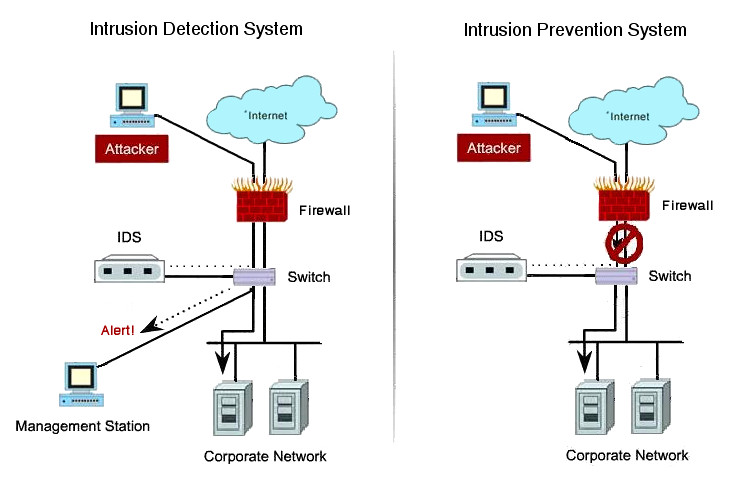

# Indications of Intrusion

### Indications of Intrusion

#### System Intrusions

Certain parameters clearly indicate the presence of an intruder or even an emerging attack on a system or network. Attackers modify certain system files and configurations to hide any sighs of intrusions. An attacker’s number one objective is to remain stealth, covert, and fly low and slow under the radar of the defenders. To put it simply, an attacker’s main objective is to not get caught; however, in doing so, they leave many digital footprints behind making the task of identifying and detecting an attacker a bit easier for the defender. Signs of intrusion can include, but are not limited to:

* A system failing to identify a valid user
* Active access to unused logins, or dormant accounts
* Logins during nonbusiness hours (unless a business justification supports this)
* New user accounts other than the accounts the administrator has created
* Modifications to system software, in-house homegrown code, and configuration files that the system was idle for during that particular time. The gaps may actually indicate that an intruder has attempted to erase the auditing tracks
* The system’s performance decreasing drastically, consuming CPU time
* Sudden system crashes and reboots without user intervention
* System logs are too short and incomplete
* Time stamps of system and security logs are modified to include strange inputs
* Permissions on log files are changed, including new ownership of the log file and its inheritable subfolders
* System logs are deleted
* System performance is abnormal; the system responds in unfamiliar ways to normal inputs by administrator
* Unknown processes are identified
* Unusual display of graphics, pop-ups, and text messages observed on the system

#### File System Intrusions

By observing the system files, a user can identify the presence of an intruder. System files record the activities of the system. Any modification or deletion of the file attributes or the files themselves is a sign that the system was a target of attack. The following anomalies are indications of file system intrusion, and may include but are not limited to:

* New, unknown files or programs on the system
* Changed file permissions: Intruders often attempt to escalate privileges to gain administrative access. Intruders who obtain administrative privileges can change the file permissions
* Unexplained modifications in file sizes: All system files should be analyzed
* Presence of rogue SUID and SGID files on a Linux system that do not match the master list of SUID and SGID files
* Unfamiliar file names in directories, including executable files with strange extensions and double extensions
* Missing files

#### Network Intrusions

The following symptoms are general indications of network intrusions and may include but are not limited to:

* Sudden increase in bandwidth consumption
* Repeated probes of a machine’s available services
* Connection requests from IPs other than those allowed in the network range
* Repeated attempts to log in from remote machines
* Arbitrary log data in log files, indicating attempts of denial of service attacks, bandwidth consumption, and distributed DoS

#### Steps to Perform After an IDS Detects an Attack

The following steps should be performed aftern an IDS detects a possible attack and may include but are not limited to:

* Configure the firewall to filter out the IP addresses of the intruder; however,this still allows the intruder to attack from other addresses and attack vectors
* Beep or play a WAV file. This may be anything that draws the attention of the administrator
* Send SNMP trap datagrams to a management console like HP OpenView or Tivoli
* Sends Windows events to the event log
* Send email to an administrator to notify of the attack
* Save the attack information (time stamp, intruder IP address, victim IP address/ports, and protocol information)
* Save a trace file of the raw packets for future analysis
* Launch a separate program to handle the event
* Forge a TCP FIN or RSP packet to force a connection to terminate

### Evading IDS

#### IDS Attacks

IDS are not foolproof. Intruders can spoof from fake addresses to trick the IDS, and this can include creating fake attacks to trigger a reaction from the IDS. Almost like seeing how far once can push the envelope to the point of no return. Fake software designed to trigger an alert from an IDS can make it snap network connectivity for a genuine service. The intruder has many options for attacking given the conditions of attack are optimal and in the intruder’s favor may include but are not limited toL

**Insertion Attacks**

Insertion is the process by which an attacker confuses an IDS by forcing it to read invalid packets. In this case, the packets would not be accepted by the system to which they are addressed. If a packet is malformed or if it does not reach its actual destination, the packet is invalid. If the IDS reads an invalid packet, the IDS will become confused.

To understand how insertion becomes a problem for a network IDS (NIDS), it is important to understand how IDS detects attacks. The IDS employs pattern-matching algorithms to look for specific patterns of data in a packet or stream of packets. For example, IDS might look for the string “phf” in an HTTP request to discover a PHF Common Gateway Interface (CGI) attack. An attacker who can insert packets into the IDS can prevent pattern matching from operating. For instance, an attacker can send the string “phf” to a webserver, attempting to exploit the CGI vulnerability, but force the IDS to read “phoneyf” (by inserting the string “oney” instead). One simple insertion attack involves intentionally corrupting the IP checksum. Every packet transmitted on an IP network has a checksum that is used to verify whether the packet was corrupted in transit. IP checksums are 16bit numbers that are computed by examining information in the packet. If the checksum on an IP packet does not match the actual packet of the host to which it is addressed, it will not accept it, while the IDS may consider it a part of the effective data stream.

**Evasion Attacks**

An evasion attack occurs when the IDS discards a packet that the host to which it is addressed accepts. Evasion attacks are devastating to the accuracy of the IDS. An evasion attack at the IP layer allows an attacker to attempt arbitrary attacks against hosts on the network, without the IDS ever realizing it. One example of an evasion attack occurs when an attacker opens a TCP connection with a data packet. Before any TCP connection can be used, it must be opened with a handshake between the two endpoints of the connection (a fairly obscure fact about TCP is that the handshake packets can themselves bear data). IDS that do not accept the data in these packets are vulnerable to an evasion attack.

**Denial of Service (DoS) Attack**

Multiple types of denial of service are valid against IDS. The attacker identifies a point of network processing that requires the allocation of a resource, causing a condition to occur that consumes all of that resource. The resources that can be affected by the attacker are CPU cycles, memory, disk space, and network bandwidth. The CPU capabilities of the IDS can also be monitored and affected. This is because the IDS needs half of the CPU cycle to read the packets, detect the purpose of their existence, and then compare them with some location in the saved network state. An attacker can verify the most computationally expensive network processing operations and then compel the IDS to spend all of its time carrying out useless work.

#### Intrusion Detection System (IDS) Capabilities

An Intrusion Detection System (IDS) necessitates memory allocation for numerous functions, including pattern matching generation, maintaining TCP connections, managing reassembly queues, and buffering of data. Initially, the system demands memory to facilitate packet reading and network processing operations. Attackers can exploit this by forcing the IDS to allocate memory for insignificant data, thereby depleting available resources.

Furthermore, IDS systems occasionally store activity logs on disk, consuming substantial disk space. Attackers can exploit this by generating and logging a vast quantity of trivial events, saturating the disk space and inhibiting the IDSs ability to log genuine events, rendering it ineffective.

#### Network-Based IDS (NIDS)

Network-based IDSs (NIDS) monitor network activities and are typically effective because networks rarely operate at full capacity; however, they do tend to struggle under extreme network congestion depending on topologies and the layout of the network. Unlike end systems, which only process packets that are addressed to them, IDSs must inspect all packets traversing the network. An attacker can exploit this by flooding the network with irrelevant data, thereby overwhelming the IDS and preventing it from accurately monitoring network activities.

**Complex Attacks**

Sophisticated hackers can devise intricate strategies to evade detection by Intrusion Detection Systems (IDS) and one such tactic involves manipulating TCP connections to deceive the Network Intrusion Detection System (NIDS). For instance, an attacker might dispatch a TCP Reset (RST) or Finish (FIN) packet that, while detected by the NIDS, goes unnoticed by the targeted system. This deception tricks the NIDS into believing the connection has been terminated, whereas it remains active. Given the stateful nature of TCP connections, the attacker can pause the assault for an extended period before resuming, taking full advantage of the system’s timeout settings, or idle periods.

The initial phase of the attack establishes a vector, or pathway, that appears legitimate to the NIDS, yet prompts downstream routers to discard packets based on their configuration settings. In scenarios where the NIDS experiences slow link speeds, attackers can exploit this by inundating the link with high-priority IP packets while transmitting the TCP FIN packet at a lower priority. Consequently, the router’s queuing mechanism discards these low-priority packets.

Attackers also strategize based on the target host’s acceptance criteria. Different TCP stacks exhibit varied responses to marginally invalid inputs. Attacker can manipulate the traffic acceptance or rejection by employing tactics such as sending unconventional TCP options, including timeouts for IP fragments or TCP segments, overlapping fragments or segments, or inserting slightly incorrect values in TCP flags or sequence numbers. These methods exploit the nuances in how different systems handle anomalous network traffic, allowing attackers to bypass IDS detection mechanisms.

**Obfuscation**

An obfuscator is a tool that transforms a simple program into a functionality identical but significantly more complex version, aiming to obscure its original functionalities. This complicates the task of Intrusion Detection System (IDS) in detecting malicious software, as the IDS relies on comparing the program against known signatures in its database.

**Desynchronization**

This technique manipulates SYN Packets in two primary ways:

1. Postconnection
2. Preconnection

These two manipulation tactics evade detection by sniffers or IDS.

* _**Postconnection SYN:**_ Instead of attempting to directly fool an intelligent sniffer or IDS, which monitor TCP sequence numbers, attackers first aim to desynchronize these systems. This is achieved by injecting a Postconnection SYN packet into the data stream, which contains valid sequence numbers and meets acceptance criteria for the target system. Following the transmission of this data stream, the host disregards the SYN packet since the connection referenced by the SYN packet is already established. The goal here is to resynchronize the sniffer or IDS. Successful resynchronization allows the attacker to subsequently transmit an RST packet with a new sequence number, further disrupting the monitoring system.
* _**Preconnection SYN:**_ This method involves sending an initial SYN packet before establishing the actual connection, but with an invalid TCP checksum. Depending on the sniffer’s intelligence, it may ignore or accept subsequent SYNs in a connection. If the sniffer bypasses TCP checksum verification, the attack proceeds with synchronization and a false sequence number is sent to the sniffer or IDS prior to the real connection being established.

**Fragmentation Attacks**

Similar to _**session splicing attacks,**_ fragmentation attacks employ various fragmentation techniques to avoid detection by IDS.

**Session Splicing**

Session splicing is a network-level evasion technique that splits a string across multiple packets, dividing the data into smaller byte segments. By dividing the data into smaller byte segments, this method aims to bypass detection mechanisms by obscuring patterns that would otherwise trigger alerts. To counteract such evasion techniques, Intrusion Detection Systems (IDS) must not only monitor network traffic but also recognize and adapt to these deceptive practices. An IDS might employ alternative detection strategies to identify session splicing attempts. During transmission, this division helps evade string matching by the IDS. To counteract these evasion methods, an IDS must be capable of recognizing and understanding the evasion technique, employing alternative detection methods. An example Snort rule for detecting an evasion technique is provided below, targeting traffic intended for port 80 with specific characteristics indicative of an attempted reconnaissance or space splice attack:

.png>)

alert tcp $EXTERNAL\_NET any -> $HTTP\_SERVERS 80 (msg:"WEB-MISC whisker space splice attack"; content:"|20|"; flags:A+; dsize:1; reference:arachnids,296; classtype:attempted-recon; sid:1000001; rev:001;).

This Snort rule is crafted to flag traffic directed towards port 80, where the ACK flag is set, indicating an acknowledgement packet. The presence of a space character (represented by hex value 20) within the payload combined with a data size (dsize) of 1 byte, suggests an attempt at session splicing. This rule aids in identifying potential evasion tactics by analyzing specific packet characteristics that are indicative of such deceptive maneuvers.

### Intrusion Prevention Systems (IPS)

Now, to introduce an Intrusion Detection Systems’ (IDS) right-hand counterpart: Intrusion Prevention System (IPS). Intrusion Prevention Systems (IPS) introduces a novel class of protective and prevention measures embodying a proactive stance towards safeguarding networks, focusing on the early identification and rapid response to potential security threats.

An Intrusion Prevention System (IPS) encompasses any device employing access control mechanisms to shield systems against malicious exploitation. It represents an evolution behind intrusion detection, aiming to replicate the reliability, consistency, and latency characteristics inherent in other network infrastructure components like switches and routers. Primarily, an IPS is engineered to intercept harmful data packets, halt intrusions, and automatically block malevolent traffic before any damage occurs.

Network architects must design networks meticulously to ensure precise latency and throughput requirements are met when routing traffic between points. These performance metrics should remain unaffected by the volume of sorting operations performed or the nature of the traffic traversing the network. An IPS enhances network integrity by correcting _**CRC (Cyclic Redundancy Checks)**_ errors, defragmenting packet streams, migrating TCP sequencing problems, and eliminating undesirable transport-and network-layer options.

Intrusion Prevention Systems mark the convergence of networking and security disciplines. They serve not merely as perimeter defense mechanisms but offer greatest utility when deployed both internally and at network boundaries. To achieve effectiveness, an IPS must guarantee seamless network performance coupled with exceptional precision in thwarting attacks. This shift signifies a departure from traditional security appliances such as firewalls, and intrusion detection systems, which necessitate extensive configuration, adaptation, and manual intervention, towards a more automated and integrated security paradigm.

\
_**FIGURE X:** Traditional Intrusion Detection System (IDS) versus an Intrusion Prevention System (IPS)_

### Intrusion Prevention System (IPS) Strategies

Strategies for implementing Intrusion Prevention System (IPS) includes three primary strategies that guide the operation of IPSs:

1. _**Host-Based Memory and Process Protection:**_ This approach involves monitoring active processes by the IPS and disabling those deemed malicious, such as processes attempting buffer overflow exploits.
2. _**Session Interception:**_ By enabling a flexible response plugin, an IPS can terminate sessions by issuing a Reset (RST) packet. Snort, for example, can automate the termination of TCP sessions through this mechanism.
3. _**Gateway-Level Intrusion Detection:**_ Snort employes gateway identification to block malicious traffic and manipulates the access of control lists of blocked traffic via **SnortSam**. Alerts are triggered upon detection of suspicious activities.

#### Risks Associated with IPS Deployment

Deploying an IDS, especially when utilizing Snort in an IPS mode, comes with certain risks. The following sections outline these risks.

* _**Session Termination and IDS Exposure:**_ Snort can end TCP sessions upon detecting an attack by sending an RST packet. This action may inadvertently reveal the type of IPS responsible for the termination and even the operating system running the IPS software to attackers.
* _**Passive OS Fingerprinting (pOf):**_ This tool helps identify the operating system and analyze packet flows, enabling attackers to determine the machine type sending the RST packet and thus deduce the IPS solution in use.
* _**Time Delay Exploitation:**_ Attackers can exploit the delay between an IPS detecting an attack and updating the access control lists on border devices to establish a covert connection to another system.
* _**Self-Inflicted Denial of Service:**_ Spoofing or modifying source addresses to appear as legitimate systems needed by the network, can lead to denial of service conditions. For example, spoofing a DNS server’s address can disrupt name resolution services, while spoofing a mail gateway can halt email traffic.
* _**Blocking Legitimate Traffic:**_ An IPS typically blocks packets identified as attacks; however, if legitimate traffic is mistakenly flagged as malicious, leading to the blocking of numerous inbound connections, significant financial losses may occur for businesses relying on the IPS. It’s equally important to exercise the utmost caution to prevent such scenarios.

### Types of Intrusion Prevention System (IPS)

There are primarily two categories of IPS: _**Host-Based IPS (HIPS)**_ and _**Network-Based IPS (NIPS).**_

* _**Host-Based IPS (HIPS):**_ A HIPS integrates the intrusion prevention software directly onto the system it safeguards. This integration allows the software to closely monitor, and intercept system calls by binding directly to the operating system and its services. Through this binding, the application can effectively prevent attacks and maintain logs of activities. Unlike traditional antivirus solutions, HIPS don’t require frequent updates to combat new malware because it utilizes both signature-based and heuristic detection methods. Beyond monitoring system calls, a HIPS can also oversee data streams, file locations, and registry settings, particularly for web servers, to defend against generic attacks.

Malicious software typically aims to alter the system or other applications on the targeted machine. Host-based Intrusion Prevention Systems (HIPS) detect these changes and either block them automatically or alert the user for approval. An _**Application Binary Interface (ABI)**_ consists of fundamental binary software conventions that remain unchanged. HIPS operate by enforcing ABI standards or policies extending beyond the _**Application Programming Interface (API)**_ encompassing both the API and the machine language specific to a particular CPU family. Consequently, breaching the system without infringing upon the ABI becomes challenging for attackers.

### Network-Based Intrusion Prevention Systems (NIPS)

* _**Network-Based Intrusion Prevention Systems (NIPS):**_ Also known as _**inline**_ or _**gateway**_ _**IDS**_ due to their integration of Intrusion Detection System (IDS), IPS, and firewall functionalities, and application allow and denylists, offer comprehensive protections. NIPS features two primary interfaces: **internal** and **external**. Incoming packets are initially directed to the detection engine of the internal interface, where they undergo examination for potential threats. Packets deemed safe are then forwarded to their intended destinations. NIPS act as applications or hardware components designed to prevent intrusions on specific network hosts. They inspect traffic according to security policies and discard any identified malicious traffic. Unlike host-based IPS, NIPS do not require installation on every computer system thus simplifying deployments across networks.

There are several types of NIPS, including:

* _**Content-based NIPS:**_ These systems scrutinize network packet content for unique sequences, known as signatures, to identify and block unauthorized network entries. This method is pretty effective against attacks such as worms or hacking attempts.
* _**Rate-based NIPS:**_ Rather than focusing on content, these systems analyze traffic patterns to detect threats. By establishing parameters through observation of normal traffic types and behaviors, rate-based NIPS identifies anomalies as potentially malicious and blocks them. This approach is particularly effective against denial of service (DoS) and Distributed Denial of Service (DDoS) attacks.

### Information Flow in IDS and IPS

Both Intrusion Detection Systems (IDS) and Intrusion Prevention Systems (IPS) share similarities in how information flows through them. This overview outlines eight methods illustrating these similarities and differences.

1. _**Raw Packet Capture:**_ The initial phase involves capturing raw packets, a common starting point for both IDS and IPS. This process involves transferring captured packets to subsequent system components. Two primary modes exist for capturing this data:
   1. _**Promiscuous Mode:**_ Network Interface Cards (NICs) collect packets at every network interface, or choke point.
   2. _**Non-Promiscuous Mode:**_ NICs selectively capture packets associated with specific MAC addresses, ideal for host-based detection and prevention.

Network-based detection employs dual NICs – one for packet capture and another for remote administrative access by host systems. Captured raw packets are preserved by both IDS and IPS for future processing and analysis.

1. _**Filtering:**_ This stage controls which captured packets proceed further. Filtering occurs at various levels, including through NICs and packet filters configured to capture the selected packets. Tools like **libpcap** facilitate packet filtering via a BPF interpreter, determining which packets reach applications. Filtering typically occurs in kernel space with assistance from a BPF interpreter, although some systems, like Solaris, perform filtering in user space, which is less efficient.
2. _**Packet Decoding:**_ Decoders interpret packet structures obtained through promiscuous monitoring. Decoding identifies packets as IPv4, IPv6, and assesses packet integrity via integral checksums. IDS tools, such as **Snort**, employ packet encoding to verify header checksums against calculated values for protocol combinations.
3. _**Storage:**_ Post-decoding packets are stored either in files or data structures. File storage is straightforward but can lead to disk space management challenges due to large data volumes. Data structure usage mitigates this issue.
4. _**Fragment Reassembly:**_ Stored data undergoes fragment reassembly, addressing overlaps and sequential order issues. Fragmentation aids in eliminating wasted space within packets.
5. _**Stream Assembly:**_ This complex storage mechanism manages various conditions, complicating the process.
6. _**Stateful Inspection of TCP Sessions:**_ Both IDS and IPS analyze network traffic significance through stateful inspection. This method challenges systems when dealing with session-like packets, potentially overwhelming networks and rendering IDS and IPS ineffective. Current systems perform stateful inspections, aiding in signature matching and identifying scans for OS fingerprinting attempts.

### Firewall Protections for IDS and IPS

The primary function of firewalling is to safeguard Intrusion Detection Systems (IDS) and Intrusion Prevention Systems (IDS/IPS) against external threats such as worms, viruses, and Trojan horses. Given that attackers may target IDS/IPS to disable them, firewalls serve as great protective barriers. They filter proxy data across networks, thereby reducing traffic volumes. Notably, most IDS/IPS solutions lack built-in firewalls because integrating them could severely compromise system performance.

### IDS vs. IPS: A Complementary Relationship

Debating the merits of IDS versus IPS within the ream of technical security has proven unnecessary. These technologies, while distinct, can effectively complement each other. Several key differences exist between them, which are outlined in the table below.

| **Intrusion Detection System (IDS)**                     | **Intrusion Prevention System (IPS)**                    |
| -------------------------------------------------------- | -------------------------------------------------------- |
| Placed on network inactively                             | Placed in-line (actively)                                |
| Cannot parse encrypted traffic                           | Better at defending applications                         |
| Installed on network segments (NIDS) and on hosts (HIDS) | Installed on network segments (NIPS) and on hosts (HIPS) |
| Becomes reactive by providing alerts                     | Becomes proactive by providing blocking                  |
| Ideal for identifying hacking attacks                    | Better at blocking web destruction attempts              |

.png>)\
_**FIGURE X:** A firewall allows/denies inbound traffic and protects the resources on a network from users on other networks._

### Understanding Firewalls

Firewalls represent a collection of programs designed to shield the resources of a private network from external users. Essentially, firewalls monitor and control the flow of traffic between networks. Positioned at the network level, often in conjunction with routers, firewalls scrutinize all network packets to decide whether to forward them to their intended destinations. Typically installed separately from the main network, firewalls prevent direct access to private network resources from incoming requests. When properly configured, they protect systems on one side and those on the other.

A firewall acts as both an intrusion detection mechanisms tailored to an organization’s security policies and as a tool for managing network traffic. Its settings can be adjusted to modify its functionalities, such as restricting incoming traffic to certain protocols like POP and SNMP while allowing email access. Some firewalls are configured to block email services to protect against spam.

Firewalls inspect inbound traffic at strategic points known as _**choke points**_, where security audits are conducted. They can also monitor attempts by intruders to dial into network modems, logging such activities for administrative review. By verifying both incoming and outgoing traffic against predefined rules, firewalls manage access between private networks and host applications. They identify all login attempts for auditing purposes and can trigger alarms upon detecting unauthorized access attempts, enhancing network security.

#### Packet Filtering Explained

Packet filtering operates based on IP addresses and the Network layer at which the firewall functions. Firewalls have the capabilities to filter packets according to their addresses and types of traffic. During address filtering, they inspect source and destination IP addresses along with port numbers. In protocol filtering, however, they distinguish between various types of network traffic, such as HTTP, FTP, or ICMP. Additionally, firewalls can assess the state and attributes of data packets.

#### Address Filtering

This involves filtering packets based on their source, destination addresses, and port numbers.

#### Protocol Filtering

Firewalls can selectively filter network traffic based on the protocol being used. Decisions on whether to forward or block traffic depend on these protocols. Firewalls can also filter network traffic by examining packet attributes or states.

### Firewall Methodology

Firewalls typically employ two primary methodologies to control traffic:

* They may allow traffic except that which is explicitly restricted, depending on factors like the type of firewall, source, and destination addresses, and ports.
* They can block traffic that fails to meet specific criteria, based on the network layer they operate on.

.png>)\
_**FIGURE X:** Firewalls use two different methodologies for denying traffic._

.png>)\
_**FIGURE X:** Hardware firewalls can be used for multiple interconnected devices._

The criteria for allowing traffic through can vary among different types of firewalls. These criteria might focus on the type of traffic, source, or destination addresses and ports, or even involve complex rulesets that analyze application data to decide whether to permit the traffic, or not.

#### Limitations of Firewalling Technologies

Despite their effectiveness, firewalls do have certain limitations, as do most network integrations:

* They cannot prevent users with modems from dialing in or out of the network, effectively bypassing the firewall.
* Firewalls are incapable of stopping attackers from exploiting social engineering tactics to trick users into revealing sensitive information; therefore, employee user awareness training on information security is of the utmost importance.
* They offer no protection against tunneling attempts, where malicious packets are disguised and transmitted over legitimate protocols like HTTP, or SMTP. Secure applications can be compromised through such methods, highlighting a significant vulnerability.

#### Types of Firewalls

**Hardware Firewalls** are ideal for networks requiring firewall protections across multiple systems, and hardware firewalls add an extra layer of security to the physical network infrastructure; however, a vulnerability in one hardware firewall can expose all connected systems to its risks. Hardware firewalls are typically integrated into the system similarly to other peripherals and are widely adopted by large organizations. The figure below illustrates the deployment of a hardware firewall within a network.

**Software Firewalls** offer protection against malware, worms, viruses, and malicious email attachments. They function like standard applications and can be tailored to meet specific network needs, serving as an additional layer of security. Often, software-based firewalls are bundled with antispam, antivirus, and anti-adware solutions.

**Packet-Filtering Firewalls** focus on inspecting individual packets by examining their header details and direction. They evaluate each packet to determine whether to allow or block it. Traditional packet filtering-based firewalls base their decisions on criteria such as:

* _**Source IP Address:**_ Used to verify the packet’s origin against known valid sources, information about which is contained within the packet’s IP header.
* _**Destination IP Address:**_ Utilized to ensure packets are routed to the correct destination and that the destination is configured to accept such packets. Details regarding the destination IP address are located within the packet’s IP header.
* _**Source TCP/UDP Port:**_ Examines the originating port of the packet.
* _**Destination TCP/UDP Port:**_ Verifies the destination port to determine permissible and forbidden services.
* _**TCP Code Bits:**_ Inspects for specific flags such as SYN and ACK indicating the packet’s nature.
* _**Protocol In Use:**_ Determines whether the packet’s protocol is allowed through the firewall.
* **Direction:** Identifies whether packets are inbound or outbound relative to the firewall.
* _**Interface:**_ Assesses the packet’s origin, particularly if it comes from a potentially untrustworthy source.

#### Circuit-Level Gateway Firewalls

**Circuit-Level Gateway Firewalls** operate at the Session layer (Layer 5) of the OSI Reference model, or the TCP layer of the TCP/IP suite. Circuit-level gateways facilitate data transfer between networks without deep packet inspection. They prevent unauthorized access to hosts but permit traffic flow to subsequent networks. Traffic routed through a circuit-level gateway appears to originate from the gateway itself, masking the true source IP address.

Circuit-level gateways establish controlled connections between internal and external network segments. They validate session requests by monitoring TCP handshakes among packets, offering a cost-effective solution that conceals private network details without filtering individual packets.

#### Application-Level Firewall Proxies

**Application-Level Firewall Proxies** focus on the Application layer, proxy/application-based firewalls inspect application data to decide on packet transmissions. _**Content-Caching Proxies**_ enhance efficiencies by storing frequently accessed data, reducing redundant requests.

#### Stateful Multilayer Inspection Firewalls

**Stateful Multilayer Inspection Firewalls** address the limitations of packet-filtering firewalls by remembering previously passed packets and use this memory to inform decisions about new packets. Combining the strengths of both packet filtering and application-based filtering, these firewalls offer a comprehensive approach to network security.

### Identifying Firewalls Through Various Techniques

#### Port Scanning

**Port Scanning** is a prevalent technique employed by hackers to explore the ports utilized by potential target systems. Among the numerous tools available, Nmap, the Network Mapper, stands out as one of the most widely used for port scanning tasks.

#### Firewalking

**Firewalking** is a method that is utilized to gather intelligence about remote networks situated behind firewalls. It tests _**Access Control Lists (ACLs)**_ on packet-filtering routers and firewalls. **Firewalk**, a well-known software for conducting firewalks, operates in two distinct stages: i) a network discovery phase and, ii) a scanning phase. Firewalking necessitates three hosts primarily:

* _**Firewalking Host:**_ The system outside the target network from which data packets are dispatched to the destination host to gather more information about the target network.
* _**Gateway Host:**_ The system on the target network connected to the internet, through which data packets travel en route to the target network.
* _**Destination Host:**_ The target system on the target network to which the data packets are addressed.

**Banner Grabbing** is a technique that involves intercepting messages (or, banners) sent by network services during connection establishments, which disclose the services running on the system. Banner grabbing is a rudimentary yet most effective method for operating system detection and uncovering services managed by firewalls. Common services that broadcast banners include FTP, Telnet, and web servers. Ports associated with these services should remain closed to mitigate vulnerabilities to banner grabbing techniques; however, firewalls do not inherently block banner grabbing since the connection appears legitimate.

An example of _**SMTP (Simple Mail Transfer Protocol)**_ banner grabbing involves connecting to the SMTP port of email server using the command (telnet mail.targetcompany.org 25). Similarly, connecting a known port on a target server, such as the HTTP port (telnet www.mindhackdiva.tech 80), reveals the server’s response, including the server’s name and version.

#### Countermeasures Against Banner Grabbing

* _**Disabling Vendor and Version Presentation in Banners:**_ Defenders can alter the Information Internet Services (IIS) banner, a common target for grabs on Windows servers, by editing the _**DLL**_ _**(Dynamic Link Library)**_ containing the IIS banner or installing an _**ISAPI**_ _**(Internet Server Application Programmable Interface)**_ filter that modifies the banners details.
* _**Regular Auditing:**_ Conducting regular port scans and raw _**netcat**_ connections to active ports helps in identifying and mitigating potential vulnerabilities.

### Penetrating Firewalls

When a firewall is in place and operating as intended to provide safeguards for a network, attackers seek methods to breach it any which way they can. Some various strategies may include but are not limited to:

#### Insider Threats

One of the simplest ways for an attacker to bypass a firewall is via insider collaboration efforts. This can occur if an individual within the organization installs a backdoor or introduces network software on an internal system that utilizes a port authorized by the firewall’s configuration. Port 80 (HTTP) is a commonly exploited port due to many firewalls’ default allowance of all traffic through it, aiming to simplify setup and reduce support inquiries.

#### Exploiting Vulnerable Services

Networks typically offer several services, including incoming email, web browsing, and _**DNS (Domain Name Service)**_. These services might reside on a firewall host, within the _**DMZ (Demilitarized Zone)**_, or on an internal systems designed to house just the firewall’s capabilities. Any vulnerability discovered in these services provides an entry point, or attack vector, for attackers to gain an initial foothold onto the network.

#### Compromised External Servers

Sometimes, internal systems access external servers or services through the firewall. If an attacker gains control over these external systems, they can inflict significant harm. Tactics can include sending deceptive FTP responses to cause buffer overflows in FTP client software, replacing images on web servers to crash browsers, or executing various arbitrary commands. Some firewall setups permit incoming Telnet sessions from designated systems, enabling unauthorized individuals to monitor the network and infiltrate it.

#### Hijacking Established Connections

Companies often deem incoming Telnet connections secured through authentications like **SecureID** as safe; however, attackers can hijack these connections post-authentication to gain access. Hijacked connections can also be manipulated to induce buffer overflows by altering protocol implementations.

#### Utilizing HTTPTunnel to Circumvent Firewalls

HTTPTunnel establishes a bi-directional virtual data connection that is encapsulated within HTTP requests and responses. This method is particularly beneficial for users operating under restrictive firewalls. By leveraging HTTP proxy access, users can employ HTTPTunnel alongside Telnet or _**PPP (Point-to-Point Protocol)**_ to establish connections to external computers beyond the firewall’s reach. The command syntax for HTTPTunnel is htc \[option]…HOST\[:PORT].

Several HTTPTunnel commands and their functionalities include:

* htc -h: Provides an overview of HTTPTunnel and its available options.
* htc -A: Facilitates proxy authorizations.
* htc -V: Displays information about the versions of the services currently running on the system.
* htc -m: Sets a minimum duration for a connection to maintain its active state.

### Introducing Backdoors Through Firewalls with rwwwshell

rwwwshell, developed by THC’s van Hauser between October 1998 and May 1999, served as a demonstration tool for the white paper, _“Placing Backdoors Through Firewalls.”_ Written in Perl, rwwwshell offered portability and flexibility with its innovative approach involved in initiating the connection from the slave/Trojan side to the master, designed to evade stateful packet inspection devices and proxies that restrict incoming traffic to pre-established internally initiated connections.

In practical terms, the rwwwshell slave could either be actively controlled in real-time or configured as a passive backdoor, waking up and contacting the pre-configured master through an outgoing HTTP request at scheduled intervals. The master would then relay shell commands as HTTP response packets, with command outputs returned to the slave as CGI script HTTP GETs. Each command-response cycle initiates a new TCP connection from port 1171, typically connecting to port 8080, mimicking a caching web server exchange. Commands and responses were encoded to obscure the communications. In passive modes, the slave consistently failed to connect with the master, maintaining the illusion of normal web traffic activities.

### Loki: Hiding Data Transmissions in ICMP\_ECHO Requests

The tool, Loki, introduced in August 1996 by Phrack, leverages the fact that network devices rarely inspect the contents of ICMP\_ECHO traffic, merely passing, dropping, or returning it. Loki exploits this by embedding arbitrary information within the ICMP\_ECHO and ICMP\_ECHOREPLY packets, creating a covert channel. Although the original intention was not to create a compromise tool, attackers have adapted Loki for various purposes, including establishing backdoors and secretly retrieving information from systems.

Loki’s effectiveness lies in its ability to communicate data covertly and confidentially. Authentication can be enhanced through the use of cryptographic measures, including symmetric and asymmetric key exchanges and Blowfish encryption. Despite these safeguards, the presence of Loki can be challenging to detect, with indications to an excess of ICMP\_ECHOREPLY packets with garbled payloads. Countermeasures including prohibiting ICMP\_ECHO and UDP port 53 DNS traffic entirely or restricting ICMP\_ECHO traffic to trusted hosts; however, forging packets for “incoming-only” Loki traffic can circumvent these restrictions.

#### Understanding ACK Tunneling

Firewalls traditionally pose challenges for Trojan clients attempting to establish connections with Trojan servers residing within protected network enclaves; however, the concepts of ICMP tunneling and protocol tunneling have demonstrated the feasibility of penetrating firewalls. Yet, if firewalls were to adopt stringent countermeasures, such as completely blocking all ICMP traffic, they could potentially become impervious to such attacks.

#### Firewall Classifications and TCP Sessions

Firewalls can be broadly categorized into ordinary packet filters and stateful firewalls. TCP, a protocol that facilitates the creation of virtual connections atop IP, plays an important role here. A TCP session begins with a SYN (Synchronize) segment from the client, followed by a SYN/ACK segment from the server. The client confirms the session initiation with an ACK (Acknowledgement) segment. Subsequent traffic within the session invariably includes ACK segments.

Traditional packet-filtering firewalls assume that every session commences with a SYN segment from the client. Consequently, rulesets are applied to all SYN segments, with any detected ACK segments presumed to be part of an established session. More sophisticated firewalls apply their rulesets to all segments, including ACK segments, while also tracking server-side ephemeral port negotiations during the TCP Three-Way Handshake.

However, handling ACK segments presents a major challenge for many firewalls. Given that a session may encompass thousands or even millions of ACK segments compared to a single SYN-only segment, applying rulesets to ACK segments significantly increases the firewall’s processing load and operational costs, and overhead.

### ACK Tunneling Illustration

Consider a scenario where a firewall blocks UDP and ICMP-based traffic. An attacker emails a Trojan server to a user behind the firewall, and the user inadvertently executes the Trojan. The challenge for the attacker on the outside is how to establish contact with the Trojan on the inside.

ACK Tunneling offers a solution, however. The client component of the Trojan used by the attacker communicates exclusively with the server component installed on the victim’s network using ACK segments. Since these segments are part of an ongoing TCP session, they pass through the firewall undetected.

This method is effective regardless of whether the target system’s IP address is static or dynamic. Even if the IP address changes over time, the attacker can employ specialized scanners to locate the Trojan through the firewall. Most importantly, the Trojan does not need to contain any references to the attacker, and the individual interacting with it may not realize the Trojan’s origin. This scenario parallels scanning for NetBus across an entire network, hoping it’s installed on some systems.

#### Understanding Honeypots and Their Applications

A honeypot is an intricately crafted decoy system designed to lure and ensnare individuals engaging in unauthorized or illicit activities on the host system. The primary indicator of interaction with a honeypot is the likelihood of malicious intent. Unlike traditional security solutions that aim to solve specific problems and issues, honeypots are versatile tools adaptable for a wide range of security applications. They can be employed to deter attacks, detect intrusions, facilitate information gathering and information sharing, and support research efforts. Here are some illustrative uses of honeypots:

* Deploying a system within a network solely for the purpose of recording all unauthorized access attempts.
* Incorporating an outdated, unpatched operating system into the network, such as the default installation of Windows Server 2019 with IIS4, which is vulnerable to various attack vectors. Utilizing a standard intrusion detection system to log and monitor activities aimed at exploiting these vulnerabilities can simulate an intrusion without granting actual access to the network.

Any computing environment can be transformed into a honeypot. For instance, on Windows Server 2019, renaming the default administrator account and creating a fictitious account named “administrator” without a password can serve as a honeypot. Given Windows’ comprehensive logging capabilities, this setup can identify users attempting to elevate privileges and exploit systems.

#### The Honeynet Project: Advancing Information Security Research

The Honeynet Project is a non-profit organization composed of cybersecurity professionals committed to advancing information security research. Operating without commercial interests, products, or employees, the project conducts all research voluntarily. Traditionally, insights into attackers have been limited to their tool usage. The Honeynet Project aims to expand this knowledgebase by exploring attackers’ motivations, communication methods, timing of attacks, and behaviors post-compromise: The project is structured into four distinct phases:

* _**1. Phase I (1999-2000):**_ Focused on demonstrating the concept by capturing and analyzing a spectrum of attacks using Generation I (GenI) honeynets. The objective was to identify prevalent threats targeting default installations of operating systems and applications.
* _**2.**_ _**Phase II (2002-2003):**_ Aimed at developing a superior honeynet – Generation II (GenII) – that is simpler to deploy, more challenging to detect, and more efficient in data collection. These enhancements targeted sophisticated attackers, enhancing the project’s intelligence-gathering capabilities.
* _**3.**_ _**Phase III (2003 onwards):**_ Initiated the development of a bootable CD-ROM that launches a honeynet gateway or honeywall. This standardized approach simplified deployment and offered the option to log data centrally, facilitating the expansion of distributed honeynets.
* _**4. Phase IV (2004 onwards):**_ The final phase aimed at constructing a centralized system capable of aggregating and correlating data from distributed honeynets, thereby enhancing the overall analysis and understanding of cyber threats.

Through these phases, the Honeynet Project has evolved from a Proof of Concept (PoC) initiative to a comprehensive framework for studying and combating cyber threats.

#### Exploring Different Honeypots

Honeypots are strategically designed decoys meant to entice and capture individuals engaged in unauthorized or illicit activities on a host system. They come in various forms, each tailored to different levels of interaction and serving unique purposes in the realms of cyber and information security. Below, we examine the specifics of low-interaction, high-interaction, and medium-interaction honeypots.

#### Low-Interaction Honeypots: Honeyd

Honeyd, developed by Niels Provos, exemplifies a low-interaction honeypot. It is open-source and primarily designed for UNIX systems. Honeyd operates by monitoring unused IP addresses and upon detecting a connection attempt to an unused IP, it intercepts the connection and interacts with the attacker, impersonating the victim all the while.

By default, Honeyd monitors and logs connections to any UDP or TCP ports. Users can configure it to emulate specific services, such as an FTP server monitoring port 21 (TCP), to capture detailed interactions with the attacker. Emulates services are programmed to expect specific types of behaviors and respond accordingly, however, if an attacker performs actions not anticipated by the emulation, Honeyd generates an error message, highlighting its limitations.

#### High-Interaction Honeypots and Honeynets

Honeynets represent a high-interaction honeypot. Unlike software solutions or products, honeynets are an architectural design – a network of computers engineered to track and analyze attacks. This architecture ensures a highly controlled environment where all activities are monitored and captured without the attacker’s awareness.

Victims are intentionally placed within this network which comprises real computers running genuine applications. Attackers unknowingly engage with these systems, believing they are legitimate targets. Their activities, including encrypted SSH sessions, email communications, and file transfers, are captured through kernel modules inserted into the victim systems.

To manage and control the attacker’s activities, honeynets utilize a honeywall gateway. This gateway permits inbound traffic to the victim systems while employing intrusion prevention technologies to regulate outbound traffic. This setup allows attackers to interact with the victim systems freely while preventing them from causing harm to non-honeynet computers.

#### Medium-Interaction Honeypots

Medium-interaction honeypots combine elements of both low-interaction and high-interaction honeypots to effectively detect bot and malware attacks. A key feature of medium-interaction honeypots is application layer virtualization. They wait for known exploits on certain ports and respond with expected outcomes to trick the exploits into delivering a payload. Upon receiving the payload, the honeypot extracts and analyzes the shellcode. It then emulates the shellcode’s actions to download the malware, storing it locally or submitting it for further analysis.

Each type of honeypot serves a distinct role in cyber and information security, offering unique advantages and limitations. Low-interaction honeypots like Honeyd provide a lightweight approach to monitoring and logging suspicious activities, while high-interaction honeynets offer a comprehensive view of an attacker’s actions within a controlled environment. Medium-interacction honeypots bridge the gap, offering a balance between depth of interaction and ease of deployment.

#### Benefits and Drawbacks of Implementing Honeypots

Honeypots, decoy systems designed to attract and capture unauthorized or malicious activities, offer several advantages that make them valuable tools in cyber and information security strategies; however, like any technology, they also come with their share of drawbacks. As an ethical hacker, understanding these aspects is critically important for effectively integrating honeypots into your client organization’s security posture.

#### Advantages of Using Honeypots

* _**Focused Data Collection:**_ Honeypots concentrate on collecting data related to malicious activities, simplifying the task of ethical hackers to analyze and respond to the collected information. This focus reduces the noise from benign activities, making it easier to discern real threats.
* _**Reduced False Positives:**_ Traditional intrusion detection systems often generate numerous false alerts, complicating the identification of genuine threats. Honeypots, by focusing solely on malicious interactions, significantly lowers the incidence of false positives, streamlining the alert management process.
* _**Ease of Detecting Novel Attacks:**_ Honeypots excel in identifying and documenting previously unseen attacks or behaviors, providing a unique capability among cybersecurity tools.
* _**Cost Efficiency:**_ Honeypots are economical to operate since they interact only with malicious activities, eliminating the need for high-performance resources. They can run efficiently on modest hardware configurations.
* _**Simplicity:**_ Honeypots are straightforward to deploy and manage, lacking the complexity associated with developing advanced algorithms or maintaining extensive rule bases.

#### Disadvantages of Honeypots

Despite their benefits, honeypots also possess limitations that necessitate careful consideration.

* _**Limited Visibility:**_ Honeypots can only observe activities directed towards them. They fail to detect or capture attacks aimed at other systems within the network, thereby limiting their scope of visibility.
* _**Risk of Exposure:**_ Every addition of a resource with an IP stack introduces potential risks and is, therefore, hackable. The level of risk varies among different honeypots, underscoring the importance of addressing this concern.

#### Placement and Considerations for Honeypots

When deploying honeypots, especially those focused on mitigating external attacks, placing them in strategic locations is essential. Ideally, honeypots should be situated in the external demilitarized zone (DMZ), acting as a buffer between the organization’s internal network and the public internet. This placement helps in isolating potential threats before they reach critical internal systems.

* _**Router Addressability:**_ Ensuring that honeypots are router-addressable is vital. Non-router-addressable honeypots will only be accessible to users within the local network, potentially missing out on capturing broader external threats.
* _**Static IP Addresses:**_ Assigning honeypots static IP addresses is recommended. Dynamic IP assignments complicate the process of trapping attackers within the honeypot, as the chance of an attacker re-engaging with the same honeypot decreases.

To sum, while honeypots offer significant advantages in terms of data focus, reduce false positives, and simplicity, their limitations in visibility and risk exposures necessitate thoughtful planning and deployment strategies. Proper placement and configuration, coupled with an understanding of their strengths and weaknesses, can maximize the effectiveness of honeypots in your client organization’s cyber and information security strategies.

### Commercial and Open-Source Honeypots

Honeypots, designed to lure and capture unauthorized or malicious activities, are available in both commercial and open-source versions. These tools vary widely in their features, complexity, and deployment requirements, catering to a broad spectrum of cybersecurity needs. Below is a detailed exploration of available commercial and open-source honeypots, along with considerations for physical and virtual honeypots.

#### Commercial Honeypots

Commercial honeypots are typically developed by companies specializing in cybersecurity solutions. They often come with advanced features, professional support, and integration capabilities with other security tools. Some notable commercial honeypots include:

* _**KFSensor:**_ Offers a variety of honeypot options, including low-interaction and high-interaction honeypots.
* _**NetBait:**_ Focuses on detecting and analyzing network intrusions.
* _**ManTrap:**_ Provides a comprehensive suite for managing and controlling honeypots.
* _**SPECTER:**_ Specializes in detecting and analyzing complex cyber threats.

#### Open-Source Honeypots

Open-source honeypots are freely available and customizable, allowing users to tailor them to specific needs. They are supported by communities of developers and users who contribute to their development and improvement. Notable open-source honeypots include:

* _**Bubblegum Proxypot:**_ A low-interaction honeypot designed to detect and log probing activities.
* _**Jackpot:**_ Targets attackers trying to exploit known vulnerabilities in web applications.
* _**BackOfficer Friendly:**_ A honeypot designed to mimic a police website to catch hackers.
* _**Bait-n-Switch:**_ Uses DNS spoofing to redirect attackers to a honeypot.
* _**Bigeye:**_ Focuses on detecting and analyzing network scans and probes.
* _**HoneyWeb:**_ Mimics popular websites to attract and capture attackers.
* _**Deception Toolkit:**_ Offers a modular approach to deploying deception-based honeypots.
* _**LaBrea Tarpit:**_ A classic honeypot that traps attackers by mimicking a broken link.
* _**Honeyd:**_ A low-interaction honeypot that simulates a large number of hosts.
* _**Sendmail SPAM Trap:**_ Targets spammers by mimicking a mail server.
* _**Tiny Honeypot:**_ A minimalistic honeypot designed for educational purposes.

#### Physical vs. Virtual Honeypots

Honeypots can be classified based on their operational nature into physical and virtual categories.

* _**Physical Honeypots:**_ These are actual systems with their own IP addresses, offering high interaction capabilities. They allow for a deeper analysis of an attack but are expensive to deploy and maintain due to their complexity and resource requirements. Physical honeypots are ideal for environments where a high level of interaction and detailed analysis are required.
* _**Virtual Honeypots:**_ These are simulations that respond to network traffic, providing a less resource-intensive alternative to physical honeypots. They are particularly useful for large-scale deployments where it's impractical to deploy a physical honeypot for each IP address. Virtual honeypots can mimic a wide range of services and protocols, making them versatile tools for detecting and analyzing network probes and attacks.

The choice between physical and virtual honeypots depends on the specific needs of the organization, including the scale of the network, budget constraints, and the desired level of interaction and analysis. Both types of honeypots play crucial roles in enhancing an organization's cybersecurity posture by providing valuable insights into the tactics, techniques, and procedures of attackers.

Defensive Countermeasures Against Hacking Attacks

It’s the job and top priority for any well-rounded defender to create a defensive strategy to thwart hacking attacks and, in doing so, the creation, establishment, dissemination, and adherence to comprehensive defensive policies be enforced for information systems and end-users. These policies serve as the backbone to an organization’s cyber and information security strategies, ensuring that all identified vulnerabilities are addressed and that you prepare your client organization to respond effectively to any security incident. Below, we will discuss the top priorities to include in such policies:

Incident Response Team

Establishing an Incident Response team is paramount. This team should comprise individuals from across the organization who are tasked with responding to suspected intrusions. Not every member needs to be involved in every incident, but having a clear hierarchy and roles defined ensures a swift and coordinated response. Key members include:

* _**Top Management:**_ It’s a top priority to include individuals within top management who have the authority to address escalated issues. For instance, in companies offering online trading services, someone must have the power to shut down operations if necessary to prevent unauthorized activities, such as fraudulent stock trades.
* _**Human Resources:**_ Given that many attacks originate internally, either through malicious acts or negligence, human resources play a vital role in responding to these incidents. It’s a top priority that they must be proactive in addressing potential security breaches, especially those involving sensitive customer information.
* _**Technical Staff:**_ Security often operates independently of routine IT activities; therefore, it’s a top priority when security personnel detect a compromised system, they need clear lines of communications with IT staff to address the issue promptly.
* _**Outside Members:**_ It’s a top priority to maintain a list of external contacts who can assist in various capacities, such as local ISPs for mitigating specific types of attacks, law enforcement agencies for reporting criminal activities, and industry-specific incident response organizations like _**FIRST (Forum for Incident Response and Security Teams).**_
* _**Security Team:**_ Naturally, the core of the incident response team consists of security personnel themselves, who are responsible for monitoring, detecting, and initially responding to security incidents; therefore, it’s a top priority to always include the frontlines of the security team to ensure reaction to such events is with such individuals who are well-versed in the response process of their company and are ready to address pre- and post-attack events and incidents in a prompt and swift manner.

Response Procedures

Defining clear response procedures is essential and these procedures outline your client organization’s priorities during an attack, such as whether network uptime should be sacrificed to halt an intrusion or if allowing continue access might aid in gathering evidence against the attacker. Decisions regarding these priorities must be made in advanced, as there won’t be time for deliberation during an active incident.

Lines of Communication

Establishing guidelines for internal communications ensures that information flows efficiently within the organization. This includes determining how information about incidents is disseminated – whether it moves vertically up the corporate hierarchy or horizontally across departments – and deciding when external entities, such as law enforcement or business partners, should be notified.

Logging Procedures

Implementing thorough logging, auditing, and monitoring procedures is crucial for understanding the nature and extent of any security breach. Adequate logs can provide valuable insights into what transpired during an attack, aiding in both immediate response efforts and post-incident analysis.

Training and Rehearsal

Every individual involved in cybersecurity efforts must understand their responsibilities and roles. Regular training sessions and rehearsals, including simulated attacks, are vital for preparing the team to respond effectively to real-world threats. Given the rapid growth of computer networks and the increasing sophistication of cyberattacks, ensuring that personnel are well-prepared and that systems are resilient enough to recover from attacks is more important than ever.

In summary, as a defender it is important that you educate your client on how to take a comprehensive approach to defending against hacking attacks – an approach that involves assembling a skilled and prepared incident response team, establishing clear response procedures, maintaining open lines of communication, implementing rigorous logging practices, and conducting regular training and drills. These measures collectively form meaningful defense strategies capable of mitigating the impact of cyberattacks and safeguarding your client organization's digital assets.

Tools

Logging tools play a pivotal role in the realm of cybersecurity, providing mechanisms to monitor, record, and analyze events happening within a computing environment. These tools are essential for detecting unauthorized access, system anomalies, policy violations, and other security incidents. Among the various logging tools available, Tripwire stands out for its comprehensive monitoring capabilities across both Windows and UNIX systems.

Tripwire

Tripwire is a highly versatile tool designed to monitor a wide array of attributes within a system. Its primary function is to detect changes in files and directories, alerting administrators to potential security breaches or unauthorized modifications. The attributes monitored by Tripwire include:

* File additions, deletions, and modifications
* Changes in flags, last access time, last write time, creation time and size
* Hash checking to verify file integrity

Beyond file system monitoring, Tripwire extends its surveillance to other critical components such as the Windows Registry and cron job configurations on UNIX systems. This broadens its detection capabilities to include well-known signatures of malicious activities and unauthorized changes that could indicate a security compromise. Furthermore, Tripwire is equipped to detect instances of user privilege escalation, a common tactic used by attackers to gain higher-level access within a system.

Host-Based IDS Tools: Cisco Security Agency (CSA)

Cisco Security Agent (CSA) represents a sophisticated host-based Intrusion Detection System (IDS) designed to protect servers against a wide spectrum of malicious attacks, including viruses and harmful downloads. Unlike traditional IDS solutions that rely heavily on signature matching, CSA employs a proactive approach to prevent attacks before they can be deployed, regardless of whether the threats are known or unknown.

Key Features of Cisco Security Agent

* _**Prevention of Known and Unknown Threats:**_ CSA's advanced algorithms enable it to identify and mitigate new and existing threats, offering robust protection without relying solely on predefined signatures.
* _**Intrusion Prevention and Firewall Capabilities:**_ By integrating intrusion prevention features and firewall functionalities, CSA ensures comprehensive protection against external threats, safeguarding the integrity of the operating system for Windows users.
* _**Protection Against Harmful Code:**_ CSA actively prevents the execution of harmful code, thereby protecting systems from potential damage or compromise.
* _**Integration with Cisco Self-Defending Network:**_ CSA facilitates the integration of endpoint servers and desktop systems into the broader Cisco Self-Defending Network ecosystem, enhancing overall network security and resilience.
* _**Alarm Generation:**_ CSA generates alarms to alert administrators about detected threats, enabling timely response and mitigation efforts to protect critical system files and maintain operational integrity.

Additional Cisco solutions, such as Cisco Network Access Control (NAC), Cisco Clean Access, and Trusted QoS, further augment network security by ensuring the secure delivery of mission-critical traffic under heavy load conditions. These tools collectively contribute to a fortified defense posture, minimizing the risk of security breaches and ensuring the continuous operation of essential services.

In conclusion, logging tools like Tripwire and host-based IDS solutions such as Cisco Security Agent offer indispensable functionalities for monitoring, detecting, and preventing security incidents within computing environments. Their capabilities span from monitoring file system changes and detecting privilege escalation to preventing known and unknown threats, thereby playing a crucial role in maintaining system integrity and safeguarding against cyberattacks.

.png>)\
_**FIGURE X:** Tripwire fulfills a variety of logging events._

.png>) .jpeg>)

Cisco Security Agent (CSA) embodies a multifaceted approach to endpoint security, consolidating numerous protective functions within a singular agent framework. This consolidation not only streamlines security operations but also significantly reduces operational expenses associated with managing disparate security solutions. CSA's design philosophy centers around securing endpoints against a broad spectrum of attack vectors, leveraging its comprehensive capabilities to safeguard against both known and emerging threats without the necessity for frequent updates or emergency patching. This proactive stance towards security is facilitated by CSA's adaptable architecture, which empowers organizations to enforce security policies tailored to their unique requirements. Furthermore, CSA enhances network security through seamless integration with Cisco Clean Access, providing robust network access control mechanisms. It also collaborates with Cisco VPN devices to ensure endpoint security for IP Security (IPsec) and Secure Sockets Layer (SSL) VPN deployments, thereby extending its protective umbrella over remote access scenarios.

\### Intrusion Detection Tools

\*\*BlackICE\*\*

BlackICE represents a family of intrusion detection solutions, with its foundation laid in BlackICE Sentry—a comprehensive network-based intrusion detection system. Additionally, BlackICE offers host/hybrid versions designed for Windows desktop environments, incorporating a personal firewall for enhanced protection. BlackICE Sentry distinguishes itself through several key features:

\- \*\*Seven-Layer Stateful Protocol Analysis:\*\* Provides deep inspection of network traffic across all layers of the OSI model, ensuring thorough analysis of potential threats.

\- \*\*Antievasion Techniques:\*\* Equipped to counteract evasion tactics employed by attackers, such as fragmentation and signature alteration, thereby maintaining vigilance against sophisticated attack methodologies.

\- \*\*High Performance:\*\* Demonstrates exceptional speed and efficiency, capable of handling 100-Mbps full-duplex connections without compromising on detection accuracy or performance.

\*\*CyberCop Monitor\*\*

CyberCop Monitor operates as a hybrid host/network-based IDS, scrutinizing network traffic alongside Windows NT Event Log audit trails and authentication activities. This dual focus allows for a more holistic view of potential security incidents. CyberCop Monitor's feature set includes:

\- \*\*Customizable Configuration:\*\* Offers a configuration editor for tailoring settings and thresholds to match specific environmental needs, encompassing security profiles, account groups, timing, and subnet specifications.

\- \*\*Advanced Filtering:\*\* Utilizes ordered filter rules for each signature, enabling precise control over alert generation and reducing false positives.

\- \*\*Report Coalescing and Collating:\*\* Implements strategies to mitigate denial-of-service attacks on the IDS itself and aggregates monitoring and scanning data for trend analysis, complete with graphical representation capabilities.

\*\*RealSecure\*\*

RealSecure stands out as an intrusion detection system boasting an extensive library of over 400 attack signatures. It grants users the flexibility to add or customize signatures across both network and host-based platforms, ensuring adaptability to evolving threat landscapes.

\*\*Network Flight Recorder (NFR)\*\*

NFR presents itself in various configurations, including a freeware Intrusion Detection Appliance available as a bootable CD-ROM. A notable aspect of NFR is N-code, a specialized programming language optimized for intrusion detection tasks. This feature facilitates the development and integration of custom scripts for enhanced detection capabilities.

\*\*Dragon\*\*

Dragon, a UNIX-based tool compatible with numerous operating systems, serves as a host-based intrusion defense mechanism. It monitors individual systems and applications in real-time to identify malicious or suspicious activities and scrutinizes key system logs for signs of tampering. Dragon's versatility allows for deployment either directly on protected hosts or on dedicated analysis systems, aggregating logs from various network devices for comprehensive security oversight.

\*\*NetProwler\*\*

NetProwler excels in identifying, modifying, and terminating unauthorized user sessions. Its ability to listen to specified network traffic and operate in stealth mode renders it undetectable to potential attackers, enhancing its effectiveness in maintaining network integrity.

In conclusion, the landscape of intrusion detection tools encompasses a wide array of sophisticated solutions designed to fortify networks and endpoints against a myriad of cyber threats. From comprehensive endpoint security agents like CSA to specialized intrusion detection systems such as BlackICE, CyberCop Monitor, RealSecure, NFR, Dragon, and NetProwler, these tools collectively offer a robust defense posture capable of adapting to the dynamic nature of cybersecurity challenges.

SilentRunner emerges as a sophisticated Intrusion Detection System (IDS) meticulously crafted to pinpoint internal threats within a network environment. It operates under the moniker of a "passive network discovery LAN engine," empowering users with a suite of functionalities designed to enhance network security and monitoring capabilities. Key features of SilentRunner include:

\- \*\*Real-Time Network Topology Analysis:\*\* Offers dynamic visualization of network topology, enabling administrators to monitor activity levels across the network in real-time.

\- \*\*Individual Terminal Activity Monitoring:\*\* Provides granular insights into the activities of individual terminals connected to the network, facilitating the detection of anomalous behaviors indicative of potential security breaches.

\- \*\*Boolean Logic Alerts Development and Execution:\*\* Allows for the creation and deployment of custom alerts based on Boolean logic, offering flexibility in defining conditions that trigger alert notifications.

\- \*\*Advanced Data Processing for Visualization and Analysis:\*\* Processes captured network data to facilitate detailed visualization and analysis, aiding in the identification of patterns and trends that may signal security incidents.

\### Vanguard Enforcer

Vanguard Enforcer stands out as a specialized tool designed to safeguard critical data through the enforcement of standards and policies defined by cybersecurity experts. Tailored specifically for the mainframe environment, it represents a cutting-edge intrusion management solution. By adhering to predefined security protocols, Vanguard Enforcer ensures the integrity and confidentiality of sensitive information against unauthorized access and malicious attacks.

\### HP OpenView Node Sentry

HP OpenView Node Sentry serves as an IDS tool engineered to protect networks from a variety of threats, including Denial of Service (DoS) attacks, web server exploits, and email-based threats. Its operational model revolves around the inspection of data packets traversing the network, searching for signatures indicative of malicious activities. Upon detection of an attack, HP OpenView Node Sentry triggers alarms and takes action to mitigate the threat, thereby enhancing network security against both external and internal threats.

\### Cisco Secure IDS

Cisco Secure IDS is a real-time intrusion detection tool that leverages a comprehensive signature database to identify potential intrusions across the network. By offering end-to-end security coverage, it ensures that networks remain secure against a wide array of cyber threats, from simple port scans to sophisticated multi-vector attacks.

\### Lucent RealSecure

Lucent RealSecure is designed to respond swiftly to unauthorized access attempts, preventing network compromise by detecting and mitigating attacks such as DoS before they can inflict damage. Its proactive approach involves monitoring both internal and external networks for security breaches, terminating illegitimate access upon detection, and alerting system administrators through SNMP traps, syslog entries, or email notifications.

\### Snort

Snort is a software-based, real-time network IDS known for its signature-based intrusion detection capabilities. It alerts administrators to potential intrusion attempts using a lightweight framework that supports rapid rule development. Snort's functionalities encompass:

\- \*\*Threat Detection:\*\* Utilizes pattern matching to identify a wide range of threats, including buffer overflows, stealth port scans, CGI attacks, SMB probes, NetBIOS queries, and DDoS clients, among others.

\- \*\*Alert Mechanisms:\*\* Notifies administrators via syslog, SMB "WinPopUp" messages, or file logs about detected threats.

\- \*\*Rule Development:\*\* Facilitates quick creation of new rules once an attack signature is identified.

\- \*\*Packet Recording:\*\* Captures packets from offending IP addresses in a structured, human-readable format for further analysis.

\- \*\*Versatile Deployment:\*\* Can function as a passive trap to monitor for unauthorized traffic or be deployed on workstations or dedicated servers for monitoring purposes.

Configuring Snort involves specifying internal versus external traffic to accurately define the scope of monitoring. This is achieved by editing the \`snort.conf\` configuration file, where users can specify the IP range and subnet mask representing the internal network, thereby enabling Snort to differentiate between internal and external traffic effectively.

In summary, these tools collectively offer a robust suite of capabilities for detecting, analyzing, and responding to a broad spectrum of cybersecurity threats, ensuring comprehensive protection for network infrastructures against both internal and external vulnerabilities.

Configuring Snort for effective network monitoring involves several key steps, including defining internal and external networks, specifying services, and setting up Snort rules for intrusion detection. Below is a detailed guide on how to accomplish these tasks:

\### Defining Internal and External Networks

To configure Snort properly, it's crucial to distinguish between internal and external network traffic. This distinction helps Snort apply the right set of rules and alerts based on the origin of the traffic.

\- \*\*Internal Subnets:\*\* If your network comprises multiple internal subnets, you can specify all of them in the Snort configuration file (\`snort.conf\`) by enclosing the IP ranges in brackets and separating them with commas. This allows Snort to recognize traffic originating from or destined for these subnets as internal.

\`\`\`plaintext

var HOME\_NET \[192.168.1.0/24, 10.0.0.0/16]

\`\`\`

\- \*\*External Networks:\*\* To define external networks, locate the line \`var EXTERNAL\_NET any\` in the \`snort.conf\` file. Replace \`any\` with the IP addresses of external networks you wish to monitor, or leave it as \`any\` to consider all networks not defined in \`HOME\_NET\` as external. This setting helps Snort identify traffic coming from outside your defined internal network boundaries.

\`\`\`plaintext

var EXTERNAL\_NET any

\`\`\`

\### Defining Network Services

Snort allows you to specify servers running critical services such as DNS, SMTP, HTTP, and SQL. By defining these services, you enable Snort to apply specific rules tailored to the vulnerabilities and attack patterns associated with each service.

\- Locate the following lines in the \`snort.conf\` file and replace \`$HOME\_NET\` with the IP addresses of the servers hosting these services:

\`\`\`plaintext

var DNS\_SERVERS $HOME\_NET

var SMTP\_SERVERS $HOME\_NET

var HTTP\_SERVERS $HOME\_NET

var SQL\_SERVERS $HOME\_NET

\`\`\`

For example, if your DNS server's IP address is \`192.168.1.10\`, you would configure the DNS\_SERVERS variable as follows:

\`\`\`plaintext

var DNS\_SERVERS 192.168.1.10

\`\`\`

\### Starting Snort Console

After configuring Snort, you need to start it with the appropriate command to begin monitoring network traffic. Use the following command, adjusting the paths to match your installation directories:

\`\`\`plaintext

snort -l C:\Snort\Log -c C:\Snort\etc\snort.conf -A console

\`\`\`

This command instructs Snort to log activity to \`C:\Snort\Log\`, specifies the location of the configuration file, and directs Snort to output alerts to the console window. Successful execution of this command indicates that Snort has been installed and configured correctly.

\### Snort Rules

Snort rules are at the heart of its intrusion detection capabilities. These rules define what constitutes suspicious or malicious network traffic. When writing Snort rules, consider the following aspects:

\- \*\*Security Policy Violations:\*\* Identify any activities that contravene your organization's security policies and could pose a threat to network security or sensitive information.

\- \*\*Vulnerability Exploits:\*\* Include rules that detect common attempts to exploit known vulnerabilities within your network.

\- \*\*Unusual Network Packets:\*\* Specify conditions under which a packet might be considered unusual, such as packets with spoofed identities or those using uncommon protocols.

Snort rules should be both robust and flexible. Robustness ensures strict monitoring of network activities and timely notification of potential intrusions. Flexibility allows the system to adapt quickly to different types of intrusions and take appropriate remedial actions based on the nature of the threat.

By carefully configuring internal and external networks, specifying critical services, and crafting effective Snort rules, you can significantly enhance your network's security posture against a wide range of cyber threats.

Achieving both flexibility and robustness in network intrusion detection requires a straightforward yet powerful rule-description language. Snort, a widely-used Intrusion Detection System (IDS), exemplifies this requirement through its easy-to-understand and lightweight syntax for writing rules. When crafting Snort rules, adherence to two fundamental principles ensures clarity and effectiveness:

1\. \*\*Conciseness:\*\* Every rule should be confined to a single line, promoting brevity, precision, and ease of comprehension. This constraint encourages rule writers to distill the essence of the detection criteria into a succinct format, improving readability and maintainability.

2\. \*\*Structure:\*\* Each rule is logically divided into two primary components:

\- \*\*Rule Header:\*\* Specifies the action to be taken upon detection (e.g., alert), the protocol involved, the source and destination IP addresses (and ports), and the CIDR block notation for network addressing. This header sets the stage for what conditions trigger the rule.

\- \*\*Rule Options:\*\* Details the criteria for triggering the action defined in the header, including alert messages and packet inspection directives. This section allows for granular control over how and when alerts are generated based on packet content and other attributes.

An example Snort rule illustrating these principles is as follows:

\`\`\`plaintext

Alert tcp any -> 192.168.1.0/24 111 (content: "|00 01 86 a5|"; msg: "mountd access"; )

\`\`\`

This rule generates an alert for TCP traffic directed towards the subnet \`192.168.1.0/24\` on port \`111\` if the packet content matches the specified pattern, indicating a potential attempt to access the mountd service.

\### SnortSam

SnortSam extends Snort's functionality by integrating automated IP address blocking capabilities with various firewall systems. This open-source plugin enhances Snort's intrusion detection prowess by enabling real-time response actions against detected threats, thereby fortifying network defenses.

\#### Supported Firewalls:

SnortSam supports a broad spectrum of firewalls and routers, including but not limited to:

\- Checkpoint Firewall-1

\- Cisco PIX firewalls and routers

\- Juniper firewalls

\- IP Filter (ipf) for UNIX-like OSs

\- FreeBSD’s ipfw2 and OpenBSD’s Packet Filter (pf)

\- Linux IPchains, IPtables, and EBtables

\- WatchGuard Firebox firewalls

\- 8signs firewalls for Windows

\- MS ISA Server firewall/proxy for Windows

\- CHX packet filter

\- Ali Basel’s Tracker SNMP

SnortSam operates through two main components:

\- \*\*Output Plugin within Snort:\*\* Facilitates communication between Snort and the SnortSam agent.

\- \*\*Intelligent Agent on Firewall:\*\* Executes blocking actions and manages additional functionalities beyond mere IP address blocking.

\#### Advanced Features:

Beyond automated blocking, SnortSam offers several sophisticated features designed to enhance security management and operational efficiency:

\- \*\*White-list Support:\*\* Allows for the specification of IP addresses exempt from blocking.

\- \*\*Time-Override and Block-Time Management:\*\* Enables customization of block durations and scheduling overrides.

\- \*\*Flexible Blocking Specifications:\*\* Permits rule-dependent block intervals and conditions.

\- \*\*SID Filter List:\*\* Supports filtering of Snort IDs (SIDs) for fine-grained control over alert actions.

\- \*\*Misuse Detection Engine:\*\* Incorporates mechanisms to mitigate self-inflicted DoS risks associated with IDS-firewall integration.

\- \*\*Repetitive Block Prevention:\*\* Optimizes performance by avoiding redundant blocks within a configurable window.

\- \*\*Encryption and OPSEC Support:\*\* Ensures secure communication between Snort and SnortSam agents, with true OPSEC compliance for Checkpoint environments.

\- \*\*Block Tracking and Expiration Management:\*\* Provides visibility into active blocks and automates expiration handling for firewalls lacking timeout support.

\- \*\*Multithreading and Logging:\*\* Enhances processing speed through multithreaded execution and supports file logging and email notifications for event reporting.

SnortSam's integration with Snort exemplifies the power of combining intrusion detection with automated response capabilities, offering a proactive defense mechanism against network intrusions across a wide array of firewall systems.

Tools to Evade IDS

SideStep, authored by Robert Graham, serves as a compelling demonstration of Intrusion Detection System (IDS) evasion techniques. It challenges the foundational assumptions underlying traditional network IDS technologies, particularly the notion that attackers adhere to established network protocols and behaviors. SideStep operates through three distinct modes, each designed to test the resilience and efficacy of IDS implementations against varying degrees of sophistication in attack strategies.

1\. \*\*Normal Mode:\*\* In this mode, SideStep simulates attacks or scans at a level of complexity typical of unsophisticated attackers, often referred to as "script kiddies." Given the straightforward nature of these attacks, most IDS solutions should be capable of detecting them, thereby serving as a baseline test for IDS functionality.

2\. \*\*Evasion Mode:\*\* Evasion mode escalates the complexity by employing advanced IDS evasion techniques while executing the same attacks as in Normal mode. Importantly, these attacks do not rely on IP or TCP layer fragmentation, distinguishing them from simpler evasion tactics and challenging IDS capabilities to detect sophisticated threats without relying on fragmented packet analysis.

3\. \*\*False Positive Mode:\*\* This mode introduces a unique challenge by generating actions that appear benign or normal but are crafted to trigger false positives in IDS systems. Despite the absence of actual malicious intent or conditions warranting alarm, many IDS may incorrectly flag these activities as threats, highlighting vulnerabilities in their false positive management.

\### Mendax

Mendax is a specialized tool designed to disrupt TCP connections by injecting overlapping segments in a random order. Functioning as a standalone TCP client, Mendax can inject predefined attack signatures or arbitrary text into network traffic, effectively desynchronizing TCP sessions and potentially evading detection by IDS systems focused on analyzing sequential or predictable packet patterns.

\### Stick

Stick leverages the Snort rule set to dynamically generate C programs that, upon compilation, produce IP packets tailored to trigger specific Snort rules. These packets originate from spoofed IP ranges directed towards target IPs, with the generation process facilitated by lex, a lexical analyzer. Stick's capability to produce approximately 250 alarms per second showcases the potential for overwhelming IDS systems with legitimate alerts, thereby masking actual malicious activities amidst the noise.

\### Fragrouter

Fragrouter is engineered to route network traffic in manners that circumvent detection by most network intrusion detection systems. It serves as a testing tool to assess the robustness of NIDS against specific TCP/IP-based attacks, such as obfuscating "phf" attacks against web servers or buffer overflow attacks targeting DNS servers. By fragmenting traffic according to predefined rules, Fragrouter demonstrates the ease with which attackers can evade IDS detection through traffic fragmentation techniques.

\### Anzen NIDSbench

Anzen NIDSbench encompasses several tools, including Fragrouter, aimed at evaluating the effectiveness of NIDS implementations. By forcing traffic fragmentation according to various rules, Anzen NIDSbench illustrates the simplicity with which attackers can employ similar tactics to evade detection, challenging the assumptions and capabilities of existing IDS technologies.

\### ADMutate

ADMutate targets the limitations of signature-based IDS systems by transforming attack shellcode to avoid detection patterns. It leverages mutation algorithms to generate functionally equivalent yet unique code sequences from original attack payloads, particularly focusing on buffer overflow exploits due to their flexibility and prevalence. By encoding shellcode with simple mechanisms such as XOR, ADMutate ensures that the modified shellcode remains undetectable by signature analysis performed by NIDS sensors. This approach not only evades immediate detection but also complicates the task of IDS developers who must continuously update their systems to counter these evolving evasion techniques.

In summary, these tools and techniques underscore the ongoing cat-and-mouse game between network security solutions and attackers. They highlight the importance of developing and maintaining sophisticated IDS systems capable of adapting to new evasion strategies, thereby safeguarding networks against an ever-evolving landscape of cyber threats.

Citations:
