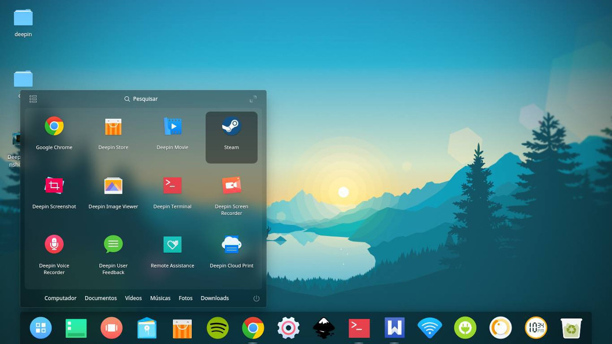

# Linux and Penetration Testing

### Linux and Penetration Testing

Transitioning from the familiarity of Windows to exploring the Linux operating system (OS) opens up a new realm of possibilities for cybersecurity professionals. Linux, with its open-source nature and vast array of distributions, offers unparalleled flexibility and a rich ecosystem of tools for penetration testing and network analysis. This chapter delves into the specifics of using Linux, particularly focusing on Kali Linux—a specialized distribution tailored for penetration testing—and introduces the concept of live CDs/DVDs, enhancing the versatility of Linux in security assessments.

### The Linux OS: An Overview

Linux, inspired by the UNIX philosophy, is renowned for its stability, security, and customization options. Unlike proprietary systems like Windows, Linux is open-source, allowing anyone to view, modify, and distribute its source code. This openness fosters a vibrant community where improvements and innovations are continuously contributed, leading to a robust and secure OS.

#### **Key Features of Linux**

* **Open-Source:** Linux's source code is freely accessible, encouraging community involvement and continuous improvement.
* **Stability and Reliability:** Linux is known for its stability and reliability, making it suitable for servers and critical infrastructure.
* **Customization:** Users can customize Linux extensively, tailoring the system to meet specific needs.
* **Wide Hardware Compatibility:** Linux runs on a variety of hardware, from embedded devices to high-performance servers.
* **Multiple User Interfaces:** Linux supports a range of user interfaces, including graphical user interfaces (GUIs) and command-line interfaces (CLIs), catering to different user preferences and requirements.

### Kali Linux: A Penetration Testing Powerhouse

Kali Linux, succeeding BackTrack, is a Debian-based distribution specifically designed for penetration testing and security auditing. It comes pre-installed with hundreds of tools aimed at assessing the security of systems and networks. Kali Linux is favored by security professionals for its extensive toolkit and ease of use in a variety of testing scenarios.

#### **Benefits of Kali Linux**

* **Comprehensive Toolkit:** Kali Linux includes a wide range of tools for network scanning, vulnerability assessment, wireless auditing, and much more.
* **User-Friendly Interface:** Despite its powerful capabilities, Kali Linux is designed to be user-friendly, making it accessible to both beginners and seasoned professionals.
* **Active Community Support:** Being part of the larger Debian community, Kali Linux benefits from a vast pool of expertise and regular updates.

### Navigating the Linux OS

Transitioning from Windows to Linux can indeed seem daunting at first, especially for those who are accustomed to graphical user interfaces (GUIs) and point-and-click operations. However, Linux offers a unique blend of command-line interface (CLI) power and flexibility, complemented by a variety of GUI options that cater to different preferences and workflows. Mastering the basics of Linux navigation, including using the terminal, understanding file permissions, and managing packages, is crucial for unlocking Linux's full potential.

#### **Navigating the Terminal**

The Linux terminal is a powerful tool that provides direct access to the underlying system commands. Familiarity with basic terminal commands such as **ls** (list directory contents), **cd** (change directory), **mkdir** (make directory), and **rm** (remove files or directories) is essential. Learning how to use wildcards (**\***, **?**) and regular expressions can also greatly enhance your efficiency in navigating the filesystem and manipulating files.

#### **Understanding File Permissions**

Linux uses a sophisticated permission system to control access to files and directories. Understanding the basics of read (**r**), write (**w**), and execute (**x**) permissions for the owner, group, and others is fundamental. Commands like **chmod** (change mode) and **chown** (change owner) are essential for managing these permissions effectively.

#### **Managing Packages**

Package managers like **apt** (for Debian-based distributions) and **yum** or **dnf** (for Red Hat-based distributions) are used to install, update, and remove software packages. Learning how to add repositories, update package lists, and install new software using these tools is important for keeping your system up-to-date and adding new functionalities.

#### **Exploring GUI Options**

While Linux is renowned for its powerful CLI, it also offers a variety of GUI options that can make it more accessible to newcomers. Desktop environments like GNOME, KDE Plasma, XFCE, and LXDE offer different levels of customization and resource usage, catering to a broad spectrum of user preferences. Familiarizing yourself with the desktop environment of your choice and exploring its settings and applications can make the transition smoother.

#### **Resources for Learning**

There are numerous resources available for learning Linux, ranging from online tutorials and documentation to books and courses. Websites like Linux.org and forums such as Reddit's r/linuxquestions are excellent places to ask questions and share experiences. Additionally, practicing on a live USB or dual-boot setup can provide hands-on experience without committing to a complete switch.

Transitioning to Linux from Windows is a journey that rewards patience and curiosity. By mastering the basics of Linux navigation, understanding file permissions, and managing packages, you'll unlock the full potential of this versatile operating system. Whether you prefer the power of the CLI or the convenience of a GUI, Linux offers tools and environments to suit every preference. Embrace the learning curve and enjoy the freedom and flexibility that Linux brings to computing.

### Linux Live CDs/DVDs: Enhancing Flexibility

One of the standout features of Linux is the ability to run it from removable media, such as USB drives or CDs/DVDs, without installation. This capability, known as "live" environments, allows users to test Linux without altering their existing system setup. Live CDs/DVDs are particularly useful for penetration testers, as they can boot a target machine into a Linux environment to perform assessments without leaving traces on the system.

Exploring Linux and distributions like Kali Linux expands the toolkit of cybersecurity professionals, offering a wealth of tools and techniques for identifying and exploiting vulnerabilities. Whether through direct installation or utilizing live environments, Linux provides a powerful platform for conducting thorough security assessments. Embracing Linux not only broadens the skill set of security professionals but also enhances their effectiveness in uncovering and addressing security weaknesses.

.png>)\
_**FIGURE X:** The Linux KDE desktop._

### Types of Linux Distributions

Linux is indeed available in many variations, known as distributions, from various providers. These distributions differ significantly in terms of style, features, performance, and intended use scenarios. While some are designed for specific purposes, others cater to a broad range of users, from beginners to advanced users and developers. The misconception that Linux is entirely free is partially true; while many Linux distros are freely available, some commercial offerings exist that come with paid support services. These commercial distributions adhere to the General Public License (GPL), ensuring that their source code remains accessible and modifiable by the community.

The world of Linux distributions is vast and varied, offering something for every type of user, from beginners to advanced system administrators. Each distribution has its unique characteristics, strengths, and target audience.

Here's a brief overview of some of the most common Linux distributions:

#### **Ubuntu**

* **Overview:** Known for its ease of use and strong community support, Ubuntu is one of the most popular Linux distros for beginners. It's based on Debian and comes in various flavors tailored to different user needs, from desktop environments to server setups.
* **Strengths:** Easy to install and use, large community support, regular releases with long-term support options.
* **Use Cases:** Great for beginners, home users, and small businesses.
* **Penetration Testing Capabilities:** Ubuntu is a versatile and powerful Linux distribution and can be effectively utilized in penetration testing through various means. While Ubuntu itself doesn’t come pre-packaged with a suite of penetration testing tools like some specialized distributions do (such as Kali Linux), it can still serve as a robust foundation for conducting penetration tests. Here’s how Ubuntu can be leveraged for penetration testing:
* _**1. Installing Penetration Testing Tools**_

Ubuntu supports a vast array of software packages, making it straightforward to install numerous penetration testing tools directly from the terminal. Popular tools like Nmap, Wireshark, Burp Suite, and the Metasploit Framework can be easily installed via the command line using the apt package manager. For example, to install Nmap, you would run:

.png>)

This flexibility allows penetration testers to tailor their environment precisely to their needs, selecting only the tools required for their specific testing scenarios.

* _**2. Using Docker for Penetration Testing**_

Docker can significantly streamline the setup and execution of penetration testing environments on Ubuntu. By containerizing tools and environments, Docker ensures consistency across different machines and simplifies the deployment of complex setups. Many penetration testing tools and frameworks offer Docker images, making it easy to spin up isolated environments for testing purposes. For instance, running a Docker container with the Metasploit Framework would involve commands like:

.png>)

This approach minimizes the risk of accidental changes to the host system and makes it easier to replicate testing environments.

* _**3. Customization and Scripting**_

Given its extensive customization options and scripting capabilities, Ubuntu allows penetration testers to automate repetitive tasks and customize their testing workflows. Bash scripting, Python, and other languages can be used to create custom scripts for automating scans, exploiting vulnerabilities, or post-exploitation activities. This level of automation can greatly increase efficiency and effectiveness during penetration tests.

* _**4. Learning and Experimentation**_

Ubuntu’s open-source nature and strong community support makes it an excellent platform for learning and experimenting with new tools and techniques. Users can download and try out various tools without worrying about licensing restrictions, and the community offers a wealth of tutorials, forums, and documentation to assist with learning and troubleshooting.

While Ubuntu isn’t specifically designed for penetration testing like some other distros, its versatility, power, and flexibility make it a valuable tool in the hands of penetration testers and ethical hackers. By leveraging Ubuntu’s capabilities to install and configure tools, utilize Docker for streamlined environments, automate tasks with scripting, and benefit from a rich learning community, penetration testers and ethical hackers can effectively conduct thorough and efficient tests.

.jpeg>)\
_**FIGURE X:** Ubuntu 22.10 Kinetic Kudu desktop._

#### **Linux Mint**

* **Overview:** Born as an Ubuntu derivative, Linux Mint offers a user-friendly experience with a focus on simplicity and accessibility. It includes several graphical tools for easier maintenance and is supported for five years with each release.
* **Strengths:** User-friendly interface, good hardware compatibility, extensive software repositories.
* **Use Cases:** Ideal for users transitioning from Windows, home users looking for a straightforward Linux experience.
* **Penetration Testing Capabilities:** Using Linux Mint for penetration testing can be a viable option, especially for those who prefer a more stable and user-friendly desktop environment compared to specialized distributions like Kali Linux. While Linux Mint itself does not come pre-loaded with a suite of penetration testing tools like Kali, it is based on Ubuntu, which means it can easily install most of the tools needed for penetration testing through its repositories or by compiling from source. Here’s how you can leverage Linux Mint for penetration testing:
* _**1. Installing Penetration Testing Tools**_

Linux Mint comes with a vast repository of software packages, including many useful for penetration testing. You can install basic tools such as nmap, wireshark, Metasploit (through the Metasploitable project), and others directly from the terminal using the following commands:

.png>)

* _**2. Use Virtual Machines**_

Another approach is to run a virtual machine (VM) with a dedicated penetration testing distribution like Kali Linux inside Linux Mint. This allows you to switch between the environments as needed. You can use software like VirtualBox or VMware for this purpose. Running a VM ensures that your main system remains clean and unaffected by the activities performed within the VM.

* _**3. Dual Boot System**_

For more advanced users, setting up a dual-boot system with Kali Linux can offer the best of both worlds: the stability and usability for Linux Mint for everyday tasks, and the full suite of penetration testing tools available in Kali Linux for security assessments. This setup allows you to choose the operating system based on what you intend to do, keeping your work isolated from your personal use.

While Linux Mint is not specifically designed for penetration testing, its flexibility and compatibility with Ubuntu’s extensive repositories make it a suitable platform for installing and running the necessary tools. Whether through direct installation from repositories, compiling from source, using virtual machines, or setting up a dual-boot system, Linux Mint offers several pathways to support your penetration testing efforts effectively.

#### .jpeg>) **FIGURE X:** Linux Mint 17.3 desktop.

#### **Arch Linux**

* **Overview:** An independent distribution that emphasizes simplicity and flexibility. Arch uses a rolling-release model, meaning users always have access to the latest software versions. It's known for its minimalist approach, leaving system management largely to the user.
* **Strengths:** Cutting-edge software, high degree of customization, strong community support.
* **Use Cases:** Suitable for advanced users who prefer to build their system from scratch and keep it up-to-date.
* **Penetration Testing Capabilities:** Using Arch Linux for penetration testing can be highly beneficial due to its flexibility, security, and the vast array of tools available through distribution like BlackArch Linux. Here’s how you can leverage Arch Linux for penetration testing:
* _**1. Steps to Install BlackArch Linux**_
  * **Download the BlackArch ISO:** Visit the official BlackArch website to download the Iso file suitable for your needs. There are options for full and slim installations depending on your requirements.
  * **Create a Bootable USB Drive:** Use a tool like Rufus or Etcher to create a bootable USB drive with the downloaded ISO file. This will allow you to run BlackArch Linux from a USB drive on any computer.
  * **Boot from the USB Drive:** Restart your computer and select the USB drive as the boot device. Follow the on-screen instructions to install BlackArch Linux.
  * **Installation:** During the installation process, you’ll be asked to choose between a “Full” and “Slim” version. The Full version comes with multiple desktop environments, while the Slim version is optimized for performance and includes only the XFCE desktop environment.
  * **Post-Installation Setup:** After installation, you can begin exploring the extensive toolset available in BlackArch Linux. Tools can be installed individually or in groups, making it easy to tailor the environment to your specific needs.

#### Customizing Your Arch Linux for Penetration Testing

If you prefer to build your own penetration testing environment based on Arch Linux, you can follow these steps:

1. **Start with a Basic Arch Linux Installation:** Begin by installing Arch Linux on a virtual machine or physical machine. It’s recommended to start with a virtual machine to avoid data loss during experimentation.
2. **Add the BlackArch Repository:** To access the penetration testing tools, you’ll need to add the BlackArch repository to your BlackArch installation. This can be done by downloading and running the strap.sh script provided by BlackArch.

.png>)

1. **Update and Install Tools:** Update your package lists and install the desired tools using the pacman package manager. For example, to install the Burp Suite, Metasploit, Wireshark, tcpdump, and wfuzz, you would run:

.png>)

By following these steps, you can create a customized penetration testing environment tailored to your specific needs, leveraging the power and flexibility of Arch Linux and the extensive toolset provided by BlackArch Linux.

Whether you opt for the convenience of BlackArch Linux or prefer to customize your own Arch Linux setup, the platform offers a robust foundation for penetration testing. Its compatibility with existing Arch Linux installations, combined with the vast array of tools available, makes it an excellent choice for both beginners and seasoned professionals in the field of information and cyber security.

\
_**FIGURE X:** Arch Linux Deepin desktop._

#### **CentOS**

* **Overview:** A community-driven project that provides enterprise-level support for Linux. CentOS is binary compatible with Red Hat Enterprise Linux (RHEL), making it a popular choice for businesses and organizations looking for stability and long-term support.
* **Strengths:** Stable and reliable, free alternative to RHEL, broad hardware support.
* **Use Cases:** Businesses and IT departments needing a stable platform for servers and workstations.
* **Penetration Testing Capabilities:**

CentOS can be effectively utilized in penetration testing due to its stability, security features, and compatibility with a wide range of security tools. Although CentOS itself doesn't come with a pre-packaged suite of penetration testing tools like Kali Linux, it can serve as a solid foundation for setting up a customized security testing environment. Here's how CentOS can be leveraged in penetration testing:

*
  * **Customizable Environment:** CentOS offers a highly customizable environment, allowing users to install and configure a variety of security tools tailored to their specific testing needs. This flexibility is particularly beneficial for penetration testers who require a tailored toolkit for their assessments.
  * **Stability and Security:** CentOS is renowned for its stability and security, making it an excellent choice for hosting security tools and conducting tests. Its minimalistic design reduces the attack surface compared to more feature-rich distributions, which can be advantageous during penetration testing scenarios.
  * **Compatibility with Security Tools:** While CentOS may not have as extensive a selection of pre-installed security tools as specialized distributions like Kali Linux, it is compatible with a vast array of security tools available for Linux. Testers can easily install and configure tools such as Nmap, Wireshark, Metasploit, and many others to perform comprehensive security assessments.

#### Example Setup: Installing and Configuring Tools

To leverage CentOS for penetration testing, you would typically start by installing the necessary tools. For instance, to set up an FTP service for testing purposes, you could follow steps similar to those outlined for configuring ProFTPD on CentOS.

.png>)

This example demonstrates how CentOS can be configured to host services that are common targets in penetration testing, such as FTP servers. From there, you can proceed to install and configure additional tools as needed for your testing requirements.

While CentOS may not be the first choice for penetration testers due to the availability of specialized distributions like Kali Linux, it offers a stable, secure, and customizable platform for building a tailored security testing environment. By installing and configuring the necessary tools, CentOS can serve as a robust base for conducting comprehensive penetration tests.

.jpeg>)\
_**FIGURE X:** CentOS 9 Stream desktop._

#### **FreeBSD**

* **Overview:** Not technically a Linux distribution, FreeBSD is a Unix-like operating system derived from the Berkeley Software Distribution (BSD). It's known for its high performance, scalability, and security features, making it suitable for servers and embedded systems.
* **Strengths:** High performance, excellent networking capabilities, portability.
* **Use Cases:** Servers, embedded systems, network appliances.
* **Penetration Testing Capabilities:** FreeBSD can be utilized in penetration testing in several ways, leveraging its robust security features, stability, and compatibility with a wide array of security tools. Here’s how FreeBSD can be employed in penetration testing activities:
  * **Hosting Intrusion Detection and Prevention Systems (IDS/IPS):** FreeBSDs flexibility and security features make it an excellent platform for running intrusion detection and prevention systems. Tools like Snort and Suricata can be deployed on FreeBSD to monitor network traffic, detect potential intrusions, and prevent malicious activities. The operating system’s stability ensures reliable and accurate detection of security threats.
  * **Security Event Auditing:** FreeBSDs security event auditing system provides detailed logging of security-relevant events within the operating system. Administrators can customize audit logs to capture specific events, offering valuable insights into system behaviors and facilitating digital forensics and incident response (DFIR) investigations. This feature aids in the detection of potential security breaches and unauthorized access attempts.
  * **Utilizing Penetration Testing Tools:** FreeBSD supports a variety of penetration testing tools, including, but not limited to:
    * **Metasploit:** An exploit framework for penetration testing, allowing testers to develop and execute exploit code against a remote target machine.
    * **Nmap (Network Mapper):** A powerful network scanning tool used for discovering hosts and services on a computer network.
    * **Wireshark:** A network protocol analyzer for capturing and interacting with network traffic.
    * **Radare2:** A comprehensive framework for reverse engineering and binary analysis.
    * **John the Ripper:** A fast password cracker for UNIX-based systems.
    * **Hydra:** A brute-force attack utility capable of performing dictionary attacks against various network protocols.
    * **Aircrack-ng:** A suite of tools for assessing WiFi network security, including cracking WEP and WPA/WPA2 passwords.

### THE Penjail Project

The Penjail Project on GitHub demonstrates how penetration testing tools can be packaged up in a jail environment on FreeBSD, using Reggae. This setup isolates the testing environment, enhancing security by limiting the potential impact of compromised systems. Tools like Radare2, Metasploit, John the Ripper, Hydra, and others are included in this package, showcasing the versatility of FreeBSD in penetration testing scenarios.

FreeBSDs security enhancements, stability, and compatibility with a wide range of penetration testing tools make it a valuable asset for information and cyber security professionals. Whether hosting IDS/IPS, utilizing security event auditing or employing specialized penetration testing tools, FreeBSD offers a robust platform for conducting thorough and effective security measures.

.png>)\
_**FIGURE X:** FreeBSD MaXX desktop._

#### **Fedora**

* **Overview:** Sponsored by Red Hat, Fedora is a community-driven project that serves as a testing ground for new technologies. It's known for its cutting-edge software and commitment to innovation.
* **Strengths:** Access to the latest software, close ties to Red Hat, strong community involvement.
* **Use Cases:** Enthusiasts and early adopters interested in the latest Linux technologies.
* **Penetration Testing Capabilities:** Fedora can be utilized in penetration testing in several ways, leveraging its robustness, security features, and the availability of powerful tools. Here’s how you can utilize Fedora for penetration testing:
* **Using Fedora Security Spin:** The Fedora Security Spin is a specialized version of Fedora designed specifically for security auditing, forensics, and penetration testing. It comes pre-installed with a variety of security tools and utilities, making it an excellent choice for conducting tests in a controlled environment. The Fedora Security Spin is maintained by a community of security testers and developers, ensuring that it stays up-to-date with the latest security tools and methodologies.
* **Installing Penetration Testing Tools:** For those who prefer to customize their environment or need specific tools not included in the Fedora Security Spin, you can manually install penetration testing tools on a standard Fedora installation. One approach is to use a script like fedora\_pentesting.sh, which automates the installation of common penetration testing tools on Fedora. This script installs tools in designed directories, making them easily accessible for your testing activities.
* **Customizing Your Environment:** Fedora’s flexibility allows you to tailor your penetration testing environment to your specific needs. You can install additional tools, configure network settings, and adjust system parameters to suit your testing scenarios. The Fedora Security Lab, for example, offers a read-write root filesystem, enabling you to install software while the live media is running. This feature is particularly useful for installing and updating tools during testing sessions.
* **Community and Documentation:** The Fedora community is a valuable resource for penetration testers. Whether you’re looking for advice on specific tools, troubleshooting issues, or learning about new techniques, the Fedora community can provide guidance and support. Additionally, Fedora’s documentation and the Fedora Security Lab’s release notes offer insights into the latest features and tools available for penetration testing.

Fedora offers a solid foundation for penetration testing, thanks to its strong security features, the availability of specialized spins like the Fedora Security Spin, and the ease of installing and configuring custom tools. Whether you’re a seasoned tester or just starting out, Fedora provides the tools and environment needed to conduct effective and efficient penetration tests.

.png>)\
_**FIGURE X:** Fedora Pantheon desktop._

#### **Gentoo**

* **Overview:** A source-based distribution that allows users to compile software from source code, offering maximum control over the system's configuration. Gentoo is highly customizable but requires more technical expertise to maintain.
* **Strengths:** Highly customizable, up-to-date software, efficient resource usage.
* **Use Cases:** Advanced users who want to tailor their system exactly to their needs.
* **Penetration Testing Capabilities:** Gentoo Linux, through its specialized version called Pentoo, plays a significant role in penetration testing due to its flexibility, customization options, and the extensive array of security tools it offers. Here’s how Gentoo can be utilized in penetration testing:
* **Customization and Flexibility:** Gentoo’s unique feature is its Portage package manager, which allows for a high degree of customization. You can compile the exact packages you need, tailored to your specific requirements for penetration testing. This ensures that you have a lean, efficient system optimized for security testing without unnecessary bloat.
* **Pentoo: A Specialized Version for Penetration Testing:** Pentoo is a specialized version of Gentoo designed specifically for penetration testing and security assessment. It is available as a Live CD, Live USB, and as an overlay for an existing Gentoo installation. Pentoo includes packet injection patched WiFi drivers, GPGPU cracking software, and a plethora of tools for penetration testing and security assessment. Its kernel includes grsecurity and PAX hardening and extra patches, with binaries compiled from a hardened toolchain.
* **Tools and Categories:** Pentoo comes with a wide variety of tools categorized under different functionalities such as Exploits, Crackers, Databases, and Scanners. These tools are essential for conducting comprehensive penetration tests, covering areas like reverse engineering, wireless and hardware attacks, vulnerability analysis, information gathering, sniffing, and spoofing, and stress testing.
* **Persistence and XFCE-Based Environment:** One of the advantages of Pentoo is its persistence support, which allows you to save all changes made before running off a USB stick. This feature is particularly useful for long-term penetration testing engagements where you need to maintain configurations and existing installed tools across sessions. Additionally, Pentoo is XFCE-based, offering a lightweight desktop environment suitable for live environments and resource-constrained systems.
* **Community and Documentation:** Pentoo benefits from the Gentoo community’s expertise and the extensive documentation available for Gentoo. This means that you can leverage a vast pool of knowledge and support when setting up your penetration testing environment or troubleshooting issues.

Gentoo, especially through its specialized version, Pentoo, offers a powerful platform for penetration testing. Its customization capabilities, combined with the specialized tools and optimizations provided by Pentoo, make it an excellent choice for security professionals looking for a flexible and efficient environment for conducting penetration tests. Whether you’re a seasoned professional or just starting in the field of information and cybersecurity, Gentoo and Pentoo provide the tools and environment needed to conduct thorough and effective penetration testing.

.jpeg>)\
_**FIGURE X:** Gentoo KDE desktop._

#### **openSUSE**

* **Overview:** A community program sponsored by SUSE Linux GmbH and other companies. openSUSE provides a stable, easy-to-use, and complete multi-purpose distribution.
* **Strengths:** Regular releases, strong community support, commercial backing.
* **Use Cases:** General-purpose computing, server deployments, educational purposes.
* **Penetration Testing Capabilities:** Using openSUSE for penetration testing is entirely feasible, although it’s worth noting that many penetration testing tools are originally developed for Debian-based distributions, which might pose compatibility issues; however, openSUSEs stability and customizability make it a viable option for conducting penetration tests. Here’s how you can leverage openSUSE for penetration testing:
* **Installing Penetration Testing Tools**
  * **Metasploit Framework:** You can install Metasploit on openSUSE through the official package repository. Visit the openSUSE software portal (_**Source:**_ [_http://software.opensuse.org_](http://software.opensuse.org/)_)_ and search for the Metasploit package. If you have an OBS account, you can customize or build the package according to your needs.
  * **General Approach:** Although Debian-based distributions are more common for penetration testing due to the availability of pre-packaged tools, openSUSE can still host a variety of penetration testing applications. You might encounter some tools that are easier to install on Debian-based systems, but many essential tools should be available or can be compiled from source.
  * **Running Penetration Testing Suites**
    * **Live CD or Virtual Machine:** For convenience, consider running a penetration testing suite via a Live CD or inside a virtual machine. This approach isolates the testing environment form your main system, reducing the risk of accidental changes or infections. Kali Linux is a popular choice for this purpose, offering a wide array of pre-installed tools.
  * **Customization and Configuration**
    * **Custom Builds:** openSUSEs flexibility allows for customization and tweaking of packages. If you encounter a tool that isn’t readily available or doesn’t meet your needs, you can modify it or compile it from source. This level of control can be particularly beneficial for penetration testers who require specific configurations or optimizations.
  * **Community and Resources**
    * **Community Support:** Engage with the openSUSE community for advice, tips, and troubleshooting. Forums and mailing lists can be valuable resources for solving installation issues or finding alternative ways to achieve your testing objectives.
    * **Learning Opportunities:** Participate in events like Hack Week, which encourages learning and experimentation with openSUSE and related projects. Such activities can provide hands-on experience with penetration testing tools and techniques.

While openSUSE might not be the first choice for penetration testers due to the prevalence of Debian-based distributions, it offers a solid foundation for conducting penetration tests. Its stability, customizability, and supportive community make it a worthwhile platform for security enthusiasts and professionals alike. Whether you’re installing specific tools, running a dedicated penetration testing suite, or exploring openSUSEs capabilities during learning events, there are numerous ways to leverage openSUSE in the realm of information and cyber security.

.jpeg>)\
_**FIGURE X:** OpenSUSE Leap desktop._

#### **Debian**

* **Overview:** Known for its robustness and reliability, Debian is one of the oldest surviving Linux distributions. It offers a vast repository of software packages and is available for many architectures. In addition, Debian supports all kinds of graphical environments, ranging from full-featured environments to lighter alternatives and even minimalist but powerful window managers. A desktop environment provides a coherent suite of applications in terms of look, functionality, and usability.
* **Strengths:** Large software repository, stability, strong community support.
* **Use Cases:** Server installations, desktop environments, embedded systems.
* **Penetration Testing Capabilities:** A popular Linux distribution known for its stability and security, can be an excellent tool for penetration testing. Its extensive package repository and customizable nature make it suitable for setting up a variety of testing environments. Debian can be utilized to aid in penetration testing endeavors, such as:
  * **Metasploitable Setup**

One of the most common uses of Debian in penetration testing is to set up Metasploitable, a deliberately vulnerable virtual machine designed for teaching purposes. You can install Metasploitable on Debian using the following steps:

* Download the Metasploitable VM image from the official website.
* Import the VM image into your preferred virtualization software (e.g., VirtualBox).
* Install Debian on another VM or physical machine.
* Use the Debian system to attack the Metasploitable VM, practicing various penetration testing techniques.
  * **Web Application Testing**

Debian can be configured to host web applications that are commonly targeted in penetration tests. Tools like OWASP WebGoat, DVWA (Damn Vulnerable Web App), and Mutillidae can be installed on Debian to practice web application security testing.

* Install LAMP (Linux, Apache, MySQL, PHP) stack on Debian.
* Deploy web applications like WebGoat or DVWA.
* Perform penetration testing activities, such as SQL Injection (SQLi), XSS, CSRF, etc.
  * **Network Scanning and Enumeration**

Debian can be used to perform network scanning and enumeration tasks. Tools like Nmap, Nessus, Wireshark, and Aircrack-ng can be installed to scan networks, discover hosts, and analyze network traffic.

* Install network scanning tools using apt-get.
* Scan target networks to discover live hosts, open ports, and running services.
* Analyze captured packets to understand network protocols and behaviors.
  * **Wireless Penetration Testing**

For wireless penetration testing, Debian can be equipped with tools like Aircrack-ng, Kismet, and Wireshark. Setting up a wireless testing environment involves configuring the wireless card drivers and installing the necessary tools.

* Install wireless drivers and tools (aircrack-ng, kismet, wireshark).
* Set up a rogue AP (Access Point) to attract targets.
* Capture and analyze wireless traffic to identify vulnerabilities.
  * **Post-Exploitation and Privilege Escalation**

Once a foothold is gained in a system, Debian can be used to escalate privileges and maintain persistence. Tools like John the Ripper, Hydra, and Metasploit can be used for password cracking, brute-forcing, and exploiting vulnerabilities.

* Install post-exploitation tools (john-the-ripper, hydra, metasploit-framework).
* Crack passwords, exploit vulnerabilities, and escalate privileges.
* Maintain persistence and cover tracks to evade detection.

.png>)\
_**FIGURE X:** Debian Buster desktop._

Each of these distributions caters to different user preferences and requirements, from beginners looking for an easy-to-use desktop environment to advanced users seeking a highly customizable system.

The kernel is the heart of every operating system (OS), serving as the bridge between applications and the actual data processing done at the hardware level. It manages the system's resources efficiently, ensuring that everything runs smoothly. Let's delve deeper into the role of the kernel, its uniqueness across different operating systems, and the customization possibilities, particularly in the context of Linux.

### Kernel Functions and Responsibilities

* **Resource Management:** The kernel is responsible for allocating and deallocating resources such as memory, disk space, and CPU time. It ensures that each process gets the resources it needs and prevents any single process from monopolizing the system's resources.
* **Input and Output Operations:** The kernel handles all input and output operations, interacting with hardware components like keyboards, mice, printers, and displays. It translates user commands into hardware instructions.
* **Central Processing Unit (CPU) Management:** The kernel schedules processes to run on the CPU, deciding which process gets CPU time and for how long. This scheduling is crucial for multitasking and ensuring fair usage of the CPU among running processes.

### Interaction with Users and Programs

In computing, the kernel is the core component of an operating system that manages hardware resources and provides services for executing applications. Users and programs do not interact directly with the kernel. Instead, they communicate with it through a shell, which acts as an intermediary layer. This shell can be either graphical, such as a desktop environment, or command-line based, like Terminal in macOS or Command Prompt in Windows.

#### How Shells Work

* **Graphical Shell:** A graphical shell, such as a desktop environment, provides a visual interface where users can interact with the system using icons, windows, menus, and other graphical elements. When a user performs an action through the graphical interface, the corresponding command is translated into a format that the kernel understands and can execute. This translation is handled by the underlying system components, including the shell and the kernel.
* **Command-Line Shell:** A command-line shell, such as Terminal in macOS or Command Prompt in Windows, allows users to interact with the system by typing text-based commands. These commands are interpreted by the shell, which then translates them into system calls or requests that the kernel can process. For example, when a user types **ls** in a terminal to list files in a directory, the shell interprets this command and passes it to the kernel, which executes the appropriate operation.

### Importance of Shells

Shells are crucial for several reasons:

* **User-Friendly Interface:** Shells provide a user-friendly interface that abstracts away the complexities of direct interaction with the kernel. This makes it easier for users to perform tasks without needing to understand the low-level details of how the system works.
* **Flexibility:** Shells offer flexibility in terms of the commands and scripts that can be executed. Users can write scripts to automate repetitive tasks, enhancing productivity.
* **Compatibility:** Shells ensure compatibility across different operating systems. While the specifics of the commands and interfaces may vary, the basic concept of issuing commands to perform actions remains consistent.

In summary, shells serve as the bridge between users and the kernel, facilitating communication and interaction in a user-friendly manner. Whether graphical or command-line based, shells translate user inputs into requests that the kernel can understand and execute, playing a vital role in the functioning of operating systems.

### Uniqueness of Kernels Across Operating Systems

Each operating system's kernel plays a pivotal role in defining its performance characteristics, security features, and user experience. The kernel acts as the bridge between applications and the actual data processing done at the hardware level. It manages the system's resources efficiently, ensuring that each application gets the CPU time, memory space, and devices it needs to execute commands. The design philosophy and requirements of each operating system's kernel significantly influence its functionality and appeal to different user bases.

#### Linux Kernel

The Linux kernel is renowned for its modularity and extensibility, which are key aspects of its design philosophy. Modularity refers to the practice of dividing the kernel into separate modules, each performing a distinct function. This modular design allows for easier maintenance and updates, as only the relevant module needs to be updated or replaced rather than the entire kernel. Extensibility means that new functionalities can be added to the kernel without altering its existing structure, thanks to the modular architecture. This flexibility makes Linux highly customizable, appealing to advanced users and developers who want to tailor the system to their specific needs.

#### Windows Kernel

The Windows kernel, on the other hand, is designed with a focus on stability and ease of use for end-users. Stability is achieved through rigorous testing and quality assurance processes, ensuring that the system runs smoothly and reliably. Ease of use is a cornerstone of the Windows operating system, with a graphical user interface (GUI) that is intuitive and accessible to a broad audience. The Windows kernel operates on a monolithic design, where most of the kernel services run in the kernel space, providing a seamless and integrated user experience. While this design offers simplicity and efficiency, it can sometimes limit the flexibility and customizability found in more modular kernels like Linux.

#### Comparison and Contrast

The comparison between the Linux and Windows kernels highlights the trade-offs between modularity/extensibility and stability/ease of use. Linux's modular and extensible design offers unparalleled flexibility and customization options, making it a favorite among developers and power users. In contrast, Windows's monolithic design prioritizes stability and ease of use, catering to a wider audience, including casual users and businesses that value reliability and simplicity.

The choice between Linux and Windows often comes down to the specific needs and preferences of the user. Linux is typically chosen by users who require a high degree of control and customization, such as developers working on complex projects or system administrators managing servers. Windows, with its emphasis on stability and ease of use, appeals to a broader audience, including home users and businesses looking for a straightforward and reliable operating system. Regardless of the choice, the kernel plays a crucial role in determining the operating system's performance, security, and user experience.

### Customization in Linux

One of the standout features of Linux is its customizability. Unlike the Windows kernel, which is tightly controlled by Microsoft, the Linux kernel can be modified by anyone with the necessary skills. This flexibility extends to creating entirely new kernels or modifying existing ones to suit specific needs. Developers and enthusiasts can tweak the kernel source code, compile it, and install the customized version on their systems. This capability has led to a vast array of Linux distributions, each optimized for different use cases, from servers to desktop environments.

The kernel plays a vital role in the operation of an OS, managing system resources and facilitating interactions between hardware and software. While the basic functions of a kernel remain consistent across different operating systems, the implementation and customization options vary greatly. Linux stands out for its open-source nature and the extensive customization possibilities it offers, allowing for a highly personalized computing experience.

**TIP More than 2,000 distributions of Linux, in different forms and formats, are currently available. Most of these distributions are very specialized, but their large number does attest to the overall flexibility of the OS.**

Choosing the right shell for your Linux environment is akin to selecting the right tool for a specific job—it can significantly affect your productivity and comfort level when working at the command line. While Bash (Bourne Again SHell) is the default shell for most Linux distributions and is widely recognized for its compatibility and extensive feature set, there are several alternatives worth considering based on your specific needs and preferences. Let's explore some of the most popular options beyond Bash, including C Shell (**csh**), KornShell (**ksh**), and Z Shell (**zsh**).

### Bash (Bourne Again SHell)

* **Popularity:** Bash is the most common shell and comes pre-installed on almost every Linux distribution. It's known for its compatibility with the Bourne shell (**sh**) and the Korn shell (**ksh**).
* **Features:** Bash offers a rich set of features, including command-line editing, unlimited size command history, job control, shell functions, and aliases.
* **Use Case:** Ideal for beginners and those who prefer a familiar environment similar to traditional Unix shells.

### C Shell (csh)

* **Popularity:** Less popular than Bash, csh is known for its interactive mode and scripting capabilities.
* **Features:** Offers a unique syntax that differs from Bash, with features like filename expansion and command substitution.
* **Use Case:** Suitable for users who prefer a different syntax or require advanced scripting capabilities.

### KornShell (ksh)

* **Popularity:** **ksh** is a superset of **sh** and offers many features of **bash** and **tcsh**. It's known for its efficiency and speed.
* **Features:** Includes features from both **csh** and **bash**, such as command-line editing and job control, with a focus on performance.
* **Use Case:** Good for users who need a fast, efficient shell for scripting or those looking for a blend of **csh** and **bash** features.

### Z Shell (zsh)

* **Popularity:** **zsh** has gained popularity for its user-friendly features and high degree of customizability.
* **Features:** Known for its _"Oh My Zsh"_ framework, which enhances the shell experience with themes, plugins, and helper functions. It also supports advanced features like spell correction, programmable completion, and loadable modules.
* **Use Case:** Ideal for power users who want a highly customizable and feature-rich shell environment.

### Choosing the Right Shell

When choosing a shell, consider the following factors:

* **Compatibility:** Ensure the shell works seamlessly with your current setup and meets your basic requirements.
* **Customizability:** Look for shells that offer customization options to tailor the environment to your liking.
* **Community and Documentation:** A shell with strong community support and extensive documentation can be invaluable for troubleshooting and learning new features.
* **Performance:** For heavy scripting or automation tasks, consider the performance implications of each shell.

Starting with a popular shell like Bash is a sensible choice for most users. From there, exploring differences with other shells can help you discover features that better suit your workflow. Whether you're a beginner looking for simplicity or an advanced user seeking powerful scripting capabilities, there's likely a shell that fits your needs on the Linux platform.

### Introducing Kali Linux

Kali Linux stands out as a unique and specialized distribution of Linux, tailored specifically for penetration testing and network security assessments. Built on the robust Debian foundation,

Kali Linux offers a vast array of tools designed for security professionals to identify vulnerabilities, test defenses, and conduct audits on computer systems and networks. Unlike general-purpose Linux distributions, Kali is not intended as a daily driver for typical computing tasks but rather as a specialized toolkit for IT and security professionals.

### Purpose-Built for Security Testing

The primary purpose of Kali Linux is to serve as a comprehensive suite for security testing and auditing. It comes preloaded with hundreds of tools that cater to various aspects of penetration testing, including wireless attacks, password cracking, sniffing, scanning, and more. This extensive collection of tools makes Kali Linux invaluable for professionals looking to assess the security posture of their own systems or those of clients.

### Open Source and Community-Driven

Being an open-source project, Kali Linux benefits from the contributions of a global community of developers and security enthusiasts. This collaborative environment ensures that the distribution remains cutting-edge, with regular updates incorporating new tools and improvements. The open-source nature also means that users can customize Kali Linux to suit their specific needs, adding or modifying tools as required.

### Popularity Among Security Professionals

Due to its specialized focus and the breadth of tools it offers, Kali Linux has gained widespread popularity among security professionals. It is used by penetration testers, security auditors, and IT administrators to identify weaknesses in systems and networks before they can be exploited by malicious actors. The distribution's reputation for reliability and effectiveness has solidified its position as a go-to resource in the cybersecurity field.

### Comprehensive Toolkit

The application menu of Kali Linux showcases the depth and variety of tools available for security testing. Categories span from information gathering and vulnerability scanning to exploitation and post-exploitation analysis, covering virtually every aspect of a security professional's workflow. This comprehensive toolkit enables users to perform thorough and efficient security assessments, leveraging the power of Linux as a versatile and customizable platform.

Kali Linux exemplifies the flexibility and power of the Linux operating system when applied to the domain of cybersecurity. Its specialized nature, combined with the vast array of tools it offers, makes it an indispensable resource for security professionals. Whether conducting internal audits, performing external penetration tests, or researching new vulnerabilities, Kali Linux provides the tools needed to assess and enhance the security of systems and networks.

.png>)\
_**FIGURE X:** Kali Linux desktop Application menu._

### Working with Linux: The Basics

As you embark on your journey to learn Linux, it's essential to understand that the system offers a rich tapestry of user interfaces, each catering to different preferences and operational needs. While Linux is renowned for its powerful command-line interface (CLI), it also boasts several graphical user interfaces (GUIs) that make it accessible to users familiar with desktop environments. This dual approach—CLI and GUI—offers flexibility and efficiency, allowing users to choose the tool that best suits their task at hand.

### A Closer Look at the Interface

Linux's versatility truly shines through its variety of user interfaces (UIs), catering to a broad spectrum of user preferences and needs. While the command-line interface (CLI) offers unparalleled control and efficiency for power users, the graphical user interface (GUI) presents a more accessible entry point for newcomers, especially those accustomed to the desktop environments of Windows or macOS. Among the popular GUIs for Linux, GNOME, KDE Plasma, XFCE, and Cinnamon stand out, each bringing its unique blend of aesthetics and functionalities to the table.

#### GNOME

GNOME is renowned for its simplicity and elegance. It focuses on usability and minimalism, providing a clean and straightforward workspace. GNOME's design philosophy emphasizes ease of use, with a consistent layout and intuitive controls. It's highly customizable, allowing users to adjust settings to suit their workflow. GNOME Shell, introduced in GNOME 3, introduces a new way of interacting with the desktop, featuring a top bar with applications, notifications, and system status, alongside a sidebar for activities and workspaces.

#### KDE Plasma

KDE Plasma is celebrated for its flexibility and configurability. It offers a rich set of features and customization options, allowing users to tailor their desktop environment extensively. KDE Plasma's default theme is modern and sleek, with a focus on visual appeal and functionality. It supports multiple virtual desktops, advanced window management, and integrates seamlessly with various hardware devices. KDE Plasma is known for its innovative features, such as Activities, which let users organize their workspace into separate groups for different tasks.

#### XFCE

XFCE is praised for its speed and low resource usage, making it an excellent choice for older hardware or systems with limited resources. Despite its lightweight nature, XFCE doesn't skimp on functionality, offering a complete set of tools for managing files, installing applications, and configuring the system. XFCE's interface is simple and efficient, with a traditional panel layout that includes taskbars, menus, and system trays. It's highly customizable, allowing users to tweak almost every aspect of the desktop environment.

#### Cinnamon

Cinnamon is developed by the Linux Mint project and is designed to offer a traditional desktop experience with a modern twist. It combines the simplicity and familiarity of classic desktop environments with the latest technology and features. Cinnamon's interface is reminiscent of older desktop environments, with a bottom panel for launching applications and accessing system settings. It supports multiple workspaces, drag-and-drop file management, and extensive customization options. Cinnamon is known for its stability and performance, making it suitable for everyday computing tasks.

Each of these GUIs for Linux offers a unique take on the desktop experience, catering to different user preferences and needs. Whether you prefer the minimalist aesthetic of GNOME, the flexibility of KDE Plasma, the efficiency of XFCE, or the traditional feel of Cinnamon, there's likely a Linux distribution that matches your desktop environment desires. These environments provide a point-and-click experience, making file management, application installation, and system configuration more visually oriented and less intimidating for beginners, thus broadening the appeal of Linux to a wider audience.

### Command-Line Interface (CLI)

For those willing to venture beyond the GUI, the CLI presents a depth of functionality unmatched by graphical interfaces. The CLI is a text-based interface where users type commands to perform operations. It's akin to conversing with the computer, instructing it on what to do. This mode is particularly useful for scripting, automation, and accessing remote servers, where typing commands directly can be faster and more efficient than navigating menus.

### Bridging the Gap Between CLI and GUI

Many Linux distributions offer hybrid interfaces that combine the strengths of both worlds. Tools like GNOME Terminal, Konsole, and xterm allow users to execute CLI commands alongside their GUI applications seamlessly. This integration enables users to leverage the power of the CLI for specific tasks while enjoying the convenience and visual appeal of the GUI for everyday computing.

### Learning the Basics

To get comfortable with Linux, start by exploring its directory structure and learning basic navigation commands like **cd** (change directory), **ls** (list files), and **pwd** (print working directory). Familiarize yourself with file permissions (**chmod**, **chown**) and ownership concepts, as they are fundamental to securing your system.

### Advanced Operations and Scripting

As you grow more confident, delve into scripting with languages like Bash or Python. Scripting allows you to automate repetitive tasks, enhancing productivity. Commands like **if**, **for**, and **while** loops, along with functions and variables, are essential building blocks for creating scripts.

Linux's dual nature—offering both powerful CLI and user-friendly GUIs—makes it adaptable to a wide range of users, from novices to experts. Embracing both interfaces can unlock the full potential of Linux, enabling you to tailor your workflow to your preferences and needs. Whether you prefer the precision of the CLI or the ease of the GUI, Linux has something to offer every user.

The perception that using Linux necessitates deep familiarity with the command line interface (CLI) is prevalent, especially among newcomers to the Linux world. While it's true that mastering the CLI is fundamental for advanced usage and troubleshooting, the reality is that many tools and applications now offer graphical user interfaces (GUIs) that simplify the experience for users. This shift towards more accessible interfaces doesn't diminish the importance of understanding the underlying command-line operations but rather complements them, making Linux more approachable for a wider audience.

### Advantages of GUIs in Linux

* **Accessibility:** GUIs lower the barrier to entry for new users, making Linux more accessible to those who prefer graphical environments over text-based ones.
* **Simplicity:** For routine tasks, GUIs can be quicker and simpler to use, reducing the steep learning curve associated with the CLI.
* **Visualization:** GUIs often provide visual cues and feedback that can aid in understanding system states and configurations better than the CLI alone.

### Importance of Command Line Proficiency

Despite the rise of GUIs, a solid understanding of the Linux command line remains invaluable for several reasons:

* **Efficiency:** For power users and administrators, the CLI offers unparalleled efficiency and speed. Complex tasks that would take minutes through a GUI can often be accomplished in seconds via the command line.
* **Troubleshooting:** When GUI applications fail or behave unexpectedly, resorting to the CLI for diagnostics and repair is often necessary. A strong CLI proficiency enables faster resolution of issues.
* **Automation:** Scripting and automation are core aspects of Linux administration. Writing scripts to automate repetitive tasks is much easier and more efficient when done through the CLI.
* **System Control:** Deep control over the system is possible through the CLI. Users can manipulate files, directories, permissions, and services directly, offering a level of control that GUIs cannot match.

### Balancing GUI and CLI

For security professionals and serious Linux users, the key is to achieve a balance between GUI and CLI skills. Embracing GUIs for ease of use and accessibility while simultaneously honing CLI proficiency ensures flexibility and effectiveness in managing Linux systems. This dual approach allows users to leverage the strengths of each interface according to the task at hand, whether it's performing routine maintenance, automating tasks, or troubleshooting complex issues.

While GUIs have made Linux more accessible and user-friendly, the command line remains a powerful tool for efficiency, control, and troubleshooting. Achieving a comfortable level of proficiency in both GUI and CLI environments is essential for success in Linux, whether for personal use, professional work, or security-related tasks.

### Basic Linux Navigation

Transitioning from Windows to Linux can indeed present a steep learning curve, especially when it comes to understanding the differences in how drives, files, and directories are referenced. Here's a breakdown of these differences and tips for adapting to the Linux filesystem:

### Drive and File References

* **Drive Letters vs. Paths:** Windows uses drive letters (e.g., C:, D:) to reference drives and partitions. In contrast, Linux uses a hierarchical file system where everything is treated as a file or directory. Drives and partitions are mounted under the **/mnt** or **/media** directories, and each partition gets its own mount point, typically named after the device identifier (e.g., **/mnt/my\_partition**).
* **Device Files in /dev:** Disk drives in Linux are represented as device files under the **/dev** directory. For example, **hda1** refers to the first partition on the first hard disk (**hd**) detected by the system. These names are assigned by the kernel based on the hardware configuration and can vary between boots unless fixed by UUIDs or labels.

### Directory Separators

* **Backslashes vs. Forward Slashes:** Windows uses backslashes (**\\**) as directory separators, while Linux uses forward slashes (**/**). This is a fundamental difference that can easily lead to errors if you're accustomed to Windows syntax. In Linux, the backslash is a special character used for escaping certain characters in strings, not as a directory separator.

### Tips for Adapting

**1. Learn the Basics:** Familiarize yourself with the Linux filesystem hierarchy. Understand the purpose of directories like **/bin**, **/etc**, **/home**, **/usr**, and **/var**.

**2. Use Absolute Paths:** When working with files and directories, start by using absolute paths instead of relative ones. This practice helps avoid confusion about where you are in the filesystem.

**3. Mount Points:** Learn how to create and manage mount points for external drives and network shares. Tools like **mount** and **umount** are essential for managing these connections.

**4. File Permissions:** Get comfortable with Linux's file permission system. Understanding read/write/execute permissions for user, group, and others is crucial for managing access to files and directories.

**5. Command Line Navigation:** Practice navigating the filesystem using command-line tools like **cd**, **ls**, **pwd**, and **find**. These commands are indispensable for locating files and directories.

**6. Symbolic Links:** Learn about symbolic links (symlinks) and how they can simplify navigation and file management. Symlinks are essentially shortcuts to other files or directories.

**7. Practice Makes Perfect:** The best way to get comfortable with Linux's filesystem is through regular use. Start small, perhaps by creating a simple project directory structure, and gradually take on more complex tasks.

Adapting to Linux's filesystem and command-line culture takes time and patience, but with practice, you'll find it to be a powerful and flexible tool for managing your computing environment.

We have so far covered several essential aspects of Linux, including the use of the backslash as an escape character, the significance of various directories in the Linux filesystem, and the importance of understanding common commands and terminal usage. Let's delve deeper into each topic to provide a clearer understanding.

### The Backslash Character in Linux

In Linux, the backslash (**\\**) is indeed an escape character. This means that when you type a backslash, Linux expects you to provide another character that has a special meaning. For instance,  is interpreted as a tab character, and  as a new line. If you accidentally type a backslash and do not intend to use it as an escape character, pressing **CTRL-C** to cancel the command and trying again is a straightforward solution.

### Important Linux Directories

Linux organizes files and directories in a hierarchical structure starting from the root directory (**/**). Understanding the purpose of various directories helps in navigation and system administration:

\- \`/\`: The root directory, serving as the foundation of the filesystem.

\- \`/bin\`: Contains executable files for system utilities and applications.

\- \`/boot\`: Stores files needed to boot the Linux system.

\- \`/dev\`: Houses device files, essentially representing devices connected to the system.

\- \`/etc\`: Holds configuration files for the system and installed packages.

\- \`/home\`: The default directory for storing personal files for regular users.

\- \`/lib\`: Contains shared libraries required by the system and applications.

\- \`/mnt\`: Used for mounting removable media or network shares.

\- \`/opt\`: Intended for optional or third-party software installations.

\- \`/proc\`: Provides a virtual filesystem containing information about running processes.

\- \`/root\`: The home directory for the root user.

\- \`/sbin\`: Contains system binaries for administrative tasks.

**/tmp**: A temporary space for files created by system processes.

* **/usr:** Contains user utilities and applications.
* **/var:** Holds variable data like logs, mail, and printer spooler files.

### Commonly Used Commands

Familiarity with the command-line interface (CLI) and common commands is crucial for efficient Linux operation. Opening a terminal window launches a command shell, usually **bash**, presenting a command prompt. The prompt displays the username, hostname, and current directory. Recognizing the privilege level (indicated by **$** for standard users and **#** for **root**) is important for executing commands appropriately.

### Best Practices

* **Use Appropriate Privileges:** Only log in with the minimum privileges needed for your tasks.

Elevate privileges temporarily when necessary.

* **Learn Command Syntax:** Understand the syntax of common commands to avoid errors.
* **Regularly Update System:** Keep the system updated to benefit from the latest features and security patches.

By mastering these concepts and following best practices, users can navigate the Linux filesystem efficiently, perform administrative tasks, and leverage the power of the command line for system management and automation.

The basic structure of Linux commands is fundamental to navigating and manipulating the Linux operating system efficiently. Understanding this structure enables users to perform a wide range of tasks, from simple file operations to complex system administration duties.

Here's a breakdown of the basic command structure in Linux:

### Command Name

The command name identifies the operation you wish to perform. Linux commands typically consist of lowercase letters and digits, although some commands may contain uppercase letters. The case of each character is important, meaning **ls** and **LS** would refer to different commands. For instance, **ls** lists files and directories in the current directory, whereas **LS** might not exist unless defined as an alias or a script.

### Options

Options modify the behavior of a command. They are preceded by a hyphen (**-**) and can alter the output format, change the mode of operation, or add new functionalities. For example, the **-a** option with the **ls** command shows all files, including hidden ones (those starting with a dot **.**).

### Arguments

Arguments follow options and specify additional information required by the command. They can be filenames, directories, usernames, or other identifiers. For example, specifying a directory as an argument with the **ls** command directs it to list files in that particular directory instead of the current directory.

### Some LiNUX COMMANDS

Here are a few examples illustrating the use of command names, options, and arguments:

* **ls:** Lists files and directories in the current directory.
* **ls -l:** Displays detailed information about files and directories in a long listing format.
* **ls -a:** Shows all files, including hidden ones.
* **cd /path/to/directory:** Changes the current working directory to **/path/to/directory**.
* **cp source\_file destination\_file:** Copies **source\_file** to **destination\_file**.

### Expanding Your Knowledge

Once you're comfortable with the basic commands and understand their structure, expanding your knowledge base is the next step. There are numerous commands available in Linux, each serving a specific purpose. Conducting an internet search on basic Linux commands will reveal a vast array of utilities that can help you accomplish almost anything on a Linux system.

Learning more commands is essential for becoming proficient in using Linux. Whether you're a beginner looking to get started or an advanced user seeking to optimize your workflow, mastering the Linux command line is a valuable skill that opens up a world of possibilities for system administration, automation, and scripting.

Understanding and mastering basic Linux commands is essential for navigating and managing the Linux operating system efficiently. These commands form the foundation of interacting with the system through the terminal, allowing users to perform a wide range of tasks from simple file operations to more complex system administration duties.

Here's a breakdown of the key points and examples provided:

### Command Structure

* **Command Name:** Typically consists of lowercase letters and digits. Case sensitivity applies, meaning **ls** and **LS** would refer to different commands.
* **Options:** Modify the behavior of the command. For instance, **-a** with the **ls** command shows hidden files.
* **Arguments:** Specify filenames or other information to refine the command's action. For example, specifying a directory with the **ls** command changes the listing scope to that directory.

### Essential Commands

**Displaying Files and Directories (ls)**

* Lists files and directories in the current directory.
* Options like **-a** show hidden files.

**Showing Current Directory (pwd)**

* Prints the absolute path of the current directory, akin to the Windows **cd** command without arguments.

**Changing Directories (cd)**

* Navigates to a different directory within the filesystem.
* Shorthand notations include **/** for the root, **.** for the current directory, **..** for the parent directory, and **\~** for the home directory.

**Creating Directories (mkdir)**

* Creates a new directory with the specified name.

**Removing Directories (rmdir)**

* Deletes empty directories. Non-empty directories cannot be removed with this command.

**Removing Files and Directories (rm)**

* More versatile, capable of deleting files, directories (even non-empty ones), and symbolic links.
* Caution is advised when using **rm**, especially with wildcards, as it permanently deletes files and directories.

**Copying Files (cp)**

* Copies files from one location to another.

**Moving Files (mv)**

* Moves files from one location to another, effectively renaming files or directories in the process.

### Practice and Exploration

To become proficient with Linux commands, start by familiarizing yourself with these basic commands and their usage. Then, explore more advanced features and options available for each command. Utilizing online resources, tutorials, and hands-on practice are excellent ways to deepen your understanding and skill level.

Remember, the Linux command line offers a powerful interface for managing files, executing scripts, and automating tasks. Mastering these commands opens up a world of possibilities for system administration, scripting, and automation.

TIP Some commands provide the ability to specify multiple arguments. In these situations, you must separate each argument with a space or tab.

NOTE Yes, that's correct. One of the fundamental differences between Linux and Windows environments is how they handle file paths and commands in terms of case sensitivity.

#### Case Sensitivity in Linux

Linux is case-sensitive, meaning that files and directories named "**MyFile**" and "**myfile**" would be treated as entirely different entities. This extends to commands as well; thus, **ls**, **Ls**\`, and **LS** are considered three distinct commands in Linux. Only \`ls\` is recognized as the command to list directory contents, while **Ls** and **LS** would result in errors unless they are aliases defined in the user's shell configuration.

#### Case Sensitivity in Windows

Windows, on the other hand, is typically case-insensitive for file paths and commands. This means that you can type commands in uppercase, lowercase, or a mix of both, and Windows will interpret them as the same command. For example, **cd Documents**, **CD documents**, and **cd DoCuMeNts** would all work the same way in Windows Command Prompt or PowerShell, directing you to the Documents folder.

### Practical Implications

This difference has several practical implications:

* **Command Line Operations:** When working in a Linux environment, it's important to remember that commands are case-sensitive. This can lead to confusion for users accustomed to the flexibility of Windows' case-insensitivity.
* **Script Compatibility:** Scripts written for Linux may not run correctly on Windows without modification, primarily due to differences in case-sensitivity and syntax.
* **File Management:** Users need to be mindful of case when naming files and directories in Linux to avoid confusion and errors.

#### Example

Consider the following scenario where case sensitivity plays a crucial role:

.png>)

Here, **MyFile.txt** and **myfile.txt** are treated as two separate files. Attempting to rename or delete one using the other's name would fail due to the case sensitivity.

Understanding the differences in case sensitivity between Linux and Windows is essential for users transitioning between the two operating systems or working in environments that require cross-platform compatibility. It underscores the importance of paying close attention to command syntax and file naming conventions when working in a Linux environment.

### Using Wildcards in Linux

Wildcard characters in Linux, specifically the asterisk (**\***) and the question mark (**?**), are powerful tools for matching and manipulating filenames and directories. Understanding how to use these characters effectively can significantly streamline your workflow and enhance your productivity when working with files and directories in the Linux environment.

#### Using Asterisk (\*) as a Wildcard Character

The asterisk (**\***) wildcard character is versatile and can match zero or more characters in a filename or directory name. This makes it incredibly useful for performing operations on multiple files or directories at once. For instance, if you wanted to copy all **.log** files from the **/etc/logs** directory to the **\~/logfiles** directory, you could use the following command:

.png>)

This command tells **cp** (copy) to copy all files ending with **.log** from **/etc/logs** to the **\~/logfiles** directory. The **\*.log** pattern matches any file that ends with **.log**, thanks to the wildcard capability of the asterisk.

#### Using Question Mark (?) as a Wildcard Character

The question mark (?) wildcard character is slightly different; it matches exactly one character. This can be useful when you know part of a filename but not all of it. For example, if you had a series of files named **file1.log**, **file2.log**, etc., and you wanted to copy all of them to another directory, you could use:

.png>)

This command would match and copy files named **file10.log**, **file11.log**, etc., but not **file12.log** or **file1.log**.

### Live CDs/DVDs in Linux

Linux distributions offer the convenience of live CDs/DVDs, which allow users to boot into a complete Linux environment without installing anything on the host machine. This feature is particularly useful for troubleshooting, testing hardware compatibility, or trying out a Linux distribution without committing to an installation.

Live CDs/DVDs can be used for a wide range of purposes, including:

* **Installing Linux on a new system:** Booting from a live CD/DVD can simplify the installation process, especially on machines where you cannot install an operating system beforehand.
* **Testing new software:** Before installing new software on your main system, you can test it in a live environment to see how it performs.
* **Evaluating hardware configurations:** Live environments can help identify hardware compatibility issues without risking your main operating system.
* **Repairing damaged systems:** If your system becomes unbootable, a live CD/DVD can provide a recovery environment to repair or reinstall the operating system.
* **Forensic investigations:** Live CDs/DVDs can be used for conducting secure investigations without altering the original system.

While live CDs/DVDs offer numerous benefits, it's important to remember that they should be used responsibly. Misuse, such as cracking or stealing passwords, can lead to legal repercussions and damage reputations. Always use live environments ethically and legally.

FYI Indeed, the terms "live CD" and "live DVD" can be somewhat misleading, as they imply a limitation to the types of media on which these live distributions can be run. However, the reality is quite flexible, allowing users to boot Linux-based operating systems from a variety of storage devices, including CDs, DVDs, portable hard drives, and USB flash drives. This flexibility extends to the concept of "installing" Linux on a flash drive, creating a portable computing environment that can be carried and used on virtually any computer system.

### Advantages of Portable Linux Distributions

* **Portability:** One of the most significant advantages of running Linux from a flash drive is portability. Users can carry their entire operating system, applications, and data on a single device, making it incredibly convenient for travel, presentations, demonstrations, or troubleshooting purposes.
* **Versatility:** Since the operating system runs entirely from the flash drive, it doesn't require installation on the host machine. This means that users can boot Linux on almost any compatible hardware without worrying about compatibility issues or leaving traces on the system.
* **Security and Privacy**: For IT support staff, penetration testers, and security professionals, carrying a Linux distribution on a flash drive offers a level of security and privacy. It ensures that the user's tools and data remain isolated from the host system, reducing the risk of malware infection or accidental data loss.

### How to Create a Portable Linux Distribution

Creating a portable Linux distribution involves downloading a lightweight Linux distribution, such as Ubuntu Live, Fedora Workstation, or Linux Mint, and using a tool like UNetbootin or Rufus to write the ISO image to a flash drive. Once the flash drive is prepared, it can be inserted into any compatible computer, and the BIOS or UEFI settings adjusted to boot from the USB device.

### Practical Uses

* **IT Support and Troubleshooting:** IT professionals can use a portable Linux distribution to diagnose and repair computers without needing administrative rights or altering the target system.
* **Penetration Testing:** Penetration testers can carry a suite of tools and utilities on a flash drive, allowing them to perform assessments in environments where installing software is not feasible.
* **Education and Demonstrations:** Teachers and presenters can demonstrate Linux and its features on any computer, showcasing its capabilities without the need for prior setup.

The ability to run Linux from a flash drive opens up a world of possibilities for users seeking convenience, versatility, and security. Whether for professional use, educational purposes, or personal preference, portable Linux distributions offer a powerful alternative to traditional installation methods.

The concept of live distributions in computing, particularly with Linux, offers a versatile and convenient way to test new operating systems, recover from system failures, or perform specialized tasks without altering the existing system setup. These live distributions run entirely from removable media such as CDs, DVDs, or USB drives, allowing users to boot into a separate operating environment without installing anything on the host system. This flexibility comes with certain trade-offs, notably slower performance due to the reliance on external storage mediums, which are inherently slower than internal hard drives.

### Advantages of Live Distributions

* **Non-Invasive Testing:** Users can try out new operating systems or software without affecting their main system, making it ideal for testing purposes.
* **System Recovery and Repair:** Live distributions can be used to repair or recover a broken system by accessing the file system and performing repairs without needing to boot into the problematic system.
* **Specialized Tasks:** Certain live distributions are tailored for specific tasks, such as forensics, malware removal, or password resets, offering specialized tools and environments.

### Performance Considerations

While live distributions offer great flexibility, their performance is generally inferior to that of a system installed on a hard drive. This is because live distributions read from and write to the external media, which is significantly slower than reading/writing to a hard drive. This limitation is especially noticeable during operations that involve heavy disk I/O.

### Special-Purpose Live Distributions

Some live distributions are specifically designed for particular needs, such as firewall applications, rescue disks, and security tools. These distributions might not include the capability to install the operating system onto a hard drive, limiting their use to running solely from the external media. Examples include Kali Linux, a popular choice among penetration testers and security professionals for its extensive suite of security tools.

### Virtual Machines (VMs)

Another powerful alternative to live distributions is running Linux as a virtual machine (VM). VMs offer the flexibility to run multiple operating systems simultaneously on a single host system, with each VM isolated from the others. This setup allows security professionals to use specialized tools and environments like Kali Linux without the performance limitations associated with live distributions. VMs also provide the convenience of saving and restoring states, facilitating repeatable experiments and investigations.

Live distributions and VMs serve as valuable tools in the cybersecurity toolkit, offering flexibility and specialized functionality. While live distributions provide a convenient way to test and troubleshoot systems without installation, their performance limitations make VMs an appealing alternative for intensive tasks and long-term projects. The choice between live distributions and VMs depends on the specific requirements of the task at hand, including performance needs, the necessity for system modifications, and the desired level of isolation and reproducibility.
