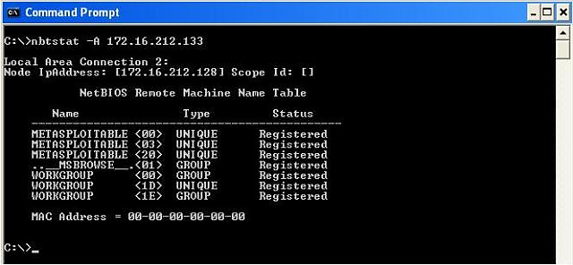
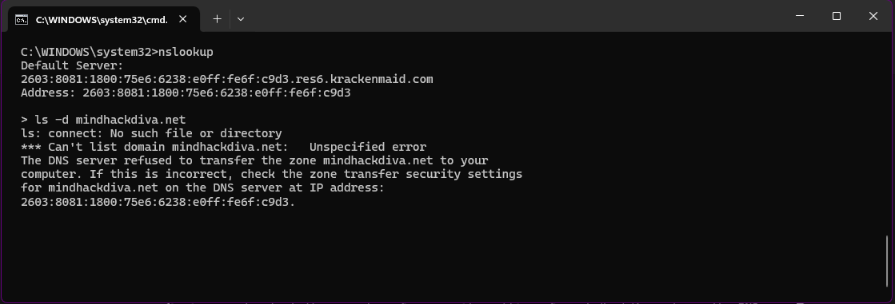
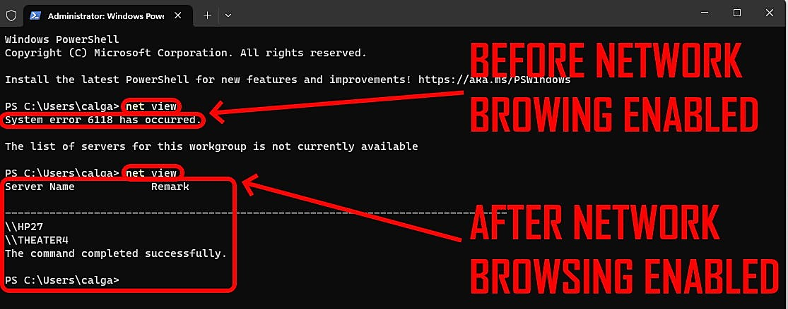
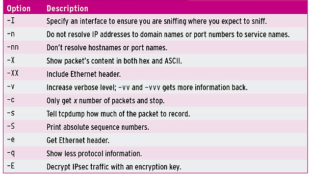
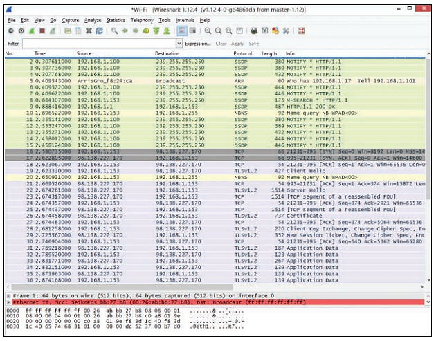
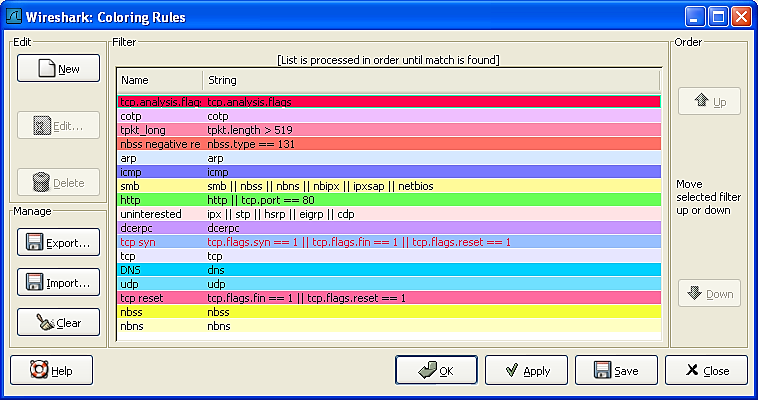
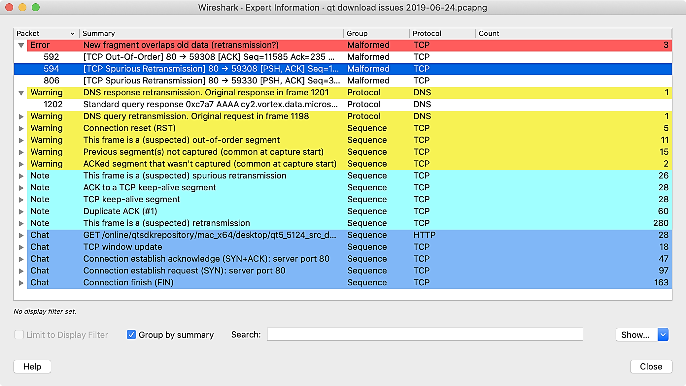
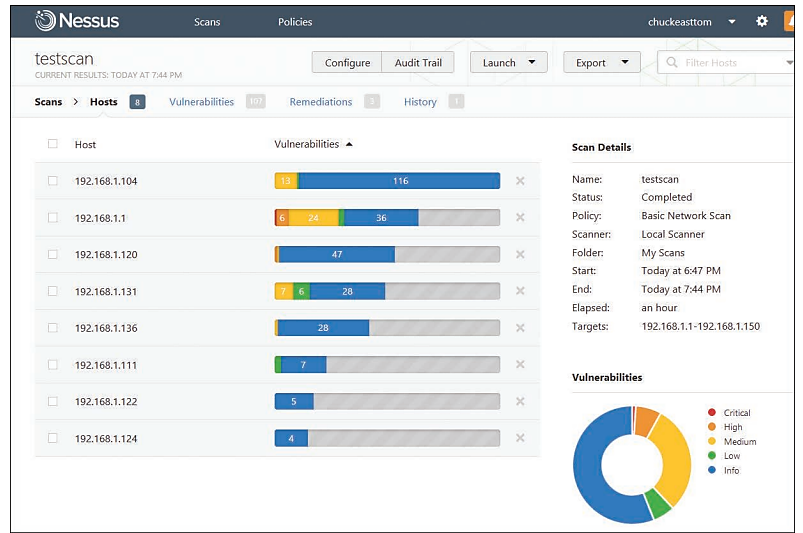

# Network Vulnerability Scanning and Enumeration

### Introduction - To Scan Or Not To Scan?

Maybe that used to be the question, but it is no longer a question to be asked. Scanning a network is an essential part of your security protocol as an ethical hacker to ensure that your client information is secured. So, since you need to scan systems for vulnerabilities, where do you start?

There are many effective products available for network scanning and testing and probing for system vulnerabilities. The best approach is to review various options and select the one that best meets your needs. The scanning tool should not only identify vulnerabilities within your target network but also provide clear and understandable reports. These reports should be accessible to both technical and non-technical audiences, including your clients, stakeholders, and other related parties. A report is valuable only if it translates the findings into actionable insights that help guide your clients in remediating the identified issues.

You may be thinking, _“I do not have the expertise to conduct these scans and read the reports, so what do I do now?”_ here is my best advice:

In situations where you find yourself lacking the necessary expertise to conduct security scans or interpret their reports, it’s crucial to seek assistance from professionals who specialize in cybersecurity. Engaging with a cybersecurity consultant or firm can provide you with the guidance needed to navigate through this complex landscape. These experts can perform the scans on your behalf, explain the findings in layman’s terms, and recommend actionable steps to mitigate identified risks.

Additionally, consider investing in training or educational resources tailored to your level of understanding. There are numerous online courses, webinars, and workshops available that cater to beginners and aim to demystify cybersecurity concepts. Gaining foundational knowledge will empower you to better understand the importance of security measures and how they apply to your specific situation(s).

Furthermore, leveraging automated tools and services designed for users without deep technical expertise can also be beneficial. Many cybersecurity platforms offer user-friendly interfaces and simplified reporting features, making them accessible even to those without extensive IT backgrounds. These tools often come with support and documentation that can guide you through the process of securing your systems effectively.

And, finally, my best to you is to **not give up!** Remember, cybersecurity is an ongoing journey that involves continuous learning and adaptation. By embracing challenges as opportunities for growth, staying informed about the latest threats and defense strategies, and consistently applying best practices, you’ll find yourself becoming increasingly adept at navigating the complexities of cybersecurity and you’ll also find one day that the ‘light will turn on’ for you. I promise.

Below are lists of commercial (pay) and open-source (free) vulnerability scanning tools and related software for you to choose from. This is not an exhaustive list as there is a myriad of network vulnerability scanning tools that exist and are available through quick online searches. These lists are also supplied to give you an idea of what is out there for you to use (I named the top vendors and software authors) for your reference.

### Commercial Network Scanning Tools

#### 1. Nessus

* **Vendor**: Tenable
* **Description**: A widely used vulnerability scanner known for its comprehensive coverage and detailed reporting capabilities.
* **Free Training:** Tenable offers webinars, documentation, and community forums.
* **Free Software:** Nessus Essentials (limited functionality and targets).
* **Website:** https://www.tenable.com/products/nessus

#### 2. QualysGuard

* **Vendor:** Qualys
* **Description:** A cloud-based platform offering a suite of security and compliance solutions, including vulnerability scanning.
* **Free Training:** Qualys provides free training via its Qualys Community Edition and online resources.
* **Free Software:** Qualys Community Edition (limited features).
* **Website:** https://www.qualys.com

#### 3. Rapid7 Nexpose

* **Vendor:** Rapid7
* **Description:** Provides in-depth vulnerability management and security assessment capabilities.
* **Free Training:** Rapid7 University offers various training resources and webinars.
* **Free Software:** InsightVM Free Trial (limited time trial).
* **Website:** https://www.rapid7.com/products/nexpose/

#### 4. Acunetix

* **Vendor:** Acunetix
* **Description:** Focuses on web vulnerability scanning and includes features for network scanning as well.
* **Free Training:** Webinars, documentation, and user guides are available.
* **Free Software:** Acunetix Free Trial (limited time trial).
* **Website:** https://www.acunetix.com

#### 5. GFI LanGuard

* **Vendor:** GFI Software
* **Description:** A network security scanner and patch management solution.
* **Free Training:** Webinars, whitepapers, and documentation.
* **Free Software:** GFI LanGuard Free Trial (limited time trial).
* **Website:** https://www.gfi.com/products-and-solutions/network-security-solutions/gfi-languard

#### 6. OpenVAS (Greenbone Security Manager)

* **Vendor:** Greenbone Networks
* **Description:** Though it's open-source, Greenbone offers a commercial version with additional features and support.
* **Free Training:** Documentation and community support.
* **Free Software:** OpenVAS (open-source version available).
* **Website:** https://www.greenbone.net

### Open Source Network Scanning Tools

#### 1. Nmap

* **Vendor:** Open-source community
* **Description:** A powerful network scanning tool used for discovering hosts and services on a computer network.
* **Free Training:** Nmap documentation, tutorials, and the book "Nmap Network Scanning."
* **Free Software:** Nmap is completely free and open-source.
* **Website:** https://nmap.org

#### 2. OpenVAS

* **Vendor:** Greenbone Networks
* **Description:** An open-source vulnerability scanner and vulnerability management solution.
* **Free Training:** OpenVAS documentation and community support.
* **Free Software:** OpenVAS is completely free and open-source.
* **Website:** https://www.openvas.org

#### 3. Nikto

* **Vendor:** Open-source community
* **Description:** A web server scanner that performs comprehensive tests against web servers for multiple items.
* **Free Training:** Nikto documentation and community tutorials.
* **Free Software:** Nikto is completely free and open-source.
* **Website:** https://cirt.net/Nikto2

#### 4. Zmap

* **Vendor:** Open-source community
* **Description:** An open-source network scanner designed for large-scale network surveys.
* **Free Training:** Zmap documentation and academic papers.
* **Free Software:** Zmap is completely free and open-source.
* **Website:** https://zmap.io

#### 5. Metasploit Framework

* **Vendor:** Rapid7
* **Description:** Though primarily an exploitation framework, Metasploit also includes comprehensive scanning capabilities.
* **Free Training:** Metasploit documentation, tutorials, and community forums.
* **Free Software:** Metasploit Framework is free and open-source.
* **Website:** https://www.metasploit.com

#### 6. Masscan

* **Vendor:** Open-source community
* **Description:** A fast port scanner that can scan the entire Internet in under six minutes.
* **Free Training:** Masscan documentation and community forums.
* **Free Software:** Masscan is completely free and open-source.
* **Website:** https://github.com/robertdavidgraham/masscan

#### 7. Wireshark

* **Vendor:** Open-source community
* **Description:** A network protocol analyzer that can capture and interactively browse the traffic running on a computer network.
* **Free Training:** Wireshark documentation, tutorials, and the book "Practical Packet Analysis.”
* **Free Software:** Wireshark is completely free and open-source.
* **Website:** https://www.wireshark.org

These tools offer a range of capabilities for network scanning and vulnerability assessment, catering to both beginners and experienced professionals in ethical hacking.

### Remediate and Document

Now that you have all this information, what do you do? \*\*REMEDIATE and DOCUMENT\*\*. Yes, those two words you always love to hear strike fear in the hearts of many. Most, if not all, scanning software will rate the criticality of each vulnerability found on the network. Always start with the most critical and work your way down the list.

### Remediation Steps

**1. Prioritize:**

* **Critical Vulnerabilities:** Begin with the most critical vulnerabilities as identified by your scanning tool. These pose the highest risk and should be addressed immediately.
* **High to Low:** Continue working through the vulnerabilities from high to low criticality.

**2. Understand the Findings:**

* **System Knowledge:** Familiarize yourself with the systems running in your network. Each vulnerability might require specific actions based on the system configuration.
* **Remediation Techniques:** Understand how to remediate each vulnerability. This may involve applying patches, updating software, reconfiguring systems, or other measures.

**3. Expertise:**

* **In-House Skills:** Utilize your internal team’s expertise to address vulnerabilities.
* **External Help:** If your team lacks the necessary expertise, consider hiring a reputable network vendor or third-party to assist with remediation.

**4. Specific Changes:**

* **Active Directory:** Some vulnerabilities may require changes in Active Directory. This can include permissions, user settings, or other configurations.
* **Registry Settings:** Modifying registry settings can be sensitive. Ensure you understand the implications of these changes.
* **Group Polic:** Adjusting Group Policy settings can affect many systems. Proceed with caution and test changes.

**5. Testing:**

* **Isolated Testing:** Always test changes on a single system before rolling them out network-wide. This helps prevent widespread issues.
* **Application Compatibility:** Ensure that changes do not disrupt existing applications. Monitor for any adverse effects.

### Documentation

**1. Detailed Records:**

* **Vulnerability Details:** Document each vulnerability, including its criticality, affected systems, and the recommended remediation steps.
* **Action Taken:** Record the specific actions taken to remediate each vulnerability, including any changes made to systems or configurations.

**2. Reporting:**

* **Internal Reports:** Create comprehensive reports for internal stakeholders, outlining the vulnerabilities found, actions taken, and current status.
* **Client and Stakeholder Communication:** Prepare simplified reports for clients and non-technical stakeholders. These should be easy to understand and free of excessive technical jargon.

**3. Continuous Monitoring:**

* **Regular Scans:** Schedule regular scans to identify new vulnerabilities and ensure previous issues have been resolved.
* **Update Documentation:** Keep your documentation up to date with the latest findings and remediation actions.

Proper remediation and thorough documentation are crucial for maintaining network security. If you find yourself lacking the expertise to handle these tasks, do not hesitate to seek help from experienced network vendors. Remember, making uninformed changes can lead to significant network damage, so always proceed with caution and test thoroughly before implementing any changes on a wide scale.

Furthermore, there are instances where certain settings cannot be changed because doing so may cause significant harm or disruption to the system. When faced with such a situation, thorough documentation becomes even more critical.

First, assess the impact of the potential change on system stability and performance. It's crucial to evaluate how the change might affect applications and services running on the network. If the risk is too high, you must document the decision to refrain from making the change. This documentation should include a detailed explanation of the potential risks and the reasons for not proceeding with the modification.

Next, explore alternative solutions or temporary measures that can mitigate the risk until a permanent fix is possible. It's often helpful to consult network security experts or vendors who may have experience with similar issues. Document any temporary measures implemented, including the rationale behind their selection and how they will be monitored for effectiveness.

When documenting the issue, provide a thorough description of the problem, including the specific settings or configurations involved. Clearly state why the change cannot be made and the potential consequences of making the change. Include any alternative solutions or workarounds that were considered, along with the reasons for their selection.

Additionally, outline the steps taken to address the issue, even if a permanent solution is not immediately implemented. This should include a timeline for revisiting the problem, any monitoring or testing that will be conducted in the interim, and a plan for resolving the issue in the future.

Verify that the issue has been resolved or mitigated by conducting thorough testing and monitoring. Document the results of these tests, noting any improvements or remaining concerns. This will provide a clear record of the actions taken and the current status of the issue.

Finally, ensure that all documentation is easily accessible to relevant stakeholders, including IT staff, management, and external auditors. This transparency is essential for demonstrating due diligence and maintaining accountability. By documenting every aspect of the issue, from identification to resolution, you create a comprehensive record that can be used to inform future decisions and improve overall network security.

These resources provide a comprehensive foundation for learning and utilizing network scanning tools for ethical hacking, catering to both beginners and seasoned professionals.

**This chapter covers the following objectives:**

* Port scanning
* Network enumeration
* Vulnerability assessment

The goals of scanning and enumeration are essentially the same: to find out information about your target host. There is no passive way to perform vulnerability scanning, port scanning, or network enumeration. The target will most likely have some indication of the process – or at least should if it has adequate security measures in place.

### Scanning

We discussed some scanning techniques in the “Reconnaissance and Scanning” chapter. In this chapter, we will venture a bit deeper and include network enumeration in our discussions of scanning.

### TCP Scanning

There are a number of tools that you can use to perform packet scans. In the previous chapter, we saw Nmap and hping used in that manner. Additional tools include:

* **Omnipeek:** https://www.liveaction.com/products/omnipeek-network-protocol-analyzer/
* **MiTeC Network Scanner:** http://www.mitec.cz
* **NEWT Professional:** http://www.komodolabs.com
* **MegaPing:** http://www.magnetosoft.com
* **Superscan:** https://sectools.org/tool/superscan

You can also run some tools from a mobile device.

Recall from the previous chapter that we discussed packet flags as well as the TCP three-way handshake. One way to perform scanning is to create your own packets. There are quite a few tools that will do this. A few are listed here:

* **Packeth:** http://packeth.sourceforge.net
* **NetScanTools Pro:** https://www.netscantools.com
* **Colasoft Packet Builder:** https://www.colasoft.com/packet\_builder/

Colasoft has a pro version for sale, as well as a free edition. Because Colasoft has a free version, it is worth looking at a bit closer. The main screen is shown in Figure 2.1 below.

.png>)

_**FIGURE 2.1:** Colasoft main screen._

As you can see, you can select several different packet types. Figure 2.2 shows that you can also edit any aspect of the packet you choose.

.png>)

_**FIGURE 2.2:** Colasoft packet editing screen._

When running scans with any tool (Nmap, Colasoft, etc.), you do not want to simply depend on the results from the first tool and the first scan results you receive, so it’s always best to re-run a second scan to ensure the output is similar to avoid deviations. Your goal is to understand what they mean. One approach that many tools use is to send a packet with a particular flag set and see what the response is. The appropriate responses from the various flag scans are shown here:

#### FIN scan

*
  * **Port closed:** Response is RST.
  * **Port open:** No response.
  * Windows PCs do not comply with RFC 793; therefore, they do not provide accurate results with this type of scan.

#### XMAS scan

*
  * **Port closed:** Response is RST.
  * **Port open:** No response.

#### SYN scan

*
  * **Port closed:** Response is RST.
  * **Port open:** The target responds with a SYN/ACK.

#### NULL scan (all flags off)

*
  * RFC 793 states that if a TCP segment arrives with no flags set, the receiving host should drop the segment and send an RST.

#### ACK scan

*
  * **Port closed:** No response
  * **Port open:** Response is RST.

### ICMP Scanning

ICMP (Internet Control Message Protocol) is the protocol that is used by utilities such as ping and tracert. You can send ICMP packets, and the error messages you receive in response can tell you quite a bit about your target.

These are the most common ICMP message types:

* **0:** Echo reply (used with ping)
* **1 and 2:** Reserved
* **3:** Destination unreachable
* **5:** Redirect
* **6:** Alternate host request
* **7:** Reserved
* **8:** Echo request (used with ping)
* **9:** Router advertisement
* **10:** Router solicitation
* **11:** Time exceeded
* **12:** Bad IP header
* **13:** Time stamp
* **14:** Time stamp reply

Message Type 3 is rather important. When a destination is deemed unreachable, you will want to know why. The specific message codes for message Type 3 are shown here:

* **0:** Destination network unreachable.
* **1:** Destination host unreachable.
* **2:** Destination protocol unreachable.
* **3:** Destination port unreachable.
* **6:** Destination network unknown.
* **7:** Destination host unknown.
* **9:** Network administratively prohibited.
* **10:** Host administratively prohibited.
* **11:** Network unreachable for TOS (Type of Service)
* **12:** Host unreachable for TOS
* **13:** Communication administratively prohibited.

ICMP can be used in a number of ways. The simplest way is to simply ping a target to see if it is present and responding. This is shown below in Figure 2.3.

.png>)

_FIGURE 2.3: Ping scan._

There are a number of flags you can use to modify a ping scan. These are shown below in Table 2.1.

| • Parameter • | • Description •                                                                                                                                                                                                                                                                                                   |
| ------------- | ----------------------------------------------------------------------------------------------------------------------------------------------------------------------------------------------------------------------------------------------------------------------------------------------------------------- |
| /t            | Directs ping to continue sending echo request messages to the target until uninterrupted. To interrupt and display statistics, press Ctrl+Enter. To interrupt and quit this command, press Ctrl+C. This flag is only useful in Windows OS because Linux pings indefinitely by default.                            |
| /a            | Specifies that reverse name resolution be performed on the destination IP address.                                                                                                                                                                                                                                |
| /n \<count>   | Specifies the number of echo request messages to be sent. The default for Windows OS is **four.** The default in Linux is to keep pinging until manually stopped.                                                                                                                                                 |
| /l \<size>    | Specifies, in bytes, the size of the data field. The default is 32 bytes. The maximum size is 65,527 bytes.                                                                                                                                                                                                       |
| /f            | Specifies that echo request messages are sent with the do not fragment flag if the IP header is set to 1. (This flag is not available in IPv6).                                                                                                                                                                   |
| /l \<TTL>     | Specifies the value of the TTL (Time to Live) field in the IP header for echo request messages sent. The default is the default TTL value for the host, which depends on the operating system. The maximum TTL is 255.                                                                                            |
| /v\<TOS>      | Specifies the value of the TOS (Type of Service) field in the IP header for echo request messages sent. TOS is specified as a decimal value from 0 through 255. The default is 0. (This flag is not available in IPv6).                                                                                           |
| /s\<count>    | Specifies that the internet time stamp option in the IP header is used to record the time of arrival for the echo request message and corresponding echo reply message for each hop.                                                                                                                              |
| /w\<timeout>  | Specifies the amount of time, in milliseconds, to wait for the echo reply message corresponding to a given echo request message. If the echo reply message is not received within the timeout period, the “Request timed out” error message is displayed. The default timeout is 4000 milliseconds, or 4 seconds. |
| /R            | Specifies that the round-trip path is traced (with IPv6 only).                                                                                                                                                                                                                                                    |
| /S\<srcaddr>  | Specifies the source address to use (with IPv6 only).                                                                                                                                                                                                                                                             |
| /4            | Specifies that IPv4 be used to ping. This parameter is not required to identify the target host with an IPv4 address. It is only required to identify the target host by name.                                                                                                                                    |
| /6            | Specifies that IPv6 be used to ping. This parameter is not required to identify the target horst with an IPv6 address. It is only required to identify the target host by name.                                                                                                                                   |
| /?            | Displays help at the command prompt.                                                                                                                                                                                                                                                                              |

**Table 2.1 ping Command Flags**

It can also be interesting to see the return messages. Many of the tools we have already discussed will allow you to perform a ping sweep. Network Pinger is a tool that allows you to do a lot of different things with ICMP scans. This tool is free to download from http://www.networkpinger.com/en/downloads/. The main screen is shown below in Figure 2.4.

.png>)

_**FIGURE 2.4:** Network Pinger main screen._

This is a versatile tool, and you should spend some time learning it. A basic ping scan result is shown below in Figure 2.5.

.png>)

_**FIGURE 2.5:** Network Pinger results._

There are quite a few tools to facilitate ping sweeps, including:

* **SolarWinds Engineer’s Toolset:** https://www.solarwinds.com/ engineers-toolset
* **Advanced IP Scanner:** https://www.advanced-ip-scanner.com
* **Angry IP Scanner:** https://angryip.org/about/
* **PingPlotter:** https://www.pingplotter.com

#### Cram Quiz

Answer these questions. The answers follow the last question. If you cannot answer these questions correctly, consider reading this section again until you can.

1. Jerome is performing a scan against a target server. He is sending a SYN scan. If the port is open, what will Jerome receive back?

❍ **A.** RST

❍ **B.** ACK

❍ **C.** SYN/ACK

❍ **D.** Nothing

1. Abu is performing an ICMP scan on a web server. The server network is reachable, but the host IP address is not reachable. What response will he get back?

❍ **A.** Message Type 3, Code 1

❍ **B.** Message Type 3, Code 7

❍ **C.** Message Type 11

❍ **D.** Message Type 0

1. When using Linux, how do you get ping to keep sending packets until you manually stop it?

❍ **A.** You cannot.

❍ **B.** That is the default in Linux.

❍ **C.** Use ping /t.

❍ **D.** Use pint /n 0.

**Answers**

1. **C.** If the port were closed, Abu would receive RST in reply. Because it is open, he will receive a SYN/ACK.
2. **A.** Code 1 means the host is unreachable, even though the network is reachable. Code 7 would mean that the target does not know who the host is.
3. **B.** The default in Linux is to ping until stopped. The default in Windows is to ping four times then stop.

Below is a process methodology for scanning.

.png>)

_**FIGURE 2.6:** Scanning process methodology._

It is important to think and plan before scanning. Don’t just start using random tools and hope to gather the information you need. That will almost never be successful. Having a plan and a specific process is the most appropriate approach. Cutting corners in scanning will get you nowhere, so it’s best to always follow a structured methodology. You can also tailor methodologies to your preferences but just make sure they methodology doesn’t stray too far from the original basis, otherwise you will run into issues as explained above.

As you can see in Figure 2.6, scans can be done with any type of packet. UDP packets are useful in that they don’t have a TCP three-way handshake. When a UDP packet is sent, if the port is open, there is no response. If the port is closed, an ICMP port unreachable message is sent back. Thus, you can use UDP to perform port scans.

You can also use a technique called _**source routing,**_ which refers to sending a packet to the intended destination with a partially or completely specified route (without firewall-/IDS-configured routers) in order to evade an IDS/firewall. With source routing, as a packet travels through a network, each router examines the destination IP address and chooses the next hop to send the packet to the intended destination.

**Netcat** is a versatile tool that can do many different types of scanning. You can get it from http://netcat.sourceforge.net. You can get Netcat for Windows at http://joncraton.org/blog/netcat-for-windows. Basic uses of Netcat are shown here:

* **Listen on a given port:** nc -l 3333
* **Connect to a listening port:** nc 132.22.15.43 3333
* **Connect to a mail server:** nc mail.server.net 25
* **Turn Netcat into a proxy server:** nc -l 3333 | nc www.google.com 80

### Network Mapping

In addition to being able to scan ports, an ethical hacker needs to have a map of the network – or at least a map of as much of the network as can be mapped. Here are a few tools that can be used for this purpose:

* **OpManager:** https://www.manageengine.com/network-monitoring/ free-edition.html
* **NetSurveyor:** http://nutsaboutnets.com/archives/ netsurveyor-wifi-scanner/
* **Spiceworks Inventory:** https://www.spiceworks.com

There are also mobile tools that will allow you to perform network mapping:

* **PortDroid Network Analysis:** https://play.google.com/store/apps/ details?id=com.stealthcopter.portdroid\&hl=en\_US\&gl=US
* **Network Mapper:** https://play.google.com
* **Fing:** https://www.fing.io

LanHelper is an inexpensive network mapper/scanner that you can download from https://www.majorgeeks.com/files/details/lanhelper.html. It installs rather quickly, and then you simply tell it to scan by clicking **Network** on the drop-down menu and then select one of the following:

* **Scan Lan**
* **Scan IP**
* **Scan Workgroups**

When the scan is done, you see a list of all devices on the network, and you can click on any one of them to get more details. You can see this tool below in Figure 2.7.

.png>)

_**FIGURE 2.7:** LanHelper_

The NetBIOS protocol can also help in enumerating Windows systems and networks. NetBIOS is an older protocol used by Microsoft and still present in Microsoft networks today. A NetBIOS name is a string of 16 ASCII characters that is used to identify a network device. Table 2.2 shows NetBIOS messages and responses.

| • Name •     | • NetBIOS Code • | • Type • | • Data Obtained •                                                                                |
| ------------ | ---------------- | -------- | ------------------------------------------------------------------------------------------------ |
| \<host name> | <00>             | UNIQUE   | Hostname                                                                                         |
| \<domain>    | <00>             | GROUP    | Domain name                                                                                      |
| \<host name> | <03>             | UNIQUE   | Messenger service running for that computer                                                      |
| \<username>  | <03>             | UNIQUE   | Messenger service running for that individual logged-in user                                     |
| \<host name> | <20>             | UNIQUE   | Server service running                                                                           |
| \<domain>    | <1D>             | GROUP    | Master browser name for the subnet                                                               |
| \<domain>    | <1B>             | UNIQUE   | Domain master browser name, which identifies the PDC (primary domain controller) for that domain |

**Table 2.2: NetBIOS Messages and Responses**

In Windows, there is a utility named **nbtstat** that retrieves NetBIOS information. You can see nbtstat in Figure 2.8 below:

_**FIGURE 2.8:** nbtstat command output._

There are many tools that can perform nbtstat scans for you, including:

* **Nsauditor Network Security Auditor:** https://www.nsauditor.com
* **SuperScan:** https://sectools.org/tool/superscan
* **NetBIOS Enumerator:** http://nbtenum.sourceforge.net

In a Windows system, the net view command can also provide you information about connected systems and their hostnames. You can see net view in use in Figure 2.9.

_**FIGURE 2.9:** net view command output._

### Simple Network Management Protocol (SNMP)

SNMP (Simple Network Management Protocol) can also assist in mapping a network. As its name suggests, SNMP was created to help manage networks. SNMP works on port 161 and 162.

An SNMP-managed network consists of three key components:

1. Managed device
2. Agent (software that runs on managed devices, or endpoints)
3. NMS (Network Management Station; software that runs on the manager (e.g., could be server or standalone))

The agents are 24x7x365 in regular communication with the NMS. This means that such messages can potentially be intercepted to learn about the target network. The MIB (Management Information Base) in SNMP is a database containing formal descriptions of all the network objects that can be managed using SNMP. The MIB is hierarchical and each managed object in a MIB is addressed through an _**OID (Object Identifier)**_. There are mainly two types of managed objects in SNMP:

1. Scalar
2. Tabular

A _**scalar object**_ defines a single object instance. In the Simple Network Management Protocol (SNMP), a scalar object represents a fundamental type of object that defines a single instance of data within the MIB. Unlike tables, which consist of multiple rows and columns, a scalar object pertains to a singular, specific piece of information. This is crucial for managing and monitoring network devices efficiently.

A scalar object is characterized by its singular nature, meaning it provides data that is not organized in a structured table format, but rather exists as a standalone utility. This object typically represents a single data point, such as a particular configuration setting, a status indicator, or a counter. The data contained in a scalar object is usually a simple, indivisible value, which can be an integer, a string, or another basic data type.

For instance, in the context of a network router, a scalar object might represent the router’s uptime or the current CPU utilization, and about spikes in the network, or outages that have occurred in the network without anyone noticing. These values are crucial for network management and network defenders but are inherently single-instance, making them ideal candidates for scalar objects. The scalar object allows SNMP to query and retrieve this specific piece of information directly, without the need to traverse a complex data structure.

In the context of ethical hacking and cybersecurity, understanding data types and object-oriented programming concepts can be crucial. A scalar object refers to a fundamental data type that represents a single value, such as a number or a string. Unlike composite or complex objects that can encapsulate multiple values or data structures, a scalar object is a singular entity that stands alone.

In practical terms, scalar objects are often used to store and manipulate individual pieces of data within scripts or applications. When examining software for vulnerabilities, recognizing how scalar objects are managed and utilized can help identify potential weaknesses or exploitation points. For instance, improper handling of scalar values could lead to issues such as buffer overflows or data leaks, making it essential for ethical hackers to understand their role and behavior within the codebase.

A _**tabular**_ _**object**_ is a data structure used in Management Information Bases (MIBs) to organize multiple related instances of objects within a table. Each row in this table represents a distinct instance, while the columns define various attributes of these instances. This tabular format allows for efficient management and querying of network devices and their configurations. Understanding tabular objects is essential for ethical hackers, as it aids in discovering and analyzing network devices, identifying potential vulnerabilities, and assessing security in the context of network management protocols like SNMP.

There are tools that can analyze SNMP messages for you. A few of them are listed here:

* **SNMP Informant:** https://www.snmp-informant.com
* **snmpcheck:** http://www.nothink.org/codes/snmpcheck/
* **NetScanTools Pro:** https://www.netscantools.com
* **Nsauditor Network Security Auditor:** https://www.nsauditor.com

Just as you can utilize SNMP to retrieve data, _**LDAP (Lightweight Directory Access Protocol)**_ also provides valuable information. LDAP is often likened to a network’s phone book, which is an apt comparison. It holds details about network machines, services, users, and more, making it a powerful tool for network mapping. LDAP operates on port 389, while secure LDAP uses port 636.

The process begins when a client connects to a _**Directory System Agent (DSA)**_ to start an LDAP session. The client then sends an operation request to the DSA, with information exchanged between the client and server using _**Basic Encoding Rules (BER)**_.

There are several tools available for LDAP enumeration, including:

* **LDAP Account Manager:** https://www.ldap-account-manager.org
* **LDAP Search:** https://securityxploded.com/ldapsearch.php
* **ad-ldap-enum:** https://github.com/CroweCybersecurity/ad-ldap-enum

While less common than LDAP or SNMP for network mapping, _**NTP (Network Time Protocol)**_ can also be useful. NTP is used to synchronize time across networked computers. Although Windows lacks default NTP commands, Linux provides several important ones:

* **ntptrace:** Traces the chain of NTP servers to the primary source.
* **ntpdc:** Monitors the operation of the ntpd (NTP daemon).
* **ntpq:** Monitors ntpd operations and assesses performance.

Other network protocols, such as _**SMTP (Simple Mail Transfer Protocol)**_ and _**RPC (Remote Procedure Call)**_, can also be valuable for network enumeration.

For user enumeration on Linux, the following commands are commonly used:

* **rusers:** Shows a list of users logged on to remote machines or local network machines. **Syntax:** /usr/bin/rusers \[-a] \[-l] \[-u| -h| -i] \[Host ...]
* **rwho:** Displays users logged in to hosts on the local network.

**Syntax:** rwho \[ -a]

* **finger:** Provides detailed user information, including login names, real names, terminal names, idle time, login time, office location, and phone numbers.

**Syntax:** finger \[-l] \[-m] \[-p] \[-s] \[user ...] \[user@host ... ]

DNS zone transfers can be performed on both Windows and Linux systems. A zone transfer retrieves DNS information from a server, primarily to synchronize backup DNS servers with primary ones. This can be done manually or with tools like:

* **Quick and Easy Online Tool:** http://www.digitalpoint.com/tools/zone-transfer/
* **Zone File Dump:** http://www.dnsstuff.com/docs/zonetransfer/

DNS zone transfer is actually a rather simple process to do manually. You can see an attempt to manually do a zone transfer in Figure 2.10.

_**FIGURE 2.10:** Zone transfer._

In any secure network, you will get the response shown in Figure 2.10; however, if it is successful, you will have all the information in DNS server, has including information on every machine in that network that has a DNS entry.

#### Cram Quiz

Answer these questions. The answers follow the last question. If you cannot answer these questions correctly, consider reading this section again until you can.

1. When using SNMP, what is MIB?

❍ **A.** Management Information Database\
❍ **B.** Message Importance Database

❍ **C.** Management Information Base

❍ **D.** Message Information Base

1. You have been asked to perform a penetration test by ABC bank. One of the early steps is to map out the network. You are using your Linux laptop and wish to find out the primary source for NTP (Network Time Protocol). What command should you use?

❍ **A.** ntptrace

❍ **B.** ntpdc

❍ **C.** nbtstat

❍ **D.** netstat

1. Ramone is trying to enumerate machines on a network. The network uses a Windows Server 2019 domain controller. Which of the following commands is most likely to give him information about machines on that network?

❍ **A.** finger

❍ **B.** ntpq

❍ **C.** net view

❍ **D.** rwho

1. What flag identifies the network card you use with tcpdump?

❍ **A.** -e

❍ **B.** -n

❍ **C.** -i

❍ **D.** -c

1. You are using **tcpdump.** What will the following command do?

**tcpdump -c 500 -I eth0**

❍ **A.** Capture 500 packets on interface eth0.

❍ **B.** Capture 500 MB on interface eth0.

❍ **C.** Nothing. There is an error.

❍ **D.** Route the first 500 packets captured to interface 0.

**Answers**

1. **C.** MIB stands for Management Information Base.
2. **A.** The **ntptrace** command traces back to the source NTP server.
3. **C.** **net view** is a Windows command that shows all the machines connected to the test machine.
4. **C. -i** identifies the network interface card (NIC).
5. **A.** The **-c** flag tells **tcpdump** to capture the number that follows tells it how many packets and -I identifies the interface.

Network packet capture is primarily useful if you have some connection to the target network. There are several tools that can do this.

### tcpdump

tcpdump is a free command-line tool. It was meant for Linux but can also work in Windows. It is fairly simple to use. To start it, you have to indicate which interface to capture packets on, such as:

tcpdump -i eth0

This command causes tcpdump to capture the network traffic for the network card using Ethernet Interface 0 (eth0). You can also alter tcpdump’s behavior with a variety of command flags. For example, this command tells tcpdump to capture only the first 500 packets on interface eth0 and then stop.

tcpdump -c 500 -i eth0

This command displays all the interfaces on the computer so you can select which one to use.

Below are some common tcpdump capture options you can use depending on what needs you need to fulfill:

_**FIGURE 2.11:** tcpdump capture options._

Some examples of using tcpdump:

* **tcpdump host 192.168.1.45:** Shows traffic going to or from 192.168.2.3
* **tcpdump -i any:** Gets traffic to and from any interface on your computer.
* **tcpdump -i eth0:** Gets traffic for the interface eth0.
* **tcpdump port 443:** Shows traffic for port 443 (HTTPS).

### Wireshark

Wireshark is the most widely known network packet capture and protocol analyzer. Penetration testers can often learn a great deal from simply sniffing the network traffic on a target network. Wireshark provides a convenient GUI (graphical user interface) for examining network traffic. It is available as a free download from https://wireshark.org. The tool can be downloaded for Windows or macOS. Figure 2.12 shows a screenshot of a Wireshark packet capture.

_**FIGURE 2.12:** Wireshark main screen._

### Wireshark Packet Colorization

A very useful mechanism available in Wireshark is packet colorization. You can setup Wireshark so that it will colorize packets according to a filter. This allows you to emphasize the packets you are (usually) interested in.

There are two types of coloring rules in Wireshark. Temporary and Permanent.

_**Temporary**_ coloring rules can be added by selecting a packet and pressing the \<ctrl> key together with one of the number keys. This will create a coloring rule based on the currently selected conversation. It will try to create a conversation filter based on TCP first, then UDP, then IP, and finally Ethernet.

Temporary filters can also be created by selecting the “Colorize with Filter> Color X” menu items when right-clicking in the packet-detail pane.

To _**permanently**_ colorize packets, select the **Coloring Rules…**&#x6D;enu item from the **View** menu; Wireshark will pop up the “Coloring Rules” dialog box as shown below in Figure 1.13.

_**FIGURE 1.13:** The Wireshark “Coloring Rules” dialog._

Once the Coloring Rules dialog box is up, there are a number of buttons you can use, depending on whether or not you have any color filters installed already.

|  | FYI: FOR YOUR INFORMATION                                                                                                                                                                                                                                                                                                                                                                                |
| --------------------------------------------------------------------------------------------------- | -------------------------------------------------------------------------------------------------------------------------------------------------------------------------------------------------------------------------------------------------------------------------------------------------------------------------------------------------------------------------------------------------------- |
|                                                                                                     | 
You will need to carefully select the order the coloring rules are listed as they are applied in order from top to bottom. So, more specific rules need to be listed before most general or default rules in place. For example, if you have a color rule for UDP before the one for DNS, the color rule for DNS will never be applied (as DNS uses

UDP, so the UDP rule will match first).
 |

_**FIGURE 1.14:**_ _A color-codified Wireshark GUI._

Wireshark allows you to filter what you capture or to capture everything then just filter what is displayed. I always recommend the latter. Display filters (also called post-filters) only filter the view of what you are seeing. All packets in the capture still exist in the trace. Display filters use their own format and are much more powerful than capture filters. Here are a few exemplary filters:

Display filter examples (note the double = sign ==).

* **Only get packets from a specific subnet:**
  * ip.src==10.2.21.00/24
* **Get packets for either of two IP addresses:**
  * ip.addr==192.168.1.20 || ip.addr==192.168.1.30
* **Only get packets for port 80 or port 443:**
  * tcp/port==80 || tcp.port==443

You can also click on a packet; you can select to follow that particular TCP or UDP stream, this makes it easier to view the packets in that specific conversation. This will also be color-coded. The packets you sent will be in red and the ones received will be in blue.

Wireshark is a very complex tool, and entire books have been written about it. In ethical hacking, it’s beneficial to have a general understanding of the tool and it would benefit you even more if you spent a majority of your time getting more familiar with this tool. (Frankly, an ethical hacker should spend time getting very comfortable with every tool mentioned in this book).

#### Cram Quiz

Answer these questions. The answers follow the last question. If you cannot answer these questions correctly, consider reading this section again until you can.

1. John is using Wireshark to identify network traffic. What color designates DNS traffic?

❍ **A.** Green

❍ **B.** Dark Blue

❍ **C.** Light Blue

❍ **D.** Black

1. Adrian wants to capture traffic on the second network card, and only traffic using port 22 (SSH). What command will do this?

❍ **A.** tcpdump -i eth1 port 22

❍ **B.** tcpdump -i eth2 port 22

❍ **C.** tcpdump -i eth1 – 22

❍ **D.** tcpdump -i eth2 - 22 3

1. Ramone is using Wireshark, and he wants to view only those packets that are from IP address 192.10.10.1 and using port 80. What command will do that?

❍ **A.** ip ==192.10.10.1 || port==80

❍ **B.** ip.addr==192.10.10.1 || tcp.port==80

❍ **C.** ip ==192.10.10.1 && port==80

❍ **D.** ip.addr==192.10.10.1 && tcp.port==80

**Answers**

1. **B.** By default, green indicates TCP traffic, dark blue indicates DNS traffic, light blue indicates UDP traffic, and black identifies TCP packets with problems.
2. **B.** The network cards begin at 0, so the second card is 1. And the port is designated with the – port flag.
3. **D.** Address requires ip.addr, port requires tcp.port, and the && is the and symbol. The || symbol is for or, not for and.

It is important to understand that vulnerability scanning is not penetration testing; however, vulnerability scanning can help you identify targets for a penetration test. If all you do is a vulnerability scan, that simply is not hacking; however, it is rare for professional hackers to start a penetration test without first identifying vulnerabilities otherwise how you know what can be exploited if you don’t know what vulnerabilities exist?

Vulnerabilities can include many different subcategories, such as default credentials, misconfigurations, unpatched systems, among many other subcategories.

You always want to check first to see whether the target network is using default passwords. You can find lists of default passwords for various systems at sites like these:

* https://cirt.net/passwords
* http://www.routerpasswords.com
* http://www.default-passwords.info

You need to know the following terms associated with vulnerability scanning:

| • Term •                     | • Definition•                                                                                                                                                                                 |
| ---------------------------- | --------------------------------------------------------------------------------------------------------------------------------------------------------------------------------------------- |
| Active Assessment            | An assessment that uses a network scanner to find hosts, services, and vulnerabilities. Tools like Nessus and SAINT are active assessment tools.                                              |
| Passive Assessment           | A technique used to sniff network traffic to find active systems, network services, applications, and vulnerabilities present. Tools like tcpdump and Wireshark are passive assessment tools. |
| Internal/External Assessment | An assessment done from within/outside a network.                                                                                                                                             |
| Host/Network Assessments     | An assessment of a single host/an entire network.                                                                                                                                             |
| Tree-based Assessment        | An assessment in which an ethical hacker uses different strategies for each machine or component of the information system.                                                                   |
| Inference-based Assessment   | An assessment in which an ethical hacker scans to learn protocols and ports and then selects vulnerabilities based on the protocols and ports found.                                          |

_**FIGURE 2.14:** Nessus GUI._

You have the option of running a scan immediately or running it at a preset time. Nessus scans can take some time to run because they are quite thorough. The results of a test scan are shown in Figure 2.15.

_**FIGURE 2.15:** Nessus Scan Result Dashboard._

### Nexpose

Nexpose is a commercial product from Rapid 7, which also distributes Metasploit. You can find Nexpose at https://www.rapid7.com/products/nexpose/. There is a free trial version that you can download and experiment with. This tool is a Linux virtual machine and takes some effort to learn. Given that it is distributed by the same group that distributes Metasploit, it has

received significant market attention.

### SAINT

SAINT is a widely used vulnerability scanner that is available at http://www.saintcorporation.com. While it is a commercial product, you can request a free trial version. SAINT can scan a network for any active TCP or UDP services and then scan those machines for any vulnerabilities. It uses CVE as well as CERT advisories as references.

#### Additional Vulnerability Assessment Tools

Additional tools are available for vulnerability assessment. A few of them are listed here:

* **Nikto:** A Linux-based web server vulnerability assessment tool.
* **Retina CS:** A commercial vulnerability management suite. There is also a mobile version.
* **OpenVAS:** The most widely known open-source vulnerability scanner.
* **Net Scan:** A vulnerability scanner that runs on mobile devices.

#### Cram Quiz

Answer these questions. The answers follow the last question. If you cannot answer these questions correctly, consider reading this section again until you can.

1. \_\_\_\_ is a list maintained by the MITRE Corporation.

❍ **A.** CVSS

❍ **B.** CVES

❍ **C.** CVE

❍ **D.** CVS

1. In CVSS, the Access Vector metric can be what four values?

❍ **A.** N, A, L, P

❍ **B.** N, A, L, H

❍ **C.** N, H, L, C

❍ **D.** N, P, L, H

1. Victoria is using a different vulnerability scanning strategy for each machine or component of the information system. What best describes this approach?

❍ **A.** Tree-based assessment

❍ **B.** Inference-based assessment

❍ **C.** Active assessment

❍ **D.** Passive assessment

**Answers**

**1. C.** CVE (Common Vulnerabilities and Exposures) is a list of vulnerabilities maintained by the MITRE Corporation.

**2. A.** The Access Vector metric can be Network (N), Adjacent (A), Local (L), or Physical (P).

**3. A.** A Tree-based assessment uses different strategies for different components of the system.

### What Next?

The next chapter covers several topics, including rootkits, password cracking methodology,

password attacks, and steganography.
